# 人工智能中的对数算法

> 原文：<https://medium.datadriveninvestor.com/logarithmic-algorithms-in-ai-62d7f9f3bff4?source=collection_archive---------5----------------------->

## 1 和 9 的中间是多少？孩子们和科学家说 3！

你可能会想，为什么不是 5 呢？

根据麻省理工学院的一项研究[3]，大多数小孩和不识字的人会回答 3。认知科学家发现，这是因为我们的神经回路进化得更倾向于对数思维而不是线性思维。有趣的是，数字 3 在对数上是 1 和 9 的中间值*。*

*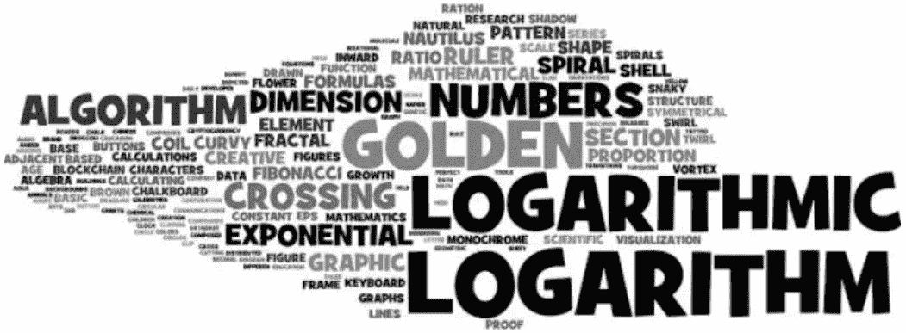*

*甚至人类的**行为特征也遵循对数正态分布**。例如，人口密度与离城市的距离，花在网页上的时间或考试中的得分模式，等等。，都遵循对数正态分布。经济学中的**帕累托原理(80–20 法则)遵循** **幂律**，是对数正态分布的一般情况。**人类感知到** **光、声、热等刺激的对数增长**，**好像是线性增长**。[4]*

***对数算法***

*当我们的神经回路、行为特质，甚至身体反应都遵循对数自然时，在 AI 算法中使用对数优化难道不是自然的吗？当一个算法的执行时间与输入大小的**对数成比例时，称该算法为对数算法。***

*下面就拿现在流行的 O(log n)时间算法，也就是二分搜索法，来解决一个有趣的问题( **AGGRCOW** )，刷新一下你的理解。此外，我们将快速浏览一下这个想法如何用于**机器学习和深度学习。***

***二叉树和二分搜索法***

*在**二分搜索法**中，我们反复将“排序数据”分成两半，直到只剩下一个元素，或者找到搜索元素。*

***二叉树**是一种数据结构，其中每个节点最多有两个子节点，一个在左边，一个在右边。如果这样的树满足**【二分搜索法性质】**，即左边节点中的所有元素小于等于根节点，右边节点中的所有元素大于等于根节点，则称之为**二叉查找树(BST)。***

*可以将排序后的数组转换为 BST 数据结构，并且可以递归或迭代地搜索特定的关键字**。***

*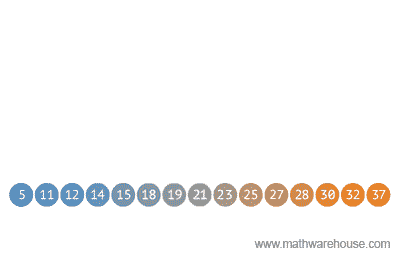*

****Conversion of sorted array into Binary Search Tree****

***对数时间算法的优势***

*二分搜索法在每一步都可以忽略一半的元素，这是它最大的计算优势。在 BST 中，我们可以决定去一个节点的左边或右边的子节点，从而在每一步中完全丢弃一半的值。*

*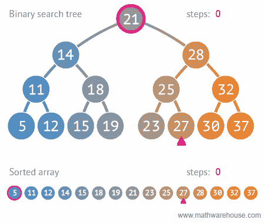*

***Linear Search (10 steps) vs Binary Search (3 steps)***

*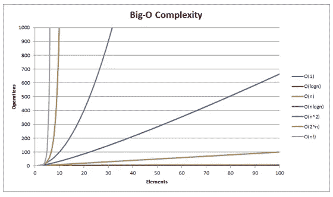*

***O (log n) algorithms have the least average case time complexity***

*由于二分搜索法的想法是基本的，让我们详细挖掘二分搜索法是如何被用来解决一个问题，著名的 AGGRCOW。稍后我们会谈到这个想法是如何在人工智能领域借用的。*

***AGGRCOW *问题定义:****

**农场主约翰新建了一个长长的谷仓，里面有* ***N 个摊位*** *。货摊沿着一条直线位于特定的位置。他的奶牛不喜欢这个谷仓的布局，一旦被关进牛栏，它们就会变得互相攻击。为了防止牛互相伤害，他* ***想把牛分到牛栏里，使它们之间的最小距离尽可能大。求最大最小距离*** *。**

****a)输入输出:****

*   ***输入**:档位和奶牛数量*
*   ***输出**:最大最小距离*

****b)分析:****

*这些牛被放置在尽可能远离彼此的地方，这样它们就不会受伤。并且这个距离在选择的隔间之间应该是相同的。这被称为最大最小距离。*

****c)见解:****

*   ***对于一个给定的值‘x’，如果不可能让所有的奶牛都待在牛栏里，并且任意两头奶牛之间的最小距离为‘x’，那么就不可能让所有的 y > x.***
*   *逻辑上，一半的值(y > x)在一个步骤中被消除。这就是二分搜索法的想法发挥作用的地方。*
*   *找到排序的档位之间的距离变得单调，从零到最大最小值。*

****d)实现逻辑使用二分搜索法:****

*首先，我们假设最大距离的上下界在第一个失速和最后一个失速之间。**在每一步，我们将间隙减半，并检查对于该间隙值是否可以容纳 3 头奶牛**。**如果价值减半是不可能的，那么上面的任何价值也不可能。因此，在节点的左侧搜索间隙值。**如果减半的值是可能的，那么最大的间隙值应该在节点的右侧。因此，找到最大的最小距离**归结为可能的间隙值的二分搜索法。***

****e)Python 中的优化编码:****

***样本输出:***

*   *失速位置= [1，4，6，10，20]。奶牛= 3 头*
*   *最大最小距离= 9*
*   ***原因** : 3 头奶牛被放在牛栏里【1，10，20】*

*使用二分搜索法，我们将 120 个可能的步骤减少到 6 个。*

*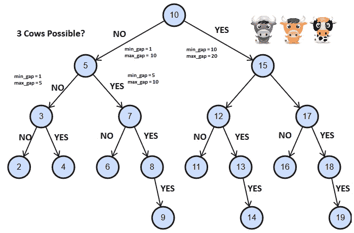*

***Diagram of Gap Binary Tree. Traversal = {10, 5, 7, 8, 9}***

# ***AI 中的应用***

*由于“搜索操作”的时间和空间复杂性在图中比在树中更大，后者在人工智能中更受欢迎。*

*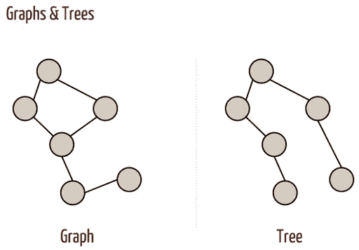*

*Loops in Graph result in duplicate node search (time) or storing searched nodes (space)*

*树形数据结构的应用在多个领域都有着至关重要的应用，尤其是**机器学习和深度学习。***

1.  ***kd 树:***

*KNN 算法中最昂贵的步骤是寻找点的 k 个最近邻。**因此，为了降低 KNN** 算法的时间复杂度，使用了一种有效处理 k 维数据的数据结构 KD-tree**。***

*一棵 ***kd 树*** 是一棵 **BST** 到 k 维空间的推广。k 维空间被递归分割成 2 个半空间。当点是二维的(即 k=2)时，我们可以用点的 x- & y 坐标构建一个 BST，作为交替序列中的键，如下所示。*

*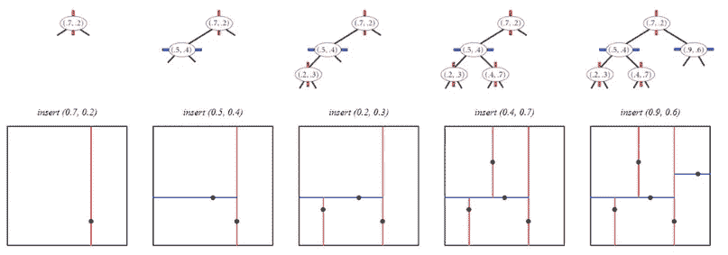**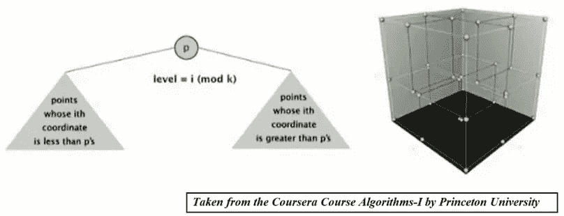*

*kd-tree 优于 BST 的主要优点是它支持有效实现 ***范围搜索*** 和 ***最近邻搜索*** 。*

****a .范围搜索*** *:* 查找给定查询矩形中包含的所有点*

****b .最近邻搜索*** *:* 查找离给定查询点最近的点*

*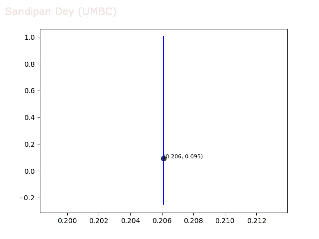*

**Recursive space-partioning of 2d-tree (*[*Animation Courtesy*](https://sandipanweb.wordpress.com/2017/09/10/implementing-kd-trees-along-with-the-fast-range-search-nearest-neighbor-search-and-k-nearest-neighbor-search-algorithms-in-2d-with-an-application-in-simulating-the-motion-of-a-flock-of-boids/)*)**

*在最好的情况下，使用 kd 树，查找最近邻居的比较次数从 O (n)减少到 O(log n)**。此外，kd-trees 非常适合高维和聚类数据。***

***2。决策树/随机森林/ GBDTs***

*与基于几何的逻辑回归或基于实例的 KNN 算法相反，决策树是嵌套的 if-else 条件分类器，如下所示。*

**

***Class labels are boolean: Fit or Unfit***

*在决策树(DTs)中，我们计算每个特征的**“信息增益”(IG)** ，并在树的每一层基于具有最大信息增益的特征来划分数据集。**在构建 DT 之后，我们必须进行‘k’次比较(k =树的深度)，以便在运行时找到类标签**。*

*由于 DTs 中的数据分割是基于局部最优阈值(IG)，因此 DTs 可能并不总是平衡的。然而，在最好的情况下，对于一个平衡树，**树的深度应该是 O (log N)。***

*同样的想法也适用于更受欢迎的**梯度提升决策树(GBDTs)和随机森林(RFs)以及**，因为基础学习者分别是浅&深**决策树**。*

***3。分层 Softmax(深度学习)***

*两种算法，即 **CBoW 和 Skip-gram** ，都有数百万个权重需要训练。我们可以利用二叉树的概念优化 Word2Vec 算法中最难的运算，即 softmax。*

*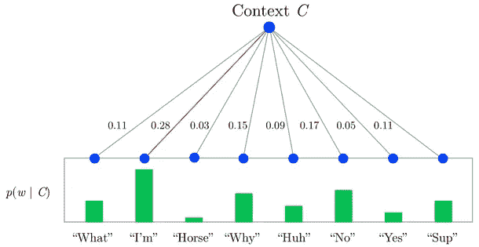*

*In Softmax, we need to compute **all** terminal leaves, to find most probable word*

*如果 vocab size = 'v '，那么每个' v '个激活单元返回每个单词对应的概率，其中选择概率最大的单词。但是，**我们可以建立一棵二叉树来寻找 log (v)步中最大可能的单词，而不是计算所有的概率。***

*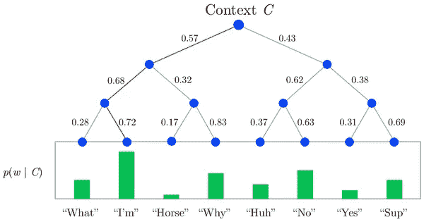*

*Depiction of softmax function as a tree*

***在二叉树的每个节点中创建一个二元分类器(sigmoid 单元)**而不是创建一个 v 类分类器。sigmoid 单元的输出表示输出字属于左节点还是右节点。因此，**我们只需要 **3 个二进制 softmax 单元，而不是 8 个 softmax 单元**。***

*随着人工智能领域从大脑的实际功能中获得越来越多的线索，让我们希望对数算法在未来会得到越来越多的应用。*

***参考文献***

1.  *[www.appliedaicourse.com](http://www.appliedaicourse.com)*
2.  *[https://www.spoj.com/problems/AGGRCOW/](https://www.spoj.com/problems/AGGRCOW/)*
3.  *[http://web . MIT . edu/news office/2012/thinking-logarithly-1005 . html](http://web.mit.edu/newsoffice/2012/thinking-logarithmically-1005.html)*
4.  *[http://www . cis . rit . edu/people/faculty/montag/vand plite/pages/chap _ 6/ch6p 10 . html](http://www.cis.rit.edu/people/faculty/montag/vandplite/pages/chap_6/ch6p10.html)*