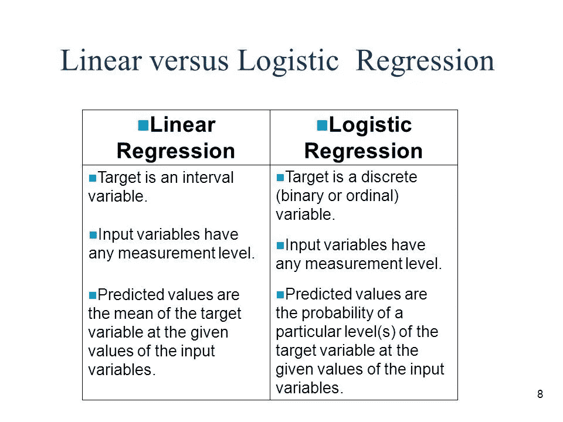

# 逻辑回归

> 原文：<https://medium.datadriveninvestor.com/logistic-regression-18afd48779ce?source=collection_archive---------5----------------------->

[](http://www.track.datadriveninvestor.com/1B9E)

在上一篇文章中，我们已经看到有各种回归技术，我们还学习了线性回归模型，所以现在是学习逻辑回归的时候了。

像其他回归技术一样，逻辑回归也是一种预测分析技术。它用于建立一个因变量和一个或多个自变量之间的关系。当因变量是分类变量时，它是适用的。

逻辑回归与线性回归没有太大的不同，除了一个***s 形*** 函数被拟合到线性回归的方程中。

线性回归方程:

```
y = a + b1x + b2x + b3x + ....
```

Sigmoid 函数:

```
p = 1 / (1 + e ^ (-y))Therefore it becomes, 
p = 1 / (1 + e ^ (-a -b1x -b2x -...))
```


**source :** [**www.datacamp.com**](http://www.datacamp.com)

所以这是这两种技术的基本区别，sigmoid 函数的加入改变了一切。

***Logistic 回归的类型:***

1.  *二元 Logistic 回归:*只有两种可能的结果，是或不是，垃圾邮件或没有垃圾邮件。这些是目标变量的结果。
2.  *多项逻辑回归*:目标变量有三个或三个以上的名义类别，也是这样，没有排序，比如预测哪个巨星更受欢迎，哪个食物更受欢迎，预测酒的种类。
3.  *有序逻辑回归*:目标变量有三个或三个以上的有序类别，说明这些类别是有序的。例如，从 1 到 5 对任何产品、餐馆、电影进行评级。

这种技术与其他技术有什么不同？

很有趣的问题，不是吗？这个问题我们也有了答案。

逻辑回归和线性回归的本质区别在于，逻辑回归用于因变量本质上是二元的情况，而线性回归中因变量是连续的，回归线也是线性的。在逻辑回归中，s 形函数与线性回归方程一起使用。此外，在线性回归中，独立变量可以彼此相关，但是在逻辑回归中，如果独立变量之间不存在相关性，则更为优选。



**source : towardsdatascience.com**

***用 python 实现:***

有一些内置的库可以帮助我们轻松地工作，我们的大部分工作都是由它们完成的。

```
#sklearn is the required libraryimport numpy as np
import matplotlib.pyplot as plt
from sklearn.linear_model import LogisticRegression
from sklearn import datasetsiris = dataset.load_iris() #loading our data
x = iris.data[:, :2] #selecting the first two features
y = iris.targetlogreg = LogisticRegression()
logreg.fit(x,y)
logreg.predict(iris.data[-1,:],iris.target[-1])#output is this and it may change
#and it is for three classes 0,1,2
#[0.28, 0.71, 0.016]
```

***逻辑回归的应用:***

1.  在市场营销领域，这是一项非常有用的技术，用于预测公司在运营的基础上是盈利、亏损还是保持收支平衡。
2.  公司可以通过研究员工休假的模式以及根据他们的个人特征来预测他们的出勤情况。
3.  会成为一项有用的医疗技术。它可以根据患者的病史、症状和个人特征来预测患者的医疗状况，还可以将他/她与其他患者进行比较。
4.  由于其高效和直接的特性，它易于实现，因此被数据分析师和科学家广泛使用。

***假设:***

现在，随着每项技术的整体运作，我们还必须考虑一些假设:

1.  误差项不是正态分布的。
2.  它不要求因变量和自变量之间存在线性关系。
3.  因变量不是用比率来衡量的。
4.  因变量必须是分类变量。
5.  自变量之间应该很少或没有相关性。

**有一些*缺点*也有一些**:

1.  它不能处理大量的分类变量，这意味着它不能用于大型模型。
2.  主要缺点是，它容易过度拟合。
3.  如果自变量与目标变量不相关，那么这种技术就不能正常工作。

所以记住这些事情，让我们开始工作。编码快乐！！！