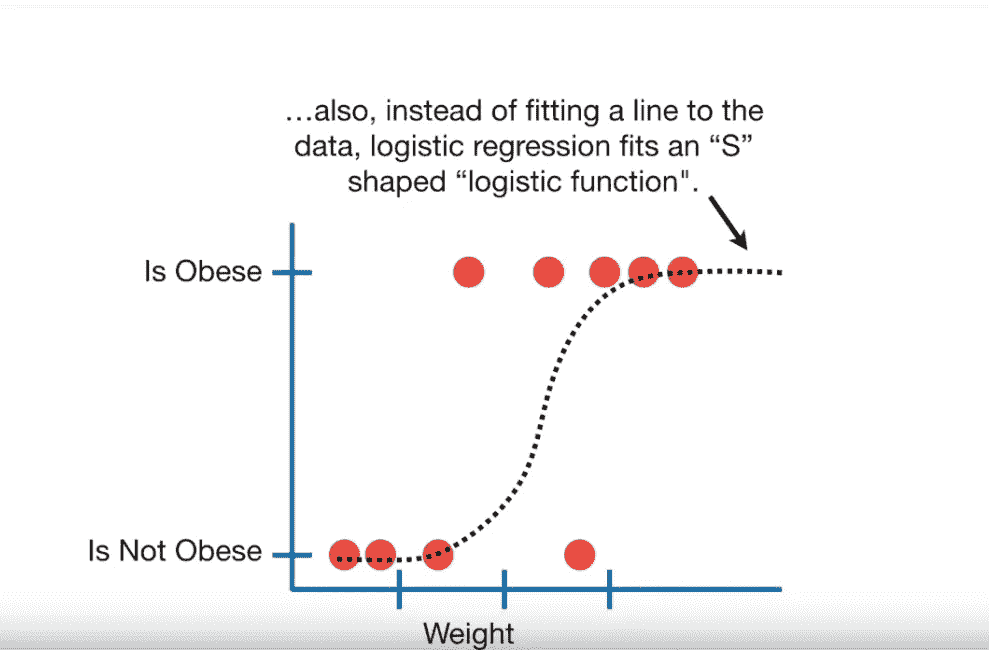
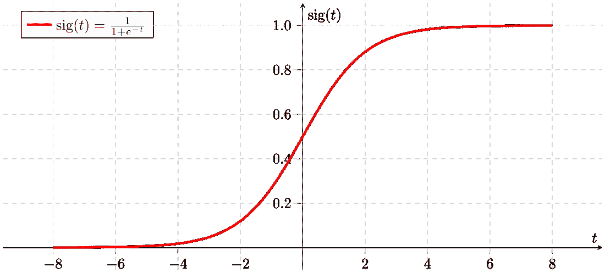
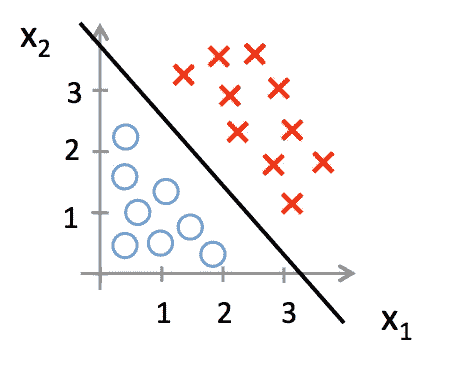

# 逻辑回归

> 原文：<https://medium.datadriveninvestor.com/logistic-regression-8d7d1872eb83?source=collection_archive---------10----------------------->

在上一篇博客中，我们讨论了线性回归，其中我们拟合了一条最符合我们数据的直线。但是在逻辑回归中，同一行被逻辑函数或 Logit 函数所代替。我们将在博客的后面讨论这个函数，但是现在，假设它是一个从 0 到 1 的“S”形曲线，如下所示:

[https://www.youtube.com/channel/UCtYLUTtgS3k1Fg4y5tAhLbw](https://www.youtube.com/channel/UCtYLUTtgS3k1Fg4y5tAhLbw)

上面的曲线从 0 到 1，表示给定体重的肥胖概率。如果体重高，则此人很有可能肥胖。所以这就形成了一个分类问题，如果一个人肥胖的概率大于 50%，那么他就被归类为肥胖。

因此，我们了解到，与线性回归不同，逻辑回归用于**分类**问题。现在，在线性回归中，我们使用普通最小二乘法(OLS)来估计最佳拟合线，同样，这里我们使用最大似然估计来选择我们的逻辑曲线。

## 物流功能

Sigmoid Function

这是一条“S”形曲线，可以取任何实数值，并将其转换为 0 或 1。

输出= 0 或 1

假设=> Z = WX + B

hθ(x)= sigmoid(Z)

如果‘Z’趋于无穷大，Y(预测)将变为 1，如果‘Z’趋于负无穷大，Y(预测)将变为 0。

[https://houxianxu.github.io/images/logisticRegression/1.png](https://houxianxu.github.io/images/logisticRegression/1.png)

## 逻辑回归的类型

1.  二元逻辑回归:

只涉及两个可能的类别。例如，将电子邮件分类为垃圾邮件或非垃圾邮件。

2.多项式逻辑回归

可以涉及 2 类以上的分类。例如，考虑对水果进行分类的任务，它可以有 2 个以上的类别。

3.有序逻辑回归

这涉及到特定类别的排名。例如，从 1 到 5 评价这部电影有多好。

## 我们如何得到 sigmoid 函数

在逻辑回归中，Y 轴被限制在 0 到 1 之间的概率值。为了解决这个问题，逻辑回归中的 y 轴被转换为 log(odds ),这样，线性回归中的 y 轴可以具有从-无穷大到+无穷大的值(注意:odds 不是概率)。概率是某件事情发生与某件事情没有发生的比率。

事件的概率= p/(1-p)其中 p 表示事件的概率。对于数据的对称分析，我们使用数据几率的对数，得出以下等式:

对数(赔率)=对数(p/1-p)

这里 Log(p/1-p)构成了 Logit 函数！！！

如果 log_odds(p(y=1∣x))=wo+w1x1+w2x2+…+wnxn

我们把 w0+w1 x1+w2 x2+…+wn xn 简称为 z(x)那么，

log_odds(P(y=1∣x))=z(x)

反过来说，

P(y=1∣x)=ϕ(z)=1/(1+e^-z)

因此我们得到了 sigmoid 函数。

## 价值函数

线性回归使用均方误差作为成本函数，这在逻辑回归的情况下不能使用，因为它会导致非凸函数，因此不可能达到全局最小值。

## 结论

简而言之，不要被它的名字所迷惑，逻辑回归不是用于回归问题，而是用于分类问题，如果你对线性决策边界满意，逻辑回归是完美的算法。通过加入一些复杂的变量非线性函数，我们也可以用逻辑回归得到非线性的决策边界。逻辑回归的一些应用包括:

1.  垃圾邮件过滤
2.  图像分割和分类
3.  手写识别
4.  医疗保健行业

希望这能帮助你开始学习逻辑回归，关于评论或任何更多的细节，你可以通过 *ratikpuri1998* @gmail.com 联系我。我很乐意帮助并澄清你的疑惑。