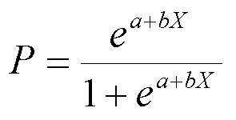
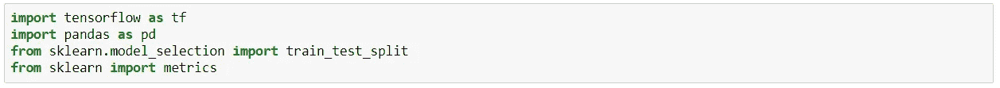
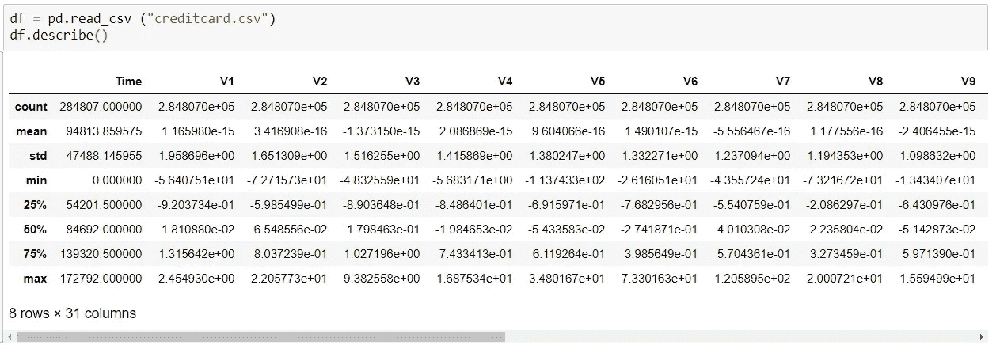
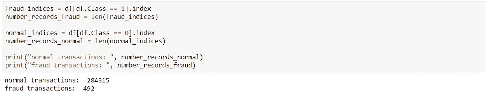
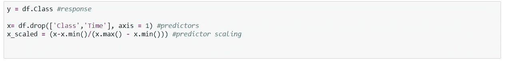
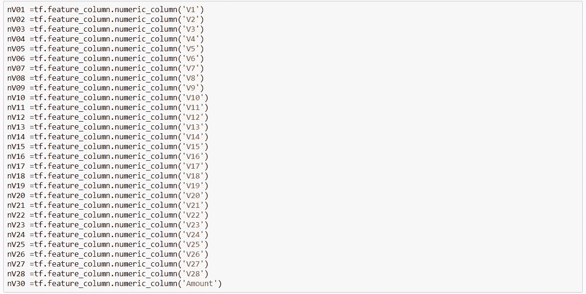
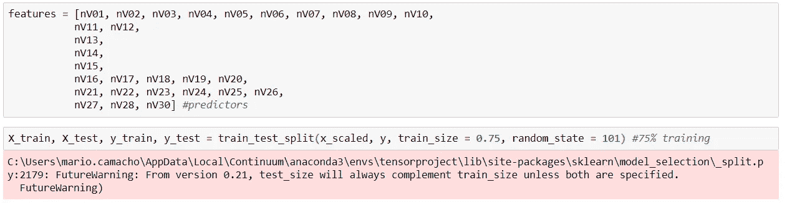
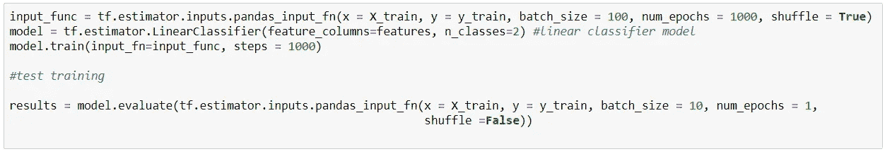
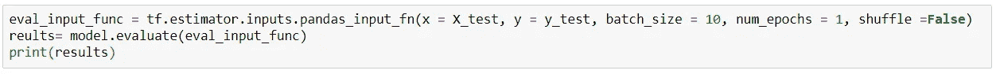

# 用 Python 实现二元响应分类的逻辑回归模型

> 原文：<https://medium.datadriveninvestor.com/logistic-regression-model-to-classify-binary-response-with-python-1412a28fa62b?source=collection_archive---------4----------------------->

当数据响应分为两类(是或否)时，逻辑回归有助于解决分类器问题，并预测数据属于哪一类。

逻辑回归模型用于二进制分类问题，预测某个实例属于默认类的概率，该默认类可以归入 0 或 1 分类。这是一个线性算法，并假设输入变量和输出变量之间的线性关系。更好地揭示这种线性关系的输入变量可以产生更精确的模型。应用这种预测模型时的一个主要问题是过度拟合，这通常发生在数据集非常小时。

 [## DDI 编辑推荐:5 本机器学习书籍，让你从新手变成数据驱动专家…

### 机器学习行业的蓬勃发展重新引起了人们对人工智能的兴趣

www.datadriveninvestor.com](https://www.datadriveninvestor.com/2019/03/03/editors-pick-5-machine-learning-books/) 

在数学上，它用以下公式表示:

y 是预测输出，a 是截距，b 是输入变量(x)的系数。

简单介绍之后，我将向您展示一个使用信用卡数据识别欺诈的示例。数据集中与欺诈相关的要素是“类”，它将成为逻辑回归中的响应变量，如果是欺诈，则取值 1，否则取值 0。

首先，我们导入将要在 Jupyter Notebook 中使用的库，

然后，我们将探索这些数据，

Descriptive Statistics

Number of Fraud Transactions

删除不需要的变量，并缩放预测的输入变量

Response and Predictors

用张量流标准化 de 变量，

Tensorflow Normalized outputs

然后我们决定如何训练我们的模型，

x variables scale, 75% of data trained

使用 Tensorflow，我们创建了模型，然后测试了训练数据

Build a Binary Classification Model

知道我们打印了模型的结果以及它有多好，

Model Result

我们发现一个很好的模型，精确度为 0.99，AUC 为 0.88，这是一个合理的 88%的真实预测。

最后，我们检查测试数据以查看结果，我们有相似的结果。

Test Data Model Result

使用逻辑回归，我们可以处理非正态数据，它有助于了解独立变量的影响，因此在欺诈案件中，检测欺诈交易中发生的最具影响力的事件。

G.James，D. Witten，T. Hastie 和 R.Tibshirami，“统计学习导论及其在 R 中的应用”，2017 年