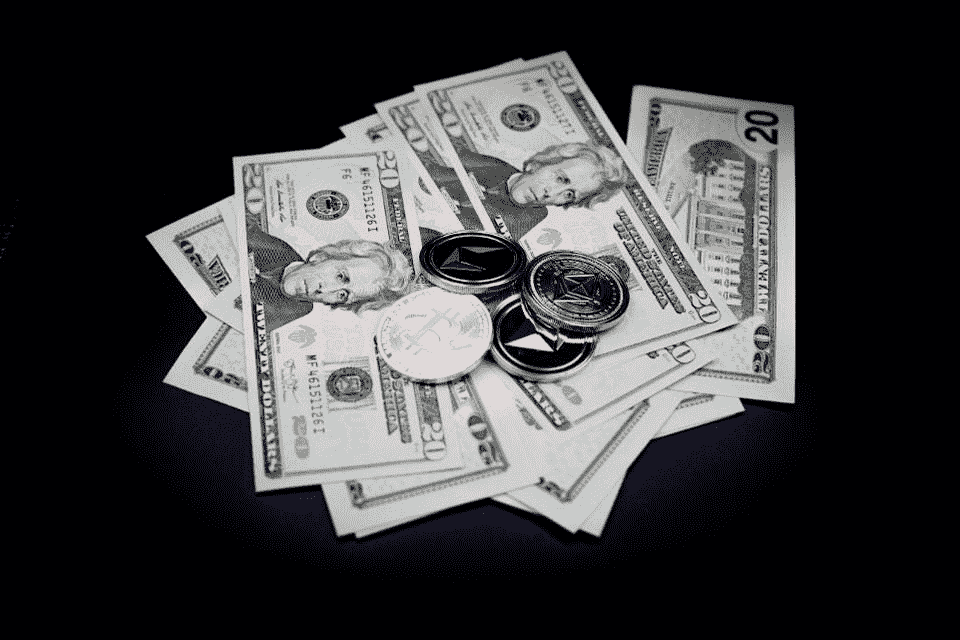

# 伦敦初创企业 Aurus 推出黄金支持的加密代币，可能向新投资者开放黄金市场

> 原文：<https://medium.datadriveninvestor.com/london-start-up-aurus-launches-gold-backed-crypto-token-possibly-opening-the-gold-market-to-new-5299038a06b0?source=collection_archive---------19----------------------->

加密硬币可以用于日常商品和服务的想法还没有成为现实。稳定硬币提供了将密码用于日常支付的潜力，因为它们的价值与基础资产挂钩，价格更加稳定。尽管如此，坐在买方和卖方之间的中间人的存在是为了将数字资产兑换成传统的法定货币。

通常情况下，稳定的硬币，如 Paxos 或 USDT，在加密市场中用作对冲工具或价值存储。日常购物的支付渠道是必不可少的，只有当无缝集成成为现实时，公众才能像一些区块链纯粹主义者承诺的那样，从更精简的基础设施中获益。当我们审视我们的支付系统时，我们可以看到区块链的创新可以将旧的基础设施改造得更好。

 [## 总部位于瑞士的 ETP 进入加密交易市场|数据驱动的投资者

### 虽然金融市场几乎没有沉闷的时刻，特别是在引入…

www.datadriveninvestor.com](https://www.datadriveninvestor.com/2019/03/10/swiss-based-etp-enters-the-crypto-trading-market/) 

如果我们将 stablecoins 的发展视为支付领域的创新，那么它们的监管和保值方式会给投资者带来新的风险。在过去的一年里，稳定的硬币受到了批评，认为其价格可能不像人们认为的那样稳定。然而，这种类型的证券市场已经显著增长，并变得更加拥挤的新硬币。稳定的资本值得融入我们的经济吗？密码行业如何设计一种方式，让分散技术创造一种独立、不受控制的货币，可以用于日常交易？数字黄金作为一种支付形式能否实现和利用？

新推出的 Aurus 创造了一种代币化黄金，代表了实物黄金的实际所有权。这种改编是对现有 stablecoins 的创新，可以减少中间商的足迹，并扩大传统的黄金市场。

我采访了 Guido Van Stijn，他是 Aurus 的首席执行官。Aurus 是一家提供令牌化即服务(TaaS)的软件公司，它使黄金市场能够自主地将其黄金令牌化为 AurusGOLD (AWG)。Van Stijn 先生解释说，每个 AWG 代币都有抵押，可兑换 1 克实物黄金。据我所知，AWG 不会被政府控制，而是作为 ERC-20 的代币存在。这种说法是，不管 Aurus 是否作为一家公司生存下来，黄金支持的代币都将作为一种资产存在下去，就像金条一样。这是一种独特的令牌化方法，因为每枚硬币都可以追溯到特定的金条注册。与黄金交易所交易基金的所有权不同，黄金交易所交易基金是一种股权，并不代表实物黄金所有权，AWG 表示，这是实际的黄金所有权。

使用像黄金支持的代币这样的代币化资产对传统黄金买家来说可能是一种好处。AWG 代币的售价仅略高于黄金现货价格。Van Stijn 先生解释说:“我们的流程不同于其他金牌支持项目。目前市场上所有黄金支持的稳定硬币都有一个集中的铸造过程。这意味着该公司本身将在某个时候持有黄金。通过数字化复制传统的黄金市场，Aurus 是第一个创建由黄金提供商、金库和分销商组成的自我维持生态系统的项目，他们共同努力生产半分散的黄金支持的加密货币。”

为了让自我维持的生态系统能够存在，Aurus 流通了第二种混合公用设施令牌——AurusCOIN(AWX)。Aurus 的业务发展总监 Mark Gesterkamp 先生表示:“AWX 的总供应量限制在 3000 万台，交易费用来自 AWG 的使用。AWX 为投资者提供了买入 Aurus 未来增长的机会。”Van Stijn 先生说:“由于世界各地的人们交易 AWG，所有产生的交易费用的 70%按比例分配给所有 AWX 持有者(以 AWG 支付)。其余 30%的费用分配给生态系统的运营成本，如下所示:15%给黄金提供商，15%给金库合作伙伴。“市场参与者首次可以通过出售黄金产生被动收入流。

当你可以拥有比特币的时候，谁还想要黄金？

在 crypto 中，黄金支持的 stablecoins 没有什么特别之处。但 Aurus 创造了一些不同的东西，弥合了传统黄金交易和加密世界之间的差距。更重要的是，进入黄金市场不需要黄金经纪人。Van Stijn 先生声称，他的方法降低了公共黄金投资的门槛。

托尼·多布拉是 Aurus 顾问委员会的成员，曾任 Baird & Co .的总经理，他认为 AWG 是独一无二的。多布拉说，“虽然它不是区块链上唯一的黄金，但它是加密交易中最真实的黄金交易。通过 AWG 加密货币，生产商、精炼商和交易商可以在他们选择的多个地点对他们的黄金进行令牌化，并在几个平台和交易所交易基础黄金。因为有多个地点、供应商和贸易商，所以可以获得最好的价格。你不仅仅局限于一个地点或一个价格提供商。”

Aurus 预计并正在努力实现 AWG 将在黄金市场创造更多流动性的状态。更重要的是，Aurus 的团队解释说，他们的主要目标是让 AWG 用于日常交易，即让 AWG 像现金一样用于日常购物。虽然在这成为现实之前还有很长的路要走，但 Aurus 项目似乎是向资产支持的数字货币方向的转变。如果这一举措奏效，大宗商品和贵金属交易可能会受到影响而效仿。至于在支付中的使用，像 AWG 这样的稳定货币在销售点仍然需要交换机制。时间会证明这种风格是否会被大众接受。

*最初发表于*[*【https://www.forbes.com】*](https://www.forbes.com/sites/robertanzalone/2019/12/09/london-start-up-aurus-launches-gold-backed-crypto-token-possibly-opening-the-gold-market-to-new-investors/)*。*