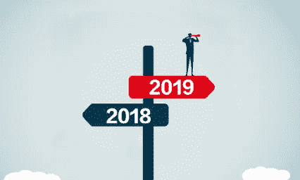

# 敬请关注 2019 年的这些商业趋势！

> 原文：<https://medium.datadriveninvestor.com/look-out-for-these-business-trends-in-2019-96ae64f8b9c3?source=collection_archive---------3----------------------->

Photo credit: The One Brief

老实说，我从来没有真正花时间做年度分析，但随着今年即将结束，我第一次想反思和思考明年的商业趋势将是什么。我也想敦促你也这样做，基于这一点或你自己对事物和经历的看法。

商业趋势决定了一个人如何计划和制定战略，尽管大多数人一年中的大部分时间都在对这些趋势和预测做出反应，但往往加入的太晚了。成功的关键之一就是趁热打铁！有了这个，我的意思是你需要比别人反应更快。

这就是为什么这一次或今年我花时间去思考。

因此，今年我想分享我认为将在 2019 年实现的商业趋势和预测。我不是预言家、看手相的人或巫师，但这是基于我对事物的分析和对现象的研究。

也许你同意或不同意这些预测，但无论如何，我强烈敦促你现在就注意到它们，这样你就可以在其他人开始思考之前采取行动，或者像我所说的那样，趁热打铁…

# #1.要引起别人的注意，你会付出一大笔钱

面对你的客户会越来越难，越来越难，实际上成本也越来越高。为什么会这样有几个原因。

一、广告费用继续大量上涨。

二。你的观众或潜在客户的注意力持续时间正在减少。你知道为什么吗？因为线下和线上有很多让人分心的事情。网上的干扰被称为“白噪音”。

三。你的竞争对手正在并将会越来越擅长他们的工作。暗示你或你的公司将会花更多的钱来吸引他们的注意力。这将是通过付费或有机营销。

去年(2018 年)，一些客户和初创公司问我，是否有可能增加他们在脸书的帖子，以获得更多粉丝。也要知道，那些专注于建立客户信任和关注的企业将处于赢得这场战斗的有利位置。那么，你或你的企业打算做什么？

# #2.预计经济形势会很艰难

这听起来像是一个很大的猜测或主张，我同意。但相信我，据我所知，2019 年的经济会很艰难。好吧，假设是这样的话，这将导致对咨询等服务的更高需求(关于如何创业，在哪里投资等)。)、金融知识、导师和教练服务等。

你知道为什么吗？因为随着人们失业(你知道很多人在 2018 年失业)，他们会转向“专家”告诉他们下一步该做什么。对于那些有创业热情的人来说，这将是他们的“关键时刻”。就像浪子在追求成功的过程中发现了第二个最好的选择。

但是，即使这对你和你的企业来说可能是件坏事，最聪明的企业家是那些将度过他们最辉煌岁月的人。但前提是你:

I .现在将你的精力集中在品牌建设上，并为此建立一个积极参与的观众/客户群。

二。专注于最大化盈利能力的短期策略/技术。

# #3.一些社交媒体平台将越来越没有效果，尤其是 FACEBOOK

不要担心，脸书仍然相关，但你预计在 2019 年的参与度将略有下降！

无论你关注的是有机产品还是付费产品(或者两者兼而有之)，这种情况都有可能发生，只是你的时间和金钱的投资回报率(ROI)会比较低。

脸书营销漏斗将最终失效。

我预测 Instagram 应用程序在 2019 年将在人们的小工具上获得越来越多的下载。一些人很可能会开始从智能手机上删除脸书应用。

作为一个平台，脸书将保持其价值。但是你真的必须知道你在做什么才能让它起作用，在 YouTube 教程上跟随几个步骤并期待巨大结果的日子已经一去不复返了！

二。更多的人将开始在他们的电脑上安装广告拦截软件。你们都知道，当你在使用机器或小工具时，那些弹出广告和通知是多么的危险。

三。因为有太多的“白噪音”,你企业的客户或观众正在“关机”。我之前提到过——分心。

# #4.预计 Instagram、YouTube 甚至谷歌广告的使用会非常活跃

我刚刚在上面告诉你，会有更多的人开始使用 Instagram。另一方面，平台上的广告，YouTube 和 Google 将会一飞冲天！如果你有一个大品牌，并且已经在这些平台上有很大的影响力(比如 Instagram 上的“scopionmcug”和“irene_ntale”，以及 YouTube 上的“Ann Kansiime”)，你就比其他任何人都有很大的优势。

至于我，我将开始在所有这些平台上进行试验(至少在 Instagram 上)，但预计很快就会在 Youtube 上看到视频日志和视频剪辑，我希望看到的结果比我预期的好得多。

就个人而言，脸书仍然相关，但这些其他平台正在 2019 年迅速缩小差距！因为预计他们的广告费用会很低，但关注度会更高。想知道我在说什么，去问斩杀女王吧！

还有哦！今年，Instagram 测试了允许你直接向 WhatsApp 发帖的功能。看这里:【https://dailym.ai/2VW3LIR 

# #5.营销人员只会关注终身价值

你客户的终身价值比你 30 天的回报更重要。我这么说是什么意思？当你展望一个客户时，你会花很多钱(在电子邮件、电话、广播时间、那些免费赠品和在与客户的商务会议上放纵)——你在花钱。

所以，你不会想让客户呆几天就让他/她走。不要！我说的是看不见的投资回报率，以及长期投资的重要性。当你缺少客户的时候，你不会在游戏中呆太久。如果你这样做了，忘记幸存的 2019 年吧！

你需要把你的注意力放在接下来的几周内你能给某人带来多少价值上，并且这可以持续到未来。它需要一致性。只有到那时，你才会意识到客户的终身价值。这甚至超过了他们 30 天的回报。把它放在你的脑后。

# #6.∑(品牌+权威)的价值将会上升

之前讲过外行。大多数时候，他们被视为“伪装者”,无论他们说了多少，伪装者都没有时间。相反，观众会关掉它们。但是拒绝伪装者的观众也是需要帮助的观众。

这意味着那些在行业内久负盛名并拥有权威的人将会受到更多的重视和追捧。所以如果你是你手艺的大师…做好 2019 年领工资的准备。因为他们愿意为品牌+权威买单。

# #7.低端产品更多在线购买的可能性

网上购买物品或产品很可能会增加。你知道为什么吗？好吧，让我告诉你。除了互联网渗透率和智能手机使用率，在线支付平台的增长率也很高。去年 MTN 推出了 MoMo 卡。

此产品/功能允许您使用移动货币帐户中的资金在线支付服务费用/购买产品！一旦你激活它，你有 14 天它(卡)到期。现在告诉我，如果你不想使用该功能来购买家居用品。

就在去年 12 月，我们用 MTN MoMo Pay 或 Card 为[www.ablestate.org](http://www.ablestate.org)购买了一根原装投影仪线缆。这比我们在市区买它的价格低了两到三倍。

# #8.成功属于专注的人

每年都有课程，因为每个课程都有自己的挑战，而且数量各不相同。就像去年一样，如果你看看你在执行你设定的任务和目标时有多混乱，你会意识到你需要做些正确的事情。

如果你想赢得今年的比赛，就要有激光聚焦。它总是被证明是正确的。

# #9.启发你的潜在客户将是游戏的赢家

如今，网民在网络上变得目光敏锐。许多人现在都在寻找那些一次性的优惠(承诺降低成本)。但是请记住，你的潜在客户是在你的脖子上。如今客户操纵很少奏效，2019 年可能成功率非常低。

所以用开悟代替客户操纵！这也意味着向他们展示做出购买决定所需的所有信息。给他们看他们的痛苦。向他们展示所需的解决方案。提供给他们，改变他们，不管是企业还是个人。

# #10.会有很多免费内容

你听说过或见过吸引潜在客户购买你的产品或服务的营销。通常，卖家卖，卖，卖，然后达到赠送一些免费物品的程度。通常，从长远来看，这些对建立可扩展的业务没有太大帮助。因为免费的东西可能无法帮助改变你的潜在客户产生持久的影响。

另外，原因是许多人购买了它们(如果是在线的话，可以免费下载)并且忘记了它们，例如教程。这意味着你今年应该改变你的商业模式，让它免费提供你最好的内容……这能吸引注意力，建立信任和客户亲密关系。之后，它会将您的销售线索转化为客户，为他们提供真正解决他们的痛苦/问题的产品/服务。

但是，也要警惕免费的东西！

# #11.“从底层开始，现在我们在这里”这句话行不通了，它会变得更难

现在，这对所有渴望成为“专业人士”的人来说都是一个难题。即使是专业人士也曾是业余爱好者。拳击界的传奇人物穆罕默德·阿里曾经说过——“假装直到你成功”。我个人喜欢这句话。你看，有时当你没有专业知识时，自称为“专家”或“专业人士”可能根本不起作用。

我并不是说成为专业人士或更好的人是不可能的，但从底层往上走会越来越难。你需要停止提供不公平的交易。通过与你的顾客/客户/潜在客户建立良好的关系和信任，成为大人物。

所以，如果你还没有听众，现在就开始吧，不要太晚，成为他们的“听众”。

# #12.“常规”营销漏斗的缓慢死亡

你们都听说过典型的营销漏斗，通过视频教程或视频片段引导某人点击、喜欢或关注该网站，然后向你发送电子邮件以促成销售。是的，那一个。它在慢慢死去！而在这个 2019 年，它依然会奄奄一息。

因此，你只需要改变漏斗战略，保持它，但通过使其相关来调整它。我的意思是，在正确的时间，以建立信任、亲密和声誉的方式，给你的潜在客户相关的内容(正确的内容)。投资回报(ROI)需要更长的时间，但它更大更好，随着您的持续提供而增长。

请记住，您的客户之旅将变得至关重要。我在这里是什么意思？在销售之前和之后，顾客的旅程决定了你的成功。这很重要，但随着这些天的激烈竞争，走向 2019 年变得绝对重要。

要做的是给你的客户一个不会忘记的体验，让他们不要选择你的竞争对手，而是选择你。给人留下持久的印象，这就是“令人惊叹”的因素。

# #12.**获得融资将比从岩石中挤出水更困难**

获得融资是乌干达创业增长的一个重要方面，但它仍然是初创公司和中小微企业面临的最大挫折之一，尤其是在青年企业中。这是一段布满荆棘的崎岖之路。问问生态圈里的任何一家创业公司！

*金融部门深化(FSD) 2016* 的一份报告显示，每十(10)家中有七(7)家中小企业指出“融资渠道有限”和“融资成本-高利率”是业务增长的制约因素。

根据我在与初创公司、中小企业和金融家/基金等合作时的融资收购经验。，你会意识到需要多长时间来确保财政安全。其实成功率也就 10%左右。这有许多因素；如缺乏簿记和审计财务账目，团队组成不佳等。

我建议这些潜在投资者拥有经审计的财务账目，组建强大的团队，建立强大的内部控制系统/机制，拥有具有吸引力的可扩展产品，并获得银行认可的商业计划等。为了节省时间，上下移动，请经常寻求帮助。

去年对我来说是金融收购熔炉中相当惊险的一段时间，我认为 2019 年不会是一杯茶。做好最坏的打算。我在提前吞下自己的药。

# 你在这里…..这些只是我对 2019 年的商业预测和趋势

当我们制定这一年的目标和决心时，这是我们很可能将精力投入的方向。你可能同意或不同意这些商业趋势。也许你只同意其中的一部分，大部分，或者不同意。

对双方来说，想想你对未来一年的预测，并在你的竞争对手之前很久就采取行动。

朱利叶斯·马萨巴确实在一家天使投资网络工作。他也有兴趣通过融资收购和投资准备，以及数字营销和技术创业的诀窍来帮助企业。