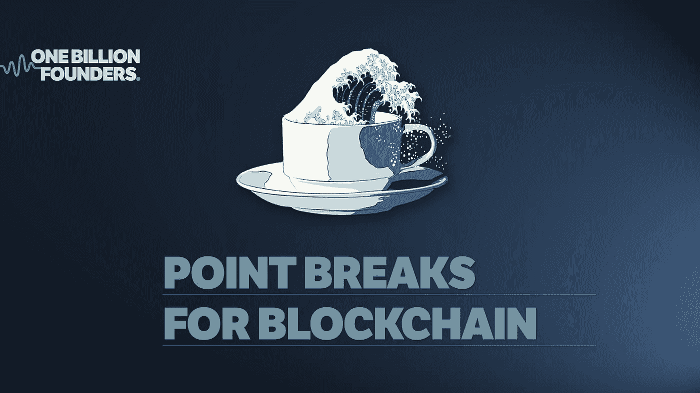
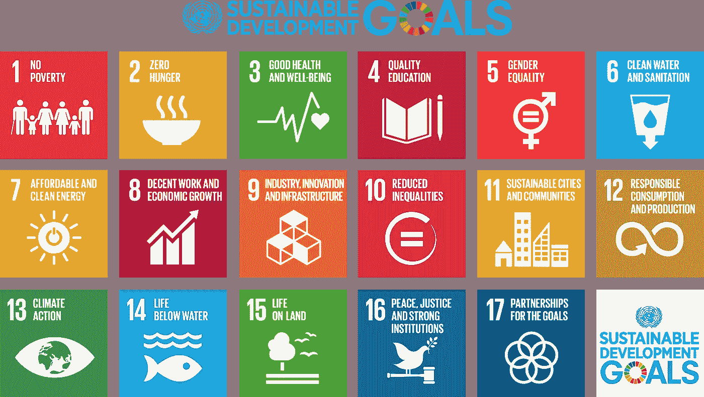

# 在茶杯外面寻找下一波机会

> 原文：<https://medium.datadriveninvestor.com/looking-outside-the-teacup-for-the-next-wave-of-opportunity-7393b24dcb57?source=collection_archive---------13----------------------->

## 浏览数字网络、平台和数据智能。

我对加密货币行业的一个恼火之处是米老鼠初创公司，他们通过 ICO(首次发行硬币)筹集了大量资金，然后却无法交付任何与他们的产品营销人员与公众分享的内容相差甚远的东西。

公平地说，创始人通常有良好的意图和巨大的热情，但完全缺乏经验、商业头脑或现实核查。许多加密初创公司失败了，因为他们试图在一个充斥着我们可能想要的一切的市场中立足。其中一些企业甚至没有区块链功能。他们只是利用一个虚无缥缈的效用函数创造了一个“硬币”市值，以及一个零基础的代币经济。

这有点像试图将另一种类型的谷物引入购物岛，你可以用外币支付(大多数人从未听说过)。除了在现有系统运行良好的情况下使用笨重的支付方式带来的额外不便之外，为什么还会有人购买类似玉米片的商品呢？

使用加密作为交换媒介不像 Visa 或 Mastercard，这种新货币需要用户下载软件或 Metamask 等浏览器扩展，将私钥存储在安全的地方(并希望你的房子不会被烧毁)，而且现在(2018 年 8 月)没有 tap'n'go。

不难理解为什么加密货币对日常生活来说似乎很荒谬，其采用率一直很低，因为零售银行和传统金融科技解决方案存在巨大阻力。

区块链有可能减少对大量基础设施支出的需求，并改变企业跟踪、测量和自动化运营的方式。整个行业的工作将会改变，不再相关。

> 资本主义本质上创造效率来替代人类劳动。

纵观历史，我们已经看到了铁匠、电话总机接线员、活字印刷装配工、隐藏数字(又名计算劳动力)的灭绝——没错——追溯到 17 世纪初，计算机，通常是女性，会整天用手计算数字和处理数字。事实是，有些工作不可避免地会被淘汰。

但这绝不应该成为抵制创新的理由。事实上，自动化令人麻木的工作是一件好事，从来没有比这更好的机会来争取“拯救世界”的职业生涯。

你可能认为你抗议自助超市结账是无私的，但是你想过对于一个聪明、聪明的大学生来说，这种工作有多无聊吗？

> 我决定通过促进批判性思维来拯救人类智慧。拯救大脑。

单调、重复的工作正在削弱和阻碍我们的年轻人，他们有精力(也没有积累足够的情感包袱)成为活跃的变革推动者。

自 17 世纪以来，资本主义随着因果关系而发展:康德拉蒂耶夫的创新浪潮是通过不平等、机会和社会自由传播的。哈里·登特(Harry Dent)花了很多时间研究现代文明中人口统计和经济周期之间的关系:

1.(1600-1780)T2 金融农业革命的浪潮

2.(1780–1880)T4 工业革命的浪潮

3.(1880–1940)技术革命的浪潮

**4.(1940-1985)科技革命的浪潮**

**5.(1985–2015)信息和电信革命的浪潮**

**6\. (2015–2035?) …**

**当前这种假想的后信息技术阶段的浪潮确实令人兴奋。年轻一代睁大眼睛看着世界即将面临的环境和社会崩溃。现在是把几个世纪的理论整合到实际应用中以造福社会的时候了，要有重点和紧迫性。**

**我们正在进行一场独特的工业革命，人类学家将在我们之后的几代人的时间里记录这场革命。我已经注意到人们不可思议的能量，他们为可持续生活而奋斗，并被驱使去创造新的就业和收入机会，这是你永远也不会想到的。**

> **下一波经济机会是物联网在可再生能源转型等主题市场中实现的合作连锁反应。**

**未来是利基数字社会，无论他们在世界的哪个角落，都可以通过他们的电子设备实现变革。**

**我花了一些时间思考，并与世界各地沉浸在加密货币和区块链中的聪明人合作。我们致力于协议和产品的研究和开发，这将成为冲浪运动员梦寐以求的破浪点。**

**我感觉到一种明显的意识正在超越社交媒体平台上的流行文化。新兴劳动力也有很大的吸引力，他们比之前任何一代人都拥有更多的知识。大多数人厌倦了枯燥的日常工作，在办公室政治的硝烟和镜子中努力与同事交流。**

**很难忽视那些渴望为他们能有所作为的事情做出贡献的人们沮丧的能量。**

****

**2030 SUSTAINABLE DEVELOPMENT GOALS**

**区块链和量子技术将融合物联网的 3 个主要领域:**

## ****网络****

**连接物理、数字和社交**

## ****数字平台****

**利用网络和智能的新商业模式**

## ****数据****

**能够管理和分析信息的数据和工具激增**

**尽管对区块链有明显的热情，为什么整合一个有如此大潜力的方法论如此困难？似乎旧习难改，企业并不急于被赶下神坛，也不愿意努力把事情做得更好。就像连锁超市中成熟的早餐通道中的一盒玉米片一样，大多数人都过着合理的可接受的生活方式，现有的制度或社会治理切割着我们的饼干，用勺子喂我们。**

**所以，让我们合乎逻辑地看待现代西方生活方式，它们慷慨地服务于认知垃圾电视，如电视和“愚蠢的富人”的家庭主妇。**

> ****资本主义:**它就像社会脸上溃烂的盲疮。它不会消失，除非你的肤色变得一团糟。**

**技术正在取代工作，越来越多的人认为，以背负沉重的学生贷款为代价来获得学术资格是不值得的。我相信任何一种学习和教育都应该是任何一个高中毕业生的首要任务。**

**我还相信，对于任何愿意参与并有自律来关注和确定什么是重要的人来说，新的机会会持续不断。**

**依我拙见，技能差距是一种谬误。我不是技术专家，但我致力于获取我需要的信息，提出正确的问题，交流想法，协商相互冲突的优先事项。远程处理全球项目需要灵活性(晚上 11:00 的电话会议)、协调任务和保持开放的对话渠道被认为是对任何业务的宝贵贡献。**

**如果你正在寻找职业生涯的改变，或者觉得你目前的角色没有得到充分利用，那么是时候开始在 LinkedIn 等社交媒体平台上与人们接触，或者参加聚会，以建立一个职业网络。如今，申请广告上的职位并不合适，这与不匹配的期望和变化的速度有很大关系。**

**企业和传统商业模式在各自的筒仓中运作，通常与市场的微妙变化脱节。职位描述和技能要求变得如此不切实际地令人费解，难怪大多数候选人会美化他们的经验或能力以保持相关性。**

> **多亏了互联网，如今知识变得便宜了。**

**虽然谷歌是最受欢迎的研究方法，但一些最有价值的信息是由一个真正有兴趣一起研究一个项目的人分享给我的。**

**我们大多数从事技术行业的人在电报组、不和谐社区或空闲频道中花费大量时间进行合作。这些都是充满活力的讨论，往往遭受同样的愤怒态度，你可能会发现在脸书集团论坛。**

**不同之处在于，拥有共同价值观的人们聚集在一起是一种基本的自然力量，集体的热情将传播思想，表达价值主张，并可以通过自动触发的算法来验证。我们的目标是通过融合社交网络与平台合作伙伴关系来提高采用速度，从而在平行经济中创造新的收入来源。**

**想一想你可以使用你的谷歌账户登录到其他平台的方式，除了这些不同的数字环境可以相互交谈，即使它们不在彼此的联系地址簿中。区块链只是解决方案的一部分，它的主要价值是认证集中式系统之间的交易或汇款，这需要通过额外的加密安全层来验证相关数据点。**

**我正在通过为现有的商业模式或市场开发高效的信息系统来激发个人和企业的变革浪潮。以创新为动力，我们通过对支持 2030 年全球可持续发展目标的项目进行再投资，利用财务收益的效应。**

**如果这听起来是个聪明的主意，那我们就来谈谈吧。**

**[hello@onebillionfounders.com](http://One of the pet peeves I have with the industry I work in is mickey mouse startups who raise a gob smacking amount of money via ICO (Initial Coin Offering) and then fail to deliver anything remotely close to what their product marketers have shared with the public.  To be fair, Founders generally have good intentions and immense enthusiasm, but a complete lack of experience, business acumen or reality checks.  Many crypto startups fail because they are trying to establish themselves in a market which is abundantly saturated with everything we could possibly want. Some of them don't even have a blockchain function.  They just create a lot of "coins" with wishy washy utility function, and a ground zero token economy.  It's a bit like trying to introduce another type of cereal to the shopping isle which you can pay with a foreign currency.  Why would anyone buy an item similar to corn flakes, except with the added inconvenience of using a clunky payment method when the existing system works perfectly fine?  Using crypto as a medium for exchange is not like Visa or Mastercard, this new currency requires the user to download software or browser extensions like Metamask, store private keys somewhere safe (and hope your house won't burn down), and right now (August 2018) there's no tap'n'go.    It's not difficult to understand why cryptocurrency seems ridiculous to the everyday Joe Blow and adoption has been slow because there is immense resistance from retail banking and traditional fintech solutions.  Blockchain has the potential to reduce the need for significant operational expenditure.  Entire industries of jobs will change and will no longer be relevant.    Capitalism by nature, creates efficiencies to replace human labour. Throughout history, we've observed the extinction of Blacksmiths, Switchboard operators, Linotype assemblers, hidden figures (aka computing labour) - that's right, dating back to the early 17th century, computers, usually women, would calculate figures and crunch numbers all day long by hand. The reality is, it's inevitable for some jobs to become obsolete.  https://www.goodhousekeeping.com/life/g4530/odd-obsolete-jobs/?slide=27  But that should never be a reason to resist innovation.  In fact, it's a good thing, and there's never been a better opportunity to strive for a career in "saving the world".   You might think you're being altruistic by protesting against self-serve supermarket checkouts but have you thought about how boring that kind of work would be for a bright, intelligent university student?  I've decided I want save human intelligence by promoting critical thinking.  Monotonous work is debilitating for our youth who have energy (and haven't accumulated enough emotional baggage) to become change agents.  Since the 1600s, capitalism has evolved with cause and effect:  Kondratiev waves of innovation have been propagated by inequity, opportunity and social freedoms.  Harry Dent dedicated a lot of his study on the relationship between demographics and economic cycles in modern civilisation:  1\. (1600–1780) The wave of the Financial-agricultural revolution 2\. (1780–1880) The wave of the Industrial revolution 3\. (1880–1940) The wave of the Technical revolution 4\. (1940–1985) The wave of the Scientific-technical revolution 5\. (1985–2015) The wave of the Information and telecommunications revolution 6\. (2015–2035?) …  This hypothetical wave of the post-informational technological phase is really exciting.  The emerging generation have their eyes wide open to the imminent environmental and social collapse of the world.  Now is the time to integrate centuries of theory into practical applications for social benefit.  We are embarking on a unique industrial revolution that anthropologists will be writing about for generations after us. I feel fortunate to be a part of an incredible energy of people who are striving to for sustainable living and driven to create new employment and income opportunities you never realized were possible.  The next economic wave of opportunity is a cooperative chain reaction enabled by the Internet of things in thematic markets such as renewable energy transition or enabling digital societies who can effect change from electronic devices, no matter where they are in the world.  I've been spending some time thinking, and collaborating with smart people around the globe who are immersed in cryptocurrency and blockchain.  We are dedicated to the research and development of protocols which will become point break waves surfers dream of.  I feel a distinct sense of awareness pushing past the thick of pop culture feeds on social media platforms. There's also a significant pull from the emerging labour force who are equipped with more knowledge than any other generation before them.  Most of them are bored in their dead beat jobs, and struggle to connect with peers amongst the smoke and mirrors of office politics.   It's difficult to ignore the frustrated energy of the people who are eager to contribute to something where they can make a difference.  The 3 primary areas where blockchain and quantum mechanics will fuse digital communities:  NETWORKS: Connecting physical, digital, and social DIGITAL Platforms: New business models that leverage networks and intelligence DATA: Surge in data and tools that can manage and analyze data  Despite the obvious enthusiasm for blockchain, why has it been so difficult to integrate a methodology which has so much potential?  It seems that old habits die hard and corporates aren't in a hurry to be shifted off their pedestals, nor are they willing to make an effort to do things better.  And just like a box of corn flakes in a well-established breakfast aisle in a supermarket chain, most people are living a reasonably acceptable life with the existing systems or the bully behaviour which cut our cookies and spoon feed us today.  So let's be logical about modern Western lifestyles which provide us cognitive junk like Goggle Box and The Housewives of "stupidly rich" men.  It's like a blind pimple festering on the face of society won't disappear without popping a mess on your complexion.  Although technology is replacing jobs, and despite a common belief there is no value in obtaining an academic qualification at the expense crippling student loan debt. I do believe there is a consistent cycle of new opportunities for anyone who is willing to participate and have the self discipline to focus and identify what's important.  In my humble opinion, the skills gap is a fallacy.  I am not a technologist but I am dedicated to acquiring the information I need, asking the right questions, communicating ideas and negotiating conflicting priorities.  Working remotely on global projects requires flexibility (conference calls at 11:00 pm), coordinating tasks, and keeping open lines of dialogue is considered to be a valuable contribution to any business.  If you're searching for a career change, or feel under-utilised in your current role, it's time to start engaging with people on social media platforms like LinkedIn or attending meetups to build a professional network.  Applying for advertised roles just doesn't cut the mustard these days, and it's got a lot to do with mis-matched expectations and the pace of change.    Corporates and legacy business models operate in their own silos and are usually out of touch with subtle changes in the market.  Job descriptions and skill requirements are becoming so unrealistically convoluted, it's unsurprising that most candidates embellish their experience or abilities to stay relevant.  With thanks to the internet, knowledge comes cheap these days.  And whilst Google is the most popular method for research, some of the best nuggets of information has been shared with me by a person who has a genuine interest to work on a project together.  Most of us in the technology industry spend a lot of our time collaborating in telegram groups, Discord communities or Slack channels.  These are vibrant discussions which often suffer from the same indignant attitudes you might find on a Facebook group forum.    The difference is, the gathering of people of shared values is a fundamental force of nature, and the enthusiasm of a collective can propagate ideas, articulate value propositions and can be validated with algorithms which automate triggers. Our aim is to increase the velocity of adoption by fusing social networks with platform partnerships which enable new revenue streams in a parallel economy.  Think of the way you can use your Google account to login to other platforms, except these diverse digital environments can talk to each other.  Blockchain is only a part of the solution, and it's primary value is authenticating transactions or remittances between centralised systems which require correlating data points to be validated by an additional layer of cryptography security.  I'm actively creating ripples of change with individuals and ventures by developing efficient information system in existing business models or marketplaces. With innovation as the cause, we leverage the effect of financial gains by re-investing in projects which support the 2030 SDG GOALS.  If this sounds like a SMART idea, let's have a conversation. hello@onebillionfounders.com)**