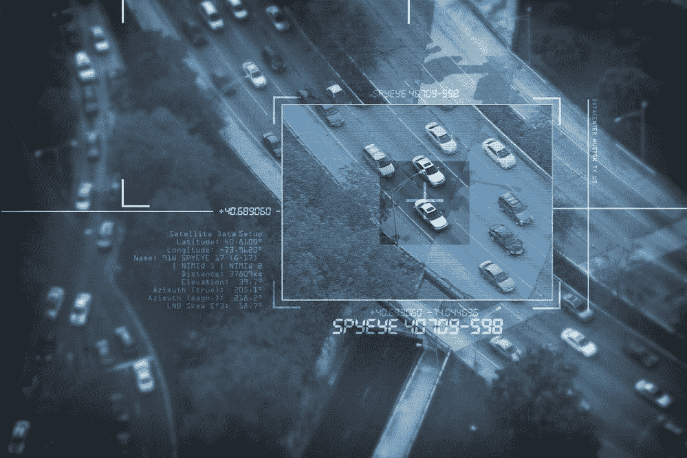
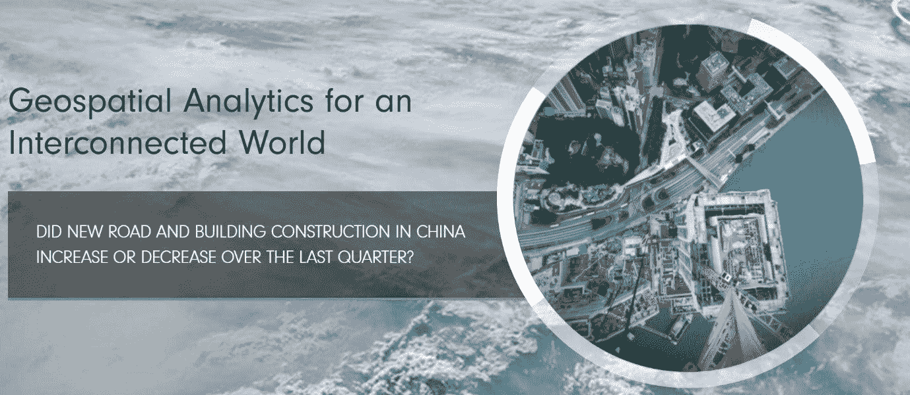

# 仰望天空寻找阿尔法

> 原文：<https://medium.datadriveninvestor.com/looking-to-the-skies-for-alpha-ede7a00578e1?source=collection_archive---------19----------------------->

我们最近讨论了 Quandl 等公司如何引领这场另类数据革命。现在，量化对冲基金非常愿意花费大量的时间、金钱和精力来获取这些数据，所有这些都是为了获得关键的信息优势和创造阿尔法。替代数据最有用的来源之一是**卫星图像**。

环绕地球运行的卫星数量正在迅速增长。无论是商业用途，还是政府、军事或民用目的，我们每年都看到更多的物体被发射到太空。[由联合国外层空间事务办公室(UNOOSA)维护的发射到外层空间的物体索引](http://www.unoosa.org/oosa/osoindex/search-ng.jspx?lf_id=)，统计了 2018 年目前围绕地球运行的 4857 颗卫星。这比 2017 年增加了近 5%，而 2017 年比 2016 年增加了 9%。

因此，随着越来越多的卫星可以用来绘制地球的长度和宽度，对冲基金越来越多地使用图像来识别关键地理区域的重大经济变化，这最终可以传递强有力的交易信号。事实上，在过去的几年里，公司已经将大量卫星送入轨道，这些卫星可以传回地球表面的图像流，同时不断更新这些图像。例如，投资决策是在绘制作物产量增长图的基础上做出的，或者是通过识别那些产煤最多的煤矿做出的。

瑞银是首批采用这一策略的银行之一。早在 2010 年，它就开始使用私人卫星公司来整理沃尔玛停车场的使用流量。通过观察每月进出停车场的汽车数量，这家瑞士银行能够预测顾客流量，并编制回归分析来预测超市的季度销售额。

自那以来，金融业对卫星图像的需求一直在增长，对冲基金越来越多地使用它来跟踪与矿山、港口、种植园和农田相关的风险。图像本身的能力也有了显著提高，这使得能够识别更精细的数据。还可以使用红外技术进一步分析矿石和作物产量的质量。因此，对冲基金现在非常热衷于抢在同行之前获得这些数据。

而且理由很充分。各国并不总是愿意提供数据，尤其是原油供应等更敏感或更有影响力的领域的数据。在展示官方数据时，他们也不总是准确的——在这方面，我想到了中国。因此，从卫星图像中获得更真实评估的迫切需要变得显而易见。关于中国的经济活动，地球的鸟瞰图能告诉我们什么？还是关于储油量？如何将其转化为可操作的市场走势预测？

这就是 Orbital Insight 这样的公司可以提供帮助的地方，该公司自 2014 年以来一直根据对卫星图像的分析为客户提供交易信号。 [Orbital Insight 构建了一个宏观视野，在不断扩大的卫星图像供应中寻找真相和透明度。](https://www.welcome.ai/products/government/orbital-insight-understanding-the-earth)“实际上，这意味着该公司雇佣数据科学家和工程师来获取、处理和分析卫星图像，使其适用于各种客户群，包括对冲基金、保险公司、政府和非政府组织。到 2016 年，70 家对冲基金和 4 家政府机构正在使用 Orbital Insight。

[来源](https://orbitalinsight.com/#slider-2)

轨道科学公司本身更多地参与数据分析阶段，而不是卫星图像阶段。正如首席执行官詹姆斯·克劳福德解释的那样，“我们从全球所有卫星公司获取图像，将其放入一个基于人工智能的系统，并在此基础上进行大量的数据科学研究，最终得出对世界上正在发生的事情的理解。”但就实际获取图像本身而言，轨道科学公司已经与多家卫星公司签署了协议——其中最令人兴奋的是行星实验室。

行星实验室由美国宇航局前雇员成立，自 2011 年以来的任务是每天对整个地球陆地区域进行成像。到 2017 年 2 月，[发射了创纪录的 88 颗鞋盒大小的“鸽子”卫星](https://www.planet.com/pulse/planet-launches-satellite-constellation-to-image-the-whole-planet-daily/)，它已经积累了实现这一壮举所需的卫星数量(149 颗)。与 cubesats 一起，这些小卫星可以比传统卫星更频繁地提供地球目标区域的图像——如石油储存设施、停车场和农田等区域。如今，Planet Labs 每年处理大约 2 Pb(200 万 GB)的数据。

2017 年 2 月，卫星想象公司 SpaceKnow 在德国风险投资公司 BlueYard 领导的一轮融资中筹集了 400 万美元，以开发能够“[扫描、理解和描述每天使用卫星图像的地球表面每一平方英寸的人工智能工具](http://spaceref.com/news/viewpr.html?pid=50404)。如今，该公司因开发了以下产品而闻名:

1.  中国卫星制造业指数(China Satellite Manufacturing Index)将卫星图像与街道地图和光谱数据结合起来，监测中国 6000 个工业基地的活动。该指数使用 22 亿张这些地点的卫星快照，覆盖 50 万平方公里的领土，以衡量该国制造业的表现。
2.  非洲夜间照明指数，使用单个国家和整个非洲大陆的照明强度作为经济指标。

SpaceKnow 现在从它目前可以访问的大约 200 颗卫星中提取的数据的多样性令人吃惊。机器学习算法可以分析库存商品、房地产、表面材料等图像，而联合创始人 Pavel Machalek 最近讨论了图像的例子，这些图像显示草地正在逐渐转化为混凝土，作为制造业扩张的可靠指标。

事实上，对对冲基金来说，最有价值的是将堆积如山的卫星图像转化为有意义的、能产生阿尔法值的金块的过程。尽管像 [Spire Global](https://spire.com/) 和 [BlackSky](https://www.blacksky.com/) 这样的新兴公司现在提供原始卫星图像来监控农作物、停车场、航运交通等，但许多分析工作都留给了对冲基金客户。

但是像[or erry . ai](http://orrery.ai/)这样的公司现在正在努力更进一步，通过实现机器学习算法来处理数据*和*产生有意义的商业见解。虽然该公司将从购买行星实验室等公司的数据开始，但它的目标是将自己的卫星送入轨道。被称为“T10 芯片卫星”的小卫星将在一天中的任何时候都配备雷达仪器，不管天气情况如何。

最终，该公司打算将从卫星图像中收集的所有数据应用到投资中，这些投资将通过 allied 2020 基金进行。因此，该基金可以利用 or Rey . ai 的发现为其投资者赚钱。正如创始人 Dick Rocket 最近承认的那样，“数据分析公司和金融部门之间存在差距……这就是我们的差距。”

鉴于近年来发射卫星的成本大幅降低，我们的世界上发生的活动数量似乎只能继续得到更全面的报道。这意味着对冲基金拥有的潜在有用数据量只会继续增加。

在未来的某个时刻，会不会有太多的意象让你无法理解？可能吧。但与此同时，对冲基金争夺替代数据的军备竞赛似乎才刚刚开始加速。

*原载于 2018 年 9 月 18 日*[*【www.datadriveninvestor.com】*](http://www.datadriveninvestor.com/2018/09/18/looking-to-the-skies-for-alpha/)*。*