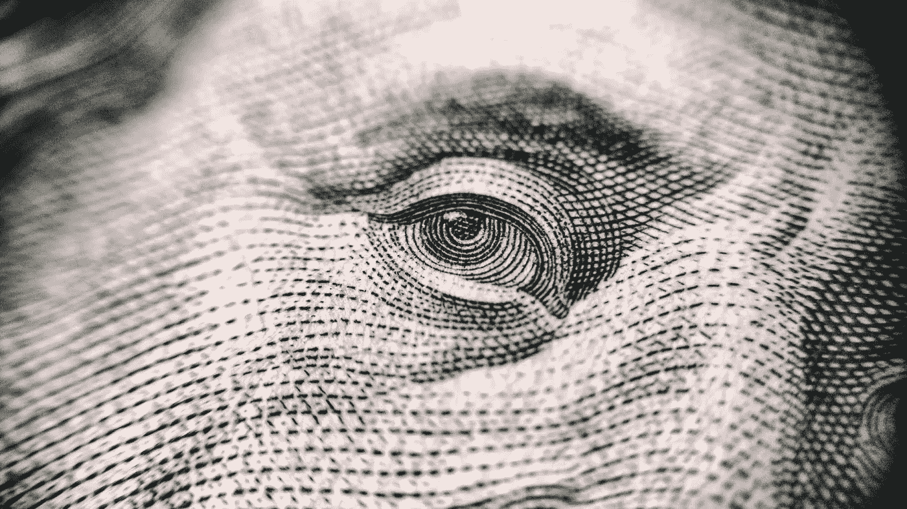

# 展望下一次衰退

> 原文：<https://medium.datadriveninvestor.com/looking-toward-the-next-recession-26b1c27ecf8?source=collection_archive---------18----------------------->

我不知道下一次衰退什么时候会到来。学习经济学的一个好处是，它让你对这个世界的看法变得不那么确定。

这就是杜鲁门想要一个单手经济学家的原因。这位经济学家不能一方面谈论另一方面，因为他只有一只手。

 [## 为什么包容性财富指数比 GDP 更能衡量社会进步？|数据驱动…

### 你不需要成为一个经济奇才或金融大师就能知道 GDP 的定义。即使你从未拿过 ECON 奖…

www.datadriveninvestor.com](https://www.datadriveninvestor.com/2019/03/08/why-inclusive-wealth-index-is-a-better-measure-of-societal-progress-than-gdp/) 

我所知道的是——我们已经没有政策选项来阻止它了。

Photo by [**Vladislav Reshetnyak**](https://www.pexels.com/@vladislav-reshetnyak-66283?utm_content=attributionCopyText&utm_medium=referral&utm_source=pexels) from [**Pexels**](https://www.pexels.com/photo/full-frame-shot-of-eye-251287/?utm_content=attributionCopyText&utm_medium=referral&utm_source=pexels)

我认为这就是特朗普打破常规向美联储施压的原因。他希望降低利率，因为他或他的顾问们可以看到隐藏在系统下面的腐败。

但是他大肆宣扬这个好消息。就业数字上升了。失业水平持平。股票市场上涨了。

就像我说的，我们已经没有标准的政策选择了。在财政政策上，你通常能做些什么？你花钱。把钱扔出去给人们。

把钱交到想花钱的人手里。布什这样做了。记得十多年前从财政部随便拿了 600 美元吗？

那很好。这不足以阻止下滑，但这很好。我付清了我的信用卡。

问题在于，国会中仍有足够多的人对任何形式的赤字支出说三道四。

许多人在上次经济复苏时抱怨挥霍无度。我想如果特朗普这样做，那也没什么。

应对经济下滑的另一个方法是减税。不要分发资金，让人们和公司把它存在银行里。

这里的问题是我们已经这样做了。税法削减了最高边际税率，并削减了公司税率。

我们看到收益激增，这有助于刺激市场。但这并没有改变增长率。它只是提高了水平。

如果你拥有股票，这很好，但是这个国家的绝大多数证券最终都被收入最高的 10%的人所拥有——超过 80%的股票，而收入最低的 90%的人所拥有的大部分都被套牢在退休基金中。

刺激经济的另一种方式是通过货币政策。你降低了中央银行的利率。你停止支付准备金的利息。这使得银行降低了利率。

反过来，企业看到这些廉价资金，决定投资建设产能。消费者购买大件商品，比如房子、汽车(或者船！).

这里的问题是美联储设定的利率，联邦基金利率，十年来一直停留在零。历经两任总统的复苏是有记录以来持续时间最长的一次，但这只是一次浅度复苏。

平均增长率低于 3%。这比衰退要好，但它会让你羡慕地看待过去的扩张。

如果不看最近的复苏，现在的利率接近历史低点。现在很少有投资是有意义的，但却在等待联邦基金利率下降 0.25 个百分点，以降低你的内部最低回报率。

这就剩下非常规政策——量化宽松、直升机撒钱或直接债务货币化——来推动事态发展。

底线是现在有信号在闪烁。

制造业正在放缓。收益率曲线已经反转，意味着长期贷款比短期贷款更便宜。

这在过去一直是市场信心下滑和衰退即将到来的信号。

衰退来了。这种机制可能会有所不同，但一旦大盘转向，它就会变成一个自我强化的过程。

市场确实喜欢确定性，这是我们的总统最不擅长的政策变量。

全球化发展了，供应链也到位了，然后他宣布改变激励机制，直到他改变主意。

在很多方面，他是自己最大的敌人，因为他选择的这些贸易战并不好玩，也不容易赢。

制造业很难回到国内。如果它回来，将是资本密集型的，因为就业市场紧张，招聘很难。

这种情况已经持续了一段时间。看看过去 40 年制造业产出与就业的对比。他们正在互相对抗。

我们需要回顾过去，并为不确定的未来做好准备。经济将会下滑，当然，总统会寻找替罪羊。

政策团队将毫无准备地寻找替罪羊。"要是鲍威尔在 12 月份不加息就好了！"他们会说当人们挨饿，失去房子，死于可预防的疾病。

不过，我们知道他不会把矛头指向哪里。

*最初发表于*[*【http://econautodidactic.blogspot.com】*](https://econautodidactic.blogspot.com/2019/07/looking-toward-next-recession.html)*。*