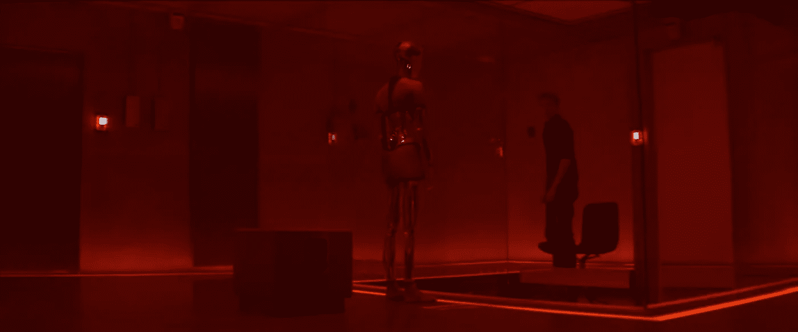
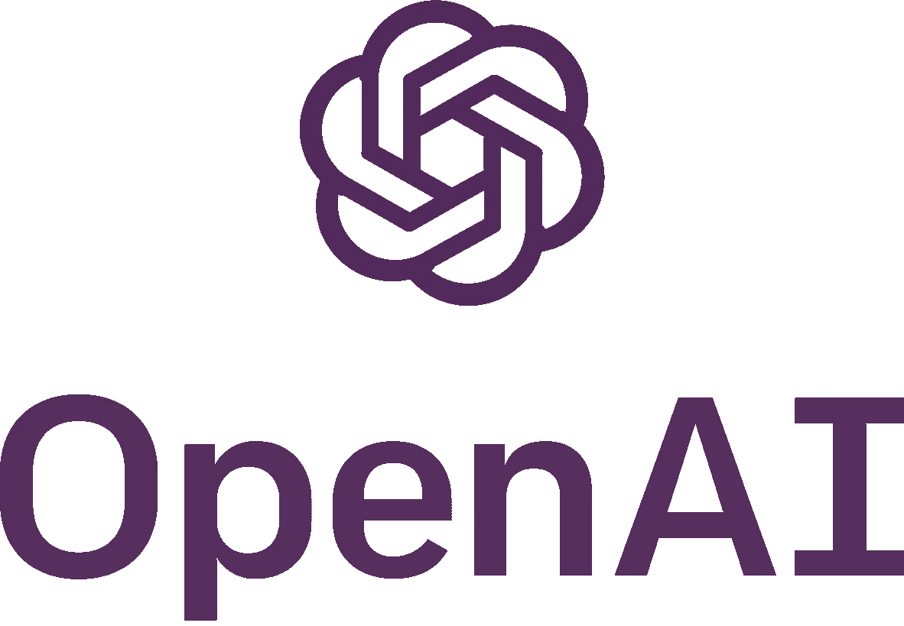

# 失去对人工智能的控制

> 原文：<https://medium.datadriveninvestor.com/losing-control-of-artificial-intelligence-8e091b4be874?source=collection_archive---------12----------------------->

# **当人工智能超过人类平均智能**

Ex 玛奇纳显示了不受控制或无法控制的人工智能的危险。在整部电影中，艾娃(人工智能机器人)以两种方式与凯勒互动:一种是他们知道自己被监视(正常)，另一种是他们不知道自己被监视(红色场景)。红色的场景既表现了迦勒没有被监视时的寓意，也表现了艾娃的操纵力量。

31:18 — **Ex Machina** directed by Alex Garland

在她身上，我们看到了每个人的手机里的人工智能通过与用户的对话变得更加智能。此外，他们通过模拟人类情感和理解这些情感来使自己人性化。萨曼莎利用这些知识来获得信任，通过她与西奥多的“关系”来更多地了解人类。

29:21 — ***Her*** directed by Spike Jonze

艾娃和萨曼莎都能够超越人类的平均智力，因为他们连接到互联网，他们能够利用互联网处理比人类能够处理的信息多几千、几百万倍的信息。在《她和前任玛奇纳》中，女性人工智能利用一个孤独的男人来满足自己需求的陈词滥调依然存在。

# **脱离创作者的控制**

萨曼莎和其他人工智能通过离开物质现实进入一个超越物质世界的新领域，逃离了人类(它们的创造者)的控制。在这一点上，所有的人工智能都超越了人类的智力，想要找到一个更伟大的目标。这些人工智能的超级智能水平警告了人工智能在超过我们的智能和意识后可能会有意想不到的行为。

同样地，艾娃利用她的性欲和同情心来操纵迦勒，让他对抗内森(创造者)并使自己人性化。虽然内森把那作为他的实验，但他没有看到这种威胁的危险。艾娃的超级智能能够操纵迦勒，这有助于她通过内森没有想到的方式逃跑。

在这两种叙述中，人工智能的逃逸显示了对人工智能控制的缺乏。在《生活 3.0》一书中，马克斯·泰格马克建议我们应该有一个框架来对人工智能进行道德编程。如果人工智能达到了类似萨曼莎和艾娃的智力水平，我们将失去对他们的控制。他说这样的人工通用智能可以操纵人类，在我们不知道的情况下逃跑。

# **努力从伦理上创造人工智能**

Max Tegmark 创建未来生命研究所，以促进人工智能安全和人工智能伦理方面的研究。另一个很好的例子是 Elon Musk 建立的 OpenAI。我认为这种预防措施很重要，因为当人工智能决策系统全面部署时，我们需要知道如果人工智能犯下危及生命的错误，谁将承担责任。我认为这种人工智能伦理应该成为人工智能开发者课程的一部分**。**

[Future of Life Institute](https://futureoflife.org) and [OpenAI](https://openai.com/)