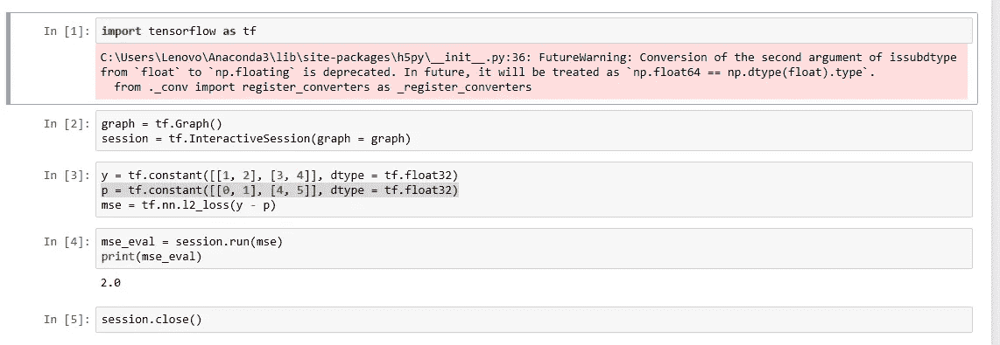
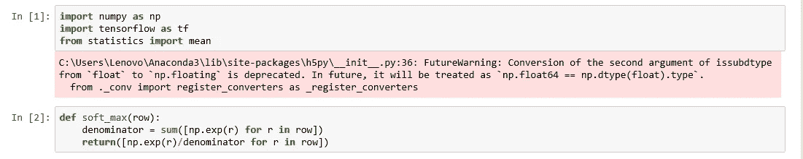
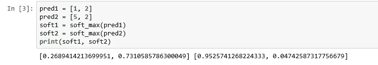
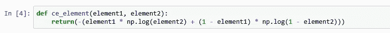
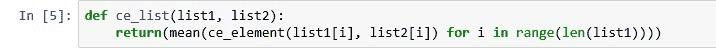
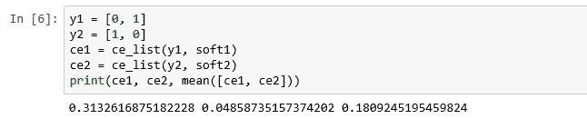
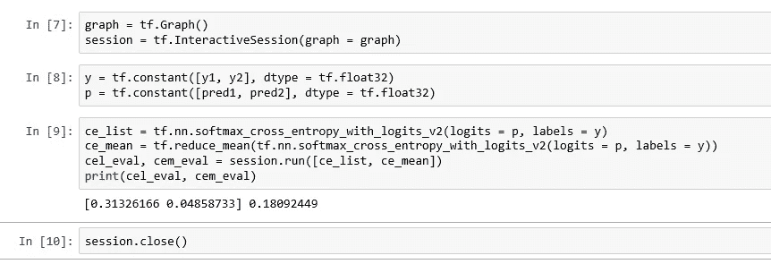

# 张量流中的损失函数

> 原文：<https://medium.datadriveninvestor.com/loss-function-in-tensorflow-b7eb1215ef78?source=collection_archive---------1----------------------->

在机器学习中，你开发一个模型，这是一个假设，在给定一组输入值的情况下预测一个值。该模型有一组权重，您可以根据一组训练数据对其进行调整。训练数据有几对输入值和预测值。我们使用损失函数来确定训练数据中预测值与实际值的偏差程度。我们改变模型权重，使损失最小，这就是训练的目的。通过[下降到 ML: Training and Loss](https://developers.google.com/machine-learning/crash-course/descending-into-ml/training-and-loss) 可以很好地解释什么是损失函数。这里我们将探索 TensorFlow 来计算我们的损失函数的值。如果你是张量流的新手，请阅读我以前的文章[开始张量流](https://medium.com/datadriveninvestor/beginning-tensorflow-dc041fc23392)以了解张量流图形和会话。

[下降到 ML:训练和损失](https://developers.google.com/machine-learning/crash-course/descending-into-ml/training-and-loss)文章谈到了平方损失函数。TensorFlow 中的 [l2_loss](https://www.tensorflow.org/api_docs/python/tf/nn/l2_loss) 函数是一个类似的函数，只是，正如所记录的，它是平方损失的一半。为简单起见，我们将跳过开发模型本身，使用实际值和预测值的假想值来计算损失。

假设实际值为

y = tf.constant([[1，2]，[3，4]]，dtype = tf.float32)

假设某个模型预测的值是

p = tf.constant([[0，1]，[4，5]]，dtype = tf.float32)

现在平方损失是平方(1–0)+平方(2–1)+平方(3–4)+平方(4–5)= 1+1+1+1 = 4。一半是 2，所以 l2_loss 是 2。这是笔记本。

l2_loss

现在让我们来看另一个常用的损失函数，交叉熵损失函数。你可以在[这个](https://ml-cheatsheet.readthedocs.io/en/latest/loss_functions.html#cross-entropy)链接中查看一下这个函数，这里我们将讨论一下 Python 和 TensorFlow 的实现。我们将再次采用一些假想值作为实际值和预测值，并且我们将使用 numpy 进行手动计算，因为与 l2_loss 情况不同，这里的计算将难以手动执行。我们将通过首先使用 numpy 计算值，然后交叉检查张量流结果来理解张量流函数[。](https://www.tensorflow.org/api_docs/python/tf/nn/softmax_cross_entropy_with_logits_v2)

[SoftMax](https://en.wikipedia.org/wiki/Softmax_function) 取一个未规格化的向量，将其规格化为概率分布。阅读维基百科链接来理解这个函数，我们将在下面讨论它的 Python 实现。函数的“row”参数表示向量。

SoftMax Implementation

现在让我们用两个简单的例子来检验这个函数。我们将在 TensorFlow 代码中重用其中的几个变量进行比较。

SoftMax Examples

您可以看到，较小的值被转换为较小的概率，而较大的值被转换为较大的概率，给定向量中的 SoftMax 值加起来等于 1。接下来我们将计算单个元素的交叉熵值(一个元素是一个标量值)，查看 ML 备忘单链接中的公式。第一个参数是实际值，第二个元素是预测值。

Cross Entropy for Element

当我们有了向量中的实际值和预测值，或者我们在 Python 中称之为列表时，我们将计算交叉熵。这是通过取元素方式的交叉熵值的平均值来计算的。

Cross Entropy for List

实际的概率通常是已知的，因此它们可以是 0 或 1。我们可以从前面计算的 SoftMax 例子中得到预测的概率。预测值通常在神经网络的前一层中计算，因此我们将 SoftMax 应用于逻辑值(逻辑值是在应用 SoftMax 等函数之前在神经网络中计算的值)。我们不会将 SoftMax 应用于实际值，因为它们已经是概率。

Cross Entropy Calculated

我们现在将使用 TensorFlow 函数计算相同的值。

Cross Entropy using TensorFlow

这里我们在 SoftMax 之前传递预测值，因为 TensorFlow 函数计算 SoftMax，然后计算交叉熵。

请注意，损失函数是一个单一值，作为训练神经网络的一部分，我们将其最小化。所以我们在笔记本的第 6 个单元格中用 numpy 方法计算了交叉熵值的平均值，在笔记本的第 9 个单元格中用 TensorFlow 方法计算了交叉熵值的平均值，它们吻合。

当你建立自己的神经网络时，你会发现这种对损失函数及其张量流实现的理解是有用的。