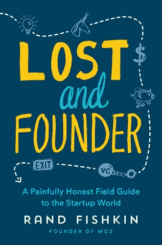

# 迷失与创始人:兰德·菲什金《创业世界痛苦而诚实的实地指南》(妮可·施林格书评)

> 原文：<https://medium.datadriveninvestor.com/lost-and-founder-a-painfully-honest-field-guide-to-the-startup-world-by-rand-fishkin-nicole-ad389756b13d?source=collection_archive---------13----------------------->

[Rand Fishkin](https://medium.com/u/10e7e9d0a0af?source=post_page-----ad389756b13d--------------------------------)’s Lost and Founder. I had a love / hate relationship with this book.

我对这本书又爱又恨……也因此对兰德·菲什金本人产生了感情。

首先，让我向你保证，当兰德告诉你这本书非常诚实时，他是非常直率的。他什么都不吝惜；创业中最丑陋、最糟糕的时刻暴露无遗。他的大部分故事都没有魅力。15 年来，他一夜成名。

然而——我希望他能再等一会儿再写这本书。看起来这些故事还是有点太原始了。这种痛苦对他来说太新鲜了，以至于他无法充分认识到他的经历对他自己、他的公司以及他已经产生重大影响的行业意味着什么。还不清楚他的新冒险是否会成功。

最痛苦的时刻到来了，当他说他从他和他母亲一起创立并花了超过 15 年时间建立的公司中退出时……满分是 4 分。实质上，他是在一个不是他自己选择的时间被迫离开的，也不是完全按照他自己的条件。

当你的公司品牌和你的个人身份合二为一时——这是痛苦的。

但是当你通读一遍，你就能开始明白为什么了。这是一家价值 4500 万美元的公司，拥有主要投资者和庞大的团队。兰德不是唯一的利益相关者，也不是最终的决策者。

然而，在某种程度上，他似乎不再是公司需要他的方向上的领导者。他对个人贡献者的抨击太长了，所以很明显背后有个人目的。

> 公司需要他的方式并不是他想提供给自己的方式。
> 
> 随着公司的发展，你必须成为一名领导者。
> 
> 是的，个人贡献者很重要。它们是必要的。
> 
> 首席执行官不是个人贡献者。

最后，我为兰德·菲什金感到难过。不是我所期待的。

但是很好的教训。新鲜的想法。一些我以前没有考虑过的事情。

[https://www . Amazon . com/Lost-Founder-hardy-Honest-Startup-ebook/DP/b 074 dgyvd5/ref = Sr _ 1 _ 1？ie = UTF8&qid = 1540150828&Sr = 8-1&关键词= lost+and+founder+by+rand+fishkin](https://www.amazon.com/Lost-Founder-Painfully-Honest-Startup-ebook/dp/B074DGYVD5/ref=sr_1_1?ie=UTF8&qid=1540150828&sr=8-1&keywords=lost+and+founder+by+rand+fishkin)