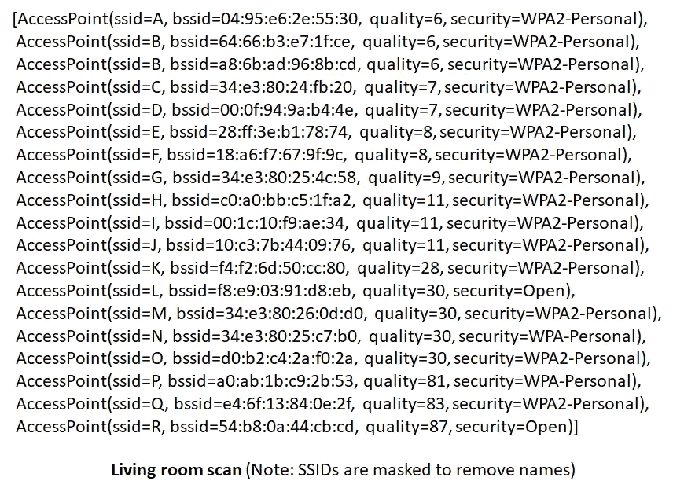
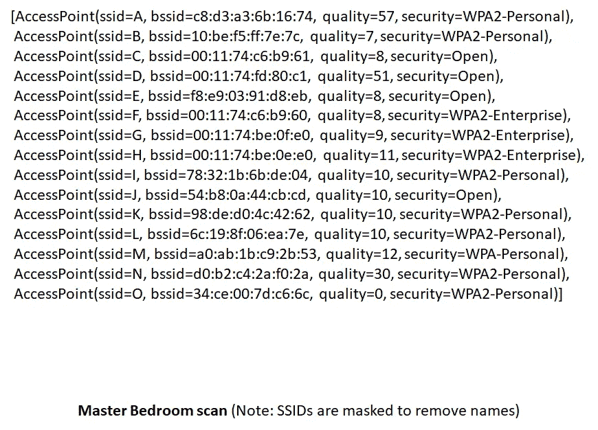
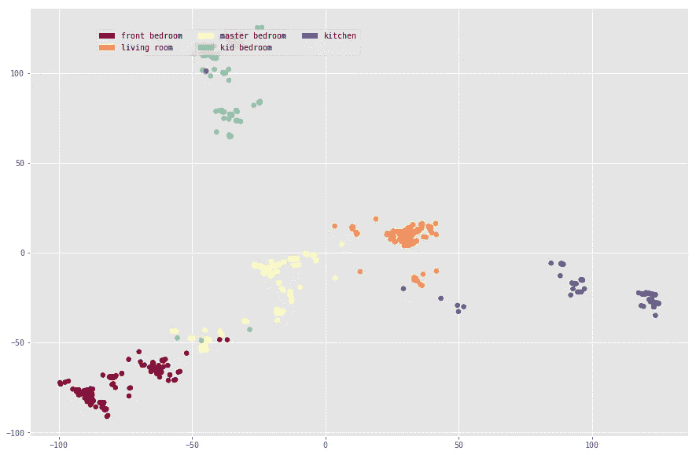
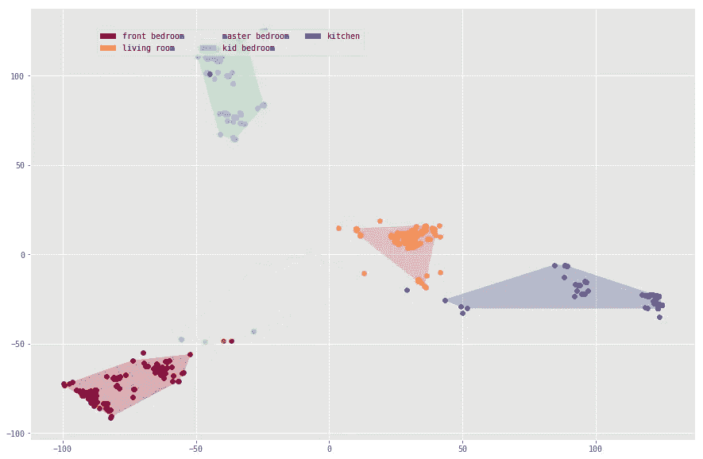
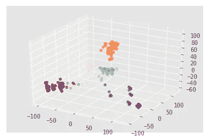

# 在你家迷路了…人工智能可以帮忙

> 原文：<https://medium.datadriveninvestor.com/lost-in-your-home-ai-can-help-21023eff6c59?source=collection_archive---------3----------------------->

不是开玩笑。你没看错。如果你从客厅到卧室迷路了怎么办？人工智能可以帮助你在家里导航。这里有一些人工智能的乐趣。

基于卫星的全球定位系统(GPS)改变了我们的生活。从位置标记、寻找商店、使用地图驾驶到自动驾驶汽车，多种使用案例都利用了这种“外部”定位系统。我们越来越沉迷于基于 GPS 的导航，以至于我们失去了自己寻找一个地方的能力。在一个新的城市，我们的头脑有方向和定位感的日子已经一去不复返了。

现在你到家了。GPS 在你的房子里失灵了。手机信号变化不定，无法精确定位你的位置。你是如何从客厅进入卧室的？一个“内部”定位系统会有所帮助。

无论是外部还是内部，信号都是关键。什么是当今世界的内部信号？当然是 WiFi 啦！！！我们周围的电磁波。

在你的手机上运行 WiFi 扫描，这些天你会发现多个接入点以不同的信号强度愉快地向你发送信号。不管连接与否，信号都存在。这是神奇的钥匙。它就像一个指纹。我们能利用这些信号构建室内地图吗？

这里有两个这样的扫描，分别在我家的一个位置。

质量表示您的扫描仪正在接收的信号强度。每个点都有不同数量和不同强度的信号。这是一个矢量。描述信号强度的数字向量。在这种情况下，它们是[6，6，6，7，7，8，8，9，11，11，28，30，30，30，81，83，87]和[57，8，8，51，8，8，911，10，10，1010，12，30，0]。这相当于我们的纬度和经度。

一旦有了矢量，就有了 AI…心脏漏跳了一拍。

现在在房子里走来走去，得到 1000 个这样的东西。添加人工智能算法来训练分类器/预测器。现在，无论你在哪里，扫描仪都会扫描，然后根据信号组合预测你在哪里。

这些是简单的步骤。当然，我们必须确保数据是干净的，缩放到相同的大小，在不同的时间点读取数据，以消除信号中的任何不确定性，并通过邻居打开/关闭调制解调器，进行异常值检测，添加一些噪声以增强鲁棒性等。所有这些都有助于提高准确性。

我们得到了什么？

这是我家的矢量地图。

Multidimensional vector reduced to 2 dimensions using PCA (Principal Component Analysis)

这里有一个房子的 WiFi 地图，如果你愿意，可以用算法画出边界或墙壁。

Boundaries auto-generated by code

例如，您可以观察两个房间之间的普通墙壁。这张地图粗略地(不准确地)描绘了楼层平面图，但没有标出所有的房间，因此不完整。内部连接被很好地捕捉到，就像客厅直接连接到厨房，而不是孩子的卧室。

有趣的是，这是 3D 矢量空间中的房子。

PCA(3D)… XYZ coordinate map

我们该怎么处理这个？这台机器现在可以预测一个人在家里的什么地方。内部定位游戏当然是可能的…一种新形式的寻宝游戏。这很有趣。试试看。

人们可以给这个 WiFi 坐标图添加标签来创建一个内部搜索引擎。不要再把那些钥匙丢在家里了。内部定位系统可以改变你如何导航建筑物，商场等。

那里有太多的数据…文本、图像、视频、基因组和电磁波。这增加了很多混乱。每一个都是一个矢量。我们如何利用这些向量和去杂波生活？

> 我们的生活是一个向量。让我们把它整理一下

在人工智能时代，我们的生活是一个向量。让我们用代码和人工智能来整理它。