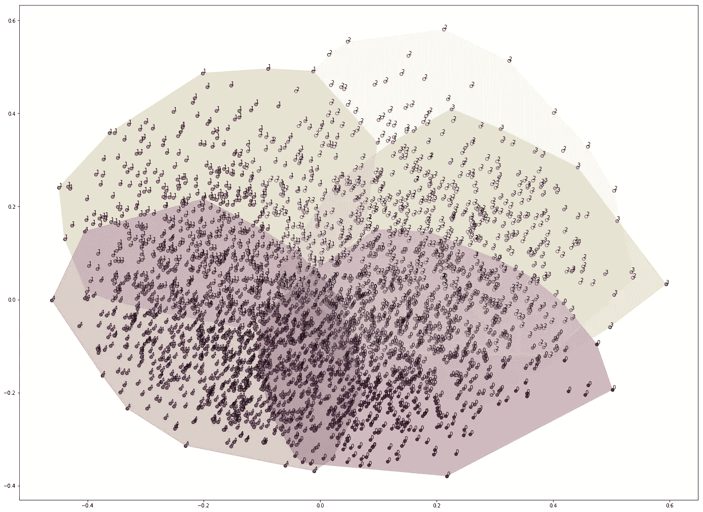
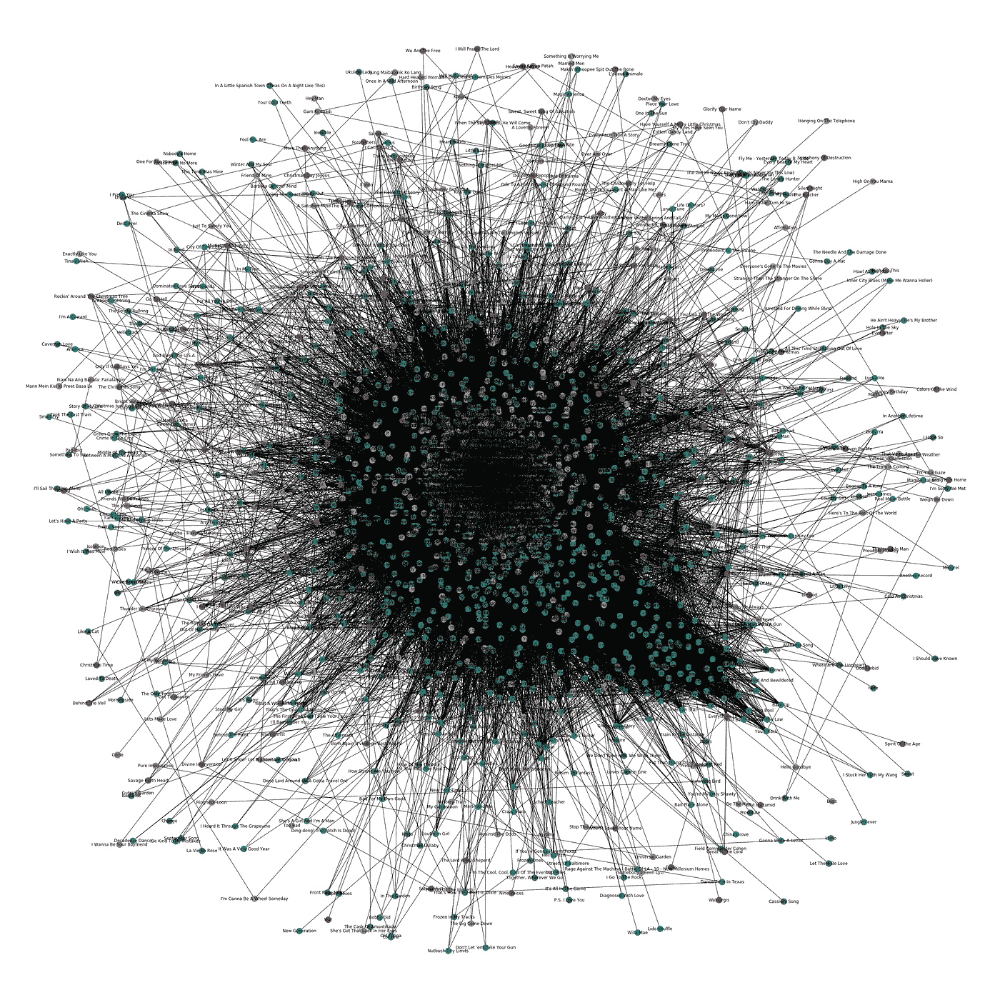
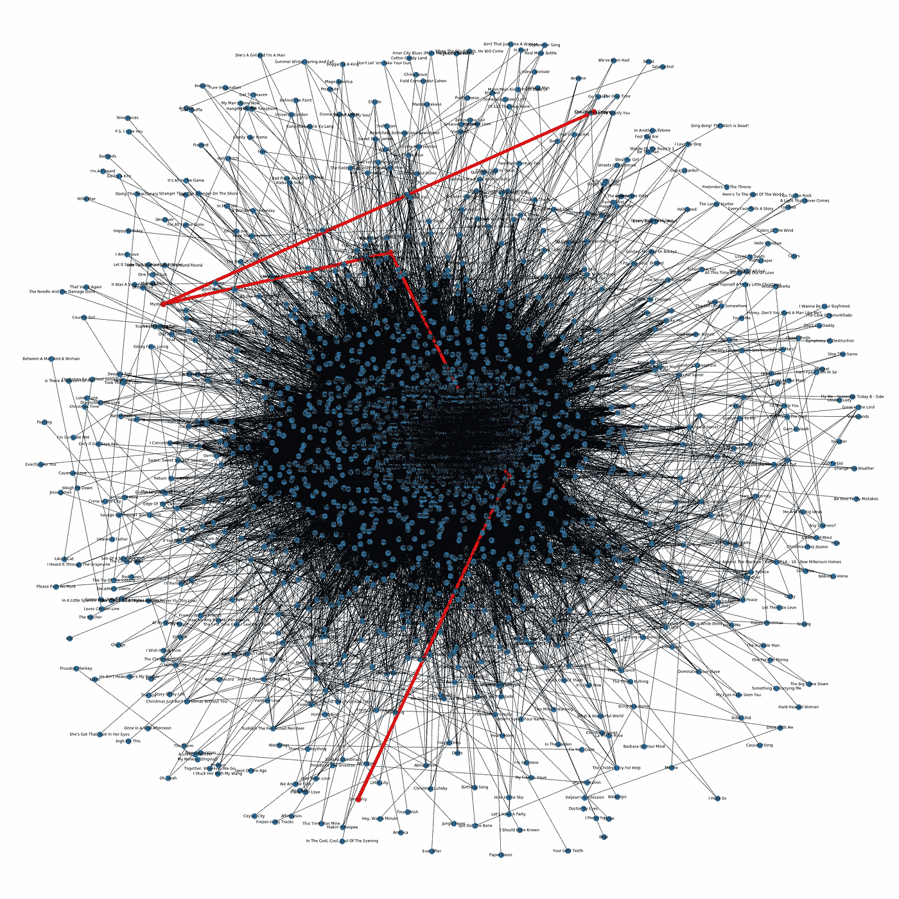
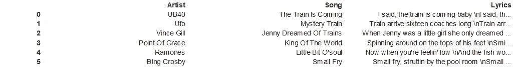
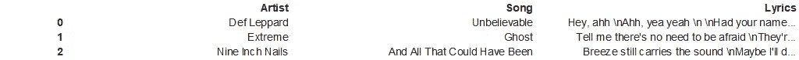
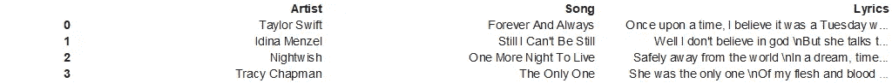
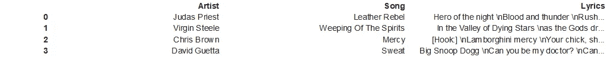

# 爱在人工智能中

> 原文：<https://medium.datadriveninvestor.com/love-is-in-the-ai-2b2e62429dac?source=collection_archive---------4----------------------->

r 不缺。

必须给她留下深刻印象。她喜欢音乐，我也喜欢音乐。我们有专门的音乐聆听课程。我给她放几首歌好吗？

那鸿同样的老消息来源。相同的旧推荐引擎。他们的算法是最少的…他们制造更多相同的东西。

 [## 人工智能与创造力:梦想成真——数据驱动的投资者

### 人工智能总是让我着迷。不仅作为一套有用的工具，不断发展，而且作为一个…

www.datadriveninvestor.com](https://www.datadriveninvestor.com/2019/01/28/ai-creativity-deep-dream-comes-true/) 

生活是一次旅行。就像说的，每一首喜欢的歌背后，都有一个不为人知的故事。我能带她踏上音乐之旅吗？回忆之旅？有没有可以设置旅程的 app？

> 每首喜欢的歌背后，都有一个不为人知的故事

不，这是单方面的…它发挥，你听。我想要一次旅行；我们都可以选择音乐空间的起点和终点。这就像在谷歌地图上导航，但却是在音乐空间。

我想取代她的位置。她的喜欢，我的喜欢，一个组合。想给她留言。歌词很重要。不仅仅是声音。我们可以坐下来听听其中的含义。

哦，可以把歌词转换成向量。就像人类理解每个单词的意思是基于它周围的东西。让我把一些 AI 算法/模型扔到音乐汤里搅拌一下，把这个以向量的形式提取出来。根据歌词有不同的歌曲组吗？

有……让我拿 5 英镑。

似乎有用。每个点都是一首歌。体面的分组将歌曲按歌词分开。没有明显的界限。哦，是的，当然…重叠的存在是因为音乐超越了界限。其实挺好的。

现在我们可以从一个点/歌曲导航到另一个点/歌曲了吗？为此，我需要找到两首歌曲之间的距离，这样我就可以通过起点和终点之间的最短距离进行导航。每首歌都是一个向量，因此可以找到两首歌之间的距离。下面展示了一幅惊人的图片，这些歌曲通过距离相互连接。

在小图中绘制时可读性不强。图中的每个节点是一首歌，每条边给出了歌曲之间的语义距离。

这是我们的音乐空间。我们的私人音乐空间。它有几十到几千首歌曲，我可以浏览它们。既然这是一次旅行，那就让我用一首 UB40 歌曲《火车来了》开始，用比尔·克罗斯比的《小人物》带她回到复古经典时代。“AI+Code”引擎导航并带我们浏览以下播放列表。

红线表示旅程，它经过下面可以看到的 4 个节点。

接下来，我们从她最喜欢的穿越到我最喜欢的，意识到这是如此短的距离。我们感觉很亲密。

我们在音乐领域经历了多次旅行。下面显示了几个“旅程播放列表”。

音乐是一种载体。越来越多，生活是一个载体。

她说…如果一切都是一个向量，接下来带我通过向量空间进行一次学习之旅，一次购物之旅，一次电影之旅。

回到未来。回到编码

页（page 的缩写）如果你恋爱了，想要一个旅程播放列表，就给我留言吧。作为回报，我想要一句原创的爱情名言。