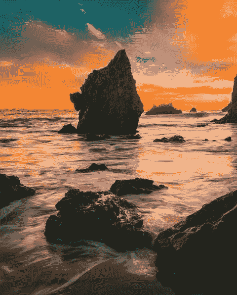
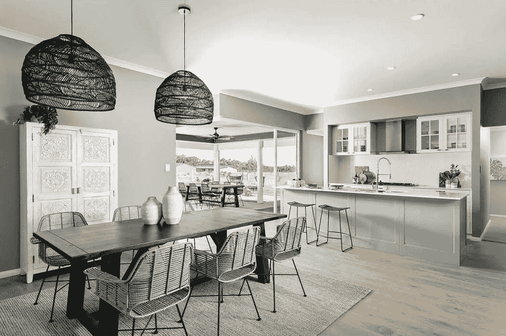

# 爱你住的地方在七个社区建设步骤

> 原文：<https://medium.datadriveninvestor.com/love-the-place-you-live-in-seven-community-building-steps-7611be61a0a8?source=collection_archive---------10----------------------->

# 1.了解你生活的地方的历史。

Rocki in the Water

感觉自己像某个地方的一个短暂的旁观者的一个可靠方法是，对待一个地方，就好像它只是在你搬到那里之后才突然出现一样。相反，通过共同努力去了解你的邻居、城镇和州的历史，你会对它更加感激，更有归属感，加深对事物为什么是现在这个样子的理解，并在驾驭它的轮廓时更有信心——无论是字面上还是象征性的。

也许发现一个地方的过去最容易的开始是通过阅读。当地书店经常出售鲜为人知的地区历史书籍，这些书籍有时就像个别街区一样具有地方色彩。一定要甚至钻研以你生活的城市或州为背景的小说；阅读 [*百年纪念*](https://en.wikipedia.org/wiki/Centennial_(novel)) 和 [*平原之歌*](https://en.wikipedia.org/wiki/Plainsong_(novel)) 比任何非小说类书籍更能帮助我了解科罗拉多州。

 [## 释放结果的简单哲学|数据驱动的投资者

### 这是我们播客中帕迪·布鲁斯南的一段话。帕迪是一个正念和冥想老师，一个…

www.datadriveninvestor.com](https://www.datadriveninvestor.com/2020/03/16/a-simple-philosophy-to-unlock-results/) 

然而，感受一个地方的历史需要的不仅仅是阅读。这只是一个开始。参观州立和国家公园和纪念碑(以及战场和小径)，逛逛最近的历史中心/博物馆，在导游的带领下步行游览市中心，基本上是脚踏实地进行一些第一手探索。不要害怕开两个小时的车去看一个人的东西；甚至开车时间本身也会增强你对你所居住的地方的了解——记住，在有限的空间里有力量。

Which one would you bring back to life?

# 2.步行或骑自行车探索

很少有事情能像通过人类运动的力量探索你的城市的街道、街区和小径一样让你大开眼界。

很多时候，我会出去散步、跑步或骑自行车。这些短途旅行帮助我以更慢、更小的尺度(也就是说，超越不太远的地平线上的山脉)看到了我所居住的地方的真正美丽。我发现了小溪和开满野花的草地，还有一些小公园和孩子们的游乐场，否则我永远也找不到。

通过脚或踏板的力量，你会很自然地注意到如果你开车旅行会错过的东西。你将能够真正环顾四周，调动你所有的感官。你会和你遇到的人打招呼，他们实际上是你的邻居，即使你离家只有几英里远。另外，边走边四处看看也很有趣——看看房子，看看天空，看看动植物。

# 3.开始微冒险(甚至去廉价的地方)

> 即使在你的后院，也有新的冒险、新的风景、新的视角:你只需要付出小小的努力去发现它们。阿拉斯泰尔·汉弗莱斯

现代探险家[阿拉斯泰尔·汉弗莱斯](https://en.wikipedia.org/wiki/Alastair_Humphreys)创造的微探险，是在你的所在地及其周围进行的探险，每天只需几个小时。可能是夜间骑自行车，在新的小道上散步，参观一个被忽视的博物馆，或者任何数量的其他郊游。这个想法是，冒险不一定要规模宏大才能有趣和充实。

把每周一次在你的区域进行一次小小的冒险作为一个目标。开车到一个俗气的路边景点，看地图([一张纸质地图！选择一个公园或小型博物馆参观，租一艘独木舟或皮艇，在附近的河流或湖泊中戏水。所有这些都将增强你对社区的了解，并加深你与社区的联系。](https://www.amazon.com/Atlases-Maps-Reference-Books/b?node=11448)

培养地形癖的最好方法之一就是走出去，融入一个地方的自然环境，真正体验它独特的天气、风景和环境。有一种东西让泥土进入你的鼻孔，了解空气在黎明和黄昏时的感觉和气味，这真的会让你的骨髓有所改变。

但是也不要忽视一个地区不太荒凉但更受欢迎的景点。当你生活在某个地方，很容易把它的旅游景点想当然；如果你不小心的话，那些经常拜访你的人可能会在你之前知道在这个地方可以做的很酷的事情。

你应该非常了解你的家乡，这样你就能成为一名专家，向你的外地客人推荐在那里做什么和避免什么。与此同时，对你所在城市的必看景点了如指掌，也会让你加入当地人的某个俱乐部，如果你没有去过这些地方，你最终会感到被冷落了。

# 4.阅读当地报纸

Read the local paper

大多数城镇，甚至是小城镇，都有当地的周报。它们通常有点无聊，写作有时会留下一些需要的东西，但它们是你的社区正在发生的事情的来龙去脉的宝库。

无论是关于志愿服务的信息，日历上有趣的事件和节日，餐馆开业，工作列表，或者只是对更大的区域可能不重要但肯定在你附近的新闻——当地报纸被严重低估。

在过去，周四早上放在我们车道上的小报纸已经被放到火炉边，看都没看一眼。但最近我一直在努力至少浏览它，我确实觉得它更像一个真正的本地人，而不是一个短暂的闯入者。

Bathromm in Western Australia

# 5.志愿者

如果你仍然是你所在城市的“消费者”,你最终只会看到其中的一个“阶层”——社会的、地理的和经验的。一个让你更沉浸于一个地方的好方法是志愿服务，这可以让你深入了解一些你可能只是肤浅地使用或完全路过的地方和机构。

在教堂教书，在学校做家教，辅导你孩子的少年棒球队，在施粥场帮忙，在当地图书馆整理书籍(我做这些，而且很有趣)。。。不管是什么，你的城镇有需求，你当然有技能可以帮助满足这些需求。你不仅提供了一项服务，而且你自己也会看到巨大的好处。对你住的地方和你住的附近的人，你不可能不感到更大的关心和责任感。与此同时，你会遇到不同类型的人，他们可能会成为你的好朋友。

Western Australia

# 6.成为某处的常客

在我们年轻的时候，我和妻子喜欢尽可能多地去新的地方冒险——酿酒厂、咖啡店、小路等等。虽然一些新奇的事物对我们来说仍然是有趣和重要的，但更大的回报是成为一些最受欢迎的当地景点的常客。

你会认识很多人——包括员工和老顾客——你会听到镇上的流言蜚语。当你经常去一个地方，你不会介意支付独立商店更高的价格，你甚至会在餐馆和咖啡店给更多的小费，因为你真正关心那些依靠你的生意谋生的人。

除此之外，你会获得一种特殊的归属感。当酒吧老板或咖啡师问你的孩子怎么样，时不时地请你喝一杯时，你就被赋予了某种地位，这种地位可以让你牢牢地扎根于你生活的地方。我们人类最大的愿望之一就是被人所知；成为一名常客有助于消除这种瘙痒。

Living Room in Western Australia.

# 7.寻找其他方法来认识你社区的人

许多这些事情——志愿服务、经常光顾当地商店，甚至有一条固定的步行路线——都会帮助你结识朋友。但有时你只需要有意走出去，看看一些当地人的面孔。参加你的街区聚会(即使你不想参加)，报名参加市中心的 5000 米赛跑，如果可能的话，陪孩子去郊游。你可以做太多的事情去进入肉的空间。

而且真的，你甚至不需要交朋友(至少是马上)。仅仅是认识你所在社区的面孔就能提供一些认同感，让在杂货店打招呼变得更加友好，而不是有点尴尬。研究表明，我们喜欢上一个人纯粹是因为熟悉。在我们的邻居中，有很多人我不认为是好朋友，但是当他们外出时，我可以认出他们，并和他们进行友好的交谈。这只是帮助我感觉我属于这里的另一件事——更扎根于此——因此增加了我对丹佛西北郊区的拓扑癖的感觉；虽然我们初次见面时还是陌生人，但随着我对她的了解越来越多，我也越来越喜欢她。

首次出现在《男子气概的艺术》中。