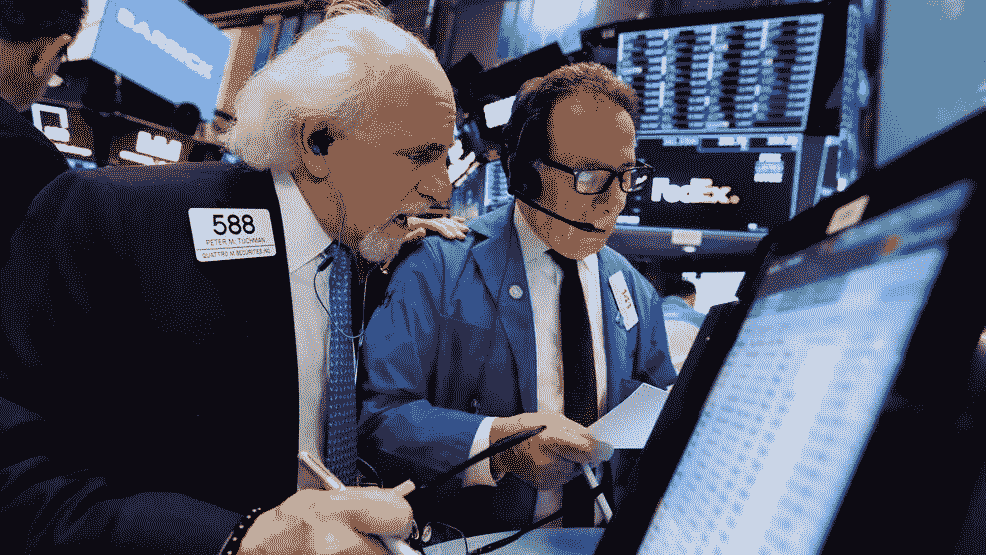

# 上一季度的低业绩导致 2019 年的预期较低

> 原文：<https://medium.datadriveninvestor.com/low-results-of-the-last-quarter-leave-2019-expectations-low-5f8864c756c6?source=collection_archive---------26----------------------->

道琼斯指数上涨 0.08%，至 23346.24 点。标准普尔 500 股市上涨 0.13%，至 2510.03 点。纳斯达克综合指数上涨 0.46%，至 6665.94 点。在标准普尔 500 的 11 个主要行业中，有 7 个行业以上涨收盘。标准普尔 500 对 2019 年收入的预测已经缩短了几个月。分析师目前的预测是增长 7.9%，低于 10 月份超过 10%的增长预测。

特斯拉生产的 Model 3 少于预期，并降低了美国价格。特斯拉股价下跌 6.8%。

从 2018 年全年来看，微软上涨了近 19%。它是道琼斯年度五大成份股之一。2018 年底，微软的资本为 7797 亿美元，每股股票为 101.57 美元。

首席执行官蒂姆·库克(Tim Cook)在致股东的信中表示，将苹果的营收预期从 890 亿美元下调至 840 亿美元。

## 货币

欧元上涨 0.01%，至 1 欧元兑 1.1345 美元

日元下跌 1.22%，至 1 美元兑 107.55 日元

英镑下跌 0.54%，至每磅 1.2539 美元

韩元兑美元汇率上涨 0.65%，至 1126 韩元