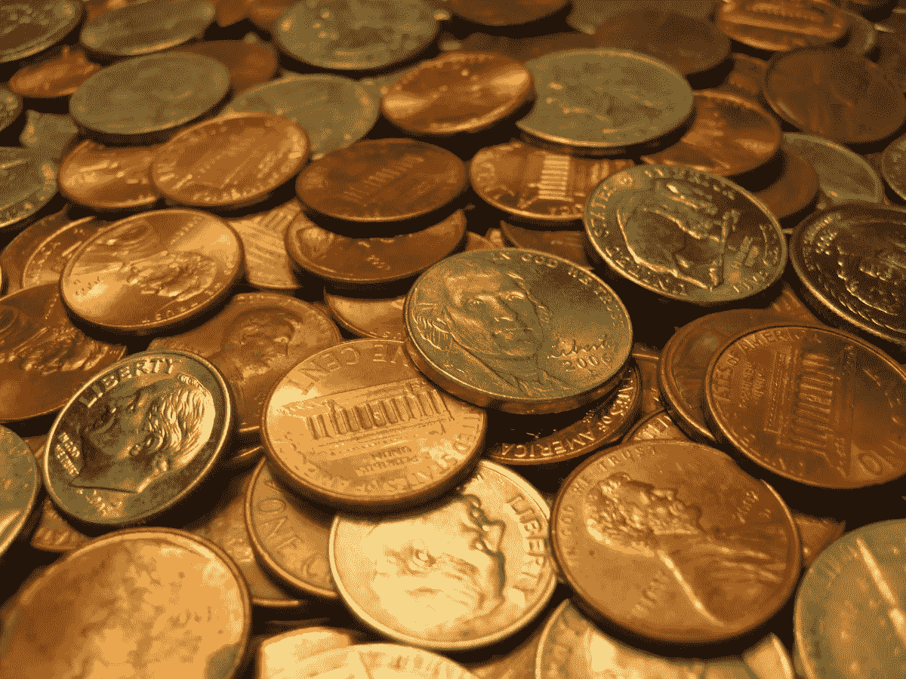

# 在海湾生活的同时降低您的开支

> 原文：<https://medium.datadriveninvestor.com/lowing-your-expenses-while-living-in-the-bay-3492d90643d4?source=collection_archive---------7----------------------->

在我们开始之前，强烈建议你一边听着你最喜欢的 Nappy Roots 的《西瓜、鸡肉和麦片》专辑，一边阅读这篇文章。

住在旧金山湾区，你可以在不彻底改变生活方式的情况下降低开支。粗略估计，硅谷的大多数人可以不费吹灰之力每月至少削减 10%的开支。我将向你展示我是如何使用下面的 6 条规则得出这个估计值的。

 [## 更好地制定预算，打造更大的数据驱动型投资者

### 即使是专家也承认它们并不完美。从 1 到 10 的范围内，安东尼·科普曼和德尔…

www.datadriveninvestor.com](https://www.datadriveninvestor.com/2018/11/08/budget-better-to-build-bigger/) 

规则 1:记录你的开销

如果你没有从这篇文章中得到什么，就做这件事吧。简单地通过跟踪你的花费，你开始减少花费。就像魔法一样。这就像健身让你吃得更健康一样。如果你是一个以预算为导向的人，你会开始做更多有预算意识的决定。

我不在乎你怎么记录你的开销。只有一件事很重要。你必须记录你所有的支出**。一切。**

我个人用 mint.com 的。我爱薄荷吗？不。每次我用它的时候，我体内的产品专家都会尖叫。它设计得很差。它能完成任务吗？是的。我找到更好的了吗？不，但我愿意接受建议；-)

如果你想获得额外的积分，按消费类别(如食品杂货、餐馆等)来细分你的支出。根据我的经验，这有助于你进一步削减开支，因为更容易找到唾手可得的果实。不要花太多时间在这里走极端。这是让大多数人感到沮丧的部分。他们过度优化了所有东西的分类，浪费了太多的时间，以至于他们停止了最重要的部分，即跟踪总体支出数字。

预计节省:5%

**规则#2:检查你不知道你买的东西的花费**

我不是在说为出去吃那顿昂贵的晚餐而内疚。适度的话我没意见。我说的是你根本不知道自己在买，也从未打算买的东西。例如，在为一个租赁申请提取了一份“免费”信用报告后，我支付了 Transunion 信用监控费用(每月 20 美元)。我每隔几个月就会在我的开销中发现类似的事情。如果你以前没有记录过你的开销，我打赌你会找到一些…

预计节省:1%

**规则 3:玩信用卡游戏**

银行向公司收取约 2.3%的信用卡交易手续费。有时这或多或少取决于公司与信用卡公司达成的交易有多好。

你有一个挑战。从信用卡公司获得超过 2.3%的“有效返现”。我能得到 4%左右。以下是如何…

*   亚马逊 Prime 信用卡:你在亚马逊购买的每一件商品都可以获得 5%的现金返还。我用它在亚马逊购物。不要把它用在别的地方。用别的卡可以做得更好。对于亚马逊购物来说，这是一个完全不需要动脑筋的问题。请注意，要获得 5%，你必须是一个主要成员。否则，你得到 3%。
*   [追逐蓝宝石储备](https://creditcards.chase.com/rewards-credit-cards/chase-sapphire-reserve):你在旅行和餐饮上每花 1 美元就能获得 3 点积分。仅在这些类别中使用它。根据点数员的说法，每个点数大约值 [2 美分。以我的经验来看，我觉得差不多是对的。这意味着你可以在旅游和餐饮上获得 6%的有效现金返还。这张卡的费用是每年 450 美元，但是你可以获得 300 美元的旅行积分。Lyft 和优步算在内，所以真的是 150 美元/年。贷项将自动核销。你不必做任何事来确保你拿回 300 美元。如果你住在湾区，又不是完全的隐居者，你会在旅游和餐饮上花足够的钱来弥补那 150 美元。收支平衡是每月 625 美元的旅游和餐饮支出。这张卡还有一些其他的好处。](https://thepointsguy.com/guide/monthly-valuations/)
*   追逐自由无限(Chase Freedom Unlimited):你在任何事情上每花 1 美元，就能获得 1.5 点积分。将它用于所有其他购买。您也可以将这些积分转移到您的 Sapphire Reserve 卡中，这样它们的价值会增加一点。有效返现为 3%。

根据我在这三个类别中每个类别的花费，我的混合平均有效现金回报约为 4%。我完全在欺骗信用卡公司。你也可以。

如果你从未用积分兑换过航班，下面以 Chase 为例简要介绍一下它的工作原理。你可以谷歌或搜索[积分的家伙](https://thepointsguy.com/)去了几个小时的老鼠洞，了解所有的光荣细节。

有两种主要的方式来兑换你的大通点。第一种是通过大通的网站预订旅行。你在 Kayak 上看到的几乎所有航班都会出现在 Chase 网站上，你将按每分 1.5 美分的价格支付航班费用。有些航班在 Chase 上没有或者更贵，但大多数都和 Kayak 或其他旅游网站一样。

你可能在想，“克雷格，你说这些点每块值 2 分钱。这是怎么回事？”这就引出了您兑换积分的第二种方式，即将积分转让给航空公司合作伙伴。例如，您可以将大通积分转换为联合航空里程。总共有大约 20 家航空公司合作伙伴。他们都有不同的计算每次飞行里程的方法。大多数并不直接与航班的现金价值挂钩。因此，有一些非常好的“积分套利”机会。我预订的航班每分能得到 3 到 4 美分。

所以你需要玩一会儿这个游戏来获得最大价值。我通常只是在 Kayak 上找到最好的航班，然后在 Chase 的网站和航空公司的网站上以英里为单位查找航班。然后，向最划算的人预订。这是 80/20 法则，可以在不浪费大量时间的情况下最大限度地利用你的积分。

对于你们这些信用卡发烧友来说，如果你们把大通信用卡换成类似的美国运通卡或花旗卡，我也没意见。不要用单独的航空公司或酒店来代替它们。大通银行、美国运通和花旗银行都允许你转到多家酒店和航空公司，这让它们更有价值。

如果你住在湾区，每年至少飞几次，我觉得 Chase 是最好的。如果你更喜欢高级酒店津贴，美国运通或花旗会更好。几个谷歌搜索将提供你所需要知道的一切，来挑选适合你的。

我的信用评分呢？在不涉及所有细节的情况下，如果你一次申请这三张卡，你的信用评分会下降 6 到 15 分。这不是一个大的丁，除非你很快申请抵押贷款。两年后，你的信用评分通常会比你第一次申请时更好，因为 FICO 评分重视经常使用更多信贷的人。所以你节省更多的钱，并增加你的信用评分！

最后，但同样重要的是，如果信用卡游戏对你来说太麻烦，至少办一张能给你 2.0%或更多返现的信用卡。那几乎是零努力。我打赌你现在拿不到 2%。

预计节省:4%

**规则四:获得西南同伴通行证**

西南航空有很多从 SFO 和 OAK 出发的直达航班。伴侣套票允许您指定一位伴侣，在接下来的 12-24 个月内，当您与该伴侣一起乘坐飞机时，您将获得买一送一的免费机票。好吧，从技术上来说，你单程要付 5 美元，但是 10 美元的往返机票太疯狂了。

更好的是，可以用西南积分订首航，大通积分 1:1 转西南。好吧，现在你开始明白了。我几乎所有的航班都是这样预订的。

你如何得到同伴通行证？《分佬》有篇不错，[详细文章](https://thepointsguy.com/guide/earn-southwest-companion-pass-new-year/)就此展开。我给你 TL；博士你需要在一个日历年内获得 110，000 个西南积分。一旦你这样做了，你就可以获得当年剩余时间和下一年全年的同伴通行证。西南航空公司提供多种信用卡，通常有 40，000-60，000 点注册奖金。假设你注册了两张信用卡，每张 5 万积分，你已经有 10 万积分了。如果你在两张卡上都花了 10，000 美元，你就成功了。

现在，Chase 对你可以注册多少张卡有一些限制。确保你同时获得两张卡的最安全的方法是获得一张个人卡和一张名片。申请名片的时候，不要撒谎。如果你做任何事情，任何副业。用它来做这个。也可以“考虑”创业，主动申请信用卡。发挥创造力。

预计节省:2%(仅限情侣，这在很大程度上取决于你的飞行次数)

**规则 5:使用高收益储蓄账户**

从技术上讲，这不是削减开支。这是关于投资的，但银行业与削减开支密切相关，我正在计算它。

大多数传统银行的储蓄账户提供 0.0-0.5%的利率(至少在撰写本文时是如此)。大多数高收益储蓄账户提供 2.0-2.5%的利息。这是 2.0%的差异，仅仅是因为你把现金存在不同的账户里！

我用[盟友](https://www.ally.com/bank/online-savings-account/)。我是粉丝。该利率一直很有竞争力(目前为 2.20%)，而且非常容易使用。Wealthfront 最近发布了一款高收益储蓄产品，利率甚至更高(目前为 2.51%)。有许多高收益储蓄账户可供选择。

注意，你应该在支票账户中保留足够的钱来支付日常开支。从储蓄账户提款的频率有一些轻微的限制，储蓄账户不能发行 ATM 卡。但是除此之外，把你剩余的现金放入高收益储蓄账户，定期转到你的支票账户(通常一两个月一次就可以了)。

预计节省:0.5%(取决于你手头有多少现金)

**规则 6:多买些杂货**

做饭几乎总是比出去吃饭便宜。两个人在旧金山吃一顿便宜的饭，加上小费大约是 50 美元。很难在低于 50 美元的餐馆里生存。

一顿昂贵的两人晚餐，包括食品杂货，即使你是从全食超市买的熟食，也要 40 美元左右。如果你真的全力以赴的话。是的，买寿司。买高价的金枪鱼沙拉。在周一晚上买一只 14 美元/磅的里贝叶。很酷。你仍然会比在外面吃饭或使用邮局食品/鱼子酱/ Doordash /等花费更少。世界上有很多地方，外出就餐往往比在家就餐便宜，但旧金山湾区不在其中。

我经常使用亚马逊 Prime Now 进行全食配送。这是额外的 10%司机小费。除此之外，和你当地的商店价格一样。付 10%的小费比出去吃饭便宜多了。

预计节省:5%(取决于你目前在外面吃了多少)

**奖励机会！:使用查尔斯·施瓦布作为您的银行**

查尔斯·施瓦布提供一个[投资者的支票账户](https://www.schwab.com/public/schwab/banking_lending/checking_account)，可以在任何自动取款机上退还你的自动取款机费用，我指的是**任何**自动取款机。没有例外。除此之外，就像其他银行一样。请注意，他们将要求您开立一个经纪账户，但您可以让它保持 0 美元的余额，并且不会产生任何后果。完全不收费。

预计节省:0.25%(但就是这么容易！)

**总之**

那么，我们学到了什么？

*   追踪你的支出。你所有的花费。
*   通过玩信用卡游戏，你应该能够通过有效的现金返还来大幅降低旅行费用。
*   用高收益储蓄账户来管理你手头的大部分现金。
*   少在外面吃饭，多买些杂货。

如果你把估计的节省加起来，我们是 17.75%。这是一个大概的猜测，但是，这些策略都需要很少的时间来实施，只需要最少的生活方式的改变。如果你住在湾区，你需要把钱放回你的口袋…