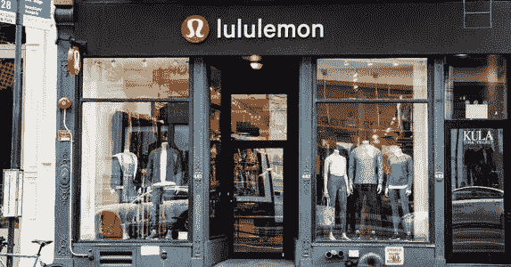
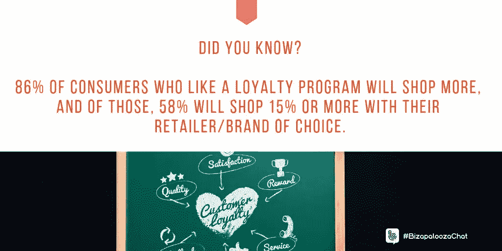
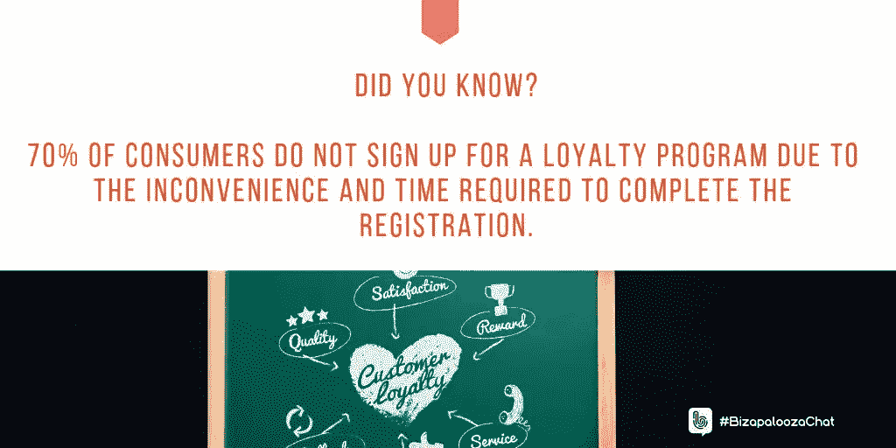
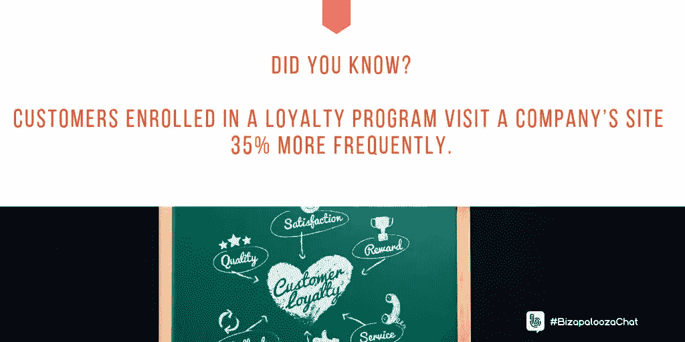
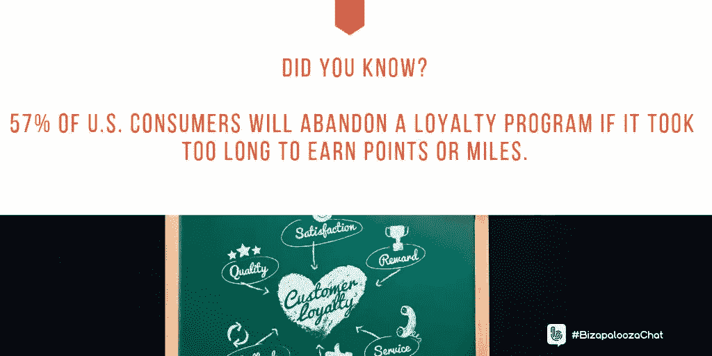

# 忠诚是一个简单的命题

> 原文：<https://medium.datadriveninvestor.com/loyalty-is-a-simple-proposition-727dfe43fa9b?source=collection_archive---------14----------------------->

## 质量将顾客与品牌捆绑在一起，并让他们不断回来

数据泄露后，M arriott 面临[集体诉讼](https://tophotel.news/marriott-faces-class-action-lawsuit-following-data-breach/)使用大数据的一个危险:值得吗？

想知道的人中包括[雷·克洛普顿](https://twitter.com/RayClopton)。他是[威尔伯奖励](https://twitter.com/wilburrewards)数字忠诚度奖励平台、[LocalGiftCards.com](https://twitter.com/LocalGiftCards)和[智能交易](https://twitter.com/STSGiftLoyalty)的创始人兼首席执行官。他以前是银行家，现在是产品专家和数据隐私倡导者。

在市场的阵痛中，Clopton 采访了 Ivana Taylor 和 Iva Ignjatovic，探讨是什么让顾客对品牌忠诚。

Ignjatovic 是一名营销、战略、领导力和商业顾问。她与泰勒密切合作，泰勒拥有 DIY 营销公司，这是一家“致力于帮助小企业主摆脱困境”的公司

整体品牌质量应该是杰出的，以赢得忠诚度。

 [## 在创业之旅中，拥抱学习|数据驱动的投资者

### 好像建立一个数百万美元的公司还不够困难，企业家必须额外照顾他们的…

www.datadriveninvestor.com](https://www.datadriveninvestor.com/2018/10/16/on-the-entrepreneurial-trek-embrace-the-learning/) 

“让我对一个品牌或企业忠诚的往往是便利性，比如地理位置，”泰勒说。

Ignjatovic 指出“产品质量，他们如何解决问题，有时价格和便利性。”

MaCorr Research 发现，86%喜欢忠诚计划的消费者会购买更多商品。其中，58%的人会选择 15%或更多的零售商或品牌。

“我参加基本的食品杂货项目，”泰勒说。“我也为亚马逊 Prime 付费。”

隐私问题可能会让消费者在加入忠诚度计划前犹豫不决。

“他们总是要求太多的个人信息，”Ignjatovic 说。“坦白地说，我不相信公司会提供我的数据。”

# 快速简单

克洛普顿研究了这类企业的其他缺点。

“如果不方便快捷，顾客就不会打扰，”他说。“我们建议商家保持简单，让奖励更容易获得。

“信任因素正是我们建议商家适应的原因,”Clopton 说。“所有的数据泄露都改变了消费者对忠诚度计划的看法。我们推荐“小数据”忠诚度计划。它们对商家来说更容易，对所有参与者来说风险更小。”

消费者可能会惊讶于忠诚计划不需要全名。

“这是营销人员和商人*必须*适应的另一个领域，”Clopton 说。“短信加入是个不错的选择。客户只发送他们的名字来加入。

“此外，人们不得不在你后面排队的不安感觉是忠诚计划的杀手，”他说。

 [## 错过便宜货是很大的动力

### 一点点恐惧可以吸引焦虑的顾客

medium.datadriveninvestor.com](/missing-out-on-bargains-is-great-motivation-f46be50c1108) 

这包括人们在收银台注册项目时的排队等候。

“我们已经在许多忠诚度项目中看到了这一点，”Clopton 说。"注册不能延迟结帐超过几秒钟。"

忠诚度计划越方便越好。

“像礼品卡一样有钱花，”Clopton 说。“我们告诉商人这件事。不要试图猜测顾客想要什么作为奖励。给他们钱花——就像礼品卡一样。

“这对于商家来说很好，只要他们每个人都有能力创建自己的奖励计划，”他说。"使用一个文本加入即时访问许多完全独立的忠诚度计划."

缺乏清晰度可能会成为程序杀手。

“这是‘Plenti’的一个问题，”Clopton 说。“模糊的奖励和无效的联盟扼杀了这个项目。很多问题。”

当加入忠诚度计划时，消费者面临着品牌和储蓄之间的艰难选择。许多人选择随着回报而来的储蓄，尽管回报可能很微薄。

“这很正常，”克洛普顿说。"更小、更频繁的奖励胜过需要很长时间才能达到的大而复杂的奖励."

虽然泰勒说方便对她来说很重要，但“当他们提供储蓄时，不抓住它们似乎是愚蠢的。”

# 先忠诚后价格

即使数额很小，钱也不是万能的。

“如果我加入忠诚计划，这将是关于价格，但也是关于报价，”Ignjatovic 说。"作为会员，我想得到一些特别的东西."

一个特殊的奖励计划刺激因素是，当一家连锁店不知道他们的应用程序如何工作，不接受它，或者甚至没有它的扫描仪。

 [## 树立震撼你的世界的意识

### 人们不会买你卖的东西，除非他们知道你是谁

medium.datadriveninvestor.com](/build-awareness-to-rock-your-world-6d5c4615e1ac) 

“我不确定这是否准确，但这是我的看法，”泰勒说。“太多的忠诚度计划向我发送垃圾邮件和我不想要的东西。

“我最喜欢的奖励是当我的信用卡显示‘你获得了 600 美元的奖励。“你想用它来平衡你的收支吗？””她说嗯——是啊！——比不得不在愚蠢的东西上花费积分要好得多。"

这种东西延伸到不受欢迎的提议。

Ignjatovic 说:“让我们把整个数据安全问题放在一边。”"最讨厌的事情是得到我根本不关心的事情的信息。"

据福布斯报道，[在可能是付费忠诚度的一年，Lululemon、CVS 和 Loblaw 都是值得一试的。如果是这样，员工应该做好准备。](https://www.forbes.com/sites/bryanpearson/2019/01/04/is-2019-the-year-of-paid-loyalty-lululemon-cvs-and-loblaw-are-game-to-find-out/%22%20%5Cl%20%227d5f63f34276)

“如果职员或雇员被要求记住规则，那从来都不是好事，”Clopton 说。“我们通常会自动向客户发送奖励和奖励信息，以获得一致的客户体验。

“谁没有下载新应用的经历或学习曲线？”他说。"没有一种歌舞伎舞蹈能给顾客带来积极的感受."

# 保留成本更低

企业可能不希望与折扣项目相关的麻烦成本，认为这会削减他们的利润。

《哈佛商业评论》称，获得新客户的成本是留住现有客户的 5 到 25 倍。“我们必须让商家知道营销资金的投资回报在哪里最大。忠诚意味着长寿。”

泰勒认为小企业“似乎有太多其他重要的事情要担心。忠诚度计划似乎是一种先进的策略。”

Ignjatovic 说，一个好的忠诚度计划不是一件容易的事情，他指出，这个系统必须仔细设计和维护。

“威尔伯是这个问题上的一个实验，”克洛顿说。“如果您可以参加许多不同商家的*独特的*忠诚度计划，而不必注册每一个，只需使用您的电话号码，会怎么样？我们知道客户会重视这一点。

“只有大约 3%的忠诚计划邮件被阅读，”他说。“商家花了大量的时间和金钱去追逐一些难以衡量的东西。”

忠诚度计划越复杂，就越难理解和解释。

“这就是挑战，”克洛普顿说。“我们告诉商家和营销人员要遵守 30 秒规则。如果你的员工不能在 30 秒内解释整个忠诚度计划，它就会失败。最佳解决方案是非常简单的忠诚度计划。”

# 提供疯狂的交易

考虑到这一点，一个好的客户忠诚度计划必须易于理解和使用。用泰勒的话来说，这样的程序在“提供疯狂价值”的同时，必须对客户“被动”

对于那些想在预算有限的情况下创建客户忠诚度计划，但不知道从哪里开始的人来说，威尔伯奖励公司赞助的 [DIY 营销人员指南](https://diymarketers.com/budget-customer-loyalty-program/)提供了有用的指导。

 [## 获得你的 2 美分价值:预算营销

### 以很少甚至免费的方式宣传你的业务

blog.markgrowth.com](https://blog.markgrowth.com/get-your-2-cents-worth-marketing-on-a-budget-801786370414) 

“我不确定服务或卓越在忠诚度项目中是否发挥了应有的作用，”泰勒说。

Ignjatovic 认为奖励、储蓄和方便对很多人来说更重要。

与此相关的是，移动服务公司 3Cinteractive 的一项研究发现，70%的消费者不会注册忠诚计划，因为完成注册不方便而且需要时间。

“有很多不同的方式来建立一个忠诚计划，”泰勒说。“但我不认为所有企业都能从增加的基础设施中受益。”

电子商务公司 [Shopify Plus](https://twitter.com/ShopifyPlus) 发表了一篇关于忠诚度计划的文章:“ [*25 个策略，36 个例子和 100 多个结果&统计*](https://www.shopify.com/enterprise/ecommerce-loyalty-programs?utm_campaign=pluscm&utm_content=1549935919&utm_medium=social&utm_source=twitter) ”

“理论上，任何企业都可以从忠诚度计划中受益，”Ignjatovic 说。"事实上，情况并非如此，也不是每个企业都应该加入忠诚度计划."

在忠诚计划中收取会员费的品牌可能会受益。

“我是亚马逊的 Prime 会员，”泰勒说。“对我来说，免费送货、观看视频和电视娱乐节目的好处是巨大的，每月还有免费书籍。”

# 几乎没有

Ignjatovic 喜欢让特殊的 VIP 以低价或免费的方式使用某些东西。

企业可能希望降低整体价格来吸引更多的客户，而不是复杂的整体客户忠诚度计划。

“忠诚被证明可以增加客户保留率，从而大幅提高利润，”Clopton 说。“高参与度的客户花费更多，推荐你的业务更多，回头率更高。

“所有的研究都支持忠诚是更好的投资回报，”他说。“另外，你可以向你最忠实的客户群提供特价销售。这是一个胜利。”

 [## 网络安全生活是一个缺口

### 在线隐私和安全是个人和企业面临的问题

medium.datadriveninvestor.com](/cybersecurity-life-is-a-breach-2393bfc1795e) 

无论项目的结构如何，都不应该是随意的。

泰勒说:“我希望企业能更多地考虑他们提供的福利。”"好处往往是‘哼’，不值得努力."

Ignjatovic 增加了安全因素，回到了万豪集团的集体诉讼。

“考虑到频繁的数据泄露，我希望他们付出额外的努力来保护我的数据，并只把它用于我注册的目的，”她说。“此外，当我结束我的忠诚度计划时，我想知道他们没有保留我的数据。”

**关于作者**

吉姆·卡扎曼是拉戈金融服务公司的经理，曾在空军和联邦政府的公共事务部门工作。你可以在[推特](https://twitter.com/JKatzaman)、[脸书](https://www.facebook.com/jim.katzaman)和[领英](https://www.linkedin.com/in/jim-katzaman-33641b21/)上和他联系。

*原载于 2019 年 3 月 24 日*[*www.datadriveninvestor.com*](http://bit.ly/2UT2Bx5)*。*