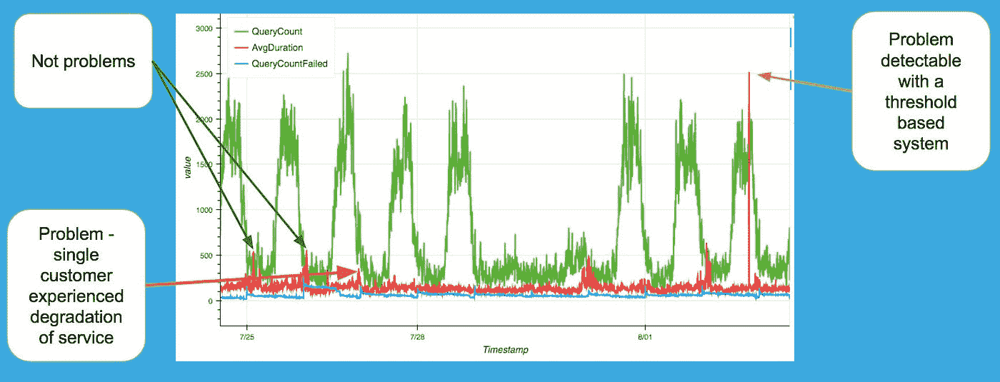

# 异常检测的 LSTM 神经网络

> 原文：<https://medium.datadriveninvestor.com/lstm-neural-networks-for-anomaly-detection-4328cb9b6e27?source=collection_archive---------1----------------------->

序数科学，2018

叶戈尔·科尔涅耶夫

**实施人工智能，为软件客户端解决实际业务问题。**

Photo by [Ethan Weil](https://unsplash.com/photos/sN3xqfZZVxw?utm_source=unsplash&utm_medium=referral&utm_content=creditCopyText)

在我们最近完成的工作中，这个项目是我个人最喜欢的项目之一。这个问题暴露了一些意想不到的挑战，解决方案没有我们最初估计的那么简单。但最终异常检测器产生的结果超出了我们的预期，再次证实了对神经计算的兴趣正在超越行业。

**问题**

我们的客户是一家专门从事远程数据采集、资产跟踪和远程信息处理的软件公司。该系统是客户的关键组件，必须满足高可用性和正常运行时间的要求。为了保持服务水平，我们客户的 devops 团队实施了 500 多个警报，以识别负面性能趋势，并在服务失败前解决正在出现的问题。他们的努力非常成功，将与服务质量下降相关的客户服务事件减少了 90%。非常好。

然而，还有两个问题。第一，由于数据收集设备的分布式特性，可能会出现局部服务质量下降。第二，出现了未反映在总体趋势中的客户特定问题。数据吞吐量和数据量的普遍变化掩盖了这些问题。因此，当客户打电话报告问题时，该团队发现了性能下降。不是最好的结果。

该团队考虑了客户特定的警报。但是，客户获取率高和使用趋势多变证明了客户特定的警报难以设置和管理。它们在 devops 团队中产生了很高的误报率和对系统的信心丧失。

**解决方案**

我们的团队同意，该解决方案必须包括一个机器学习系统，该系统能够根据每个客户和每个地区的情况，随时了解趋势。该系统还必须学习每小时、每天、每周和每月的可变性。

我们考虑了几个选项，但最终决定采用长短期记忆(LSTM)神经网络。这些类型的网络擅长发现多元时间序列数据中的复杂关系。非常合适。

LSTM 神经网络异常检测的基本思想是这样的:系统查看几小时或几天内的先前值，并预测下一分钟的行为。如果一分钟后的实际值在一个标准偏差之内，那么就没有问题。如果更多，这是一个异常。

**结果**

在两个月的并行测试中，结果符合预测系统行为的预期，准确率为 98.8%。尽管在测试期间只发生了一次合格的服务降级事件，但还是成功检测到了该异常。进一步验证了使用人工智能进行性能监控的有效性，这种异常被已建立的阈值方法遗漏了。

我将在接下来的章节中详细介绍这种方法和获奖设计。

**结论**

许多行业对神经计算的采用呈上升趋势，随之而来的是越来越多的成功案例。神经网络正在帮助将以前难以解决的问题转化为可解决的挑战。它们有助于提高以前解决方案的效果，提高幅度足以保证投资。

我们鼓励所有 devops 团队和业务领导重新审视那些因为缺乏可用的解决方案而被搁置的问题，以及所有结果不理想的问题。有新的方法可以将业务提升到认知计算的下一个级别。

**我们的方法**

我们获得了六个月的可用数据作为训练数据集。该小组确定了 18 个可能有助于 LSTM 学习序列的参数。例如，报告设备的数量、查询的数量、失败查询的数量、平均查询执行时间、公司 id、地理区域。LSTM 旨在预测下一分钟的 5 个输出值，如查询数量、报告设备数量等。

由于 LSTM 网络以时间步长分析先前的值，我们选择了三种不同的张量配置:16、64 和 256 时间步长。我们设计了具有非重叠和重叠时间窗的张量。我们以 1 分钟的频率对数据进行了重新采样，并对值使用了总和与均值聚合。该团队计划测试这些张量形状，并根据经验确定最佳配置。

类似地，该团队建立了三个 LSTM 架构，根据 LSTM 层数、隐藏神经元和完全连接层数进行排列。我们希望通过实验确定最佳表现者以及适当的超参数。

然后，我们准备好了一些乐趣，并开始训练神经网络。

**挑战**

起初，事情并不顺利。在网络训练期间，损失值高于正常值，并且仅在 4 个时期后就停止下降。验证准确度在 2 个时期后冻结在微不足道的 0.08。

在系统设计中出现轻微的恐慌和不必要的怀疑后，我们将问题追溯到数据缩放的算术错误。该修复确保所有张量值的平均值为 0，标准偏差为 1。

(这是给所有人工智能从业者的一个很好的教训——如果一个模型没有按照预期工作，检查你的训练和标签数据，然后再次检查你的数据。不要太快放弃一个设计。)

在第二次运行时，我们在测试集上达到了 0.72 的验证准确性。更好，但考虑到 98.5%的准确率目标，还远远不能接受。

我们将问题追溯到时间序列中引入新客户所产生的假阳性。我们的设计考虑到了这一点，但当同时引入许多新客户时，会导致网络过载。我们通过引入识别新客户的二进制标志解决了这个问题。我们还从训练数据集中删除了前 30 天的新客户数据，因为它被证明过于不稳定。

最终，我们达到了要求的 98.8%的准确率。

**获奖配置**

获胜的配置是最简单的设计:

*   2 个 LSTM 层，每个层有 64 个隐藏神经元，64 个时间步长，批次大小为 64。
*   2 个完全连接的层
*   优化器='adam，损失='mae '，学习率= 0.001
*   我们使用 Tesla M60 GPU 卡对网络进行了 100 多次训练

我们对最简单设计的出色表现感到惊讶，并期望更复杂的模型能够超越它。另一种设计包括更多的 LSTM 和 GRU 单元，获得了相同的性能，但需要多 20%的训练时间和多 18%的预测时间。因此，更简单的设计被选择用于生产。

在下面的博客中，我将讨论将 LSTM 异常检测器集成到产品中的数据管道。它将包括实时张量生成、Kafka 流和在线再训练方法。

**关于序数科学**

序数科学为工业建立实用的人工智能软件。我们的专长是计算机视觉、异常检测、多元预测建模、RPA 和集成人工智能系统。我们将人工神经网络集成到生产管道中，以实现实时机器学习应用。

叶戈尔·科尔涅耶夫是人工智能的狂热粉丝，也是一名企业家和顾问。他在 1998 年开始研究神经网络。