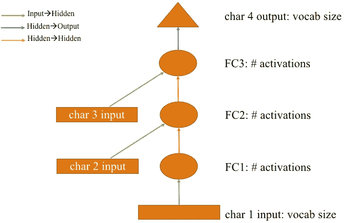
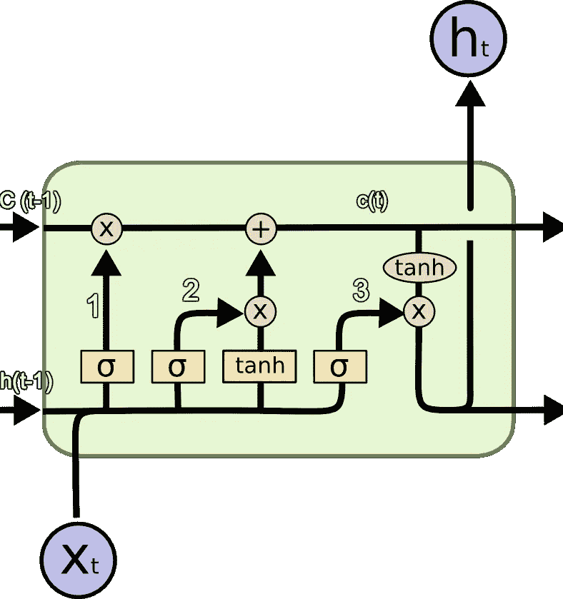
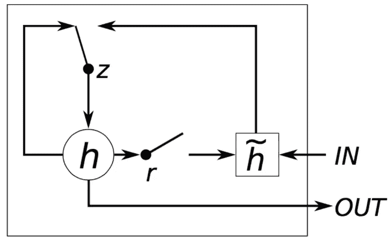

# LSTM vs GRU:理解支配字符型文本预测的两种主要神经网络

> 原文：<https://medium.datadriveninvestor.com/lstm-vs-gru-understanding-the-2-major-neural-networks-ruling-character-wise-text-prediction-5a89645028f0?source=collection_archive---------4----------------------->

[](http://www.track.datadriveninvestor.com/1B9E)

在这篇文章中，我们将讨论自然语言处理使用的两个国家的艺术神经网络，以及是什么使他们有效地反对香草 RNNs(递归神经网络)。

## 当涉及到字符文本预测时，为什么 rnn 的性能不理想？

为了理解这个问题，我们首先需要对 RNNs 如何预测文本有一个基本的了解。



Vanilla RNN: courtesy Fast.ai

在上图中，矩形框代表输入层，圆圈代表隐藏层，三角形代表输出层。通常，用于隐藏层的激活函数是 ReLU(校正线性单位),而输出层的激活函数是 tanh。与其他神经网络相比，一个很大的区别是每个隐藏层都有新的输入，而通常只有一个输入层。每层的输入与线性层进行乘法运算，并与隐藏层权重相加(当然是在调整维度之后！).输出被传递到网络的下一次迭代，本质上作为输入。因此得名*递归神经网络*。

Giphy.com — Thomas Lennon

这个操作实际上意味着，对于我们作为输入传递的文本的每 3 个字符，网络预测第 4 个字符。因此，如果将字母 1、2 和 3 作为输入传递，则第一次迭代的输出是第 4 个字符。类似地，对于第二次迭代，字符 2、3 和 4(来自前一次迭代)被作为输入给出，而网络给出第 5 个字符作为输出。这意味着第一个字符在第五个或后续字符的预测中不起作用。这导致了被称为 ***消失梯度*** 的问题，从而降低了我们网络的性能。

> **LSTM**



Pic Courtesy: Colah’s blog

LSTM 的三个主要组成部分是:

1.  **忘记门** —当前单元格 x *(t)* 的输入用蓝色圆圈标记。这经历了与先前 LSTM 单元的隐藏状态的矩阵乘法运算。然后产品通过一个 s 形层。该输出再次乘以前一个单元 c 的输出( *t-1* )。单元的这一部分决定了先前隐藏的层输入是否会在下一次迭代中被考虑，因此命名为“遗忘门”。
2.  **输入门**—输入 x( *t* )和先前隐藏状态输入 h( *t-1* )的总和被传递到两个不同的层，一个 sigmoid 层和一个 tanh 层。sigmoid 层将数值限制在( *0，1* )之间，而 tanh 层将其限制在 *(-1，1)之间。*这两个输出的乘积与遗忘门的输出相加。由 c( *t* )表示的总和是当前单元状态。
3.  **输出门** —输入 x( *t* )和先前隐藏状态输入 h( *t-1* )的总和被传递到第三个 sigmoid 层。其输出与 *tanh* (c( *t* ))相乘，形成当前 LSTM 单元的隐藏状态输出。

总之，输入门确定当前单元操作中包含多少当前输入，遗忘门确定当前单元状态中包含多少先前状态的输出，而输出门确定当前单元的隐藏状态输出。

下面的*算法 1* 中显示了一个 LSTM 单元类的伪码。

```
class LSTMcell():
 input_gate = Embedding(vocabulary_size, factor_size)
 forget_gate = self.LSTM(factor_size, hidden_layer, number_layer)
 output_gate = Linear(hidden_layer, vocabulary_size)

 def forward_operation(self, cell_state):
  output,hidden = forget_gate(input_gate(cell_state),                                                                                                                                                                                          hidden_layer)
  return Softmax(output_gate(output), dim=-1).view(-1,    vocabulary_size)
```

> **进入 GRU**



[http://www.wildml.com/2015/10/recurrent-neural-network-tutorial-part-4-implementing-a-grulstm-rnn-with-python-and-theano/](http://www.wildml.com/2015/10/recurrent-neural-network-tutorial-part-4-implementing-a-grulstm-rnn-with-python-and-theano/)

类似于普通的 RNNs，输入被乘以权重矩阵，并被添加到隐藏层。然而，此处输入被添加到`h˜`。`r`是一个复位开关，它表示有多少先前隐藏的状态用于当前预测。巧合的是，对于这个复位开关也有一个神经网络，它学习前一个状态的多少以允许预测下一个状态。`z`表示是仅使用现有的隐藏状态`h`还是使用其与`h~`(新的隐藏状态)的和来预测输出字符。

下面的*算法 1* 中显示了一个 GRU 细胞类的伪码。

```
def GRUCell(input, hidden, weight_input, weight_hidden, bias_input, bias_hidden):
 input_state = linear(input, weight_input, bias_input)
 hidden_state = linear(hidden, weight_hidden, bias_hidden)
 input_reset, input_input, input_z = input_state.chunk(3, 1)
 hidden_reset, hidden_input, hidden_z = hidden_state.chunk(3, 1)reset_gate = sigmoid(input_reset + hidden_reset)
 input_gate = sigmoid(input_input + hidden_input)
 new_gate = tanh(input_z + resetgate * hidden_z)
 return new_gate + input_gate * (hidden — new_gate)
```

## **总结**

因此，使用门的机制，我们控制我们想要在 LSTM 和 GRU 细胞输出中使用的先前状态的数量。这导致在字符文本预测问题上显著的性能改进。

> **参考文献**
> 
> 1.fast.ai
> 
> 2.[http://karpathy.github.io/2015/05/21/rnn-effectiveness/](http://karpathy.github.io/2015/05/21/rnn-effectiveness/)
> 
> 3.[https://towards data science . com/illustrated-guide-to-lstms-and-gru-a-step-by-step-explain-44e 9 EB 85 BF 21](https://towardsdatascience.com/illustrated-guide-to-lstms-and-gru-s-a-step-by-step-explanation-44e9eb85bf21)
> 
> 4.[http://colah.github.io/posts/2015-08-Understanding-LSTMs/](http://colah.github.io/posts/2015-08-Understanding-LSTMs/)