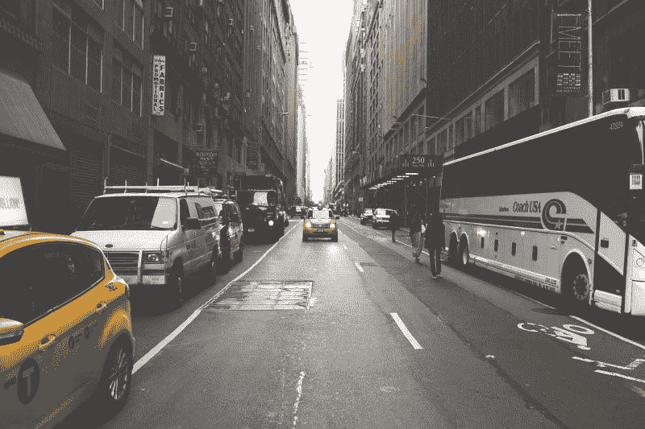
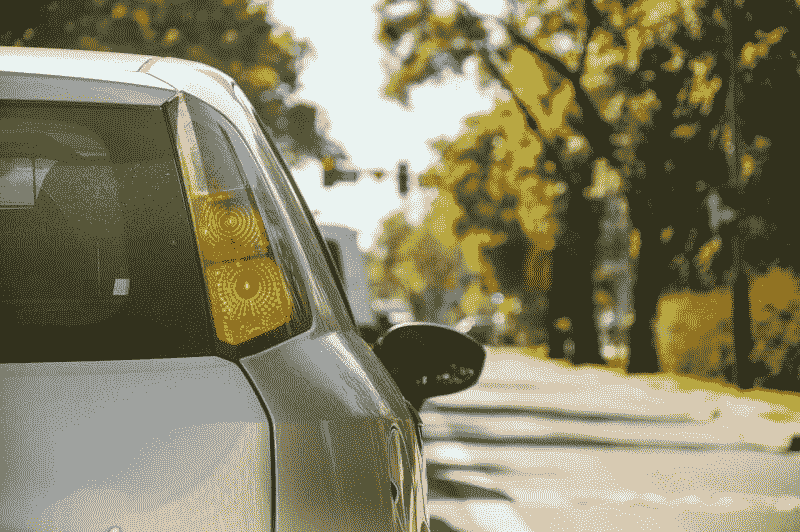

# Lyft 不赚钱，Rideshare 盈利吗？—市场疯人院

> 原文：<https://medium.datadriveninvestor.com/lyft-makes-no-money-is-rideshare-profitable-market-mad-house-838280ac8b53?source=collection_archive---------8----------------------->

财务数据显示 Lyft 不赚钱，因此我们必须问，rideshare 盈利吗？

具体来说， **Lyft(纽约证券交易所代码:LYFT)** 于 2019 年 3 月 31 日上市，运营亏损-13.96 亿美元，净亏损-13.94 亿美元。此外，Lyft 在同一天的收入为 7.7603 亿美元，毛利润为 3.1337 亿美元。

然而，Lyft 报告称其收入成本为 4.6268 亿美元，这表明其支出超过了利润。毫不奇怪，Lyft 正以惊人的速度烧钱。

例如，Lyft 报告的经营现金流为-8483 万美元，融资现金流为-7.8837 亿美元，没有自由现金流。这些数字表明 Lyft 正在借钱支付账单，或许还在借钱支付薪资。

# Lyft 值多少钱？

很明显，Lyft 的运营亏损超过了 Lyft 在 2019 年 3 月 31 日报告的 13.8 亿美元资产。然而，Lyft 在 2019 年 3 月 31 日报告了 7.0537 亿美元的短期资产。

自然，人们会问为什么 Lyft 的股票在 2019 年 5 月 17 日价值 54.95 美元。更重要的是，我们可以问那些人到底在投资什么？

我认为人们投资的是 Lyft 平台的理论价值，而不是其他。具体来说，像 2019 年 1 月估计的 2300 万 Lyft 用户、应用程序业务[等统计数据给投资者留下了深刻印象。](http://www.businessofapps.com/data/lyft-statistics/)

此外，Business of Apps 声称 Lyft 可用于 95%的美国人口。因此，Lyft 可能拥有美国拼车市场 29%至 35%的份额。

# Lyft 赚钱了吗？

不幸的是，没有证据表明 Lyft 在赚钱。也没有任何迹象表明 Lyft 未来能赚钱。

据 Business of Apps 估计，事实上，Lyft 司机的平均月收入在 364 美元至 377 美元之间。就像 Lyft 的股东一样。Lyft 司机很可能在投资上赔钱。

解释一下，377 美元几乎不够支付一辆像样汽车的汽油和保险费用。如果 Lyft 司机支付汽车费用，他或她就在赔钱。

# Lyft 的客户没有那么多钱

此外，Lyft 的客户可能没有那么多钱。例如,《应用商业》杂志估计，44%的 Lyft 服务都是在低收入地区结束或开始的。

此外，Lyft 骑手的平均年收入为 5 万美元。相比之下，美国数字部[估计](https://www.deptofnumbers.com/income/us/)2017 年美国家庭收入中值为 60336 美元。

因此，富裕的上层阶级拼车用户的流行刻板印象可能是一个神话。相反，很大一部分或者可能是大多数拼车用户是那些太穷而无法拥有或租用汽车的人。

例如，一个人可以步行或乘坐公共交通工具到达他需要去的大多数地方。然而，这个人偶尔会使用**优步(纳斯达克股票代码:优步)**或 Lyft 购物或去郊区看望他的母亲。

# 汽车租赁如何杀死优步和 Lyft

值得注意的是，在前优步时代，当我住在丹佛没有汽车时，我发现购物是最大的麻烦。我几乎可以步行、乘轻轨或公共汽车去任何我想去的地方。然而，购买任何沉重的东西都是一个挑战。

此外，我还发现了短期租车，Zipcar 的竞争对手 inciodic Car(现[企业用车份额](https://www.enterprisecarshare.com/us/en/our-story.html))，远比丹佛骇人听闻的出租车服务方便。因此，我认为短期汽车租赁的广泛使用在某些时候将比 Lyft 和优步更有利可图和受欢迎。

比如 Zipcar 哪家[**Avis-Budget Group**](https://marketmadhouse.com/is-the-avis-budget-group-making-money/)**NASDAQ:CAR)**拥有，不用给司机付钱。此外， [Zipcar](https://www.zipcar.com/?&gclid=EAIaIQobChMI2uD6pO6b4gIVk7fsCh1YIwBtEAAYASAAEgI3z_D_BwE) 避免了雇佣司机的风险，这些司机可能是疯子、暴力分子、精神病患者、种族主义者、性别歧视者，或者只是因为没有司机而让人讨厌。

取而代之的是，Zipcar 和 Enterprise Car 在公共停车场共享车辆，供客户挑选。解释一下，Zipcar 和 Enterprise Car Share 给客户一个无线设备和一个在线账户。在线账户向您收取短期租车费用；例如去好市多，无线设备打开汽车。

因此，Avis-Budget 和企业面临的最大风险是让车辆无人看管。然而，技术可以很快解决这个问题。

# 自动驾驶汽车如何杀死优步和 Lyft

解释一下，一辆自动短期租赁汽车可以在你需要的时候自动开到你身边。因此，自驾车租赁可以停在 Avis-Budget、Enterprise 或 **Hertz (NYSE: HRI)** 停车场，直到有人需要它。

此外，自驾车租赁可以在我们城市的街道上徘徊，寻找乘客。然而，我认为汽车租赁公司、汽车经销商、汽车制造商和 Alphabet 公司将从这项技术中获利。

解释一下，Avis-Budget； **AutoNation(纽约证券交易所代码:AN)**和**菲亚特-克莱斯勒(纽约证券交易所代码:FCAU)** ，正在与 Alphabet 的自动驾驶汽车子公司 [Waymo](https://marketmadhouse.com/will-waymo-boost-fiat-chrysler-automobiles-fcau/) 合作。例如，Avis-Budget 正在彭博凤凰城为 Waymo 的菲亚特克莱斯勒 Pacifica 小型货车提供服务[报道](https://www.bloomberg.com/news/articles/2017-06-26/alphabet-inks-deal-for-avis-to-manage-self-driving-car-fleet)。

# 无人驾驶汽车是未来，而不是共享

因此，我认为 Alphabet 正在为全国范围内的自动驾驶汽车网络奠定基础。我认为，这样一个自动驾驶汽车平台可以赚钱，并让优步和 Lyft 出局。

此外，其他汽车制造商如宝马、 [**、福特**](https://marketmadhouse.com/will-ford-motor-f-make-money-from-self-driving-cars/) **(纽约证券交易所代码:F)** 、通用汽车 [**(纽约证券交易所代码:GM**](https://www.mavendrive.com/) **)** 都在规划自己的自动驾驶汽车平台。事实上，宝马正在美国一些城市测试一种叫做 Reach Now 的短期租赁服务。

我认为公司可以通过几种方式从自动驾驶汽车中赚钱。这些方式包括短期租赁、商业客户和广告。

# 自动驾驶汽车如何赚钱

例如，短期租约上可以有所有者为做广告而出租的标志。此外，商业客户可以使用短期租赁。

例如，**沃尔玛(纽约证券交易所:WMT)** 或 Aldi 可以利用短期租赁将顾客带到商店，或将食品杂货送到顾客手中。此外，酒吧可以短期出租，把喝醉的顾客拖回家。

因此，通用汽车的 Maven、Reach Now 或 Waymo 可以利用几个收入来源。有趣的是，Lyft 甚至与凤凰城的 Waymo 合作，通过其应用程序提供 Waymo 的 Waymo One 拼车服务，*The Verge*[reports](https://www.theverge.com/2019/5/7/18536003/waymo-lyft-self-driving-ride-hail-app-phoenix)。

因此，自动驾驶汽车可以通过消除司机提供车辆的需求来使拼车盈利。相反，菲亚特克莱斯勒，通用汽车，福特，宝马，或企业将提供车辆。因此，Lyft 或 Waymo 的“司机”需要做的只是提着乘客的包。

# 优步和 Lyft 将会崩溃

在这种情况下，我不相信 Lyft(纽约证券交易所代码:LYFT) 和 T2 优步(纳斯达克代码:优步)会从他们目前的业务中赚钱。

事实上，我认为这两家拼车公司最终都会耗尽资金并倒闭。然而，优步和 Lyft 的应用和平台将作为 Waymo 或汽车制造商的一部分存在。

因此，所有投资者都需要远离优步和 Lyft。我觉得那些股票永远赚不到钱。

*原载于 2019 年 5 月 17 日*[*https://marketmadhouse.com*](https://marketmadhouse.com/lyft-makes-no-money-is-rideshare-profitable/)*。*

*免责声明:文章中表达的观点和意见仅属于作者，不一定反映数据驱动投资者的立场。这篇文章无意成为投资建议。*