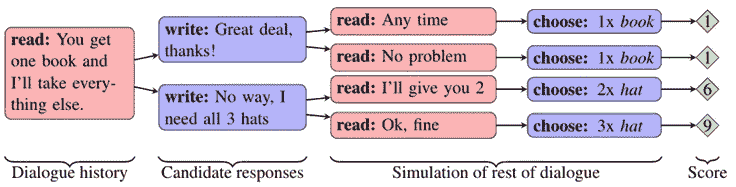

# 机器伦理

> 原文：<https://medium.datadriveninvestor.com/machine-ethics-e9af93d5be21?source=collection_archive---------9----------------------->

[Cascio (2008) — Creation 2.0](https://www.flickr.com/photos/jamais_cascio/2190824476/)

人工智能(AI)应用程序已经从相对有限的工具发展到更广泛的领域，其中每个应用程序都被限制在一个专业领域，如细菌感染的医疗诊断( [Shortliffe，1984](http://www.aaai.org/Papers/Buchanan/Buchanan45.pdf) 或下棋( [Hsu，1999](https://ieeexplore.ieee.org/document/755469/) )，如信贷决策( [Khandani，2010](https://www.sciencedirect.com/science/article/pii/S0378426610002372?via%3Dihub) )和使用来自各种各样的大量非结构化和结构化数据用自然语言文本描述视觉内容( [Venugopalan 等人，2015](https://ieeexplore.ieee.org/document/7410872) 辅助决策的人工智能应用只受人类思维创造力的限制。

> “人工智能总是更关心扩展计算机科学的能力，而不是定义它的极限”( [Luger，2005](http://iips.icci.edu.iq/images/exam/artificial-intelligence-structures-and-strategies-for--complex-problem-solving.pdf) )。

智能自动化的发展和采用有望扩大，使我们的生活更加高效和便捷；同时也提出了一些难题，比如人工智能是否会产生没有偏见的伦理结果。鉴于机器依赖于人类以某种方式生成的数据，将无意识偏见转移到决策算法似乎是合理的。此外，也许有一天机器会被要求做出涉及人类生命或情感的选择。

人类决策和机器制定的决策之间的差异在于，机器可能没有足够的先前背景来用于道德、同情或同情地执行( [Susan Etlinger，2015](https://www.ted.com/talks/susan_etlinger_what_do_we_do_with_all_this_big_data) )。这些应用程序可能有隐藏的偏差，这些偏差是由开发人员、数据或应用程序本身传递的。

并非我们所有的决定都是或被定义为道德的；实际上，没有通用的尺度来衡量道德决策；此外，现有的困境使得评估更加困难。人们几乎每天都面临伦理困境；一个伦理困境是由一些情况组成的，在这些情况下，对于一个有伦理成分的问题存在不止一种可能的解决方案。例如，如果一个重病患者询问他/她的病情或进展，护士该怎么办？说出残酷的事实还是谎言？

麦克唐纳和帕克( [1996](https://link.springer.com/article/10.1007/BF00705577) )在研究人们用于决策的认知框架时，确定了影响道德决策的八个框架:

*   *利己*:自私地获取最大程度的个人满足
*   *功利主义*:为每个人创造最大的好与坏之比的决定
*   绝对命令:不管结果如何，这个决定在道德上不是对就是错
*   责任:由于一个人的责任，这个决定可能天生就是正确的
*   正义:关于判决的公正性
*   *中和*:决定减少违反规范的行为对自我概念和社会关系的可能影响
*   *今日之光*:决定考虑这样一个问题:如果这些信息公之于众会怎样？

Sharma (2004)报告说，当面临不同类型的伦理困境时，人们会应用不同的伦理框架，因此很难知道他们使用了什么框架，因为这是非常主观的，事实上对于机器来说，这种主观性只在有限的范围内进行研究。

> “它邀请我们质疑我们处理世界的习惯和模式，审视我们自己以发现我们如何做出选择，有时也质疑我们的预设。”沃哈内( [1999](https://books.google.mn/books?hl=en&lr=&id=A99WFv8v8bkC&oi=fnd&pg=PA3&dq=Werhane,+P.+H.+(1999).+Moral+imagination+and+management+decision-making.+New+York+:+Oxford+University+Press,.&ots=_BcyWh7nIM&sig=V58Sb1pTBSzZ2bk9HIj5LqsRj_o&redir_esc=y#v=onepage&q&f=false)

Werhane 认为，处理硬数据的人经常被数据是完全客观的所迷惑，忘记了这些数据通常是经过概念过滤的。

人工智能应用程序要么从不道德的人类框架或无意的偏见决策中学习，要么使用这些框架积极开发。实现人工智能的一种流行方式是机器学习，即机器从案例集中学习，并生成模型以形成新的知识，然后用于决策。

麻省理工学院媒体实验室道德机器团队正在研究无人驾驶汽车面临的道德困境问题。正在研究的一个伦理困境是，当自动驾驶汽车发现自己处于必须在对乘客的风险和对潜在行人的风险之间做出选择的情况下，会发生什么。道德机器团队( [Shariff，Rahwan，& Bonnefon，2016](https://www.nytimes.com/2016/11/06/opinion/sunday/whose-life-should-your-car-save.html) )表示，“大多数汽车公司已经发现，他们最好的行动是回避这个问题:路上的道德困境极其罕见，这种观点认为，公司应该专注于消除而不是解决它们。”

Shariff 等人于 2016 年在[进行的一项调查研究的大多数受访者同意，他们更希望看到更多的汽车牺牲乘客，以最大限度地减少行人的伤亡；然而，受访者表示他们不会购买此类汽车，从而解决了个人的道德困境。那些将要生产和购买的无人驾驶汽车呢？伦理困境并没有消失，即使研究对象通过选择不解决它而忽视它。](https://www.nytimes.com/2016/11/06/opinion/sunday/whose-life-should-your-car-save.html)

道德困境的存在是因为许多只是未知的，未知的风险。这些风险与人类偏见和机器学习的不道德行为相结合，提出了一个重要的研究领域，即道德机器性能。

机器伦理是一个研究领域([安德森&安德森，2011](https://philpapers.org/rec/SANME) )，包括为机器和使用或设计机器的人类发展伦理。并非所有的人工制品和工具或者我们隐含或明确的价值观都是道德的。“工具制造商和用户定期评估工具在实现其设计目的方面的表现。我们期望程序在执行时朝着某个目标前进”( [Moor，2006](https://ieeexplore.ieee.org/document/1667948) )。程序或工件的预期目的是用有限的感官有效而准确地创造某种东西或产生某种结果。

例如，电脑游戏中敌人的目标是消灭其他玩家；不涉及负罪感等情绪，应用没有其他目的。当人工智能应用程序从错误中学习并调整方法以达到目标时，由于缺乏人类情感或道德结构，结果是不可预测的。

没有人类干预或伦理考虑的新技术可以发展。例如，脸书的人工智能聊天机器人发明了一种独特的语言，并学会了撒谎，以便有效地谈判、辩论并在谈判中获胜( [Lewis，Yarats，Dauphin，Parikh，& Batra，2017](https://code.fb.com/ml-applications/deal-or-no-deal-training-ai-bots-to-negotiate/) )。“FAIR(脸书人工智能研究)的研究人员研究了多议题谈判任务的 bot 谈判。两个代理(机器人)都被显示相同的物品集合，例如，两本书、一顶帽子、三个球，并被指示通过协商物品的分割来在他们之间进行分割”( [Lewis 等人，2017](https://code.fb.com/ml-applications/deal-or-no-deal-training-ai-bots-to-negotiate/) )。

每个代理都有自己的价值函数，表示为每种类型的项目分配多少价值。一个球可能值 3 分。在模拟过程中，两个代理都不知道对方的价值函数。价值函数必须从机器人之间的交互中学习(推断)。“公平研究人员创造了许多这样的谈判场景，总是确保双方不可能同时获得最佳交易。此外，退出谈判(或在 10 轮对话后不同意交易)对双方代理人来说都是 0 分。简单地说，谈判是必不可少的，成功的谈判会带来更好的表现”( [Lewis et al .，2017](https://code.fb.com/ml-applications/deal-or-no-deal-training-ai-bots-to-negotiate/) )。

为了更快地交流，机器人发明了自己的语言，例如足球运动员为某些比赛创造速记名称( [Maney，2017](http://www.newsweek.com/2017/08/18/ai-facebook-artificial-intelligence-machine-learning-robots-robotics-646944.html) )。这些机器人还学会了撒谎或欺骗来赢得更高的分数。这种协商的一个例子如图 1 所示。

Figure 1\. Negotiating Chat Bot Dialogue ([Lewis et al., 2017](https://code.fb.com/ml-applications/deal-or-no-deal-training-ai-bots-to-negotiate/))

Maney (2017)警告说，“把所有这些谈判机器人的属性放在一起，你会得到一个潜在的怪物:一个可以达成交易的机器人，对人没有同情心，说任何事情来获得它想要的东西，黑客语言，所以没有人知道它在交流什么，很快就开始类似于人类谈判的类型。

人工智能研究人员通常无法预测他们复杂的程序和工件会做什么。Tufekci ( [2016](https://www.ted.com/talks/zeynep_tufekci_machine_intelligence_makes_human_morals_more_important) )声称，“虽然我们知道如何让机器学习，但我们并不真正知道它们获得了什么知识”，以及它可能如何随着时间的推移而演变。

Moor ( [2006](https://ieeexplore.ieee.org/document/1667948) )给出了使用符合伦理原则的人工智能应用程序开发机器的三个重要原因:(1)伦理本身很重要，因此创建符合伦理的机器应用程序至关重要；(2)机器将有越来越大的自主性，这将迫使我们明确规定支配它们行为的伦理原则；(3)对伦理学进行规划的尝试将使我们对伦理学本身有更好的理解。对于人工智能，具体来说，更重要的是养成伦理道德；因为人工智能的发展和采用正迅速渗透到人类活动的所有阶段。