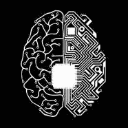
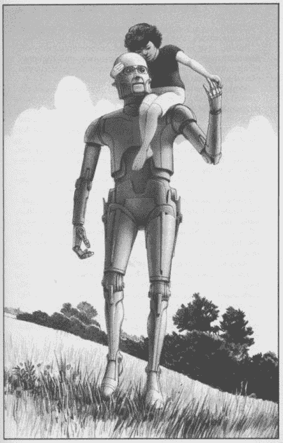

# 机器伦理:人工智能的道德行为

> 原文：<https://medium.datadriveninvestor.com/machine-ethics-the-moral-behavior-of-ai-87d1be9231a1?source=collection_archive---------18----------------------->

几乎在每种情况下，书都比电影好。

例# 3459:*我，机器人。最广为人知的是由威尔·史密斯主演的《要么接受要么放弃》科幻电影。它鲜为人知，但在各方面都很优秀，直到你在谷歌搜索的【T2 I，机器人*后面加上“图书”后，它才会出现。艾萨克·阿西莫夫的短篇小说集最初出版于 1950 年，它席卷了科幻世界，详细描述了机器人故障的智力难题，都围绕着他臭名昭著的机器人三定律:

1.  机器人不得伤害人类，也不得坐视人类受到伤害。
2.  机器人必须服从人类给它的命令，除非这些命令与第一定律相冲突。
3.  机器人必须保护自己的存在，只要这种保护不违反第一或第二定律。

在这些虚构的法律被创造出来将近 75 年后，它们仍在被争论。网上大部分文章都达成了这样的共识:法律不成立。将这些伦理规则转化为代码是不可能的。他们仍然允许错误的表现。

但是……我不同意。

**一台道德机器**

阿西莫夫想象了一个未来，在这个未来里，机器人执行人类的大部分日常功能。不同类型的机器人被创造出来用于不同的任务；有些人是遥远星球上的矿工，从事制造业和日常家务，而其他人则为人类的食物和资源消耗创造算法，名单还在继续。未来，或者更确切地说，我们的现在，在一个主要的方面有所不同:机器人运行我们的世界，而不是机器人。我们不再有一个像人类一样的金属最好的朋友，我们有自主吸尘器，运行我们的社交媒体和互联网搜索算法的机器人，以及作为流行圣诞礼物的无人机。

但是让我们假设机器人仍然在我们的未来。任何看过或读过科幻内容的人都可以告诉你，没有伦理道德的机器人会造成实质性的伤害。如果机器人越来越多地参与到我们的社会中，它们需要像人类一样遵守一些道德和伦理规则。(这提出了一个问题:谁将选择创造和维护这些机器人的人？谁选择什么是伦理和道德？)

阿西莫夫的 *I，机器人*充当了 21 世纪的一股新鲜空气，在这个时代，所有其他机器人和安卓内容都不可避免地涉及人类、地球或两者的接管和毁灭。事实上，我们不会无缘无故地创造出极其聪明的人工智能，然后把它发布给全世界；机器人将为特定任务定制，并受到密切监控。阿西莫夫承认他的机器人并不完美，因为它们是由有缺陷的人创造的。人们似乎只有在机器人工作完美无缺的情况下才会接受它们，事实上，这个世界上(或者更远的地方，很可能)没有什么东西是完美无缺的。批评者认为阿西莫夫的智力拼图场景是机器人三定律失败的例子，但在现实中，它显示了这些定律是多么灵活。它为书中的机器人和机器人心理学家提供了一个框架，以便在真正有害的事情发生之前(例如死亡或世界毁灭)分析和解决任何故障。

想象一下，如果这三个定律，以及正确执行它们被创造出来的任务所需的任何其他信息，出现在像 *Ex 玛奇纳、西部世界或银翼杀手这样的电影中。*然而，阿西莫夫的法律继续受到[的批评，认为](https://theconversation.com/asimovs-laws-of-robotics-arent-the-moral-guidelines-they-appear-to-be-74634)不“容易解释”，在[战争情况下毫无用处](https://theconversation.com/after-75-years-isaac-asimovs-three-laws-of-robotics-need-updating-74501)(阿西莫夫坚持机器人不应该被用于这种情况，所以他的法律自然会阻止在战斗中使用)，并被赋予[比人类更少的权利](https://curiosity.com/topics/why-the-three-laws-of-robotics-wouldnt-work-and-what-would-instead-curiosity/)。当然，这些论点都为机器人三定律提供了有效的观点和潜在的陷阱，但他们没有认识到的是，超级智能人工智能没有防故障、不干涉的路径和维护，也没有提出任何更好的建议。

也许机器人三定律实际上是一个很好的起点，只要我们意识到这不仅仅是给机器人的伦理程序，而是一个基准。

你可以通过冷静的逻辑推理来证明任何你想要的东西——如果你选择合适的假设的话——艾萨克·阿西莫夫

更多信息，请访问:[www.thebrainvomit.wordpress.com](http://www.thebrainvomit.wordpress.com)