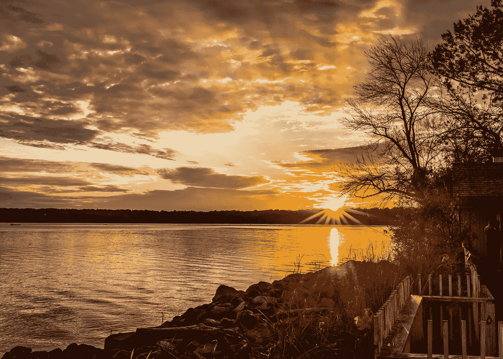
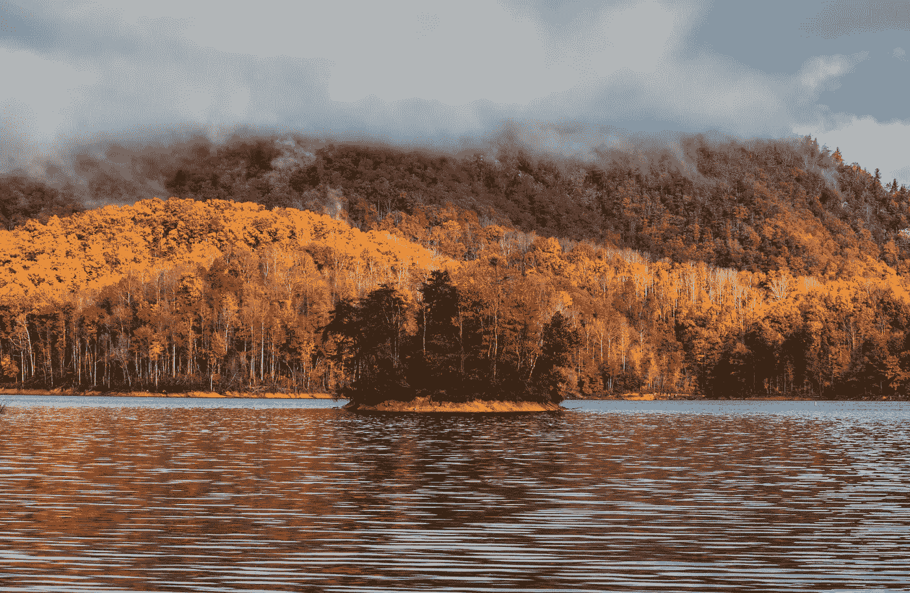

# 机器生成的主持人和人造天空

> 原文：<https://medium.datadriveninvestor.com/machine-generated-anchor-people-and-artificial-skies-7e7171c1d7ad?source=collection_archive---------22----------------------->

艾一直在录像和摄影领域取得进展。在这两种情况下，媒体播放器和软件开发人员都在积极工作，以创建将被公众接受的机器生成的视频和图像。

纯人工智能视频程序已经在多个场合进行了尝试，最近的一次是中国国有媒体公司新华社和北京搜索引擎搜狗。这两家公司在今年秋季的世界互联网大会上首次推出了中英文人工智能新闻主播。

机器人的动作基于真实演员的手势和面部表情。然而，说话生硬、动作笨拙的人工智能机器人被收件人认为令人毛骨悚然，这清楚地表明，这些公司尚未创造出最低可行产品(MVP)。

一旦技术成熟，你可以期待媒体公司部署 AI 视频角色。他们已经使用像 WordSmith 这样的写作工具，每年生成数以千计的自动化故事。

## 假视频

或许在视频领域更令人不安的是对美国前总统巴拉克·奥巴马的适度成功的模拟。华盛顿大学使用 Adobe After Effects 和人工智能人脸交换工具 FakeApp 的这些尝试是不可思议的。然而，当你看到假奥巴马的嘴部动作时，它们似乎有点不真实。

众所周知的是 [deepfakes](https://en.wikipedia.org/wiki/Deepfake) ，这些视频使用人工智能来交换一个已知人物的脸，而不是人体演员的脸。Deepfake 技术经常被用于色情作品中，将名人的脸叠加在替身的脸上。

Deepfake 视频和图像在互联网上被认为是不道德的，但这并不意味着它们会消失。这种趋势迫使一个新的验证和分析问题，以确定视频何时被机器篡改。

2018 年 11 月，当[特朗普白宫分享了吉姆·阿科斯塔](https://www.washingtonpost.com/lifestyle/style/cnn-sues-white-house-to-regain-access-for-reporter-jim-acosta/2018/11/13/afc3423c-e6bf-11e8-bbdb-72fdbf9d4fed_story.html?utm_term=.f6d3141d13dc)在一场有争议的新闻发布会上躲避白宫实习生的修改视频时，验证开始发挥作用。修改后的视频看起来像是阿科斯塔猛烈地砍了那个试图强行拿走麦克风的实习生。白宫利用这段假视频来证明撤销吉姆·阿科斯塔的记者资格是正当的。

在未来，区块链认证不仅可以用来验证视频的真实性，还可以验证是谁制作的。随着篡改视频变得越来越普遍，值得信赖的内容创作者的价值将继续增加。

## 视频 AI 的最佳用途？

然而，视频 AI 最显著的用途可能不是在内容的实际创作中，而是辅助拍摄和开发。相机公司已经在其传感器和操作系统中嵌入了令人难以置信的眼睛和面部识别技术。由此产生的视频和照片更可能是清晰的。

人工智能已经被用于将文本转换为音频并辅助音乐录制。不难想象，基本的相机和手机也可以使用人工智能来更好地锁定音频信号。

视频人工智能的真正好处是在编辑方面，如 Premiere Pro 和 After Effects 等 Adobe 视频应用程序。这些工具中的人工智能由一个名为 Sensei 的[机器学习程序驱动，可以在多个视频拍摄之间匹配颜色，优化声音，制作角色动画，并定位标题序列和过渡。](https://www.adobe.com/sensei.html)

这些不同的工具帮助视频制作者加快开发和编辑优化视频的过程。考虑到视频制作的成本，更多更便宜的高质量视频的承诺将会给营销人员带来极大的安慰。

## **人造天空**

Skylum’s Artificial Intelligence program for skies was used on this image.

类似的技术正被用于增强照片。今天的相机比以往任何时候都更有助于摄影师拍出更好的照片。已经提到的嵌入相机的算法工具锁定人脸和眼睛，校正颜色并减少噪音。

像[谷歌 Pixel III 这样的新手机也嵌入了人工智能](https://petapixel.com/2018/11/14/googles-night-sight-is-blowing-minds-shoot-photos-in-near-darkness/)来帮助今天的 Instagram 用户。谷歌的夜视功能可以拍摄多次曝光，并使用人工智能将它们排列在一幅图像中，以校正白平衡，消除鬼影和噪声。最终结果是在夜间拍摄的完美曝光的图像，这种做法在专业摄影界被称为包围。

如果摄影像用人工智能增强的相机点击一样简单，每个人的 Instagram feed 都将令人难以置信，所有专业摄影师都将失业。除了学习如何构图和照亮图像，摄影师还非常依赖各种数字编辑工具来制作照片。这些工具从消费级移动应用程序到旨在开发原始未处理图像的专业级工具不等。

像[谷歌的 Snapseed](https://play.google.com/store/apps/details?id=com.niksoftware.snapseed&hl=en_US) 这样的手机应用程序分析照片，并根据预编程的过滤器和算法提供具体的修正。这些人工智能启发的校正是基于程序认为是过滤后外观的理想曝光或解释。用户可以根据自己的喜好调整算法解释，手动修改照片。我的很多摄影师朋友都信誓旦旦地说 Snapseed 是最好的手机 app。

在桌面方面，Adobe、DxO、Skylum 等公司的程序使用人工智能来帮助摄影师和修图师实现所需的外观。从自动锐化工具到专业级照片合并和分层技术，这些程序使用算法来实现迷你视觉奇迹，这在过去需要摄影师几分钟的时间。

在某些情况下，人工智能算法会分析客户手动选择的数据或图像文件中包含的全部数据。ike 程序，如 Adobe 的内容感知填充体验，由 Sensei 和 Skylum 的 Luminar AI Sky enhancer 提供支持，然后优化图像以创建所需的外观。

有些外观就像添加模糊一样简单，有些则是摄影师导入的滤镜。摄影师使用不透明度滑块、渐变、笔刷等来优化机器的解释，以符合他们对图像的个人愿景。

编辑算法不会改造照片。相反，他们执行摄影师可以自己完成的任务(取决于他们的技能)。然而，使用传统的 Photoshop 工具，如减淡、刻录和使用图层，编辑照片以达到理想的效果会花费他们更多的时间。

A second photo that I used Skylum’s heavenly AI on.

除了营销业务，我还经营摄影业务。当 Skylum 开始营销其[天空增强人工智能](https://photofocus.com/2018/11/02/free-luminar-2018-update-get-the-new-ai-sky-enhancer-filter/)时，我持怀疑态度。但是因为我正在写这篇文章，所以我决定下载并尝试一下。该算法在分离天空和图片的其余部分方面做得很好，但主要是减少了高光，同时增加了阴影，非常像伪 HDR 编辑。

总之，Skylum 的人工智能可能为我节省了每张图像 15 分钟的时间，最终的照片表现与我的传统风景相同。打折后值 40 美元吗？是的，摄影 AI 节省了足够的时间，让它变得值得。

