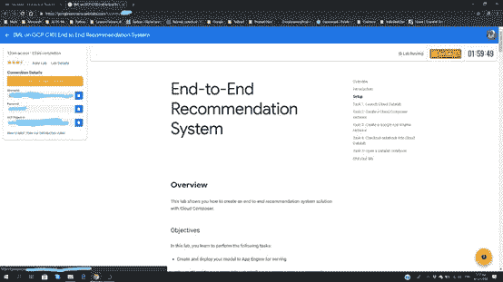
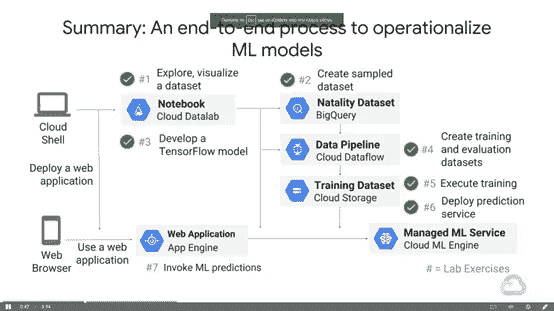

# 谷歌云平台(GCP)上 TensorFlow 的机器学习

> 原文：<https://medium.datadriveninvestor.com/machine-learning-%CE%BC%CE%B5-tensorflow-%CF%83%CE%B5-google-cloud-platform-gcp-89436bb62d41?source=collection_archive---------5----------------------->

这篇文章是关于我和谷歌云平台(GCP)在 Coursera 电子学习平台上的两个专业课程的旅行。

但首先，让我告诉你我是如何找到他们的。2018 年初看了一篇 [Lak Lakshmanan](https://towardsdatascience.com/machine-learning-with-tensorflow-on-google-cloud-platform-code-samples-7c1bc07cd265) 的文章。他写了他和他的团队一起学到的 10 课。他们被分成两个专业项目，每个项目 5 节课。当时没有时间学习，就放在了“ToRead”这个档案里。

在某个时候，我参加了一个来自 Coursera 社区的谷歌网络研讨会，在那里我“赢得”了一个月的免费专业课程。

于是我在谷歌云平台上用 TensorFlow 登录了[机器学习。总的来说，在这里你将学习什么是机器学习，通过 qwiklabs，你将做你的练习，你将完成你的作业。](https://www.coursera.org/specializations/machine-learning-tensorflow-gcp?)

End-TO-End Recommendation System

第一课，[Google 如何做 ML](https://www.coursera.org/learn/google-machine-learning?specialization=machine-learning-tensorflow-gcp) ，对专业化计划进行了总体更新，继续介绍 Google 遵循的人工智能策略，然后讲述 Google 多年来是如何做 ML 的，在倒数第二课，谈论当您想要使用 ML 时应该避免和/或必须考虑的事情，最后您将学习如何使用他们自己的 Python 笔记本。

进入 ML 的[是对 ML 的历史回顾，是对为什么神经网络现在在各种各样的数据科学问题中表现如此好的更新。](https://www.coursera.org/learn/launching-machine-learning?specialization=machine-learning-tensorflow-gcp)

当你完成本课程时，他们的目标是:
。了解深度学习为什么如此受欢迎，
。使用损失模式和性能测量来优化和评估模型，
。如何处理你在 ML 中会遇到的常见问题&
。如何创建重复和可扩展的训练、评估和测试数据集。

逻辑连续性是 TensorFlow 的[介绍。在这个专业化计划以及下一个计划中，您将参加的研讨会将使用 TensorFlow 1.7 或 1.8。本课从如何在底层使用 TensorFlow 开始(最高级别是使用 tf.estimator ),我们学习必要的概念和 API，以便能够编写分布式 ML 模型。他们解释了如何扩展该模型的训练，以及如何使用云 ML 引擎进行高性能预测。](https://www.coursera.org/learn/intro-tensorflow?specialization=machine-learning-tensorflow-gcp)

我们必须改进我们建立的 ML 模型，提高它的准确性，找出哪些列具有对我们有用的特征。在[特征工程](https://www.coursera.org/learn/feature-engineering?specialization=machine-learning-tensorflow-gcp)中，我们学习如何对它们进行预处理和转换，以便在我们的 ML 模型中得到最佳使用。

[机器学习的艺术和科学](https://www.coursera.org/learn/art-science-ml)是这个项目的最后一课。在这一课中，他们向我们展示了 ML 的基本技能，这些技能是协调和优化 ML 模型以获得最佳性能的良好判断和实验。第一，如何手动配置，看对模型性能的影响。有了超参数之后，我们如何使用谷歌云平台中的云 ML 机器自动协调它。

当我完成这个专业化计划时，我对 TensorFlow 有了更好的了解，并且我已经与 Google Cloud 合作了很多。

去年 11 月，我参加了谷歌的“让我们谈谈人工智能”( Let's Talk AI ),又一次免费上了一个月的专业课。

所以我在 GCP 上用 TensorFlow 开始了[高级 ML。推荐给对 ML 有中高级知识的人。不然还是从我上面写的专精开始比较好。](https://www.coursera.org/specializations/advanced-machine-learning-tensorflow-gcp?)

第一个专业是…热身，是开胃菜。在这里，大联盟的魔力开始了！

在这个专业中，我经常使用谷歌云平台。我获得了在实验室中优化、开发和缩放各种类型的 ML 生产模型的实践经验。这个专业教会了我如何为结构化数据、图像数据、时间序列、NLP 和推荐系统创建定制的、准确的和现成的模型。

甚至在说“早上好”之前，我们就在深水中游泳！在[GCP 上 TensorFlow 的端到端 ML](https://www.coursera.org/learn/end-to-end-ml-tensorflow-gcp?specialization=advanced-machine-learning-tensorflow-gcp)中，我从查看在生产环境中部署 ML 的步骤开始，继续使用 Datalab 和 BigQuery 探索数据(真的难以置信！)，通过在 Datalab 中使用 Pandas，我制作了一个数据集，我构建了自己的模型，对数据进行了一定规模的预处理，使其发挥作用，并在云 ML 引擎中对其进行了训练！！！！！

ML Model

在下一课[生产机器学习系统](https://www.coursera.org/learn/gcp-production-ml-systems?specialization=advanced-machine-learning-tensorflow-gcp)中，我看到了生产环境中高性能机器学习系统的组件和最佳实践。建筑。围绕模型的训练和服务的高级设计决策，这是模型的正确性能配置文件所需要的。如何使用数据进行云和基于 ML 的分析？如何将 ML 模型的数据传输到云中。为什么最好将数据放在云中，我如何获得规模优势并使用完全托管的服务。如何识别模型依赖于数据的方式，如何对成本做出决策，如何知道何时恢复先前版本中的模型，如何识别观察到的模型行为的原因。如何确定 ML 模型的性能参数？

通过在 GCP 上使用 TensorFlow 对[图像进行理解，我学会了使用 CNN 进行图像分类时需要遵循的策略。](https://www.coursera.org/learn/image-understanding-tensorflow-gcp?specialization=advanced-machine-learning-tensorflow-gcp)

我从线性开始，然后是 DNN，最后是 CNN 模型。我使用了辍学，汇集，看到了数据和图像增强，转移学习，批量标准化，并在最后残余网络。这里有一个关于 TPU 的实验室。它是可选的，因为你必须支付 5 美元。但是在 TPU 运行 ResNet 是值得的！最后，我看到了汽车。

在[时间序列和自然语言处理的序列模型](https://www.coursera.org/learn/sequence-models-tensorflow-gcp?specialization=advanced-machine-learning-tensorflow-gcp)中，我了解了序列的模型、它们的应用和自然语言的处理。

预测时间序列的未来值
自由文本排序
用 RNN 解决时间序列和文本问题
在 RNN/LSTM 和更简单的模型之间进行选择
在文本问题中训练和重用内联单词
这是我在这里学到的一些东西。

我就是这样做到最好的。最后一课是锦上添花。有了 GCP tensor flow 上的[推荐系统](https://www.coursera.org/learn/recommendation-models-gcp)，我终于设法使用谷歌云平台上可用的许多工具从头到尾构建了一个推荐系统。IAM &管理员、存储、大数据、编写器、云外壳…

Dashboard

 **整个行程很棒。从第一个专业化计划开始，包括术语和历史数据，直到第二个计划结束。**

****负面** “这不是课程的负面，是我的！”还有一个可选项目。我没敢抓。因为有 TPU 会更好。而我没有。**