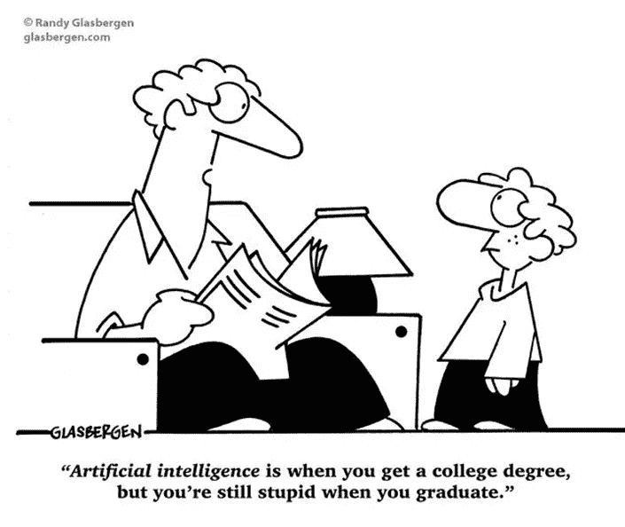
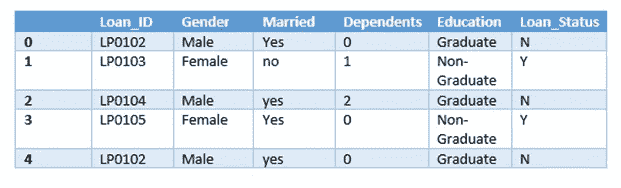

# 机器学习入门

> 原文：<https://medium.datadriveninvestor.com/machine-learning-101-111525fa70b5?source=collection_archive---------17----------------------->

在我写这篇文章之前，我想感谢那些花时间阅读我的第一篇文章，然后鼓掌，评论，分享，最后祝大家新年快乐！！！

我知道你们中的许多人问我如何“做”数据科学，是否有任何可用的课程。在 Coursera、EdX、DataCamp 等网站上有很多免费的在线课程。，关于数据科学/商业分析/统计的各种主题(这非常重要)，但是，我建议你将这些作为入门，然后从事自己的项目。这确实是最好的学习方式——边做边学:)

那么回到手头的任务，什么是人工智能(AI)？

你可以用谷歌搜索这个定义，在不到 0.66 秒的时间里就能得到 340，0 00，0 00 个结果！然而，我将简单地用我自己的话来定义它:人工智能是试图教会计算机像人类一样智能地思考或决策的研究，允许计算误差。我可以在定义中包括行话，但让我们保持简单！

适用于数据科学的人工智能分支/子集被称为机器学习(ML ),我们将如何定义 ML？我认为维基百科对此的定义很简单:

****机器学习*** *(ML)是对* [*算法*](https://en.wikipedia.org/wiki/Algorithm)*[*统计模型*](https://en.wikipedia.org/wiki/Statistical_model)*[*计算机系统*](https://en.wikipedia.org/wiki/Computer_systems) *的研究，用于逐步提高自己在特定任务上的表现-维基****

**ML 算法从过去的经验中学习，而没有被明确编程这样做。有两种主要的机器学习算法:监督的和非监督的。**

**监督学习可以被定义为被标记的数据集。例如:**

****

**Table of Loan Data**

**上表显示了贷款数据的示例(我虚构的数据)。最后一列“贷款状态”被称为标签(结果)列。如果贷款已经批准，此栏显示使用 Y/N(是/否)。使用这种标记数据的算法被称为监督学习算法。因此，我相信你可以看到，这种算法的一个特殊应用将是根据以前谁获得/拒绝贷款的数据来确定谁获得贷款。**

**实事求是地说，我们将增加另一个列，表明那些被授予谁保持贷款偿还和谁已经违约，因为这将更有意义！理想情况下，你想把贷款 ***只发放给*** 要还钱的人。有许多算法属于监督学习的范畴，但我们不会在这篇文章中讨论。**

**现在我们来谈谈无监督学习。这(自然)是一个未标记的数据集。例如:**

****

**我们向算法提供随机图像(输入数据),此后，算法看到图像之间的模式，并将相似的图像分组或群集在一起。在本例中，喂入了 3 种不同类型的水果，算法对此进行了识别。因此，输出显示了 3 个不同的组。聚类分析的一个真实例子是用于营销分析目的的客户细分。可以在群体中识别特定的聚类(或客户群)。对这些群体的分析可以确定人群购买特定产品或服务的可能性。然后，营销团队可以针对每个集群进行定制的、有针对性的沟通。**

**我们的基本概述到此结束。我不希望这些帖子是教程(网上有很多)。我想用这些帖子来揭示一种解决问题的新思路。应用数据科学不一定要成为数据科学家。我在一个纯化学工程领域(目前直到我决定从这里去哪里…)并且仍然发现它适用于我的工作。但是，要准备好花几个小时清理数据(大部分时间)和可能导致无结果/不确定结果的坏数据。**

****

**在下一篇文章中，我将介绍一种被称为决策树的特定类型的监督机器学习算法。它们有广泛的应用，并且超级容易理解(不需要技术背景)。它也是贷款预测问题中使用的算法之一！**

**我希望这篇文章很快为你提供了一个基本的概述，如果你喜欢它，请鼓掌，评论和分享！**

## **来自 DDI 的相关故事:**

** [## 数据科学和软件工程哪个更有前途？

### 大约一个月前，当我坐在咖啡馆里为一个客户开发网站时，我发现了这个女人…

medium.com](https://medium.com/datadriveninvestor/which-is-more-promising-data-science-or-software-engineering-7e425e9ec4f4)  [## 用 7 个步骤解释深度学习

### 和猫一起

medium.com](https://medium.com/datadriveninvestor/deep-learning-explained-in-7-steps-9ae09471721a)**