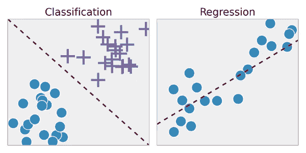
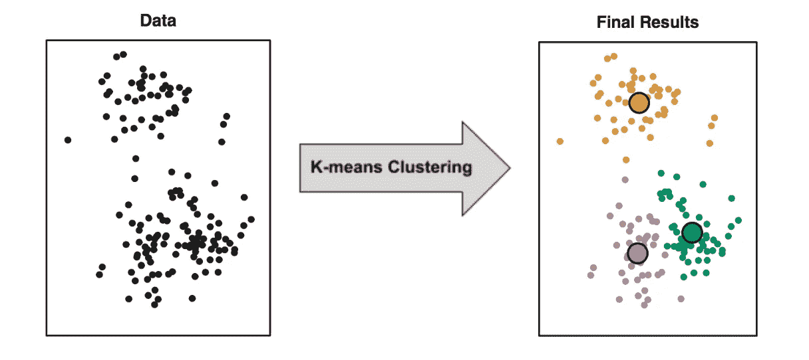

# 机器学习入门

> 原文：<https://medium.datadriveninvestor.com/machine-learning-101-aa3651171382?source=collection_archive---------20----------------------->

从广义上讲，机器学习是实现人工智能(AI)的子集或方式。人工智能涉及可以执行人类智能特征任务的机器，如逻辑决策、从经验中学习和改进。

人工智能系统可以大致分为两类狭义和广义，狭义人工智能指的是为处理某些特定任务(如垃圾邮件过滤)而构建的系统，而广义人工智能系统指的是在理论上可以解决任何问题的系统，这就是我们这些天听到的大多数流行词(如机器学习、深度学习)出现的地方。

尽管这个想法已经存在了很长时间，但它只是在大约十年前随着互联网的出现和普及而开始产生重大和突破性的结果，导致了大量数字数据的产生，并创造了比以往任何时候都更高效和更快的存储和处理设备。

# **什么是机器学习？**

阿瑟·塞缪尔在 1959 年将机器学习定义为一个研究领域，它赋予计算机在没有明确编程的情况下学习的能力。

**“学”是什么意思？**

如果由 P 测量的计算机程序在 T 上的性能随着经验 E 而提高，则称该计算机程序从关于某个任务 T 和某个性能测量 P 的经验 E 中学习。

让我们来分解一下，想象你和你的朋友去树林里射箭，而你自己以前从来没有用过弓箭。你将如何学习？你的大脑做了哪些任务和计算？

你将首先射击，希望它靠近目标(手指交叉等)，然后你会看到它击中了哪里，对于下一次射击，你的大脑会根据上次的尝试进行一些计算，并据此调整姿势、方向、力度和其他特征，以改善下一次射击的结果，你会在第二次射击中击中靶心吗？极不可能。所以你的大脑重复这个过程，一次又一次，在每次迭代中慢慢提高，如果你**练习足够的击球**，你将能够持续准确地击中目标，这就是我们所说的为一项任务开发肌肉记忆。

让我们将它与上面关于计算机程序如何学习的定义进行比较，假设在任务 T 中射击，P 是它击中目标的下一次射击的概率，E 是让程序射击 10 次或 1000 次的经验。因此，它拍摄 T，基于结果计算下一次拍摄的 P，然后基于 E 对其特征进行改变，然后再次拍摄 T，并重复该过程，旨在最大化击中靶心的概率。

现在，假设你喜欢和你的朋友一起玩射箭，并渴望在这方面做得更好，你每天都沉浸在晴朗天空下的森林中的常规练习中。

但是，当周末来临，你和朋友外出时，天气变得多风和多云。所以，即使在所有这些严格的练习之后，你仍然不能击中目标。一个原因是你已经习惯了你的环境，因此不能在一个不同的环境中工作，这个场景的术语是过度适应。如果你想知道是不是也有所谓的不合身？如果是，那会是什么？简而言之，不适合只是因为缺乏练习而表现不好的情况。

现在假设你在下周末之前在有风的环境中训练，但是下一次开始下大雨，或者你的朋友决定稍微改变一下游戏以击中移动的目标，或者这次你必须击中高架平台上的目标或者无数其他可能的模拟中的任何一个。

那么，我们怎样才能掌握一项技能呢？

由于所有这些不断变化的环境变量，据说一个人要真正掌握一项技能，无论在什么情况下都能表现出色，需要 **10，000 小时**的练习。

**但是谁有那么多时间、精力或耐心呢？**

这就是智能系统发挥作用的地方。机器学习代理可以快速运行 1000 次模拟，适应各种环境条件，并学习以非常高的准确度一致地击中目标。

# 三种基本学习模式:

***1 >监督学习***

何时、为何和如何:

当向系统提供输入和它们相应的标签，然后期望系统预测某个先前未知的输入集的标签时。

方法:

当我们需要连续范围内的输出时，这就叫做回归问题。为了解决回归问题，我们的目标是找到最佳拟合曲线，使得给定数据的损失/误差最小，然后我们可以使用该曲线来预测新数据的值。示例-根据过去的记录、天气预测等来预测某些产品的未来价格。

Classification vs Regression

当我们需要将一些数据分成一些有限的离散类(如 0，1，2…)时，这就变成了一个分类问题。为了制作二元分类器，即只有两个可能的结果 0 或 1，是或否，我们可以使用分类算法(如感知器算法，朴素贝叶斯，SVM 等。)其中我们的目标是找到线/平面的方程，该方程分隔给定的训练数据，使得线一侧的数据点属于一个类，而另一侧的数据点属于另一个类。示例-将邮件分类为垃圾邮件或非垃圾邮件，从 x 射线中发现肿瘤的存在等。

***2 >无监督学习***

何时、为何和如何:

对于事先不知道答案的问题，采用无监督学习。当我们只有数据特征而没有标签时，我们必须在数据中寻找模式并将具有相似特征的数据分组在一起。

方法:

聚类:有各种算法(如 K 均值聚类，DBSCAN 和层次聚类等。)来执行聚类，每个都有各自的起伏。例如，在 K 均值聚类算法中，我们需要预先输入 K 的值，即我们希望在数据中找到多少个聚类，而在分层/DBSCAN 模型中没有这样的限制。

Clustering of data points

用于推荐系统、社交网络分析、图像分割、市场趋势分析等。

***3 >强化学习***

何时、为何和如何:

这与上面两种方法有很大的不同，这里我们不提供任何数据来进行训练，我们只是提供设备来执行任务，然后建立基于试错的奖励系统，在该系统中，对于代理与环境的每个期望的交互，代理都会获得奖励并建立在该反馈的基础上。这就像一只狗如何被训练一样，开始时，它不理解任何命令，但当它随机地听从我们的命令一次并因此得到奖励时，它会为了奖励而重复同样的命令，最终学会在没有奖励的情况下完成任务。

Reinforcement Learning process

方法:强化神经网络(RNN)、长短期记忆网络(LSTM)等。
用于:语言建模和翻译、雅达利游戏的学习、手写识别/生成、键盘预测等。

# 现在，什么是深度学习，它有什么特别之处？

*“深度学习是一种特殊的机器学习，它通过学习将世界表示为嵌套的概念层次结构，每个概念都是相对于更简单的概念定义的，而更抽象的表示是根据不太抽象的概念计算的，从而实现了强大的能力和灵活性。”*

虽然机器学习算法依赖于程序员提供一些数据，基于这些数据它可以给出结果，但深度学习能够自己找出完成任务所需的特征。

Machine Learning vs Deep Learning

如上图所示，对于较少的数据，通用机器学习技术可能会优于深度学习，因为它需要更多的时间和资源来训练。但是，如果有足够的时间和数据，它将胜过一切。

深度学习的一个缺点是，随着模型越来越深，层次越来越密集，结果的可解释性就会丧失，即理解我们获得结果所基于的过程。

# 结论:

我们在这一领域已经取得了很大进展，现在到处都可以找到机器学习、深度学习和人工智能的应用，从谷歌搜索结果的分类，电子商务/流媒体/社交网站的推荐，移动设备中的图像识别和个人语音助手，到自动驾驶汽车。但请放心，这只是开始，仍然有巨大的可能性，可以使用这些技术实现自动化。

有希望有一天我们能制造出一个终极的基于人工智能的系统，它能解决任何未知的问题。

## 来自 DDI 的相关故事:

 [## 用 7 个步骤解释深度学习——数据驱动投资者

### 在深度学习的帮助下，自动驾驶汽车、Alexa、医学成像-小工具正在我们周围变得超级智能…

www.datadriveninvestor.com](https://www.datadriveninvestor.com/2019/01/23/deep-learning-explained-in-7-steps/)  [## 股票市场投资的机器学习——数据驱动的投资者

### 当你的一个朋友在脸书上传你的新海滩照，平台建议给你的脸加上标签，这是…

www.datadriveninvestor.com](https://www.datadriveninvestor.com/2019/01/30/machine-learning-for-stock-market-investing/)