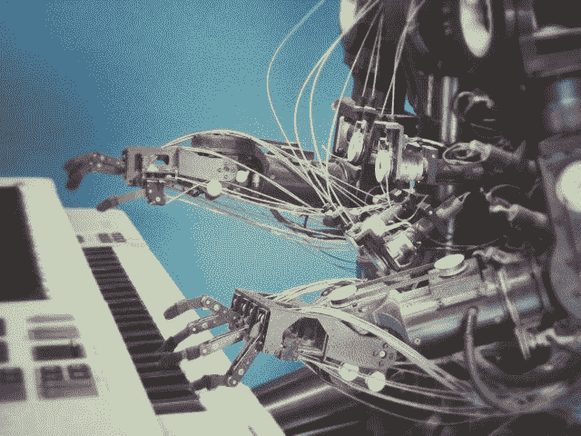

# 机器学习

> 原文：<https://medium.datadriveninvestor.com/machine-learning-1ee009220145?source=collection_archive---------5----------------------->

# 所以第一个问题是“什么是机器学习？”

机器学习可以用多种方式来定义。机器学习的一些流行定义如下:-

1.  机器学习是对算法和统计模型的科学研究，计算机系统使用这些算法和统计模型来有效地执行特定任务，而不使用显式指令，而是依赖模式和推理。它被视为人工智能的一个子集。来源:https://en.wikipedia.org/wiki/Machine_learning
2.  机器学习是人工智能(AI)的一种应用，它为系统提供了自动学习和根据经验进行改进的能力，而无需显式编程。机器学习专注于开发可以访问数据并使用数据进行自我学习的计算机程序。来源:https://www.expertsystem.com/machine-learning-definition/

上面的定义绝对正确，但是不够简单。我想把机器学习定义为通过编程让计算机自己学习来教会计算机完成特定任务的过程。我的定义可能不符合机器学习的所有规范，但对于不知道模式、算法或统计分析意味着什么的人来说，它是完美的。

# 人类在日常生活中是如何进行机器学习的？

假设你想开始用英语阅读/写作。所以这是你的具体任务。为了完成这个任务，你需要通过阅读初级英语书或观看英语视频来理解英语字母表。一旦你开始学习，你就会获得英语方面的经验。几天后，你试着通过做一些测试来测试你自己的英语语法。由于这是你的第一次测试，你不能很好地发挥，因为你没有成功通过测试的经验，或者只是缺乏基本知识。这个学习、积累经验和自我测试的循环过程持续了几个月。一个月后，你会发现有时候你能够通过测试，有时候你却失败了。慢慢地，你开始进步，你通过测试的机会每天都在快速增加。设 P 为测试中的性能。

现在我们知道了 T、E 和 P，我们就能够理解机器学习的现代定义。Tom Mitchell，现代的定义是“一个计算机程序被认为从经验 E 中学习关于某类任务 T 和性能测量 P，如果它在任务 T 中的性能，如 P 所测量的，随着经验 E 而提高。”现在，当我们知道什么是 T、E 和 P 时，我们将能够理解机器学习的现代定义。

# 机器学习的类型

1.  监督学习
2.  无监督学习
3.  强化学习

# 监督学习

你已经知道监督是什么意思了吧！，所以理解监督学习一点也不难。记得当你还是个孩子的时候，你的父母用一本水果鉴定书来教你不同种类的水果。每种水果都有特定的颜色、形状和名字下面的标签。所以你已经知道所有的正确答案了。这是机器，水果鉴定书是训练数据集。在父母的监督下教会你书中的一切后，你被要求从书中辨认出一种水果。因为你作为一台机器已经有了以前数据的知识，你会明智地思考。你将首先判断水果的形状、颜色和其他定性因素，然后将水果归入适当的类别。这就是监督学习的含义。轻松右转！，现在让我们更深入地研究一下监督学习。

# 有哪些监督学习技术？

1.  分类
2.  回归

# 什么是分类？

当问题有离散输出，如“1”或“0”，“是”和“否”时，通常使用分类。分类模型通常用于得出一些结论。

# 什么是回归？

回归通常用于解决具有连续值输出的预测问题，例如基于一些独立因素的个人工资或体重。

你可能会想，为什么我不深入研究这些技术的更多技术细节，原因是如果我现在就投入到难懂的数学和编程中，你可能会对这个话题感到沮丧，甚至可能对学习它不感兴趣。我向你保证，我将在我接下来的博客中慢慢深入机器学习的各个方面，这也将分享我的见解，并为你提供资源和需要解决的好问题。

# 无监督学习

无监督学习顾名思义就是没有任何监督的学习过程。你可能会想，“等等，这到底是什么意思？”。所以这种类型的学习中，我们不指挥或引导机器，告诉我们的数据是什么，或者换句话说，我们的数据没有标签。所以你可能会想，它是怎么学习的呢？嗯，这是有趣的部分，所以继续阅读。在无监督学习中，机器根据它在数据中发现的一些相似性、模式和差异对未排序的信息进行分组。我们不训练机器，不像监督学习。

# 什么是无监督学习技术？

1.  使聚集
2.  联合

# 使聚集

假设给你 1000 名患有不同疾病的儿童的数据，并告诉你将他们分组，但不提供更多细节。要做的是看每个孩子的年龄，他们患的是什么病，他们位于哪个地区，哪些孩子面临的是什么样的症状等等。你试图通过自动寻找变量来对它们进行分类。这就是所谓的集群。

# 联合

关联用于处理这样的问题:您有大量的数据，并且您试图找到数据之间的趋势。您实际做的是将一个数据与相似的数据相关联，并将它们分组。这就是所谓的关联。

# 强化学习

强化学习类似于监督学习，除了在一些方面。强化学习的工作原理是最大化每个适当行动的回报。假设你正试图解决一个数学问题，而解决这个问题的奖励是糖果。首先，你需要理解问题，然后按照正确的流程继续。在解决问题的过程中，你每犯一个错误，你的糖果数量就会减少 1，你每选择一个正确的过程，你的奖励就会增加 1。总奖励将在你解决问题后计算。这种学习的自然部分是，学习主体总是希望通过最小化其错误来最大化其回报。

我想现在你已经对机器学习到底是什么以及它与我们的学习过程是如何相似有了一个基本的理解。

这都是为了这个博客。在接下来的博客中，我会详细解释机器学习的每个过程和步骤。一定要去看看。祝你愉快，再见。

*原载于 2019 年 7 月 3 日*[*【http://computingbytes.wordpress.com】*](https://computingbytes.wordpress.com/2019/07/03/machine-learning/)*。*