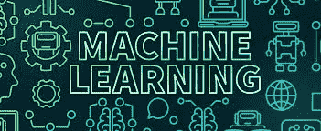
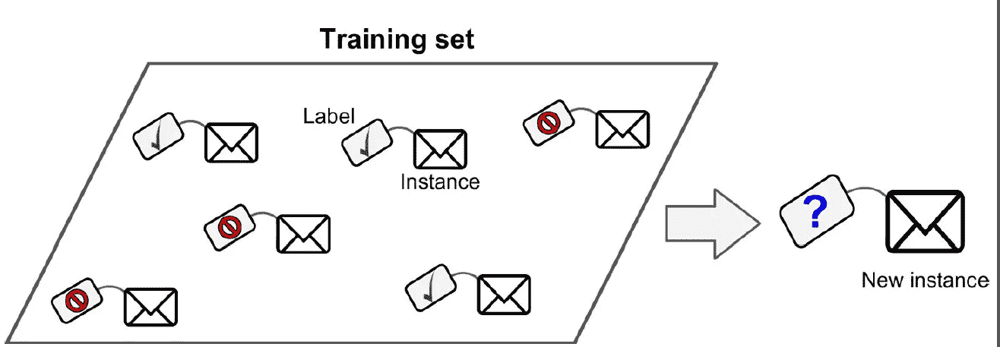
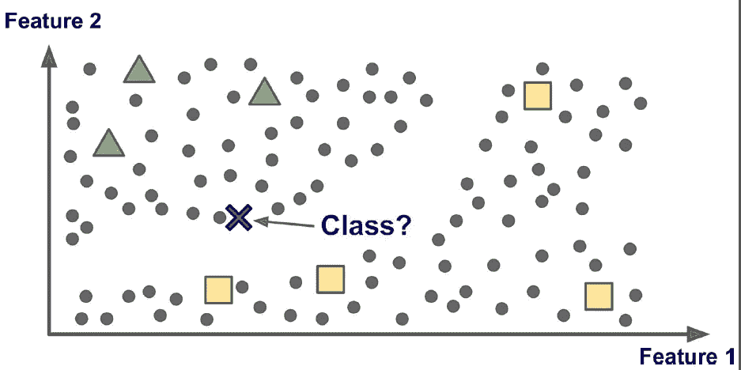
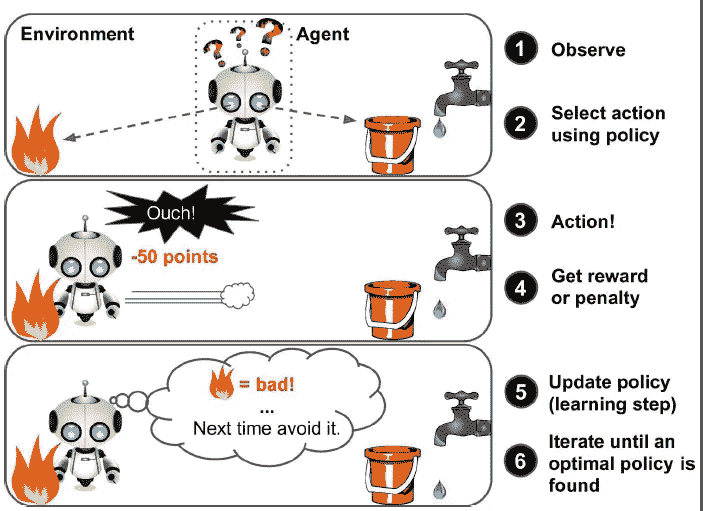

# 机器学习

> 原文：<https://medium.datadriveninvestor.com/machine-learning-98406f368779?source=collection_archive---------3----------------------->

机器学习是给计算机编程的科学(和艺术),以便它们可以从数据中学习。

下面是机器学习的一个稍微更通用的定义:

 [## 金融中的机器学习|数据驱动的投资者

### 在我们讲述一些机器学习金融应用之前，我们先来了解一下什么是机器学习。机器…

www.datadriveninvestor.com](https://www.datadriveninvestor.com/2019/02/08/machine-learning-in-finance/) 

***机器学习是在没有明确编程*** 的情况下，赋予计算机学习能力的研究。(阿瑟·塞缪尔 1959 年)

例如，机器学习程序中的垃圾邮件过滤器可以学习标记垃圾邮件，给出垃圾邮件的示例(例如，由用户标记的)和常规(非垃圾也称为“ham”)邮件的示例。系统用来学习的示例称为训练集。每个训练示例称为一个训练实例。在这种情况下，任务 T 是为新电子邮件标记垃圾邮件，经验 E 是训练数据，并且需要定义性能测量 P；例如，您可以使用该比率来定义正确分类的电子邮件。这种特殊的性能测量称为准确性，它通常用于分类任务。

为什么要用机器学习？

考虑如何使用传统编程技术编写垃圾邮件过滤器:

*   首先，您会看到垃圾邮件通常是什么样子。你可能会注意到，一些单词或短语(如“4U”、“信用卡”、“免费”和“神奇”)往往会在主题中出现很多。也许您还会注意到发件人姓名、邮件正文等其他一些模式。
*   你可以为你注意到的每一个模式编写一个检测算法，如果检测到许多这样的模式，你的程序会将电子邮件标记为垃圾邮件。
*   您将测试您的程序并重复上述步骤，直到检测到垃圾邮件。

总结一下，机器学习对以下方面很有帮助:

*   现有解决方案需要大量时间、大量调整和大量规则来定义的问题，但机器学习可以解决这些问题。
*   使用传统方法根本没有好的解决方案的复杂问题:最好的机器学习技术可以找到解决方案。
*   波动的环境:机器学习系统可以适应新数据。
*   深入了解复杂的问题和大量的数据。

机器学习系统的类型:

机器学习系统有很多种类型，因此根据以下因素将其分为几大类是非常有用的:

*   无论它们是否在人工监督下接受训练(监督、非监督、半监督和强化学习)
*   他们是否能在运行中进行增量学习(在线学习还是批量学习)
*   它们是通过简单地将新数据点与已知数据点进行比较来工作，还是像科学家一样检测训练数据中的模式并建立预测模型(基于实例的学习或基于模型的学习)

**监督学习:**

在监督学习中，输入算法的训练数据包括称为标签的所需解决方案。

A labeled training set for supervised learning

典型的监督学习任务是分类。垃圾邮件过滤器就是一个很好的例子:它与许多垃圾邮件或 ham 一起接受训练，它必须学会如何对新邮件进行分类。

大多数导入监督算法:

*   KNN(k-最近邻)
*   线性回归
*   逻辑回归
*   朴素贝叶斯
*   决策树和随机森林
*   支持向量机
*   神经网络

**无监督学习:**

在无监督学习中，正如你可能猜到的那样，数据是未标记的，系统试图在没有老师的情况下学习。

例如，你有很多关于博客访问者的数据。您可能希望运行聚类算法来尝试预测相似读者群。你不需要告诉算法一个访问者属于哪个组。它不需要你的帮助就能找到相似读者之间的联系。例如，它可能会注意到 40%的访问者是男性，他们喜欢漫画书，通常在晚上阅读你的博客，而 20%是年轻的科幻爱好者，他们在周末等时间访问你的博客。如果您使用分层聚类算法，您可以很容易地划分子组。

最常见的无监督算法:

使聚集

*   k 均值
*   层次聚类分析
*   期望最大化

可视化和降维

*   主成分分析
*   核主成分分析
*   局部线性嵌入(LLE)
*   t 分布随机邻居嵌入(t-SNE)

关联规则挖掘

*   推测的
*   喝彩

**半监督学习:**

一些算法可以处理部分标记的训练数据，通常是大量的未标记数据和少量的标记数据。这被称为半监督学习。

一些照片托管服务，如谷歌照片，就是一个很好的例子。一旦你把你所有的家庭照片上传到服务中，它会自动识别出同一个人 A 出现在照片 1、5 和 11 中，而另一个人 B 出现在照片 2、5 和 7 中。这是算法聚类的非监督部分。现在所有的系统需要你告诉它这些人是谁。只需在每个人的照片上贴上标签，它就能说出照片中每个人的名字，这对搜索照片很有用。

Semisupervised Learning

大多数半监督算法是监督算法和非监督算法的结合。例如，深度信念网络(DBN)基于堆叠在另一个之上的被称为受限玻尔兹曼机器(RBM)的无监督组件。当整个系统使用监督技术进行微调时，RBM 以无监督的方式被顺序地训练。

**强化学习:**

强化学习是一种非常不同的野兽。在这种情况下，学习系统被称为代理，它可以观察环境，选择和执行动作，并获得回报或负回报形式的惩罚。然后，它必须自己学习什么是最好的策略，即所谓的政策，以便随着时间的推移获得最大的回报。策略定义代理在给定的解决方案中应该选择什么操作。

Reinforcement Learning

例如，许多机器人实现强化学习算法来学习如何走路。DeepMind 的 AlphaGO 程序也是强化学习的一个很好的例子:2016 年 3 月，它在围棋比赛中击败了世界冠军李·塞多尔(Lee Sedol)，成为头条新闻。它通过分析数以百万计的游戏，然后与自己玩许多游戏，了解了获胜的策略。注意，在对抗冠军的比赛中，学习是关闭的；AlphaGo 只是应用了它刚刚学到的策略。