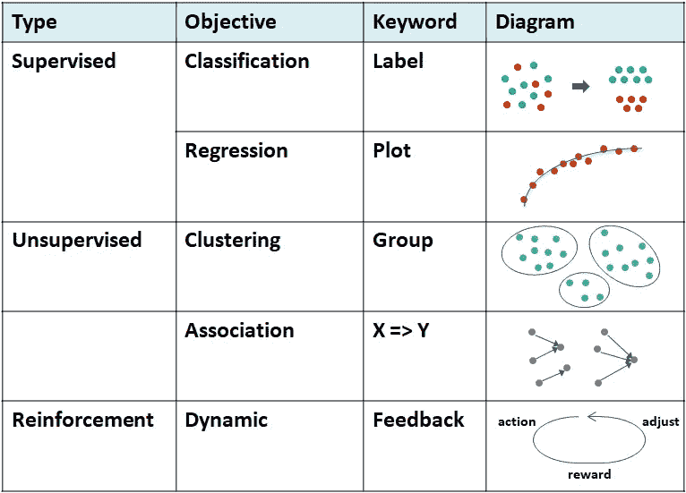
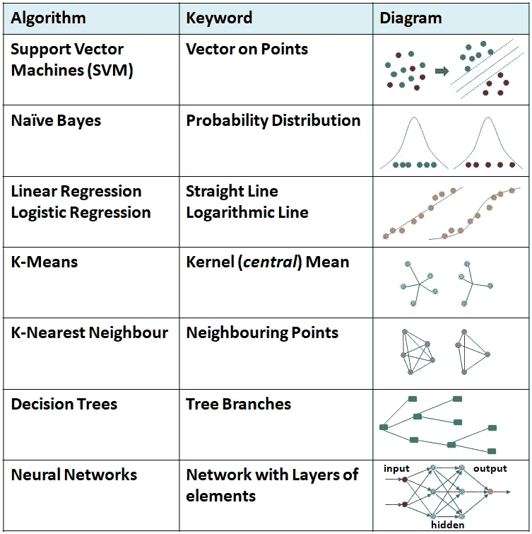

# 机器学习——自上而下的观点

> 原文：<https://medium.datadriveninvestor.com/machine-learning-a-top-down-view-e1b9d2fcaf9?source=collection_archive---------4----------------------->

## 最大似然法基本概念介绍

这是我之前写的关于人工智能的文章的延续。我在这里的尝试是介绍用例及算法，而不是深入其中。为了便于外行人阅读，我在本文的[底部](#f800)编辑了一个统计术语列表。

要让一台机器*学会*一些东西，你必须先*教会*或 ***训练*** 它，这通常是用样本或历史数据集来完成的。这样实现的学习通常表示为逻辑或数学 ***模型*** 。我们首先让机器使用*训练*数据集建立模型，然后使用*测试*数据集验证模型。

 [## 金融中的机器学习|数据驱动的投资者

### 在我们讲述一些机器学习金融应用之前，我们先来了解一下什么是机器学习。机器…

www.datadriveninvestor.com](https://www.datadriveninvestor.com/2019/02/08/machine-learning-in-finance/) 

以下是机器学习算法的高级分类…

1.  ***监督*** 学习需要人类*标注*输入数据，以便机器能够识别。一个数学模型是从一个既包含输入又包含期望输出的数据集构建的，例如，将电子邮件分类为垃圾邮件或非垃圾邮件。更多例子[下面](#1ac0)。
2.  ***无监督*** 学习是不需要人类标注输入就能发现模式的能力。数学模型是从只包含输入(不包含所需的输出标签)的数据集构建的，例如，从文本文档中导出标签云。更多例子[下面](#9df2)。
    ***半监督*** 学习涉及从不完整的训练数据开发数学模型，其中一部分样本输入没有标签。一个例子可以是在照片上识别你的家人和朋友——只有一些是有标签的。
3.  ***强化*** 学习是一种基于目标的方法，包括对好的反应进行奖励，对不好的反应进行惩罚。一个经典的例子是婴儿如何学习走路——奖励是更快地到达某物，惩罚是摔倒时的疼痛。它不同于其他形式的 ML，因为它没有标记的数据，只有一个什么是奖励的概念。点击[此处](#c19f)查看更多示例。

***其他*** 目标包括:
**> *主题建模*** 用于发现出现在一组文档中的抽象*主题*或者发现覆盖相似主题的其他文档。
> **异常检测**或异常值检测是对罕见项目、事件或观察结果的识别，这些项目、事件或观察结果因与大多数数据显著不同而引起怀疑。这是典型的欺诈检测方法。
**>特征学习**旨在发现*训练期间提供的输入*的更好表示，以一种有用的方式转换它，通常作为预处理步骤。这可以是有人监督的，也可以是无人监督的。
**>降维**旨在减少一组数据中*特征*或输入的数量。

关键的 ML 算法目标总结如下表所示。对于监督学习，我们非常了解数据结构。随着列表的深入，我们对数据结构的了解越来越少。

Machine Learning Types and Objectives

ML 算法通常是*相互比较*准确性*、*速度*和*可解释性*(追溯步骤以解释*为什么*机器学习了某些东西的能力)。术语*(*可解释 AI* )经常用在这个上下文中。
[***集成***](#f800) 方法使用多个学习算法来获得比单独从任何组成学习算法获得的性能更好的预测性能。
***迁移学习*** 侧重于存储在解决一个问题时获得的知识(参考 [AI 文章](https://medium.com/@bhaskarnsubramanian/artificial-intelligence-a-top-down-view-a0c119394aca)),并将其应用于不同但相关的问题。
***智能自动化*** 是指应用于 RPA 或机器人流程自动化的 ML 和其他 AI 概念的场景(参考 [RPA 文章](https://medium.com/@bhaskarnsubramanian/robotic-process-automation-a-top-down-view-19a93950be67))。**

# **监督学习**

**所需的输出已经定义，机器必须将输入映射或分配给输出值之一。**

*   *****分类*** —输出被限制为一组*有限的值*，例如，在医学扫描中出现(或不出现)一个条件，或在一个信号中计数不同类型的车辆，如自行车、汽车或公共汽车。**
*   *****回归*** —输出是一个范围内的*连续值*(例如:房价、天气温度)，可以绘制出来用于*预测*或*预测*。在此查看术语[回归的定义](#f800)。**

## **监督学习模型**

*   *****SVM(支持向量机)*** —数据表示为点除以一个[向量](#f800)，该向量被支持在一个具有尽可能宽的清晰间隙的超平面中。SVM 用于分类。等效方法 SVR(支持向量回归)用于回归。**
*   *****朴素贝叶斯*** —基于[贝叶斯定理](#f800)的概率分类器，具有特征之间的强(朴素)独立性假设**
*   *****线性回归*** *—* 对因变量和一个或多个解释变量之间的关系进行建模的线性方法**
*   *****逻辑回归*** —使用 [*逻辑*](#f800) 函数对二元因变量建模**
*   *****K-最近邻(kNN)****—*K([核](#f800))是用于*分类*(或*预测*连续变量/回归情况下)一个测试样本的最近邻数**
*   *****决策树*** —从对一个项目的观察(分支)到关于该项目的目标值的结论(叶)**
*   *****随机森林*** —一种[集成](#f800)学习方法，通过在训练时构建大量决策树并输出类别，该类别是各个树的类别(分类)或均值预测(回归)的模式**
*   *****神经网络*** —也叫*人工神经网络(* ***安*** *)* ，是连接节点上的一系列功能，看起来像人脑中的神经元网络。这些节点可以排列在一系列隐藏层中。多个隐藏层使得该方法像在深度学习中一样“深”。**
*   *****线性*** [***判别***](#f800) ***分析***——寻找表征或分隔两类或两类以上对象或事件的特征的线性组合。用于后面的*分类*之前的*降维*。**

# **无监督学习**

**期望的输出不是很明确。这种方法用于发现数据中的结构，如数据点的分组或聚类，发现模式等。**

*   *****聚类***——发现数据中的内在分组，如*基于购买行为的客户细分*(用于营销)。当一个分类中的项目之间的紧密程度大于分类本身之间的紧密程度时，分类是好的。**
*   *****关联规则*** —发现购买 X 的人也倾向于购买 Y 等规则，也称为市场*篮子分析*，它在电子商务网站中形成推荐的基础。**

## **无监督学习模型**

*   *****K-均值*** *—* K 个观察值被任意选择称为质心(或[核](#7c0d))，每个点被分配到其最近的质心，这样形成的每个聚类得到一个新的质心作为所有聚类成员的*均值***
*   *****k-Modes*** —最小化向量本身和数据的每个对象之间的差异的元素向量。我们将拥有所需数量的集群模式，因为它们充当质心(或[内核](#f800))**
*   *****均值偏移*** —涉及将[内核](#f800)迭代地偏移到更高密度的区域，直到收敛**

*   *******高斯混合模型*** —一种概率模型，假设所有数据点都是从具有未知参数的有限数量的**高斯分布的*混合*中生成的******
*   *******隐马尔可夫模型(HMM)*** —被建模的系统被假设为一个[马尔可夫](#f800)过程，具有不可观测(或隐藏)的状态。****
*   ******主成分分析(PCA)** —将一组可能相关变量的观察值转换成一组线性不相关变量的值，称为主成分****
*   ****[***先验***](#f800) *—* 关联规则*的广度优先搜索策略*通过识别频繁的单个项目并将其扩展到更广泛的集合****
*   *******ELCAT*** (等价类转换)是一种基于交集的深度优先搜索****
*   *******FP-growth*** 使用紧凑版本的数据构建 FP(频繁模式)树结构****

# ****强化学习****

****一个*主动学习*机制，*通过基于*预算*访问有限组输入的期望输出来优化*输入(用于训练标签)的选择****

## ***强化学习模型***

*   *****可以说 q 代表在给定状态下采取的动作的*质量******
*   ******时间差异*** —通过[引导](#f800)从值函数的当前估计中学习。这些方法从环境中采样，并基于当前的估计动态地执行更新。***
*   ******生成性对抗网络***——两个神经网络在一场博弈中相互较量(就像国际象棋或围棋的*对手*)。给定一个训练集，这种技术学习用与训练集相同的统计数据*生成*新数据。***

******

***Common Machine Learning Algorithms***

## ***深度学习***

***深度学习基于 ANN(人工神经网络)的一系列 ML 方法，具有多个深入到“*”的隐藏层。深度学习算法发现了一个特征层次，较高级别的特征*根据*或*生成*较低级别的特征来定义。例如，在图像处理中，较低层可以识别边缘，而较高层可以识别与人相关的概念，例如数字、字母或脸。学习可以是有监督的、半监督的或无监督的。
**>****(深度神经网络)* —层与层之间的链接是单向的(正向)，它们再也不会接触到一个节点
**>*RNN****(递归神经网络* ) —链接回以前的层或过去的事件， 允许信息持续存在(预测)
**>*LTSM****(长短期记忆)* —能够记忆事物并学习长期依赖关系(在语言中大量使用)
**>*CNN****(*[*卷积*](#f800) *神经网络)* —利用两个数学函数的重叠运算。 (用于语音识别和分析视觉图像——称为*区域 CNN* 或**R-CNNT45)*******

## ****定义****

*   ****整体:被视为一个整体而非单独的一组项目，或一起表演的一组****
*   ******标量**:只有大小，没有方向的量****
*   ****向量:有方向和大小，特别是确定空间中一点相对于另一点的位置****
*   ******贝叶斯定理**陈述了给定结果的可能原因的概率可以根据每个原因的概率和每个原因的结果的条件概率来计算****
*   ******直线的**:排列成或沿着一条直线或近似直线延伸的****
*   ******逻辑**功能:一条普通的*形状曲线，用对数方程表示*****
*   *******回归**:原英文定义是*回到以前的状态*。统计定义起源于向平均值的*收敛。但是，今天的用法是估计变量*之间的*关系。尤其是当我们试图绘制一个基于一堆变量的图表时。******
*   ****核心:事物的中心或最重要的部分(缩写为 **K******
*   ****数据集的中心趋势可以表示为
    ***均值*** :数据集的数学平均值
    ***中位数*** :序列中间的值
    ***众数*** :数据集中最常见的值****
*   ******回旋的**:英文意思是被折叠成弯曲的绕组(像大脑上的脊)。数学意义是用两个函数产生第三个函数。****
*   ******判别式:有区别的特征或特点******
*   ****榜样:作为典型或适当的榜样****
*   ******Bootstrapping** 是任何依赖于随机抽样替换的测试或指标。Bootstrapping 允许为样本估计值分配精度度量。****
*   ******高斯曲线**用对称钟形图表示变量分布的函数(也称为“正态分布”)****
*   ******随机**具有随机概率分布或模式，可以进行统计分析，但可能无法精确预测****
*   ******马尔可夫**模型是一种[随机](#f800)模型，用于随机变化的系统，假设未来状态仅取决于当前状态，而不取决于之前发生的事件****
*   ****以理论推导而非经验观察或经验为基础的方式****