# 机器学习算法-线性回归

> 原文：<https://medium.datadriveninvestor.com/machine-learning-algorithms-linear-regression-f89ab64ac490?source=collection_archive---------1----------------------->

在本节中，首先，我们将讨论线性回归算法的数学方面，然后尝试编写代码。

**线性回归**是一种线性方法，用于模拟标量响应(或因变量或 y)与一个或多个解释变量(或自变量或 x)之间的关系。

# 简单线性回归

一个解释变量的情况称为简单线性回归(即 x 和 y 之间的线性关系)。

从数学上讲，大家肯定都听说过直线方程:

**y = MX+c**

其中 y 为因变量，x 为自变量，m 为直线的斜率，c 为 y 截距(x=0 时 ***y*** *的*值)**

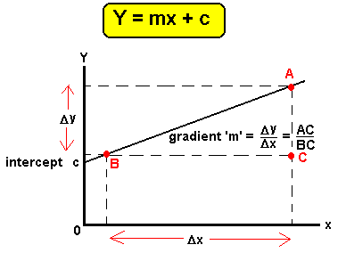

这个方程是线性回归的基础。现在，让我们从不同的角度来理解这个算法。

 [## 金融中的机器学习——数据驱动的投资者

### 在我们讲述一些机器学习金融应用之前，我们先来了解一下什么是机器学习。机器…

www.datadriveninvestor.com](https://www.datadriveninvestor.com/2019/02/08/machine-learning-in-finance/) 

核心思想是获得最适合数据的线。最佳拟合线是总预测误差(所有数据点)尽可能小的线。误差是点到回归线的距离。

线性回归的样本数据集如下。(*森林火灾面积(Y)对温度(X)* )

> [https://github . com/ashukrishna 100/Machine-Learning-Algorithms/blob/master/forest fires . CSV](https://github.com/ashukrishna100/Machine-Learning-Algorithms/blob/master/forestfires.csv)

1.  **加载数据**

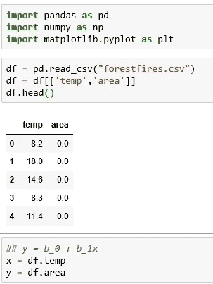

**2。将数据可视化**

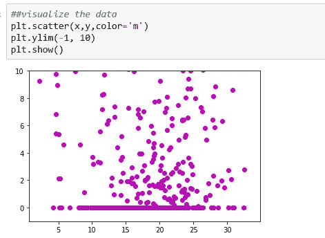

看起来像一个稳定的图表。让我们应用线性回归

**3。计算系数(斜率和截距)**

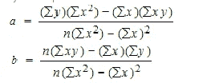

**The equation is of the form: y= a+bx**

有两种方法可以计算斜率和截距——一种使用上面的公式，另一种使用相关性和标准差。

让我们从第一种方法开始:

第二种方法使用相关性和标准差

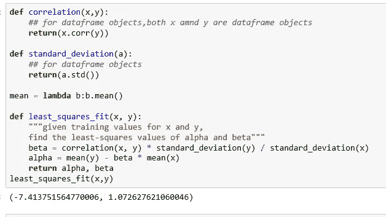

**4。计算预测值( *mx + c* )**

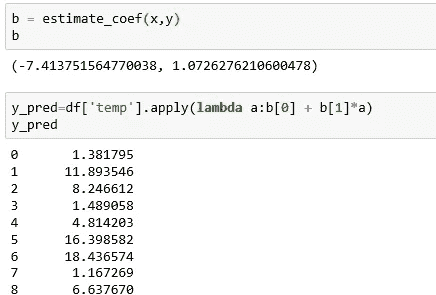

**5。可视化预测输出(面积)与 x(温度)的关系:**

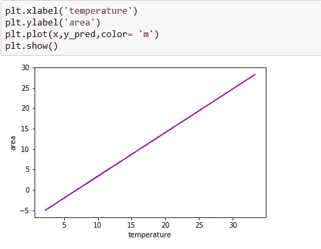

**6。使用 SKlearn 线性回归模型:**

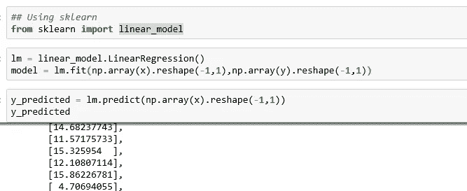

可视化图表(y _ 预测值对 x(温度)):

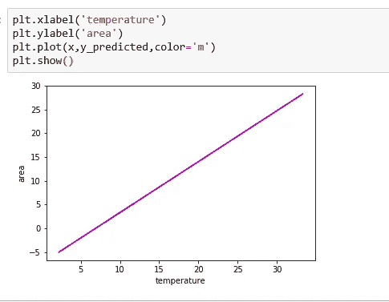

## 验证简单线性回归模型/回归模型的性能

1.  **决定系数**

**决定系数**表示为 *R^* 2 或 *r^* 2，读作“r 的平方”，是自变量中可预测的因变量方差的比例。

> r2 分数越高，模型越好

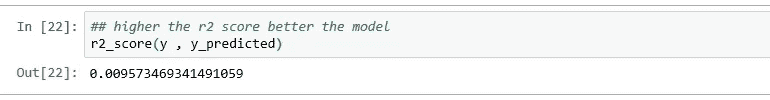

**2。均方根误差(RMSE)** :

均方根误差(RMSE)是残差(预测误差)的标准偏差。残差是数据点离回归线有多远的度量；RMSE 是对这些残差分布程度的一种度量。换句话说，它告诉你数据在最佳拟合线周围的集中程度。

> RMSE 越小，模型越好

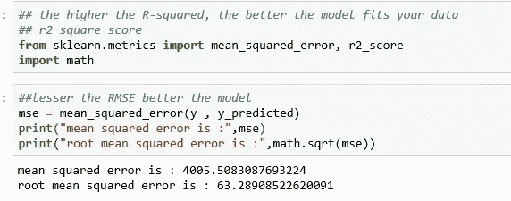

# 使用梯度下降的线性回归；

y = mx + c

损失就是我们预测值 **m** 和 **c** 的误差。我们的目标是将这一误差降至最低，以获得最准确的 **m** 和 **c.** 值

梯度下降法是一种寻找函数(这里是损失函数)最小值的迭代优化算法。

想象一个山谷和一个没有方向感的人想要到达谷底。他走下斜坡，在斜坡陡的时候迈大步，在斜坡不那么陡的时候迈小步。他根据当前位置决定下一个位置，当他到达他的目标山谷底部时停下来。

逐步对 **m** 和 **c** 应用梯度下降法；

第一步:最初让 m = 0，c = 0。设 L 为我们的学习率。这控制了 **m** 的值随着每一步变化的程度。l 可以是一个小值，如 0.0001，以获得良好的精度

第二步:计算损失函数对 m 和 w . r . t . c 的偏导数，即 **D_m** 和 **D_c**

公式如下

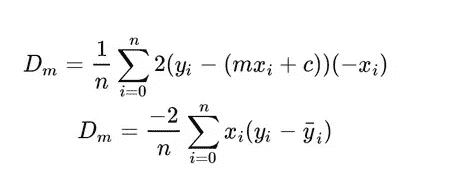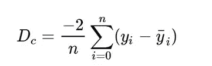

第三步:现在我们使用下面的等式更新 m 和 c 的当前值

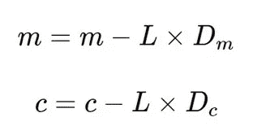

第四步:我们重复这个过程，直到我们的损失函数是一个非常小的值或理想的 0(这意味着 0 误差或 100%的准确性)。我们现在剩下的 **m** 和 **c** 的值将是最佳值

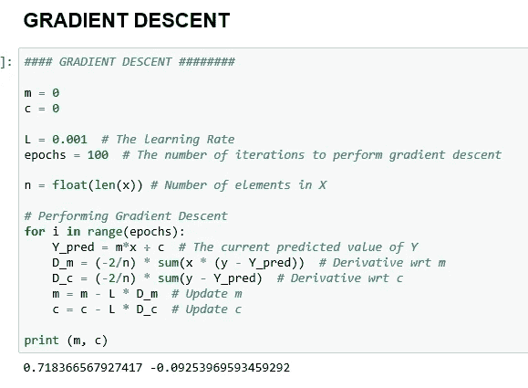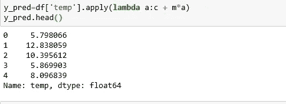

想象和评估

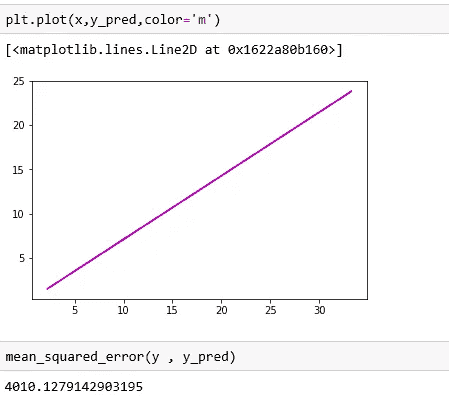

# 多变量回归

多元线性回归试图通过将线性方程与观察到的数据相拟合来模拟两个或更多解释变量与响应变量之间的关系。自变量 *x* 的每个值都与因变量 *y* 的一个值相关联。

假设每个输入 xi 不是一个单一的数字，而是 k 个成员 xi1，…，xik 的向量。多元回归模型假设:

> *y i = α + β1 xi1 +。。。+ βk xik + ε i*

让我们把 FFMC、DMC、DC、ISI、temp、RH、风、雨作为影响“区域”的独立变量。

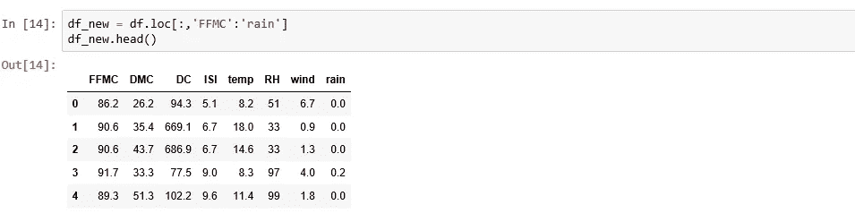

应用模型

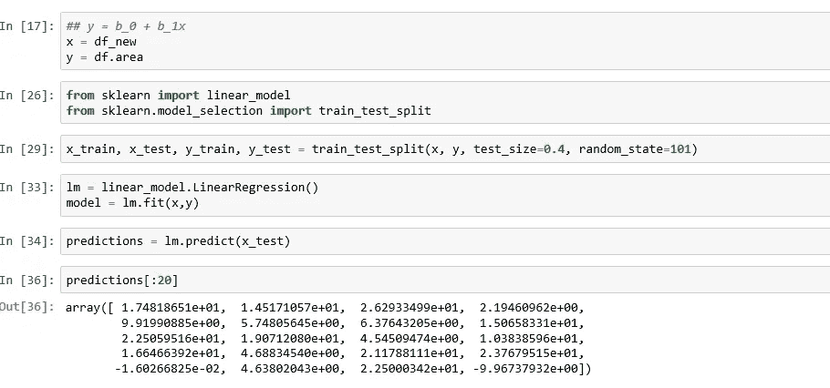

设想

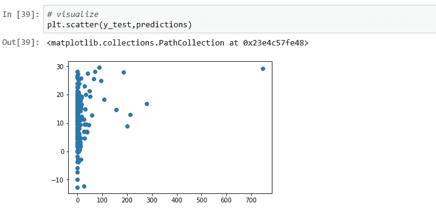

检查性能

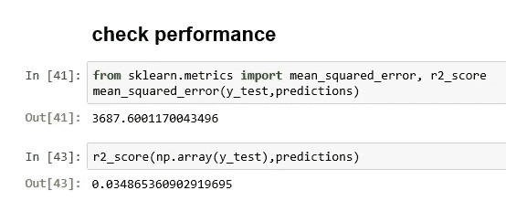

在接下来的部分，我们将挖掘更多其他类型的回归，如多项式回归，套索和岭回归和逻辑回归。

Github 回购:

> [https://github . com/ashukrishna 100/机器学习算法](https://github.com/ashukrishna100/Machine-Learning-Algorithms)