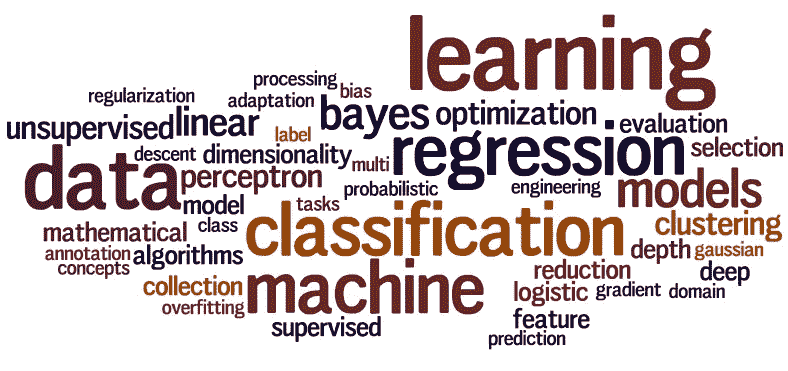

# 机器学习:综述

> 原文：<https://medium.datadriveninvestor.com/machine-learning-an-overview-fbf1c7ad698d?source=collection_archive---------10----------------------->

Source: [https://cmci.colorado.edu/classes/INFO-4604/](https://cmci.colorado.edu/classes/INFO-4604/).

在数据时代，一个很常见的术语是机器学习(ML)。但是，事实上，机器学习意味着什么呢？这是为了什么？我能在哪里使用？在什么情况下？

数据和更多的数据是由人们通过他们的活动产生的。因此，这些数据可以提供各种有趣的见解，以支持日常活动。

 [## DDI 编辑推荐:5 本让你从新手变成专家的机器学习书籍|数据驱动…

### 机器学习行业的蓬勃发展重新引起了人们对人工智能的兴趣

www.datadriveninvestor.com](https://www.datadriveninvestor.com/2019/03/03/editors-pick-5-machine-learning-books/) 

正是在这个意义上，ML 可以被用作达到这一目的的手段。因此，一些与 ML 相关的主题将在接下来的主题中讨论。

## 关于 ML 的定义和简史

人工智能(AI)被理解为计算机科学的一个领域，旨在理解和模拟人类行为并构建智能实体。因此，ML 是使用人工智能技术来自动化和解决日常问题，并允许从数据中提取知识。此外，它是统计学、人工智能和计算机科学的交叉研究领域，被称为预测分析或统计学习。

AI 和 ML 虽然在崛起，但并不新鲜。第一个作品，现在被认为是人工智能，是由沃伦麦卡洛克和沃尔特皮茨(1943 年)完成的。这些研究人员提出了一个人工神经元的模型，其中每个神经元的特征是“开”或“关”，响应足够数量的相邻神经元的模拟而切换到“开”。

第二次世界大战后，人工智能在 1950 年左右重新崛起，它的名字是在 1956 年创造的。阿瑟·李·塞缪尔斯(Arthur Lee Samuels)——IBM 的一名研究人员——开发了最早的机器学习程序之一——一个玩跳棋的自学程序。事实上，这是机器学习这个术语第一次被定义。他的 ML 方法发表在 1959 年的《IBM 研究与发展杂志》上。

然而，在 1966 年至 1973 年之间，第一批 IA 系统在用于更复杂的问题时灾难性地失败了，导致 AI 研究人员的“失望”和区域研究基金的关闭。

在离开“抑郁症之谷”之后，几十年来，人工智能技术已经被广泛用作提高底层代码性能的工具。在过去的几年里，随着对分布式计算模型和更便宜的计算和存储的关注，对人工智能和人工智能的兴趣激增，导致大量资金投资于软件开发初创公司。

## 机器学习的应用

近年来，最大似然法的应用在日常生活中变得很普遍。因此，ML 可以应用于各种环境，例如:

*   **文档/文本分类:**确定文档或文本是否属于特定主题；垃圾邮件检测；将内容分为“合适”或“不合适”。
*   **计算视觉:**物体的识别与识别；光学字符识别(OCR)；面部识别；除其他外。
*   **生物信息学:**蛋白质功能预测；基因和
    蛋白质网络分析。
*   **其他应用:**信用卡欺诈检测；机器人技术；推荐系统；搜索引擎；情感分析；假新闻的检测；信息提取系统；除其他外。

## 机器学习的方法

有各种各样的场景可以使用 ML 技术。这些场景在数据类型和数据量方面有所不同。它们是:

*   **监督学习:**模型接收一组带标签的例子作为训练数据。在“学习”或“拟合”训练数据后，模型将对未标记的数据集(测试数据)进行预测。对于这种类型的方法，最常见的技术是分类和回归。一个常见的应用示例是垃圾邮件检测。
*   **无监督学习:**模型接收一组未标记的数据，基于数据的内在特征，在这些数据下进行预测。最常见的技术是聚类和降维。
*   **半监督学习:**模型接收带有标记和未标记数据的样本作为训练集。拟合模型后，它将对新的未标记数据进行预测。这种方法常见于未标记数据易于获取，但标签获取成本较高的情况。
*   **在线/进化学习:**这种方法适用于数据流，并且通常训练和测试阶段是并行执行的。另一个有趣的事实是没有数据分布的假设，即模型本身只适合数据特征，并不试图在数据集上强加统计分布。
*   **强化学习:**它被认为是一种行为学习模型，系统通过试错进行学习。该模型接收来自数据分析的反馈，因此用户被引导到最佳结果。这样的场景广泛应用于机器人和智能汽车。

## 深度学习和神经网络

深度学习(DP)是一种特定的 ML 技术，它在连续的层中结合了神经网络，以便以迭代的形式从数据中学习。换句话说，它使用分层神经网络从几个无监督和有监督的算法中学习。此外，复杂的神经网络——也称为 DP——旨在模拟人脑的工作方式。因此，计算机可以被训练处理更高和更多层次的抽象。

深度学习通常被称为 ML 的子学科，当我们试图从非结构化数据(例如，文本和图像)中学习模式时，它特别有用。此外，神经网络和深度学习经常用于图像识别、语音、自然语言处理(NLP)和计算机视觉应用。

神经网络由三层或更多层组成:输入层、一个或多个隐藏层以及输出层。数据由输入层插入。接下来，根据应用于这些节点的权重，在隐藏层修改数据，最后在输出层修改数据。常见的神经网络可能由数千甚至数百万个密集互连的简单处理节点组成。

当神经网络中有多个隐藏层时，使用术语深度学习。使用迭代方法，神经网络不断调整和进行推理，直到达到特定的停止点。通常，DP 会有更多的隐藏层。问题越复杂，模型中的隐藏层就越多。

## 参考

Russell，S. J .，& Norvig，P. (2016 年)。人工智能:一种现代方法。马来西亚；培生教育有限公司。

Hurwitz 和 d . Kirsch(2018 年)。**假人的机器学习**。 *IBM 限量版*， *75* 。

Mohri、a . Rostamizadeh 和 a . Talwalkar(2018 年)。**机器学习基础**。麻省理工出版社。

米勒和圭多(2016 年)。**Python 机器学习简介:数据科学家指南**。奥莱利媒体公司。

m . kubat(2017 年)。**机器学习入门**(下册)。瑞士查姆:施普林格国际出版公司。