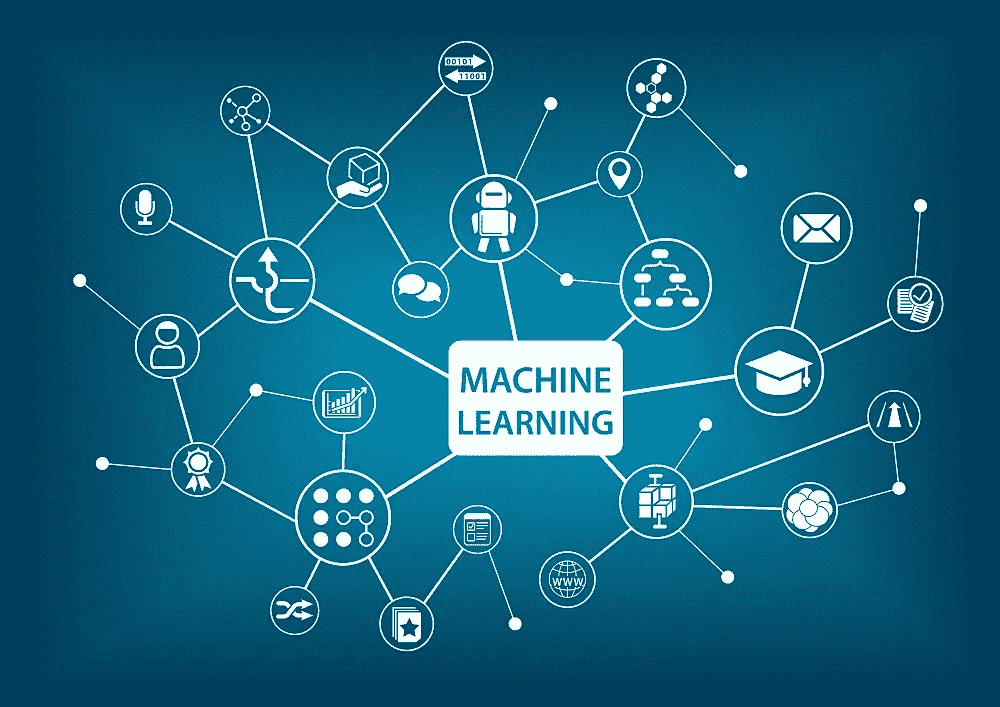

# 机器学习和区块链的共生关系

> 原文：<https://medium.datadriveninvestor.com/machine-learning-and-blockchains-symbiotic-relationship-db5dcf2e4a80?source=collection_archive---------7----------------------->

借助区块链技术革命的翅膀，机器学习正被推向未来。从贸易机器人，到保险承保，再到将数据共享放回消费者手中，机器学习和区块链正被放在一起，以改变世界各地的行业。

各种技能水平的投资者都非常需要基于机器学习的交易机器人。建立在区块链基础上的 P2P 贷款公司正在抵押贷款，并在贷款行业内改造自动化和技术。

保险承保也是区块链公司的另一个潜在用途。使用从算法中收集的数据，以及精算和政策信息，未来的保险公司将能够以透明的方式在公共总账上自动进行风险评估。

除了保险承保之外，将区块链衍生的数据实施到基于机器的学习中的进一步使用可以将数据模式识别推向 22 世纪。

从一个看似道德正义的角度来看，区块链也可能让人们将数据共享重新置于他们的控制之下。鉴于脸书剑桥分析公司的丑闻，这对消费者来说尤其重要，脸书自 2015 年就知道这件事。由于大规模侵犯隐私，随着民事和联邦诉讼的提起，消费者数据及其相关流程将受到审查。机器学习可以实现用户的自控数据共享。

脸书不再向剑桥分析公司提供数据，用户可能能够分发自己的数据，例如计算旅行时间的地图应用程序，或者涉及食物偏好的调查。

正如 Hackernoon 中所指出的，需求管理将允许数据可见性更少分割，因此变得更加集中。通过这种方式，区块链提供了一次汇集大量数据的途径，而不是使用太小且依赖猜测的非代表性样本量。这一过程停止了过去低层次统计模型的低效猜测工作。

由于区块链相关技术将提高供应链信息系统的效率，机器学习有可能根据可用性和位置来确定产品需求。供应链系统的透明性将提供持续的实时业务系统信息流，如库存和制造商供应。

机器学习正在被区块链推向未来，就像区块链正在被机器学习推广一样。虽然具体情况还不确定，但有一点是肯定的。基于这两项技术的革命，未来将会完全不同。

来源:

[https://www . quora . com/Is-there-a-link-If-not-how-can-relate-in-future](https://www.quora.com/Is-there-a-link-between-blockchain-and-machine-learning-If-not-how-could-they-relate-in-the-future)

[https://hacker noon . com/heres-how-IOT-区块链-和机器学习-正在合作-认真-创新-供应-e11ae76f9e8f](https://hackernoon.com/heres-how-iot-blockchain-and-machine-learning-are-working-together-to-seriously-innovate-supply-e11ae76f9e8f)