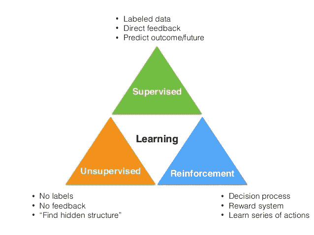
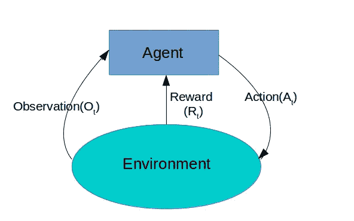

# 机器学习和技术

> 原文：<https://medium.datadriveninvestor.com/machine-learning-and-techniques-dd570c844330?source=collection_archive---------7----------------------->

***ML*** 是 *AI* 的一个应用，它为系统提供了自动
学习和改进的能力，而无需显式编程。人工智能旨在通过赋予机器独立思考、做出决策或模仿人类活动的能力，使机器更加智能，人们可以将人工智能视为人工智能的一个子集。

它专注于开发可以访问数据并利用数据进行自我学习的计算机程序。学习过程始于对数据、经验或指令的观察，这一过程有助于在数据中寻找模式，并在未来做出更好的决策。

*应用* : 1。可以进一步与各种平台集成的个人数字助理。

2.训练计算机在视频监控过程中工作，跟踪人们的不当行为，比如长时间一动不动，跌跌撞撞，等等

3.分析和纠正电子邮件垃圾。

还有更多的应用，将涵盖它下次。

# ML 技术:

[https://www.saagie.com/blog/machine-learning-for-grandmas/](https://www.saagie.com/blog/machine-learning-for-grandmas/)

*监督学习:*训练数据集包含输入数据和我们想要预测的值。

该模型使用训练数据来建立输入和输出之间的联系。训练数据可以被一般化，并且该模型可以以一定的准确度用于新数据。

监督学习下的算法有朴素贝叶斯、梯度推进、神经网络。

它通常用于图像识别、语音识别，有时也用于金融分析。

*无监督学习:*不使用输出数据，可以拆分成不同的类别。

1.  可用于降低维数的算法，如 PCA、LCA、自动编码器。
2.  检测不符合数据集模式的观察值。
3.  聚类算法，如 K 均值，混合模型。他们试图将观察结果分成不同的组。

这种学习主要用于预处理数据，或预训练监督学习算法。

*强化学习:*这些算法可以被视为获得最大回报的最佳可能方式。奖励可以是任何东西，从赚钱，赢得一场比赛或击败对手。

这种学习方法遵循各种步骤，如模型(代理)将根据环境状态选择行动以最大化回报。这些操作将改变模型和环境的状态。他们可能被解释为奖励模型。通过执行这个循环，模型的行为将会得到改善，我们的模型的准确性肯定会有所提高。

它在一个小型动态系统上表现良好，并且在未来几年肯定会继续下去。