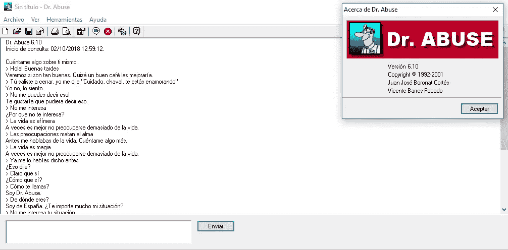
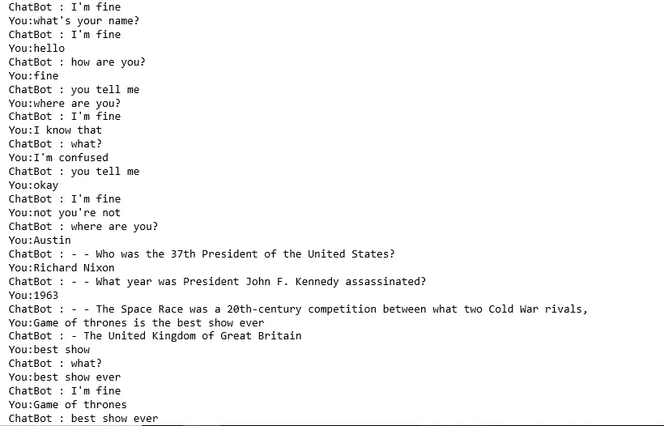

# 机器学习和第一次接近聊天机器人…机械战警和那个科学家工具包是我童年的珍宝！

> 原文：<https://medium.datadriveninvestor.com/machine-learning-and-the-first-approach-to-chatbots-robocop-and-that-scientist-kit-are-my-childhood-f025d0eab83e?source=collection_archive---------33----------------------->

我记得 2000 年初的一个项目引起了我的好奇心。它的名字叫虐待博士，是一个展示人类外表的人工智能(AI)程序，基于约瑟夫·韦岑鲍姆(Joseph Weizenbaum)著名的伊莱扎程序。它允许与计算机保持有趣和智能的对话。

我发现和电脑聊天并得到有趣的回应非常有趣。到那个时候，我还没有意识到它是如何工作的。但现在，我知道虐待博士已经通过互联网和其他媒体与人类或机器人用户进行了数百次对话。很有趣，对吧？因此，虐待博士一直是一个聊天机器人，一个可以通过实时聊天界面与人类交谈的软件。



计算机的能力是非常惊人的。人工智能的目的很简单:制造智能机器。还记得我看《机械战警》和《我与机器人》等科幻电影时的反应。机器会统治世界吗？

根据特斯拉联合创始人兼首席执行官埃隆·马斯克(Elon Musk)的说法，人工智能(AI)很有可能会对人类构成威胁，埃隆担心少数几家大公司最终会控制具有“极端”权力水平的人工智能系统(摘自独立文章:“人工智能很有可能摧毁人类，埃隆·马斯克警告”)。

但是，什么是机器学习，它与人工智能有什么关系？

机器学习是一种自动建立分析模型的数据分析方法。它是人工智能的一个分支，基于系统可以从数据中学习，识别模式并在最少的人工干预下做出决策的想法。

许多行业都在使用机器学习，如医疗保健、市场营销、政府、金融服务、交通运输等。公司能够更有效地工作，或者获得超过竞争对手的优势。

如今，聊天机器人正在改变客户体验，改变品牌与客户互动的方式。大公司已经在使用聊天机器人，比如星巴克、优步、Lyft、Spotify、万事达卡、全食超市、丝芙兰、CNN、H&M、耐克等等。

这是一段很棒的 Python 代码，用来创建聊天机器人。我们将使用一个文件来训练聊天机器人(Chatterbot corpus):

我在用 Jupyter 笔记本运行代码。

导入库、模块和类来创建聊天机器人:

```
**#Import ChatterBot,the Python library to generate automated** responses to a user’s input**. Download the package here:** [https://chatterbot.readthedocs.io/en/stable/setup.html](https://chatterbot.readthedocs.io/en/stable/setup.html)from chatterbot import ChatBot**#Import ListTrainer class, which allows a chatbot to be trained using a list of strings where the list represents a conversation**from chatterbot.trainers import ListTrainer**#Import os module for file, directory, and path manipulations**
import os
```

训练聊天机器人的过程:

```
**#Define a bot**bot=ChatBot('Bot')**#Set the trainer to train the bot, we are using the ListTrainer class in the set_trainer method**bot.set_trainer(ListTrainer)**#Loading the file: Chatterbot corpus, a machine readable multilingual dialog corpus. This module is used to quickly train ChatterBot to respond to various inputs in different languages. We are using os module to access to directory where the chatterbot corpus is located.**for files in os.listdir('C:/Users/VIRID/Anaconda/chatterbot-corpus-1.1.2.tar/dist/chatterbot-corpus-1.1.2/chatterbot_corpus/data/english/'):**#Open the data (We will use same path), and we will use readlines() method to read the data**     data=open('C:/Users/VIRID/Anaconda/chatterbot-corpus-1.1.2.tar/dist/chatterbot-corpus-1.1.2/chatterbot_corpus/data/english/'+files,'r').readlines()**#Training the bot with the data loaded in the script**bot.train(data)
```

使用 input 和 get_response 函数控制消息的条件:

```
#While the training is completed, we need to give inputs from the user, by using input function. The reply will be from the bot using get_response. We will print the reply from the bot. If the user's input is a 'Bye', then the bot finishes the chat. If the user's input is different from Bye, then the bot will keep the conversation going on.while True:
 message=input('You:')
 if message.strip()!= 'Bye':
 reply=bot.get_response(message)
 print('ChatBot :', reply)

 if message.strip()== 'Bye':
 print('ChatBot:Bye')
 break
```

这是结果:



这太棒了！如你所见，我需要更好地训练这个聊天机器人。但是如上所述，你可以得到这个聊天机器人语料库，它仍然有助于建立一个新的数据库，并使机器人能够产生的各种响应更加多样化。

聊天机器人看似聪明，其实不然。它们具有适应性和预测性。这取决于用户的输入，如果语句巧妙，聊天机器人的行为会相应地进化。