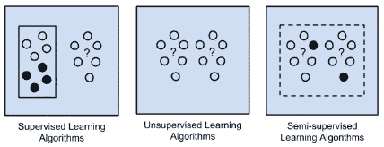
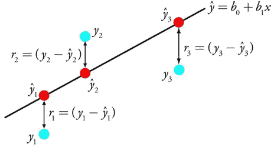
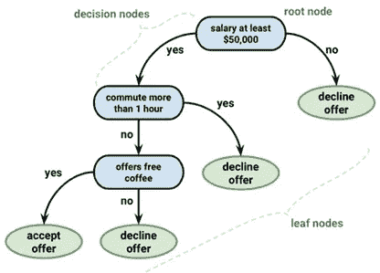
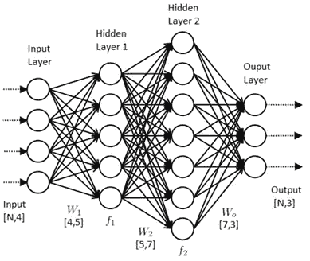
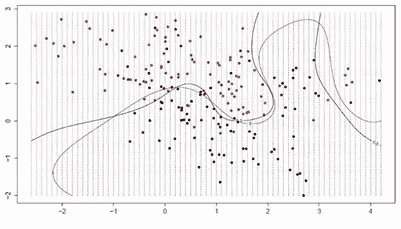

# 机器学习方法及其应用

> 原文：<https://medium.datadriveninvestor.com/machine-learning-approaches-and-its-applications-7bfbe782f4a8?source=collection_archive---------0----------------------->

在我的上一篇博客中，我们讨论了机器学习的基本和科学定义，我们也试图从一个非技术人员的角度来理解机器学习(人工智能)。在这篇博客中，我们将深入一点，了解机器学习的各种算法，最重要的是如何决定哪种算法对某一组问题更好。就像我在之前关于人工智能的博客中所说的，这不是一门新的科学，但它已经获得了新的动力。

我们可以根据问题陈述、与环境的交互以及数据和输入的类型来决定选择哪种机器学习方法/算法。但一般来说，我们可以将机器学习算法分为两组:1)学习算法和 2)相似性算法。相似性算法进一步用作基于问题环境类型的学习模型。

 [## 挑战你对人工智能和社会看法的 4 本书|数据驱动的投资者

### 深度学习、像人类一样思考的机器人、人工智能、神经网络——这些技术引发了…

www.datadriveninvestor.com](https://www.datadriveninvestor.com/2019/02/28/4-books-on-ai/) 

**一、学习算法**
学习算法是 AI 中最流行、最基础的算法。他们能适应问题环境。如图 1 所示，我们将介绍一些主要的学习风格算法。

Learning Algorithms

**A .监督学习**

监督学习是学习一个适合问题的函数。这个函数获取一个输入(X)并将其映射到输出(Y)。如果我们用一个简单的方程来表示这个定义，那么它将是 Y = f(X)。所使用的数据集分为两组:训练数据集和测试/验证数据集。这种划分的比例各不相同，但大约是 2:8 (20%的训练数据和 80%的验证数据)。输入数据集被标注并用于为训练过程准备数学模型。数学模型进一步分析训练数据并产生推断函数。
监督学习问题可以进一步分为分类问题和回归问题。在分类问题中，输出被分类到特定的组中，而在回归问题中，输出是真实值。监督学习中最广泛使用的学习算法是支持向量机、线性回归、逻辑回归、朴素贝叶斯、决策树、K-最近邻和神经网络。我们将在相似性算法部分讨论其中的一些算法。

**B .无监督学习**
与有监督学习不同，在无监督学习中，输入数据集不被标记、分类或归类。数学模型尝试识别数据集中的相似性，并基于此尝试推断输入数据中存在的结构。无监督学习问题可以进一步分为聚类问题和关联问题。在聚类问题中，我们试图发现数据集中分组的内在联系，而在关联问题中，我们试图概括描述大部分数据集的规则。在无监督学习中最广泛使用的学习算法是 K-means、神经网络、线性判别分析、主成分分析和 Apriori 算法。

**C .半监督学习**
在半监督学习中，输入数据集是已标记数据和未标记数据的混合。通常，数据集有少量标记数据和大量未标记数据。数学模型使用标记数据来学习未标记数据的结构，并尝试进行预测。半监督学习问题还可以进一步分为分类和回归问题。

**二。相似性算法**
相似性算法按其功能的相似性分组。在本节中，我们将介绍一些最流行的机器学习算法。

**A .回归算法**
统计机器学习因为建模变量之间的关系而增选了回归方法。回归算法可以反复完善这些关系，以预测更好的结果。一些最基本和最流行的回归算法是线性回归和逻辑回归。

**一、线性回归**
过去 200 年一直使用线性回归。它被用来移除相关的变量。线性回归也可用于去除数据集中的噪声数据。线性回归的主要目标是最小化数学模型的误差，并使预测更准确。

Linear Regression

图 2 显示了线性回归的表示。给定输入 X，线性回归试图通过查找输入的权重来预测 Y。这里，系数 b0 和 b1 是输入变量 X 的权重，r 是决定系数，其显示数据点有多接近回归线。

**二。Logistic 回归**
Logistic 回归主要用于二元分类问题。逻辑回归的目标是获得每个输入变量的权重，但输出是使用称为逻辑函数的非线性函数来预测的。当从数据集中删除相关数据点时，逻辑回归效果更好。

Logistic Regression

如图 3 所示，逻辑回归将任何值转换到 0 到 1 的范围内。这对于根据给定数据点属于类别 0 或类别 1 的概率对其进行分类非常有用。

**B .决策树算法**
该算法基于几个输入变量构建决策模型。决策是基于树结构中的属性和输入变量进行分叉的，如图 4 所示。决策树就像一棵二叉树，每个决策节点是一个单一的输入变量，该节点进一步分裂成叶节点或更多的决策节点。每个叶节点包含一个关于先前决策节点的输出变量。通过遍历分裂直到到达叶节点的决策树预测。

Classification and Regression Tree

分类回归树是最流行的决策树算法之一，也称为 CART。当决策树中的目标变量(叶节点)可以取一组离散的值时，它被称为分类树，当目标变量(叶节点)是连续的时，它被称为回归树。

**C .人工神经网络**人工神经网络(ANN)也被称为连接主义者系统。ANN 的灵感来自于生物大脑的神经网络。人工神经网络是各种机器学习算法的框架，这些算法协同工作来处理复杂的数据集。如图 5 所示，每个人工神经网络可以分为三层:输入层，隐藏层和输出层。隐藏层可以有多个层。每一层都是被称为人工神经元的节点的集合。每个人工神经元连接到下一层中存在的人工神经元。这些神经元之间的连接称为边。这些边缘将信息作为信号从一个神经元传输到另一个神经元，然后一个神经元处理信息并将其传递给下一个神经元。

Artificial Neural Network

边也有权重来控制(增加或减少)特定连接处的信号强度。神经元通过输入信号之和的非线性函数来计算输出。
深度学习也是一种人工神经网络。这是 ann 上的更新版本。在深度学习中，整个神经网络本身非常庞大和复杂，具有多个隐藏层。一些最受欢迎的人工神经网络和深度学习算法是感知器、反向传播、深度波尔兹曼机器(DBM)和卷积神经网络(CNN)。

**D .支持向量机**
支持向量机(SVM)与监督学习方法相关，用于分类和回归。在训练数据集中，每个数据点都被标记为属于类 0 还是类 1。然后，SVM 根据训练数据集训练一个模型，以预测新数据点属于 0 类还是 1 类。

Support Vector Machine

输入变量被超平面分割。为了分离所有的数据点，SVM 试图找到一个最佳系数，可以根据超平面的分类来分离所有的数据点。最近的数据点和超平面之间的距离被称为边缘；边缘越大，超平面越优。定义这个超平面的点称为支持向量。

**三世。强化学习**
强化学习是机器学习的一个专门子领域，被称为近似动态规划或神经动态规划。学习与代理人有关，代理人在环境中采取某种行动以最大化累积报酬。在强化学习中，环境用马尔可夫决策过程(MDP)来表示。学习算法通过不假设数学模型的预定知识，试图将模型不可行的大型 MDP 作为目标。

强化学习可以用一个孩子在客厅的简单例子来理解。一个小孩看到一个壁炉，试图靠近那堆火。很温暖，很积极，孩子感觉很好(积极奖励+1)。孩子明白火是一种积极的东西。但当孩子试图触摸那团火时，它会烧伤孩子的手(负奖励-1)。孩子只是明白，火在足够远的地方是好东西，但不要太近。这就是强化学习从一系列动作中学习的方式。

# **机器学习应用分析**

在过去的 5 年中，机器学习的应用呈指数级增长，并且在未来将继续增长。了解不同方法以及何时使用哪种方法的最佳方式是查看不同的应用程序，这就是我们在这里要做的事情。我们已经开始将虚拟个人助理融入我们的日常生活。我们都有配有个人助理的智能手机。苹果有 Siri，亚马逊有 Alexa，谷歌有 Google Now，三星有 Bixby。这个个人助理使用不同的机器学习方法。Google Now 正在将强化学习用于搜索优化，将自然语言处理用于语音识别。其他个人助理使用隐马尔可夫模型或人工神经网络。有时经典技术如朴素贝叶斯和支持向量机也被用来建立个人助理。所有这些技术/方法都有一个相似的目标，即收集尽可能多的信息，并根据先前的偏好对其进行提炼。

谷歌地图可能是目前使用最多的应用程序。谷歌地图使用一种叫做时间差异学习的机器学习方法来找到可能的最快路线。时间差异学习是一种强化学习，它使用自举来估计模型函数的值。

10 年前，垃圾邮件和恶意软件是我们头疼的问题，但机器学习的进步使得对它们进行分类变得很容易。垃圾邮件过滤器由机器学习驱动，不断更新以使其更加可靠。大多数垃圾邮件过滤器使用多层感知器网络和 C4.5 决策树归纳技术。然而，为了检测恶意软件，已经使用了各种机器学习模型来识别代码中的编码模式。一些常见的方法有决策树、线性回归、随机森林、Adaboost、高斯朴素贝叶斯和梯度推进。

机器学习在网络安全和在线欺诈检测中发挥着重要作用。由于越来越多的在线货币欺诈，像 PayPal 这样的公司已经开始使用机器学习技术来防止洗钱。欺诈检测模型的预测问题可以分为两类:分类和回归。对于这种类型的预测问题，一些最常用的机器学习方法是逻辑回归、决策树、随机森林树和神经网络。

我们正在迅速转向自动化，包括机器自动化和无人驾驶汽车。自动驾驶汽车使用几种机器学习算法，使其决策更加可靠和可信。为了制造自主车辆，机器学习算法根据子任务分为不同的类别，这些子任务是对象检测、已识别对象的分类和对象定位及其运动预测。像 AdaBoost 和决策树矩阵这样的算法用于识别不同的对象，像 k-means 这样的聚类算法用于对相似的对象进行分组，像模式识别、支持向量机和神经网络回归这样的算法用于运动预测。

**结论**

因此，我们已经讨论了一些最基本和最常用的机器学习算法，但请耐心等待，我们只是触及了表面。

Types of Machine Learning Algorithms

机器学习有 60+以上的算法，可以基于不同的问题环境来使用。在这篇博客中，我们回顾了一些最常用和最流行的机器学习算法及其应用。但是我们如何选择最佳的机器算法/方法，我们如何分辨算法和问题环境之间的映射。答案是“无”和“全部”。没有最好的机器学习算法。一些算法在自调整、非参数或适应性方面是强大的，但是以大量参数系数、大数据集和有限的可扩展性为代价，这导致结果过拟合。我们应该应用与问题环境相关的各种算法，而不是寻找最佳算法。我们根本没有办法提前知道哪种算法对于特定的问题是完美的。我们可以尝试将算法映射到问题的类别，例如，监督学习算法可以映射到分类和回归问题，而无监督学习算法可以映射到聚类和流形学习问题。

我们可以得出结论，数据驱动的方法更适合于决定使用哪种算法。我们应该熟悉数据集；数据集的噪音有多大，数据集中存在的各种数据点是什么，数据集将以何种方式影响问题环境。基于此，我们可以尝试几种与特定数据集和问题相关的机器学习算法。我们可以尝试不同参数的组合，而不是选择一个共同的参数，并强调更健壮和性能更好的算法。数据驱动是一种强大的方法，它需要较少的前期知识，但需要更多的后端实验和计算。由于在一个小数据集上的实验，它是鲁棒和快速的，然后可以在整个数据集上实现。

**参考文献**

图灵，A. M. (2009)。计算机器和智能。在*解析图灵测试*(第 23–65 页)。斯普林格，多德雷赫特。

 [## 机器学习算法之旅

### 在这篇文章中，我们将浏览最流行的机器学习算法。游览主要景点是很有用的。

machinelearningmastery.com](https://machinelearningmastery.com/a-tour-of-machine-learning-algorithms/) 

**上一篇博客:** [到底什么是机器学习？？](https://medium.com/datadriveninvestor/what-exactly-is-machine-learning-6033c63dcbf4)