# 机器学习基础:第 1 部分

> 原文：<https://medium.datadriveninvestor.com/machine-learning-basics-part-1-361eb09418b5?source=collection_archive---------5----------------------->

你是初学者吗？如果你想学习基础知识并在人工智能方面出类拔萃，这是一个正确的起点。在这个和即将到来的教程中，我将从基础开始，直到高级水平。学习要有耐心，因为这不是一天就能学会的。

学习 ML 基础知识时，您可以参考的在线教程和书籍:

1.  安德鲁恩[https://www.coursera.org/learn/machine-learning](https://www.coursera.org/learn/machine-learning)的机器学习课程
2.  麻省理工学院-深度学习-图书【https://github.com/janishar/mit-deep-learning-book-pdf】T2 进行统计分析
3.  关于基于 python 的实现，请参考弗朗索瓦·乔莱【https://www.manning.com/books/deep-learning-with-python[的《Python 深度学习》](https://www.manning.com/books/deep-learning-with-python)

**数据科学:** 数据科学是从大量结构化或非结构化
数据中提取知识

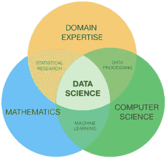

Data Science venn diagram

1 的交集。数学&统计学
2。领域体验
3。数据工程
4。计算能力
5。形象化

> “机器学习理论是一个交叉了统计学、概率学、计算机科学和算法方面的领域，产生于从数据中迭代学习和发现可用于构建智能应用的隐藏见解”

**数据科学生命周期:**

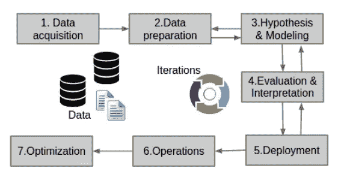

Data science Life cycle

数据科学生命周期:

1.  数据采集
2.  数据准备
3.  假设和建模
4.  评估和解释
5.  部署
6.  操作
7.  最佳化

**数据科学解决方案开发:**
1。商务问题的表述

2.将业务问题映射为技术问题

3.为答案设置可接受的性能/准确性参数[%]

4.数据可用性的确定[需要什么数据]

5.初步验证:数据是否可用于回答业务问题？

6.确定目标环境
a .开发
b .生产/部署

7.数据来源/获取

8.数据准备
a .数据清洗
b .数据转换/特征提取
c .数据采样和划分

9.数据探索与理解
a .数据可视化
b .数据统计
c .数据对账
d .数据预处理

10.设计解决方案架构数据科学解决方案开发

11.确定合适的 ML 算法:
为解决方案组件选择相关的建模技术
a .使用每种选择的技术执行建模/分析
b .性能的评估和比较
I .将训练好的模型应用于测试数据
II .分析结果
c .选择和/或组合最佳表现模式

12.通过整合组件来构建解决方案

13.分析并验证解决方案

14.用商业语言翻译输出

15.创建业务用户能够理解的可视化和/或数据产品(例如仪表板)

**什么是机器学习？** 研究领域，给予计算机无需明确编程就能学习的能力

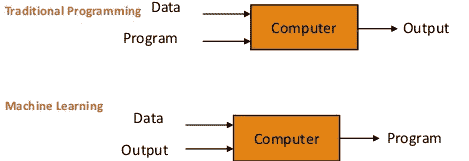

> “机器学习是对算法的研究，通过经验来提高它们在某些任务中的性能。使用示例数据或过去的经验优化绩效标准。”

广义而言，ML 分为四类:

1.  监督学习:将输入数据映射到已知目标
2.  无监督学习:在没有目标帮助的情况下寻找输入数据的变换。
3.  自我监督学习:训练数据包括很少的期望输出
4.  强化学习:从一系列行动或自身环境中获得奖励

在本教程中，我们主要关注的是**监督的**和**非监督的**学习

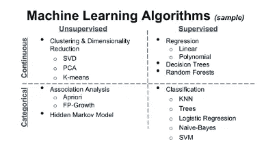

ML algorithms

## 监督学习:

> **“线性回归**:回归是一种建模和分析变量之间关系的技术，线性回归模型完全由线性变量组成。从简单的单变量开始。”

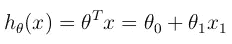

Simple linear model

线性回归的目标是最小化成本函数

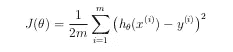

回想一下，模型的参数是θ j 值。这些是
您将调整以最小化成本 J(θ)的值。一种方法是
使用批量梯度下降算法。在批量梯度下降中，每次
迭代执行更新

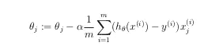

**逻辑回归:** 逻辑回归假设可以给出为

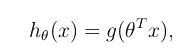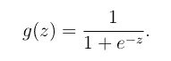

sigmoid function

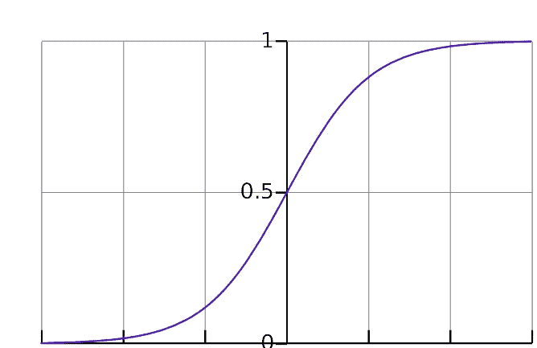

由于我们试图预测类值，因此不能使用线性回归算法中使用的相同成本函数。因此，我们使用对数损失函数来计算错误分类的成本。

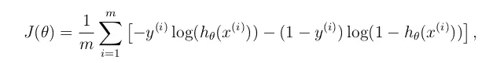

逻辑回归用于分类任务。例如，对电子邮件是否是垃圾邮件进行分类、对肿瘤是恶性还是良性进行分类、对网站是否是欺诈性的进行分类等。

**决策树:** 一棵树在现实生活中有很多类比，事实证明它影响了**机器学习**的广泛领域，涵盖了**分类和回归。顾名思义，它使用树状决策模型。**

> *“决策树是这样一种树，其中每个节点代表一个特征(属性)，每个链接(分支)代表一个决策(规则)，每个叶子代表一个结果(分类值或连续值)。”*

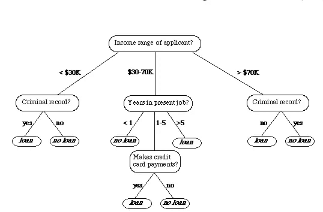

例如:如果我们对客户的银行贷款申请进行分类，决策树可能是这样的

在这里，我们可以看到它是如何做出决策的逻辑。

简单明了。

在本文中，我们讨论了一些与 ML 相关的基本概念，以及为什么 ML 在当今世界非常重要。在接下来的文章中，我将提出更多的基于分类任务的算法。在接下来的文章中，我们将探讨如何使用 python 实现模型，以及数据科学所需的一些 python 基础知识。

在此之前，请继续关注更多文章。如果你觉得有价值，请鼓掌分享，并跟我来

感谢大家抽出宝贵的时间【祝您愉快】。