# 机器学习基础:第二部分

> 原文：<https://medium.datadriveninvestor.com/machine-learning-basics-part2-f66c2bf309ae?source=collection_archive---------22----------------------->

在我的上一篇文章[机器学习基础部分-1](https://link.medium.com/H2ed9finaS) 中，我们看到了一些与 ML 相关的基础知识。在阅读本文之前，请仔细阅读。我们在讨论监督学习中的算法。我们将继续学习更多的算法

**随机森林:** 这种方法首先对数据进行随机抽样替换，并确定一组关键特征来生成每棵决策树。我们只使用一个随机子集，而不是使用所有的训练示例进行训练。

随机森林具有较低的偏差(就像单个决策树一样)，通过添加更多的树，我们减少了方差，从而减少了过度拟合。这里我们使用系综方法。集成方法背后的主要原理是通过组合几个弱学习者来成为强学习者。

有两个技巧:
1。装袋
2。助推

> Bagging 用于我们的目标是减少决策树的方差的地方。我们用替换的样本。我们最终得到不同模型的集合。来自几个决策树的所有预测的平均值将是稳健的，并且给出比单个决策树更好的性能

装袋的显著特点:

*   每个模型都是独立构建的
*   未加权投票
*   与单一模型相比，装袋改善了过度拟合问题

***随机森林*** 是套袋的延伸。这需要一个额外的步骤，除了获取数据的随机子集，还需要随机选择特征，而不是使用所有特征来生成树。当你有很多随机的树时。它叫做随机森林

> ***增强*** *是另一种创建预测值集合的集成技术。在这种技术中，学习者是顺序学习的，早期的学习者将简单的模型与数据拟合，然后分析数据的错误。换句话说，我们拟合连续的树(随机样本),并且在每一步，目标都是解决来自先前树的净误差。*

助推的显著特征:

*   将单棵树提升为强大的学习算法
*   自适应地改变训练数据的分布
*   用加权数据替换的随机抽样
*   估计值的加权平均值
*   与单一模型相比，增强改善了偏差
*   AdaBoost，GradientBoost 确定在下一个训练阶段/分类中选择的权重

**监督学习:**(分类)

**支持向量机(SVM) :**

> *“支持向量机(SVM)是由分离超平面正式定义的判别分类器。换句话说，给定带标签的训练数据(*监督学习*)，算法输出一个对新例子进行分类的最优超平面。在二维空间中，这个超平面是将一个平面分成两部分的线，其中每一类位于两侧*

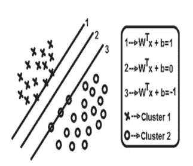

SVM illustration

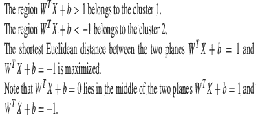

最小化 X ^ 1t X ^ 1，使得 W ^ T X ^ 1+b = 1。拉格朗日方程表述如下:

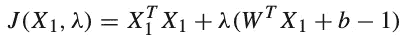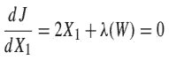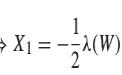

最小距离由下式给出:

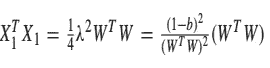

变得有点复杂:

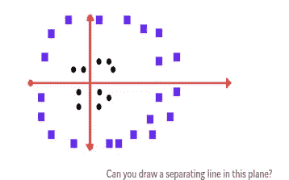

在这种情况下，我们不能画出任何一个分隔两个例子的线性最优超平面。所以我们应该用非线性变换，称为核。如果我们画一个圆形的边界，它清楚地分开两个例子。

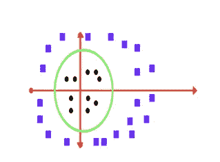

**支持向量机的优势:**

*   高精度，良好的过拟合理论保证
*   在非常高维的空间是标准的文本分类问题中特别流行。

**K 近邻(KNN) :** KNN 算法是最简单的分类算法之一，也是使用最多的学习算法之一。对于一个新的数据点，它将查看该点的 k 个最近邻居，并分配最频繁的标签

示例:新的数据点是绿点。当 k = 3 时，分配的标签将是红色的。当 k = 5 时，分配的标签将是蓝色的。

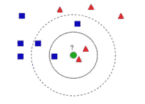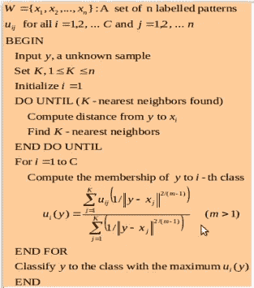

KNN algorithm

标记样本的已知类别成员资格
uij = XJ 属于类别 I 的程度

KNN 需要 k 值，它代表需要考虑的邻居数量

KNN 的显著特征:

*   没有关于数据的假设—例如，对非线性数据有用
*   简单的算法——解释和理解/诠释
*   高准确度(相对而言)—与监督更好的学习模型相比，准确度相当高，但没有竞争力
*   多功能-适用于分类或回归

**朴素贝叶斯:** 朴素贝叶斯是一种基于概率的分类器。它是基于贝叶斯定理和预测器之间的独立性假设。
贝叶斯定理的数学表述如下:

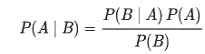

假设预测值(x)对给定类别 c 的影响
独立于其他预测值。这种假设被称为类条件独立性。

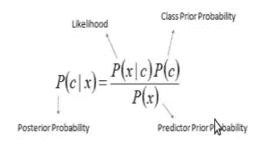

**例如:**

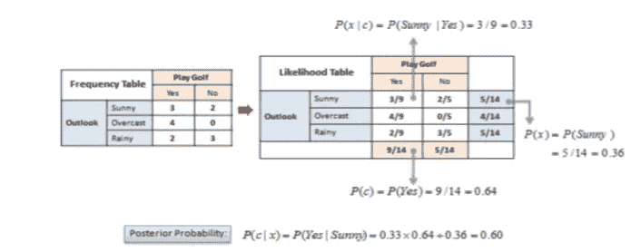

**朴素贝叶斯的优势**:

*   只是做一些计数。
*   朴素贝叶斯分类器比逻辑回归等判别模型收敛得更快，因此需要的训练数据更少。
*   它不能学习特征之间的相互作用

**评价措施分类:** 精度:

*   在检索到的所有项目中，有多少是相关的
*   它基于真阳性和假阳性。
*   它显示了有多少选择的项目实际上也是相关的。
*   真阳性(TP)是实际上正确的阳性猜测，而假阳性(FP)是不正确的阳性猜测

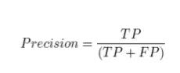

回忆:

*   从所有相关项目中检索到多少个相关项目
*   它基于真阳性和假阴性。
*   它显示选择了多少相关信息。
*   真阳性(TP)也是实际上正确的阳性猜测，而假阴性(FN)是本应是阳性的阴性猜测。

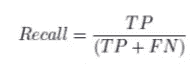

**混淆矩阵:**

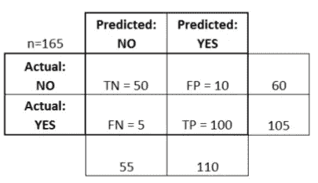

Confusion Matrix

*   准确性:总的来说，分类器正确的频率是多少？
    (TP+TN)/合计= (100+50)/165 = 0.91
*   错误分类率:总的来说，错误的频率是多少？
    (FP+FN)/total =(10+5)/165 = 0.09
    相当于 1 减精度也叫“错误率”
*   精确度:当它预测正确时，它的正确率是多少？
    TP/预测是= 100/110 = 0.91
*   敏感性或“回忆”:当它实际上是肯定的时候，它多久预测一次是？TP/实际是= 100/105 = 0.95
*   假阳性率:当它实际上是否定的时候，它多久预测一次
    是？FP/实际数量= 10/60 = 0.17
*   特异性:当它实际上是否定的时候，它预测否定的频率是多少？
    TN/实际 no = 50/60 = 0.83
    相当于 1 减去假阳性率

**何时使用哪种算法类型？**

*   要确定的参数:精确度、训练时间、线性、参数和特征的数量
*   两类分类:
    决策树，逻辑回归
*   多类分类:
    决策树、多类逻辑回归、神经网络
*   SVM 可以很好地处理大量的功能

如果你在选择算法时遇到困难，请通过[链接](https://azure.microsoft.com/en-in/documentation/articles/machine-learning-algorithm-cheat-sheet/)查找作弊代码

到目前为止，我们已经看到了各种回归和分类技术。我们已经讨论了几种算法。在下一篇文章中，我们将研究各种聚类算法。在接下来的文章中，我们将看到如何使用 python 为这些算法编写代码。敬请关注更多此类文章

如果你觉得这篇文章有价值，请鼓掌分享

快乐学习！