# 机器学习基础:支持向量机

> 原文：<https://medium.datadriveninvestor.com/machine-learning-basics-support-vector-machines-358235afb523?source=collection_archive---------6----------------------->

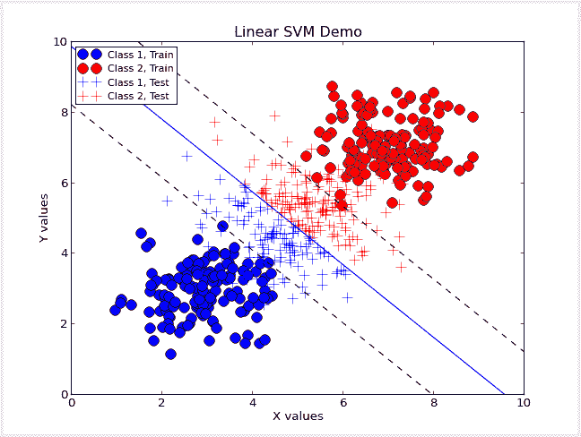

你可能会认为机器学习是人类最终已经掌握的最酷的技术之一。这是事实——然而，并非所有的机器学习都是“酷”和令人兴奋的，但理解这项技术的基础仍然很重要。

在这篇文章中，你将了解到我很久以前创建的第一个机器学习算法。它被称为支持向量机，或 SVM。

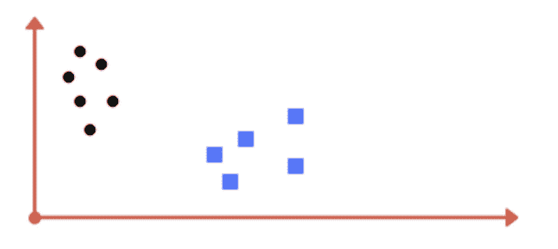

快速看一下这张照片。是线性可分的吗？*是的！*只要在方形丛和圆形丛之间画一条直线就大功告成了。这些我称之为簇的东西叫做类。我们刚分了两节课。这就是支持向量机的本质。它分隔阶级。好了，差不多就是这样——你刚刚了解了一个机器学习算法！但不可能那么容易，对吗？*号*

现在试着将图片中的正方形和圆形分开:

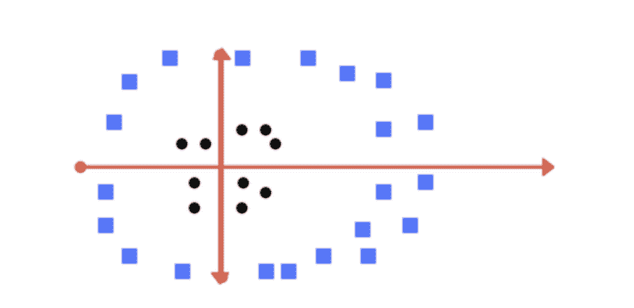

不，你不能只在圆圈周围画一个圈。想得更大。往高处想。多维思考。现在你明白我想说什么了吧？如果不使用内核参数，这个数据集是不可线性分离的。内核允许你挤压和拖动这个 2D 平面成为一个三维物体。你可以扭转和拉动飞机，直到它看起来像这样。

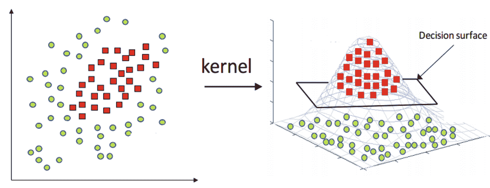

现在，你可以找一个地方放置一个叫做*决策面的东西。当你将 3D 空间转换回 2D 空间时(决策面仍然在那里),你会得到这样的结果:*

在下面的图片中，现在有一个从我们使用内核创建的决策表面映射而来的圆。

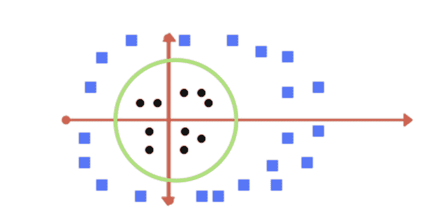

但是还有更多。

看看这张图片。我们如何对这幅图像进行分类？

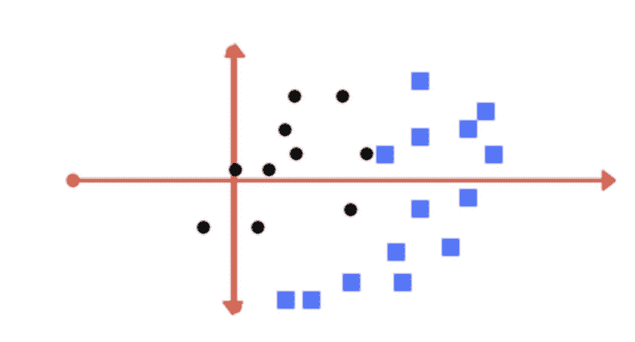

我们应该这样分类吗？

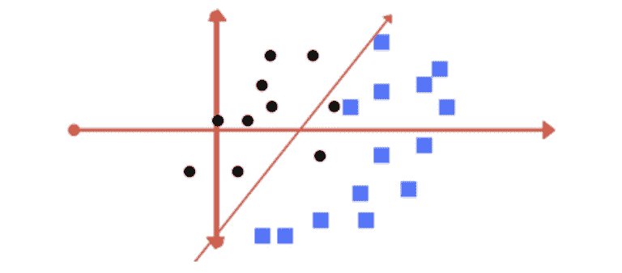

或者像这样:

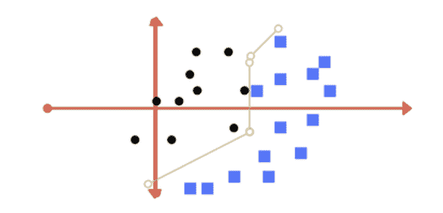

事实是——你决定！你如何决定？通过调整代码中的参数，这就是这四个主要参数发挥作用的地方:

1.  利润
2.  微克
3.  正规化
4.  核心

让我们来看看这四个参数以及它们的样子。

# 利润

理解了这个参数之后，下一对就非常容易学了，所以要注意！

余量基本上是每个类的最近点到决策边界(或分隔线)的距离。两个类的边距应该总是相等的，并且尽可能远。这是一个利润丰厚的例子。

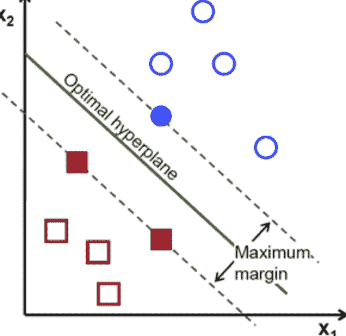

以下是如何找到放置保证金的位置:

两个类之间最近点之间的距离除以 2。该距离是决策边界与每个类的最近数据点之间的距离。

那么，利润率低的例子是什么？

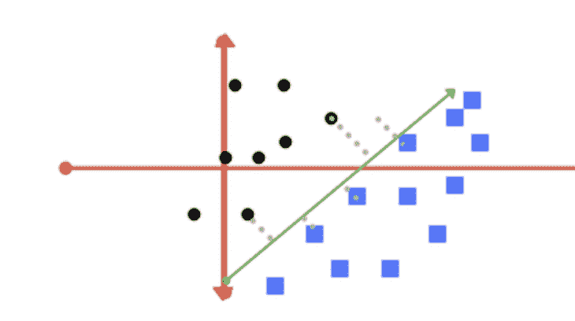

为什么这一个有一个坏的边缘的背后的原因仅仅是因为线太接近蓝色的点(蓝色类)。我们需要确保这条线到蓝点的距离和到黑点的距离一样远。并且澄清一下:这些点基本上是*数据*，这些具有相似属性的点集被称为*类*。

如果你不理解这一部分，我建议你重新阅读这一部分，或者在网上看几个好的利润例子，因为从这里开始只会变得更加复杂。

# 微克

Gamma 是一个参数，由一个看起来像 Y 的单位来测量，它定义了单个训练示例的影响范围。

基本上，gamma 是一个参数，它告诉 SVM 在做出决策边界时要考虑哪些点。如果我们将 gamma 设置为较高的值，这意味着我们希望 SVM 查看最近的点来做出决定。但是，如果我们将伽玛设置为一个较低的值，我们基本上是在告诉 SVM 考虑最远的点。这是一个高伽玛和低伽玛的例子。

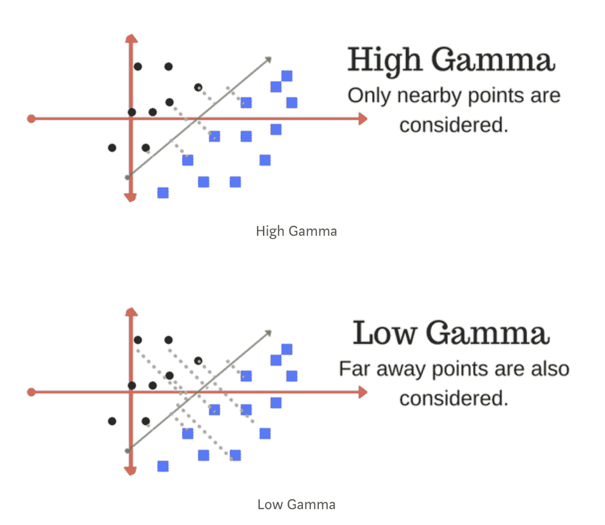

没有最佳的伽马值。这只取决于你要对哪些数据进行分类，以及你这样做的目的是什么。你必须问自己一些问题，比如高伽玛和低伽玛会如何影响我的数据，以及我是否应该考虑异常值？这同样适用于我将要解释的下一个参数——正则化(或者 C，如果你对你的 SVM 进行编码，你就会看到它)。

# 正规化

正则化参数实现了与 gamma 相同的目的，但通过另一种方式实现。该参数有助于我们让 SVM 避免所谓的过度拟合，即决策边界以各种不同的形状扭曲，以便能够对两个类进行分类，而不会有任何来自一个类的数据点位于决策边界的另一个类侧。

高 C:

*   在正确分类每个训练点方面做得更好
*   选择较小的利润
*   允许过度装配

低 C:

*   鼓励更大的利润→更简单的决策函数→一些数据点被错误地分类→更低的训练准确度

这是高音 C 的直观表示:

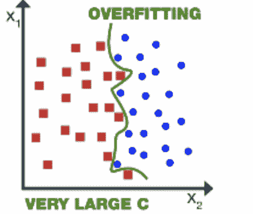

有时过度拟合可能是不好的，因为在某些情况下，当您使用测试数据时，通过考虑异常值来训练我们的数据可能会导致不准确的结果。您必须能够在过度拟合和不太考虑数据的情况下宽松地创建决策边界之间找到平衡。没有对错之分。你只需要决定如何对你的数据进行分类。

# 核心

这个参数基本上就是我们在本文开头附近用超平面对多维空间中的训练点进行分类的参数。

如果你想了解更多关于内核的信息，我在下面附上了我的 SVM 演示的链接，它将向你展示如何有效地使用内核技巧，以及它如何直接关系到提高你的准确度分数。

查看这些以了解更多信息，并随时发送任何问题或评论。

资源:

Amsal 的 SVM 演示视频:[https://youtu.be/ewHmfJdAuXo](https://youtu.be/ewHmfJdAuXo)

Amsal 关于机器学习的重点介绍:【https://www.youtube.com/watch?v=DRrhHqs-Ci4 T2

Amsal 在 GitHub 上的 SVM 知识库:【https://github.com/amsalgilani/Support-Vector-Machines 

还有，一定要看看我的个人网站！:[http://amsalgilani.com/](http://amsalgilani.com/)

## 来自 DDI 的相关故事:

 [## 用 7 个步骤解释深度学习

### 和猫一起

medium.com](https://medium.com/datadriveninvestor/deep-learning-explained-in-7-steps-9ae09471721a)  [## 数据科学和软件工程哪个更有前途？

### 大约一个月前，当我坐在咖啡馆里为一个客户开发网站时，我发现了这个女人…

medium.com](https://medium.com/datadriveninvestor/which-is-more-promising-data-science-or-software-engineering-7e425e9ec4f4)