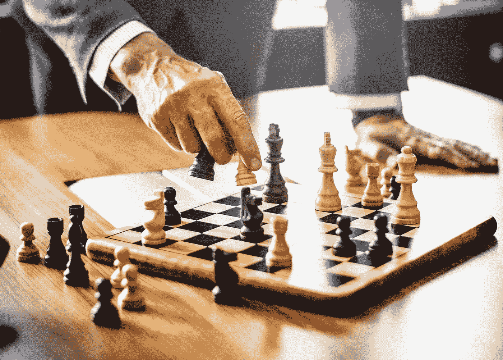
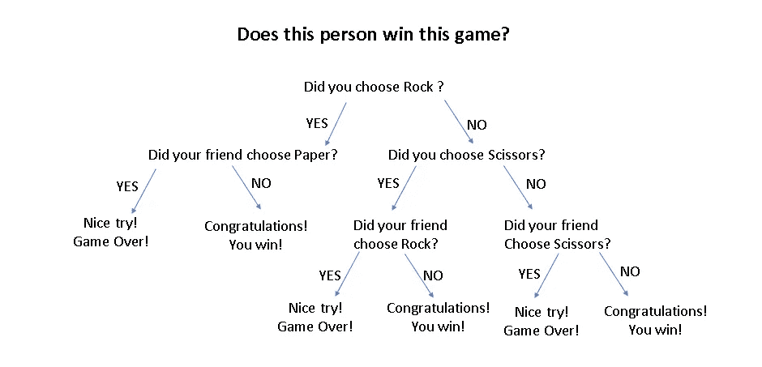
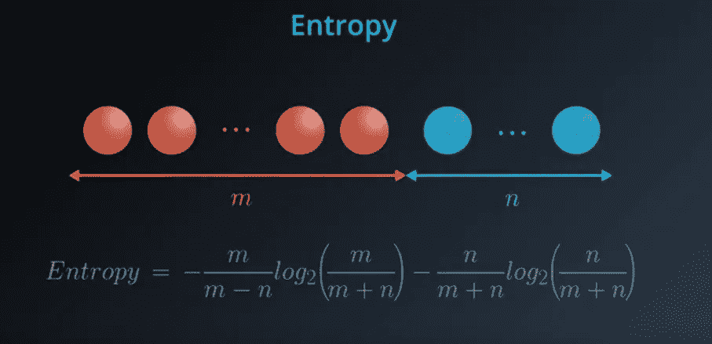
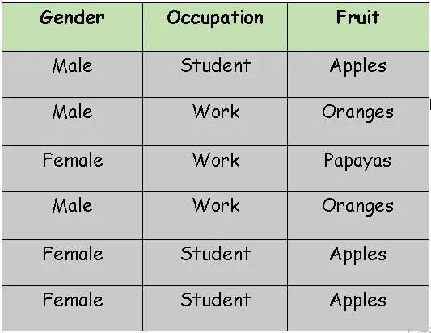
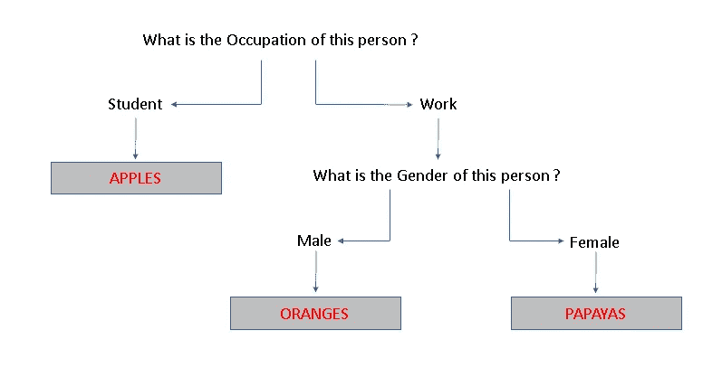

# 数据科学职业生涯—第 3 部分—机器学习—决策树

> 原文：<https://medium.datadriveninvestor.com/machine-learning-decision-trees-946255e6df2d?source=collection_archive---------14----------------------->

我们每天都要做出成百上千个决定。像“我应该带一条红色还是蓝色的手帕？”这样微小的无关紧要的决定像“我应该买这辆自行车吗？”这样的重大决定。每次你做决定的时候，你都会无意中耗尽你的精力，制造压力。这不是机器的情况，因为它们使用概率估计来确认最好的可能结果。

所以，如果你一直关注我的博客，这是我关于决策树机器学习的第三篇文章。如果你是第一次来这里，下面是我的介绍文章的链接，希望你喜欢我博客上的内容，珍惜这次学习之旅。

 [## 开始数据科学职业生涯？

### 你对人工智能的能力着迷吗？还是你属于那种相信…

medium.com](https://medium.com/@harris.datascientist/beginning-a-career-in-data-science-241102f1fc5a) 

© [rawpixel](https://unsplash.com/photos/flhzHp-F814?utm_source=unsplash&utm_medium=referral&utm_content=creditCopyText), [Unsplash](https://unsplash.com/search/photos/decision?utm_source=unsplash&utm_medium=referral&utm_content=creditCopyText)

# **趣闻:**

**美国第 44 任总统巴拉克·欧巴马在《名利场》的一篇文章中说:** " *你需要从你的生活中去除那些日常问题，这些问题占据了大多数人一天中有意义的部分……你会看到我只穿灰色或蓝色的西装。我正试图减少决策。我不想决定我该吃什么或穿什么。因为我有太多其他的决定要做。你需要集中你的决策能量。你需要把自己常规化。你不能因为琐事而分心。*”

# **决策树，听起来很简单。这种直觉可能真的会帮助你更好地理解:**

假设，你和你的朋友决定创建一个应用程序(App)来玩一个基于运气的小游戏，为之前在*[*机器学习—感知器*](https://medium.com/datadriveninvestor/machine-learning-perceptron-algorithm-bd46e954791)*中搭建的社交网站。你设计了一个应用程序，让你玩石头剪刀布的游戏。获胜者是根据以下条件选出的。如果双方选择相同的，即如果双方都选择石头或布或剪刀，则无法决定谁是赢家，游戏将重新开始。**

****

**这个简单的基于规则的游戏，是一个基于决策系统的经典例子。如你所见，随着系统缩小赢家*的范围，这些问题会变得越来越有教育意义。这和决策树做的事情完全一样，它们会问你一个又一个关于数据的问题，直到它们收集到足够的信息来做出预测。因此，让我们深入了解它们，了解它们是如何工作的，以及它们是如何构建的。***

# ******决策树大致可以分为:******

> *****-分类树(是/否)*****
> 
> ***我们上面看到的是一个分类树的例子，其中的结果是一个变量，如“赢”或“输”。这里的变量是绝对的。***
> 
> *****-回归树(连续数)*****
> 
> ***在这里，决策或结果是一个连续的变量，例如像 13 这样的数字。***

*****我想直觉一定投射了一些简短的想法，什么是决策树！**那么，让我们看看决策树是如何工作的。这个例子，可能有助于深入了解它是如何工作的，而不是旧的学校定义。如果你对 ***熵*** 和 ***信息增益*** 有清晰的概念。我可以大胆地肯定你已经理解了这个算法是如何工作的。***

****

**© [Viktor Kern](https://unsplash.com/photos/VMphSM-RqBo?utm_source=unsplash&utm_medium=referral&utm_content=creditCopyText), [Unsplash](https://unsplash.com/search/photos/snowfall?utm_source=unsplash&utm_medium=referral&utm_content=creditCopyText)**

# **熵:**

**现在，为了进一步研究决策树，我们需要学习一个叫做熵的重要概念。熵来自物理学，为了解释它，我将使用水的三种状态。这些是冰(固体)，水(液体)，水蒸气(气体)。**

**当我们观察构成水的每一种特定状态的粒子时。冰是非常坚硬的，也就是说，粒子没有太多的空间自由移动，它们大部分都呆在原地。与冰相比，水的刚性稍低，颗粒不是紧密堆积的，可以有一些运动。有趣的是，与其他状态的水相比，构成水蒸气的粒子运动最自由。**

**熵精确地测量了这一点，一个粒子有多少自由来移动？*由此可见冰的熵低，液态水的熵中等，水蒸气的熵高！***

****

**© [Brooke Lark](https://unsplash.com/photos/AgD6OBNXF0Q?utm_source=unsplash&utm_medium=referral&utm_content=creditCopyText), [Unsplash](https://unsplash.com/search/photos/fruits?utm_source=unsplash&utm_medium=referral&utm_content=creditCopyText)**

**熵的概念也适用于概率。假设我给你三篮水果。**

**第一个篮子里有 4 个苹果。第二个篮子里有三个苹果和一个橘子。而第三个篮子里有两个苹果和两个橘子。**

**我们假设这些水果完全无法区分。我们可以说，如果我们把水果排成一条线，它们被允许移动的距离就是熵。**

**我们可以看到，第一个篮子是非常非常刚性的，无论我们如何组织水果，我们总是得到相同的状态，即 4 个苹果，所以它有 ***【低熵】*** 。**

**从第二个篮子开始，我们可以用 4 种不同的方式重新组织水果，所以它有 ***【中熵】*** 。**

**而第三个篮子里的水果可以用 6 种不同的方式重新组织，所以它有 ***【高熵】*** 。**

> **这不是熵的精确定义，但它给了我们一个概念，集合越刚性或越均匀，熵就越小，反之亦然。**

**查看熵的另一种方法是衡量知识，如果我们从每个篮子里随机挑选一个水果，我们对这个水果了解多少？第一个篮子里只有苹果，我们可以肯定水果是苹果。于是，我们有了 ***【高知】*** 。第二个篮子由 3 个苹果和 1 个橘子组成，我们知道摘下的水果很可能是苹果，而不太可能是橘子。所以，如果我们打赌这是一个苹果，我们大部分时间都是对的。因此，我们对摘下来的果实有了 ***【中知】*** 。而在第三个篮子里，我们知道的要少得多，因为得到一个苹果和一个橘子的可能性是一样的。所以，这里我们有 ***【低识】*** 。**

****原来知识和熵是对立的。一个人拥有的知识越多，熵就越小，反之亦然。因此，我们得出结论，第一篮子具有低熵，第二篮子具有中等熵，第三篮子具有高熵。****

***虽然我还没有介绍任何* ***数学*** *，但是我想现在你对决策树的理解可能会好很多！*:)**

****

**© [Annie Spratt](https://unsplash.com/photos/SVR0YpsHH-8?utm_source=unsplash&utm_medium=referral&utm_content=creditCopyText), [Unsplash](https://unsplash.com/search/photos/apples?utm_source=unsplash&utm_medium=referral&utm_content=creditCopyText)**

# **我相信，你还留着我给你的那三篮水果。让我们用它来编造一个熵的公式:**

# **第一个篮子——苹果，苹果，苹果，苹果**

*   **获得上述订单的可能性有多大？嗯，要得到第一个水果是苹果，概率其实是 1。第二个水果也是如此，第三个也是最后一个水果也是如此，因为这个篮子里只有苹果。因为我们在每次抽签后都把水果放回篮子里，所以这些事件是完全独立的。所以，它们都发生的概率是四个概率的乘积。这意味着我们的概率是 1，这符合我们的直觉，无论我们做什么，我们都会选择苹果，苹果，苹果。**

# **第二个篮子——苹果，苹果，苹果，橘子**

*   **这篮水果获得上述订单的可能性有多大？要得到第一个水果为苹果，概率为 0.75(4 个水果中有 3 个是苹果)。第二个水果和第三个水果也是一样。而要挑选一个橘子作为最后的水果，概率是 0.25(4 个水果中有 1 个是橘子)。因此，由于事件是完全独立的，这四个事件发生的概率是这四个概率的乘积。(0.75 x 0.75 x 0.75 x 0.25 = 0.105)**

# **第三个篮子——苹果，苹果，橘子，橘子**

*   ****同样，这篮水果拿到这个订单的可能性有多大？**我们知道它同样有可能是最后一篮子水果中的任何一个。要得到第一个&第二个水果为苹果，概率为 0.50(4 个水果中有 2 个是苹果)。同样，获得作为第三和第四种水果的橙子的概率是 0.5(4 种水果中有 2 种是橙子)。因为事件是独立的，所以这四个事件发生的概率是这四个事件的乘积。(0.5 x 0.5 x 0.5 x 0.5 = 0.0625)**

> ****注意#1 :** 大量事件的个体概率乘积可能不合适，因为当你最终将 0 到 1 之间的 1000 个数字相乘时，最终结果将非常微小。因此，让我们对这些乘积使用对数**
> 
> **log(ab) = log (a) + log (b)**
> 
> ****注#2 :** 由于 0 到 1 之间的数字的对数是负数，通过考虑整个等式的负数，我们将处理正数。**

**对概率应用-log()后，我们得到:**

**#第一个篮子:-[log(1)+log(1)+log(1)+log(1)]= 0+0+0+0 = 0**

**#第二个篮子:-[对数(0.75) +对数(0.75) +对数(0.75) +对数(0.25)]= 0.415+0.415+0.415+2 = 3.24**

**#第三个篮子:-[log(0.5)+log(0.5)+log(0.5)+log(0.5)]= 1+1+1+1 = 4**

> **注 3:我们需要将结果除以 4，因为我们将使用熵的定义，即以所需方式采摘水果的概率的对数的负值的平均值。**

**因此，对于第一个篮子，我们得到 0 熵，第二个篮子得到 0.81 熵，第三个篮子得到 1 熵。这种数学方法与我们最初对每一篮子水果的熵的估计相吻合。**

**在更一般的方式中，M 个红色球和 N 个蓝色球的熵可以计算为:**

****

**© Udacity**

## **现在，我们知道熵是什么，以及如何计算它。加上下一个概念，信息增益，我们应该能够深入理解决策树。另外，要知道这个算法是如何用树来表示的。**

# **信息增益:**

**好了，现在，让我们继续构建一个决策树。在那之前，让我给你之前给你的一篮水果加一些木瓜。我猜你意识到了，对一个人来说，水果太多了。尽管如此，向附近的人捐赠多余的食物/水果，而不是让它们腐烂和浪费，总不会有什么坏处。据估计，每十秒钟就有一个人死于饥饿或与饥饿相关的原因。可悲的是，最常死亡的是儿童。**

****

**所以，你决定捐出多余的水果并记下来。使用这个表格数据，让我们建立决策树。我们的算法会非常简单。查看每列给出的可能拆分，计算信息增益并选择最大的一个。**

> **让我们计算这个数据的熵，这是 3 个人在摘苹果，其中 2 个人在摘橘子，1 个人在摘木瓜。**
> 
> ****-(3/6)对数(3/6)-(2/6)对数(2/6)-(1/6)对数(1/6) = 1.46****

# **#现在，如果我们根据性别分割数据，我们会得到两组数据:**

*   **首先，一个人摘木瓜，另外两个人摘苹果:**

**这个集合的熵是-(1/3)log(1/3)-(2/3)log(2/3)= 0.92**

*   **第二，一个人摘苹果，另外两个人摘橘子:**

**和另一套一样，**

**这个集合的熵是-(1/3)log(1/3)-(2/3)log(2/3)= 0.92**

**这种分裂的平均熵是 0.92**

****因此，信息增益= 1.46–0.92 = 0.54****

# **#如果我们根据职业划分数据，我们会得到两组数据:**

*   **首先，他们三个摘苹果:**

**这个集合的熵是-(3/3)log(3/3) = 0**

*   **第二，一个人摘木瓜，另外两个摘橘子:**

**这个集合的熵是-(1/3)log(1/3)-(2/3)log(2/3)= 0.92**

**这种分裂的平均熵是 0.46**

****因此，信息增益= 1.46–0.46 = 1.00****

*****综上所述，按性别栏拆分得到的信息增益为 0.54，&按职业拆分得到的信息增益为 1。算法说，挑信息增益最高的那一列，就是职业。我们得到:*****

****

# **这是我们的决策树。**

****

**© [Brooke Lark](https://unsplash.com/photos/aGjP08-HbYY?utm_source=unsplash&utm_medium=referral&utm_content=creditCopyText), [Unsplash](https://unsplash.com/@brookelark?utm_source=unsplash&utm_medium=referral&utm_content=creditCopyText)**

**下一篇文章将是关于朴素贝叶斯的。您可以在下面找到链接:**

** [## 数据科学生涯—第 4 部分—机器学习—朴素贝叶斯

### 朴素贝叶斯其实真的很幼稚:)

medium.com](https://medium.com/datadriveninvestor/machine-learning-naive-bayes-58119642495e) 

一如既往，我想感谢我的读者们的时间和兴趣。用我最喜欢的一句话来结束这篇关于决策树的文章:

***“我是一个足够的艺术家，可以自由地发挥我的想象力。想象力比知识更重要。知识有限。想象力环绕着世界。”***――阿尔伯特·爱因斯坦

Enjoyed the article? Click the ❤ below to recommend it to other interested readers!**