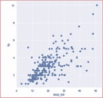

# 去神秘化的机器学习

> 原文：<https://medium.datadriveninvestor.com/machine-learning-demystified-4b41c3a55c99?source=collection_archive---------0----------------------->

这篇博文将通过使用日常例子来帮助你理解复杂的机器学习世界。使用一个流行的虹膜数据集-[https://adityak6798.github.io/ml-walkthrough.html](https://adityak6798.github.io/ml-walkthrough.html#For-an-introduction-to-the-terminologies-of-ML,-as-well-as-a-brief-theoretical-overview,-please-refer-to-https://blog_link.com)来看看机器学习 Python 代码的例子

# 理解机器学习的简化方法

你在网上购物，你一登录就会看到根据你以前的搜索或购买显示给你的商品。

*有没有想过幕后是什么？*

大多数在线购物网站使用机器学习来推荐你可能感兴趣的商品。商品推荐基于您之前的搜索或购物历史，或者基于其他客户购买的与您正在搜索的商品相似的商品。

这就是机器学习-ML，历史数据中的模式被用来预测未来的行为

## 机器学习的官方定义

**如果任务 T 的性能 P 随着经验 E 而提高，则称计算机程序从关于某类任务 T 和性能测量 P 的经验 E 中学习**

*但是等等！这个神秘的东西是什么意思？请用通俗的术语。*

在网上购物的例子中，计算机程序将根据你的购物历史和搜索以及其他顾客的购物历史来学习和推荐购买的物品——这被称为体验 E，网上购物是任务 t。性能 P 是衡量网站显示你可能感兴趣的正确物品或产品的程度。

*我希望这有助于澄清我们如何在日常生活中使用机器学习*

## 概述机器学习

机器学习是一门教计算机从历史数据中学习和理解模式的科学，以便为更好的决策做出预测。

向前看，机器学习分为监督和非监督

## 监督机器学习:

令人讨厌的东西:

***对于预测器测量值 Xi 的每个观测值，i = 1，…，n，有一个相关的响应测量值 Yi。***

***我们的目标是拟合一个模型，该模型已经从历史观测数据中学习了模式，以准确预测未来观测的响应。这是通过理解反应(Y)和预测值(X)之间的关系来实现的***

*这到底是什么意思？*

用另一个我们在生活中都经历过的例子

想象一个孩子在老师的监督下学习，老师使用历史信息来指导孩子，并进一步训练孩子做出更好的决定。

假设一位家长正在教孩子牵着孩子的手在不同的表面上行走。根据父母的历史经验，他们知道如果孩子摔倒在柔软的表面上不会受伤，但是如果孩子摔倒在坚硬的表面上就会受伤。这种体验然后转化为模式，进一步帮助孩子理解落在硬表面或软表面之间的差异。这就是我们所说的监督学习。

在监督学习中，我们被给定一个数据集，在这个数据集中我们已经知道输出，并且能够识别输入和输出之间的关系。

在我们上面的例子中，基于孩子在硬的或软的表面上行走的经验，孩子现在知道了由于父母过去的经验而产生的结果——如果孩子摔倒会有多痛。

*啊。好吧。*

监督机器学习有两种类型

**回归** —输出是一个连续变量(例如预测房价)

**分类** —输出是一个离散变量(如猫对狗)

*连续？离散？请帮帮忙。*

**连续意味着**它是一个可以取任何值的数字，比如房价可以是 105K，212K 等等。

**离散的**意味着它只采用几个值(如 0–1 ),比如一封电子邮件可能是垃圾邮件，也可能不是垃圾邮件。

# 无监督机器学习:

令人讨厌的东西:

***无监督学习描述了稍微更具挑战性的情况。对于每个观察值 i = 1，…，n，对于输入变量 Xi，没有相关的响应 Yi。***

***不可能拟合线性回归模型，因为没有可预测的响应变量。在这种情况下，由于我们没有任何监督，我们在某种意义上是盲目工作的。***

***这种情况被称为无监督学习，因为我们缺少一个可以监督我们分析的响应变量。***

*好的……*

无监督学习发生在没有历史响应输入的情况下，数据模式仅基于预测器自行出现。

举一个和上面一样的例子，当没有人教孩子的时候，孩子会自己去体验东西来辨别硬表面和软表面的区别。

将来，孩子在坚硬的地面上行走时会更加小心，这是基于他们所拥有的数据模式或经验，因此将来会用于更好的决策。

这有助于在没有任何监督或指导的情况下识别复杂的过程和模式。试图在未标记的数据中找到一个结构。

在高层次上，有监督的和无监督的机器学习之间的区别

**监督机器学习**

> **目标或输出变量是已知的。**
> 
> **每个观察都标有正确答案**
> 
> **监督学习是高级预测建模**

示例:

> *将邮件分类为垃圾邮件还是非垃圾邮件或者*
> 
> *根据某些关键参数，癌症患者的百分比是多少*

常见型号:

> *回归模型用于预测定量数据*
> 
> *分类模型用于预测分类数据*

**无监督机器学习**

> **目标或输出变量未知**
> 
> **观察结果没有正确答案。在没有任何指导的情况下，必须根据数据形成一个模式**
> 
> **自动化数据分析**

示例:

> *向顾客推荐书籍或电影或*
> 
> *细分市场以锁定合适的客户*

常见型号:

> *聚类，在数据中找到组*
> 
> *推荐电影或产品的推荐系统*

**机器学习常用术语:**

我在机器学习中听到很多技术术语。你能帮忙吗…？

当然可以。请将此视为一份备忘单。这些术语通常用于机器学习(ML)

***观察值*** :数据集中的每个实例，也称为历史数据。它可以由多个变量组成。所有输入变量(还记得以前的吗？)对每个例子都有一定的价值。总的来说，它们被称为观察值。

有时数据集可以有一个响应变量(记住监督学习)。当响应变量不存在时，我们可以选择无监督学习

***特征或输入变量或预测值*** :用于预测的数据集中的独立变量。这些是对输出或目标变量有影响的变量。

*什么是自变量？你能解释一下吗…*

互不影响的输入值，如房屋的面积或窗户的数量或房屋离学校的远近。记住，这些值被用作(机器学习)ML 算法的输入。

***目标变量或输出变量*** *:* 试图从数据集中预测的变量。也称为输出变量或因变量或目标变量。

比如预测大学生的饮酒习惯。在这里，目标变量将是学生是否会有饮酒问题是或否，基于某些独立变量，如家庭中是否有人吸烟和饮酒，他们是否有朋友或兄弟姐妹吸烟等。

***训练集*** :用于训练 ML 算法的数据集。

***测试集*** :用于验证 ML 算法性能的数据集。

***模型*** *:* 从数据中学习到的一组模式。也称为 ML 算法，因为该算法从训练集中学习模式。

***机器学习算法*** :用于训练模型的特定 ML 算法。示例:线性回归、K-最近邻、支持向量机(SVM)等。

现在，对于一些数学术语。不要担心这些术语，它们非常数学化。你以后会找到窍门的。这些主要是用来说数据的。

***双变量分析*** *:* 分析两个(双)变量之间的关系。使用散点图理解双变量关系。

什么是散点图？

一种绘图类型，您可以在一个轴上绘制一个变量的值，在另一个轴上绘制另一个变量的值，以了解它们之间的关系。因此，对于给定的一组示例，您可以绘制每个点，并且可以可视化它们之间的关系(如果有的话)。

下图显示了总账单金额及其与小费金额的关系的散点图

Scatter Plot between Total Bill Amount and Tip Amount

***共方差*** :规定两个变量是否共变的度量。它是关于两个变量之间的变化方向。两个变量之间关系的强度是由相关性决定的。

它可以是正的协变、接近零或负的协变。

一个变量的变化对另一个变量有线性影响。在上面的例子中，随着账单金额的增加，小费金额也会增加。

协变没有下限或上限，其规模取决于变量的规模。

***相关性*** :描述两个变量之间的方向和强度。

相关性在+1 到-1 之间变化，并且是标准化的。相关值与变量的规模无关。

室外温度和能耗之间的相关性示例。温度和能耗都是以不同的单位测量的，但它们之间存在相关性，并且总是在+1 和-1 之间

相关性并不总是意味着因果关系。

*什么是因果关系？*

当一件事引起另一件事。就像下雨的时候，会把草弄湿。

看来你也跟着来了！恭喜你。您现在已经准备好深入 ML 了

好的。假设我有数据，并训练了一个模型。下一步是什么，我如何知道哪个模型最适合我的用例？

很好！你在正确的思考过程中。现在请继续阅读…以获得更深入的理解

# 你如何评估一个算法，

机器学习算法通过以下方式进行评估

> 解释输出的容易程度
> 
> 计算时间
> 
> 预测能力

对于现实生活中的机器学习程序，我们执行以下步骤。我们将在下一系列中详细讨论这些

机器学习的步骤

1.数据探索和[数据可视化](https://medium.com/@arshren/data-visualization-5b1dc260c91a)

2.[数据清理](https://medium.com/@arshren/python-machine-learning-data-clean-up-2d2a40f0374d)

3.特征工程

4.算法选择

5.模特培训

6.测试模型

7.[测量模型性能](https://medium.com/datadriveninvestor/how-to-evaluate-the-performance-of-a-machine-learning-model-45063a7a38a7)

8.监控真实世界的结果并调整模型

学分:

[https://en.wikipedia.org](https://en.wikipedia.org)

[https://seaborn.pydata.org](https://seaborn.pydata.org)

[https://www.youtube.com/user/BCFoltz](https://www.youtube.com/user/BCFoltz)

[https://elitedatascience.com](https://elitedatascience.com)

 [## 媒体——一个阅读和撰写重要想法和重要故事的地方

### 欢迎来到灵媒，一个文字很重要的地方。Medium 挖掘了世界上最有洞察力的作家的大脑…

medium.com](https://medium.com/) 

# 如果你喜欢这篇文章，请鼓掌！