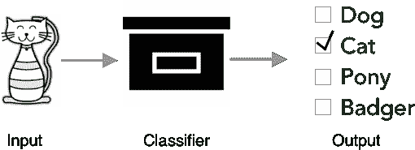
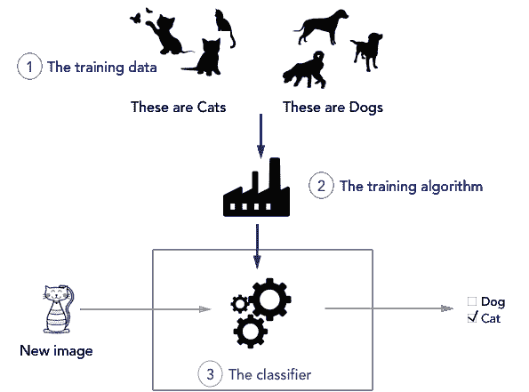
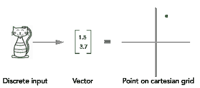
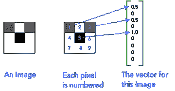
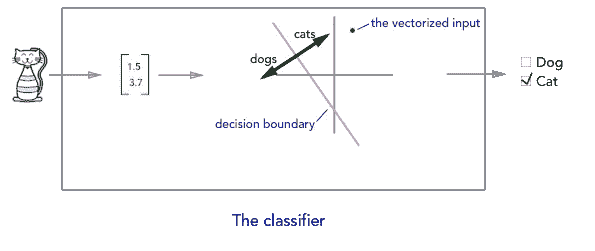
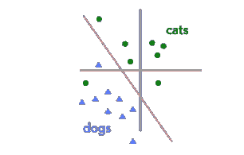
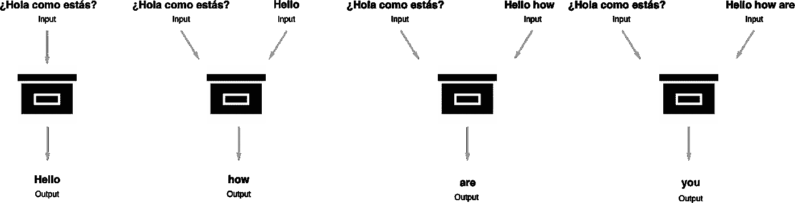

# 面向高管的机器学习

> 原文：<https://medium.datadriveninvestor.com/machine-learning-for-executives-6eecad7d9f41?source=collection_archive---------3----------------------->

由 Gabor 安格利，[雄辩实验室](http://eloquent.ai)首席技术官

谷歌想利用机器学习让[为你预订餐厅](https://www.theverge.com/2018/6/27/17508728/google-duplex-assistant-reservations-demo)。中国希望用它来帮助 T4 的医疗保健事业。脸书想用它来杜绝假新闻。很容易找到关于机器学习的浮华标题。然而，一个问题仍然存在——它究竟是什么？

如果不理解机器学习的核心要素，应用该技术解决现实世界的问题是徒劳的。这就像一个盲人戴眼镜，因为他听到他们帮助你看到。人们应该了解机器学习的基本原理，以便很好地利用这项技术，并避免在获得它时犯代价高昂的错误。

在这篇文章中，我将简要介绍机器学习(ML)。如果你正在寻找人工智能领域的概述，请访问[我们在这里的另一篇文章。](https://blog.eloquent.ai/2018/08/15/the-ai-landscape/)

随着我们的进行，我会用**粗体**标出技术定义，试图揭开普通 ML 术语的神秘面纱。这篇文章的每个部分都将像一个多米诺骨牌一样，从第一部分的最大问题推动第二部分的内容，以此类推，直到你牢固掌握了机器学习的基础知识。在这篇文章之后，你将能够更好地评估人工智能技术核心的 ML。

就其核心而言，ML 实际上并不复杂。你在现实世界中可能看到的大多数 ML 都可以通过理解量词来直观地理解。

# 什么是量词？

在高层次上，**分类器**是贴标机。给它一个离散的输入(例如，一幅图像、一个单词、一个句子)，它就输出一组已知标签中的一个。

A classifier labels an image of a cat as “Cat.”

在上面的例子中，神秘的“黑盒”代表了我们的分类器。它将感兴趣的离散对象(图像)作为输入，并从一组固定的可能标签(输出空间**)中产生一个标签(“Cat”)。**

**在现实世界中，你可能读过的大多数令人兴奋的 ML 模型要么是我们在这篇博文中描述的更复杂的分类器，要么是通过将简单的分类器链接在一起来执行更复杂的任务(例如，句子翻译、无人驾驶汽车、聊天机器人)而组成的。**

**在这篇介绍性的文章中，我们将只检查一个简单的分类器，该分类器将图像分为两类:猫或狗。这个简单的例子将在不牺牲技术严谨性的情况下使事情更加直观，同样的见解将适用于实际应用，如自动驾驶汽车。**

# **分类器是如何构造的？**

**在上一节中，我们把分类器想象成一个黑盒:一个输入(图像)进去，一个标签(“Cat”)出来。现在，我们将讨论分类器是如何制造的，这将为解释它们如何工作打下基础。下图有助于说明分类器的关键组件:**

****

**分解每个组件:**

1.  ****训练** **数据**由成对的已知输入和输出组成，看起来就像分类器将模拟的输入和输出。在我们的例子中，我们的数据由图片和它们相应的标签组成。我们的(输入，输出)数据看起来是这样的:(猫的图像，“猫”)，(狗的图像，“狗”)等。**
2.  ****训练算法**使用这些标记的数据来产生一个分类器，该分类器可以模拟数据中演示的任务。在我们的示例中，这意味着训练模型可以将图像标记为“猫”或“狗”)。**
3.  **这里精确定义的**分类器**是一个模型，其所有**参数**由训练算法填充实际值。一个简单的思考参数的方法是回忆一条线的方程:y = m*x + b，在这个方程中，“m”和“b”就是参数。**

****模型**是我们的分类器用来进行预测的算法。⁴:现在，你可以把模型想象成一个空壳。在它能够做出预测之前，它需要填充信息。虽然一个模型有 **capacity⁵** 来执行复杂的预测，但它需要正确的参数来这样做。要求一个模型在不提供参数的情况下做出预测，就像期待一台空的 DVD 机播放*星际*。虽然 DVD 播放机有能力在屏幕上显示任何东西，但它缺少特别是显示星际的指令。**

**为了开发这些参数并填充这个空壳，我们使用了一个称为**训练**的过程。基本上，我们教我们的模型如何使用训练数据进行预测。**

**这在高层次上是如何工作的:我们构建了一个算法，该算法将带标签的数据作为输入，并产生一个分类器作为输出，这个分类器是 T2 分类器，或者更准确地说，是完成模型的填充参数。标签化的数据进去(图片标签为“猫”；标记为“狗”的图像)，并且一组数字(模型的参数)出现，其定义了模型应该如何预测新图像是猫还是狗。训练算法填充我们的参数值。**

**在现实世界中，如何构造分类器对于模型的最终用途非常重要。例如，一个被输入停止标志示例的分类器将无法检测到交通灯，就像播放*星际*的 DVD 播放机不显示*指环王*。那么，为什么我们可以在街道标志上训练一个分类器，并期望它在看不见的街道标志上工作，但不期望它在交通灯上工作？**

**在下一节中，我们将回顾分类器实际上是如何训练的——我们如何填充参数的值——并深入了解我们期望分类器能够准确处理哪些类型的未知数据。**

# **我们如何填充参数的值？**

**如果我们认真揭开黑盒子的盖子，一步一步地了解我们神秘的分类器如何给图像贴上“猫”或“狗”的标签，这可能会有所帮助。下图显示了最初的几个步骤:**

****

**首先，我们必须将我们的离散输入——例如，一只猫的图像——转换成我们可以进行数学运算的东西。对于几乎所有的机器学习应用，这是一个向量。反过来，⁶矢量可以被认为是笛卡尔坐标网格上的一个点。**

**这些通常是很长的向量，这意味着这些点不在 2 维或 3 维空间，而是在 500 维或 1000 万维空间。我推荐做每个 ML 专家都做的事情，那就是将 2 维可视化，并认真思考“1000 万”。**

**将图像转换为矢量是一个相对简单的过程。图像的每个像素是向量的一个维度，并且每个维度的值是例如该像素的灰度值。⁷**

****

**假设每个离散输入都被转换为空间中的某个点，我们只需将这个空间一分为二:一部分空间用于“猫”，一部分空间用于“狗”。在最简单的情况下，我们通过画一条线——或者在高维情况下画一个**超平面** —来分隔空间。⁸这是我们的**决定边界。****

**训练算法的工作是定义这个决策边界的参数。在高维空间中，这个决策边界作为高维平面存在。在二维中，决策边界作为一维平面存在——它只是一条线。就像以前一样，当有人提到决策边界或超平面时，可以安全地想象一条线，并认真思考“许多维度”:**

****

**一条线需要两个参数来拟合:再次回忆一条线的方程，y = m*x + b，M 和 b 是我们的训练算法设置值的参数。对于更高的维度，我们有更多的参数，但想法是一样的。**

**把这些放在一起，我们的分类器黑盒开始看起来相当简单。我们将输入转换成一个向量，绘制出结果向量，然后测量它在决策边界(线)的哪一边。对于加分来说，为了得到一个信心的衡量标准，我们可以衡量我们离决策边界有多远——越远，我们就越有信心。在我们的例子中，一个点离我们的决策边界越远，这个点代表的猫越大，狗越小。**

****

**在现实世界中，这些参数可以定义汽车如何决定一个标志是否是交通信号灯，是否显示通行或停车信号，“ciao”是否意味着你好或再见，以及聊天机器人是否认为“我只是在跟你开玩笑”是有人引用一个笑话或告诉机器人他们的名字。**

**但是，还应该清楚的是，我们将示例中的空间划分为几个类。如果我们在猫和狗之间进行分类，我们应该如何理解獾是什么？如果我们得到一张新的猫的图像，我们可以预期它会落入标记为“猫”的空间部分，但是随着我们远离越来越多的不同输入，它们会矢量化到空间中的正确位置变得越来越不清楚。**

# **培训实际上是如何工作的？**

**简答:训练就是曲线拟合。**

**知道了黑盒的工作原理，训练算法就直观多了。训练一个 ML 系统，就其核心而言，可以被视为曲线拟合的练习。事实上，你在学校的时候可能已经做过**最小二乘回归**了——这是一个非常有效的机器学习算法。⁹**

**下图中绘制的线条显示了我们如何绘制决策边界(每个点都是一个**训练示例**):**

****

**直观地说，训练算法的目标是构建一个决策边界，该边界以尽可能少的错误来分隔我们的数据，并使尽可能多的元素远离决策边界。例如，上图中的边界线只犯了一个错误——将一只猫错标为一只狗。**

**在现实世界中，机器学习的大部分挑战是利用我们有限的训练数据，找到“正确”的曲线，即正确分类最不可见数据的曲线。很明显，更多的数据会创建一个更准确的边界，或者说*右*数据——最接近你看不见的数据——会创建一个更可靠的决策边界。当我们谈论“大数据”或“干净数据”或任何这些 ML 术语时，我们指的是将有助于拟合正确曲线以区分猫和狗的数据，在我们的例子中。**

# **我们将何去何从？**

**这篇文章关注机器学习的关键技术基础，解释分类器，分类器如何进行预测，以及如何从训练数据中训练分类器。当人们问我关于机器学习的实际问题时，从这些基础中获得的直觉是我答案的基础。**

**这些直觉帮助我回答的实际问题:为什么在看不见的数据上评估 ML 系统很重要？为什么神经网络是如此强大的分类器？什么类型的数据对机器学习有价值？在接下来的博客文章中，我将利用这篇文章中的见解来回答这些和其他问题。其他值得期待的帖子包括对人工智能公理的解释，如何评估人工智能系统，如何判断人工智能是否适合你的任务等等。如果您想在有新帖子发布时得到提醒，请关注我们并填写我们网站[上的表格。](http://eloquent.ai)**

**如果你对本文的观点仍有疑问，并希望进一步讨论，请发邮件至[hello @口才. ai](mailto:hello@eloquent.ai) 给我。也许你的问题会变成以后的博文！**

# **脚注**

**[1]这里更准确的说法应该是“许多看起来不像分类器的任务仍然可以用同样的直觉来理解。”例如，神经机器翻译可以被视为一系列分类器，其工作方式如下图所示:**

****

**这里，根据(1)外语句子和(2)迄今生成的英语句子预测翻译的英语句子的单词。每个决策本质上都是一个分类器，有一个巨大的输出空间，由英语中的每个单词组成。细节很复杂，但直觉在很大程度上起作用。**

**[2]训练算法广泛涵盖了你可能听说过的算法，如[随机梯度下降(SGD](http://ufldl.stanford.edu/tutorial/supervised/OptimizationStochasticGradientDescent/) )及其变体、[最小二乘回归](https://en.wikipedia.org/wiki/Least_squares)或[强化学习](https://en.wikipedia.org/wiki/Reinforcement_learning)。**

**[3]参数也是一个技术术语。模型的参数是确定模型将如何执行其任务的学习数字。**

**[4]你可能听说过[lstm](https://en.wikipedia.org/wiki/Long_short-term_memory)、 [SVMs](https://en.wikipedia.org/wiki/Support_vector_machine) 和[逻辑回归](https://en.wikipedia.org/wiki/Logistic_regression)。这些是模型的类型。神经网络是一系列模型，包括 LSTM 等模型。**

**[5]能力也是一个技术术语——高能力模型(如神经网络)具有学习更复杂任务的能力，但往往更难训练。高容量模型往往有许多参数。**

**[6]对于许多应用来说，这是一个高阶张量。但是，出于直觉的目的，张量只是一个额外需要精神训练的向量——向量是秩 1 的张量，矩阵是秩 2 的张量，等等。**

**[7]对于语言来说，将文本转换成向量需要一个额外的步骤。这被称为**将**单词嵌入向量空间(通常，大约 100-1000 维)；产生的向量被称为**单词嵌入**。你可能听说过 [word2vec](https://en.wikipedia.org/wiki/Word2vec) 和 [GloVE](https://nlp.stanford.edu/projects/glove/) ，这是两种流行的生成单词嵌入的方法，以及相应的将单词映射到向量的字典。**

**[8]超平面是嵌入到 n 维空间中的(n-1)维空间。就像高维空间中的大多数事物一样，大多数人工智能专家想象的要么是 2 维空间和 1 维“超平面”，要么是 3 维空间和 2 维“超平面”(在这种情况下，只是一个平面)。**

**[9]稍微扩展一下:最小二乘回归将直线拟合到一组点上。这条线实际上比嵌入空间多了一个维度。在我们作为例子使用的 2D 空间中，现在想象屏幕上出现第三维，其中每个正面例子的值为 1，每个负面例子的值为-1。我们拟合的“线”是 1 和-1 值之间的线；决策边界超平面是拟合直线与特征空间的截距。**

***原载于 2018 年 8 月 30 日*[*blog . orange . ai*](https://blog.eloquent.ai/2018/08/30/machine-learning-for-executives/)*。***