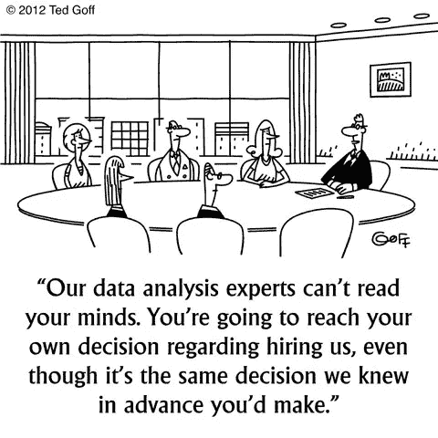
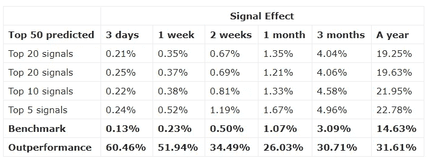
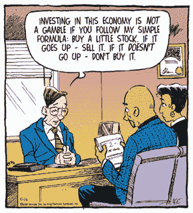

# 股票市场投资的机器学习

> 原文：<https://medium.datadriveninvestor.com/machine-learning-for-stock-market-investing-f90ad3478b64?source=collection_archive---------1----------------------->

当你的一个朋友在脸书上传你的新海滩照，并且平台建议给你的脸加标签时，这并不是因为马克·扎克伯格在偷偷跟踪你并且知道你的名字。事实上，这要归功于机器学习。今天，机器学习在我们周围无处不在。机器学习就是当你说“好的谷歌，晚安”的时候，谷歌主页就会关掉你的灯和电视。机器学习就是当你在网上搜索“炸鸡配方”，然后在 Youtube 上看到肯德基的广告。但是机器学习不仅仅局限于我们使用的科技产品。

近年来，它已成为金融业，尤其是股票市场的支柱。这给我们带来了一个主要的积极因素——我们现在有了以完全相同的方式处理工作的计算机，而不是吵闹的男性至上的黄领带交易员。除了它们更好、更快、更便宜、更可靠，不会在 35 岁带着一张丰厚的支票退休。

*Source:* [*KDNuggets*](https://www.kdnuggets.com/2012/12/machine-learning-data-mining-humor.html)

**什么是机器学习？**

机器学习是计算机自主学习新事物的能力。学习过程基于数据、过去的经验和观察。计算机处理的数据越多，得出的结论就越准确。这正是机器学习算法成为金融市场 DNA 不可或缺的一部分的原因。

**股票投资如何受益于机器学习的进步？**

交易过程已经发生了巨大的变化，交易者利用复杂的参数和各种因素的组合来做出决定。从社会情绪得分，通过技术指标，到基本面信息，今天的投资比以往任何时候都更加复杂。机器学习有可能通过分析大块数据、发现重要模式并生成单一输出来简化整个过程，从而根据预测的资产价格引导交易员做出特定决定。

它在实践中是如何工作的？

在本质上，金融市场往往是不可预测的，甚至是不合逻辑的，就像英国退出欧盟投票或上次美国大选的结果一样。由于这些特征，财务数据应该被认为拥有一个相当混乱的结构[1],这通常使得很难找到可持续的模式。为了解决这个问题，算法应该被提供尽可能多的无偏信息。

对混沌结构建模需要机器学习算法能够发现数据结构中隐藏的规律，并预测它们在未来将如何影响它。实现这一点的最有效的方法论是“深度学习”。深度学习可以轻松处理复杂的结构，并提取关系，进一步提高生成结果的准确性。这里有一个 [**指南**](http://www.datadriveninvestor.com/deep-learning-in-python) 来帮助你更好地建立深度学习模型。

机器学习在股票交易中的工作方式与人类分析师通常采用的方法没有太大区别。第一步是为首选仪器组织数据集。然后，它被分成两个主要组—训练集和测试集。这是为什么呢？在测试算法之前，需要对其进行训练和微调，这就是训练集的作用。在明确算法符合所有要求之后，就可以用测试集来执行它了。算法生成结果后，会将其与特定股票的实际表现进行比较。

**股票交易机器学习算法背后的逻辑示例**

有很多方法可以建立预测算法。然而，他们中的大多数人通常遵循以下逻辑，因为这是一种简单有效的基本股票市场预测方法:

*   **收集所需数据**

正如我们已经提到的，金融市场是混乱的结构。混沌过程已经证明，过去的事件会对现在和未来产生巨大的影响。这使得历史数据成为预测工具未来价格的良好来源。

我们假设主要关注点是股票交易。首先，交易者必须弄清楚他对哪些工具感兴趣，并下载和准备相应的时间序列格式的历史数据。接下来，交易者要选择一个基准，这样他就可以把算法结果和它的性能进行比较。让我们以标准普尔 500 为例。我们应该设定一个分析指数表现的时间框架。我们来取 2016 年 1 月到 2019 年 1 月这 3 年的数据。

*   **构造算法**

主要目标是建立一个能够预测价格轨迹的算法。实现这一点的一个好方法是瞄准两个主要因素——信号和可预测性。第一个的想法是代表预期的运动是什么——是涨价还是降价。可预测性因子旨在揭示算法的过去预测和每个观察到的资产的真实运动之间的相关性。或者换句话说，显示信号结果的可信度。为了获得更准确的结果，我们将使用皮尔逊相关系数[2]。

评估在单个库存水平上进行，然后取平均值。每笔交易的盈利能力通过以下公式计算:

为了便于计算，这可以在 Excel 中进行。上述公式得出的结果表明，如果投资者在预测日买入该工具，并在 1 个月后卖出，预期收益率是多少。

这为从整个指数中找出最好的交易工具铺平了道路。下一步是指示算法取所有预测的平均值，并相应地对它们进行加权(最近的表现通常获得更大的权重)。

> *最终价格/预测日价格— 1*

*   **解读结果**

算法完成预测后，交易者应该过滤列表中最可预测的工具，选择信号强度最高的工具。这样，他可以很容易地找出哪些股票最有可能经历价格波动，并根据结果进行交易。

接下来，交易者应该将表现最好的股票的结果与各自的基准进行比较，并做出投资决定。

Evaluation of the top 50 stocks filtered by predictability

可以看出，结果表明，该算法在所有投资范围内都优于标准普尔 500 指数的回报。

**替代预测方法**

事实上，通过机器学习算法进行股市预测还有很多其他方式。这是我开始的地方。一种被广泛优选且有效的方法被称为“集成学习”。其背后的想法是利用多种学习算法的能力来提高最终预测的整体准确性。由于学习和算法训练过程独立发生的事实，集成学习技术通常是优选的。最终确定后，生成的预测将合并到一个综合分析中。神经网络和支持向量机是经常通过集成学习结合起来的两种最流行的算法[3]。

**结论**

十年前，预测股票价格是一个漫长而耗时的过程。今天，机器学习算法的力量帮助我们节省时间和精力，同时实现更好的性能和更高的效率。然而，这项技术还有很长的路要走，直到它完全有能力解决金融市场的谜团。然而，如果需要的话，你可以用一种算法来代替你的个人理财顾问，这是一件好事。至少你会确信它只会给你建议，而不会试图卖给你任何东西。

*Source:* [*BusinessPundit*](http://www.businesspundit.com/easy-investment-advice/)

渴望将数据转化为有见地的信息，但不知道从哪里开始？[**这个**](http://www.datadriveninvestor.com/Introduction-to-R-for-Finance) 就是我开始的地方

*[1]混沌结构——也称为“动态系统”,如果初始条件发生微小变化，这些结构很容易改变其行为。这使得它们很脆弱，很难探索。然而，随着机器和深度学习的力量，在动态结构中发现隐藏的规律和模式的过程不断演变。*

*[2]皮尔逊相关系数——衡量两个变量之间线性相关性的指标。对于上述示例，变量是过去的算法性能和从-1 到 1 测量的实际市场运动*

*[3]支持向量机——用于分类和回归分析的监督学习模型。SVM 算法模型将结果可视化，用空间中的点来表示。*

*本文原载:*[*https://www.datadriveninvestor.com/*](https://www.datadriveninvestor.com/)

## **来自 DDI 的相关故事:**

 [## 数据科学和软件工程哪个更有前途？

### 大约一个月前，当我坐在咖啡馆里为一个客户开发网站时，我发现了这个女人…

medium.com](https://medium.com/datadriveninvestor/which-is-more-promising-data-science-or-software-engineering-7e425e9ec4f4)  [## 用 7 个步骤解释深度学习

### 和猫一起

medium.com](https://medium.com/datadriveninvestor/deep-learning-explained-in-7-steps-9ae09471721a)