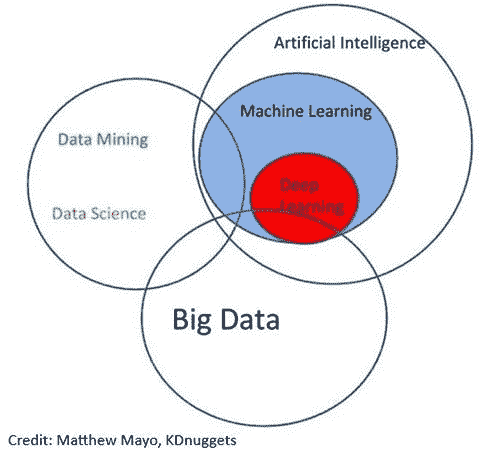

# 税务机器学习

> 原文：<https://medium.datadriveninvestor.com/machine-learning-for-tax-f49694963e35?source=collection_archive---------2----------------------->

人工智能(AI)、机器人流程自动化、机器学习、认知计算——我们现在到处都能听到这些术语，但它们对税务专业人士意味着什么？谁在乎[沃森](http://www.youtube.com/watch?v=P18EdAKuC1U)能否在《危险边缘》中击败我们当中最好的人！？或者说 [AlphaGo](http://www.youtube.com/watch?v=8tq1C8spV_g) 对围棋也能这样？有人能帮我报税吗？

在过去的几年里，我看到了咨询公司、软件供应商和“未来主义者”等营销的泛滥——他们都在宣扬机器人的必然崛起，机器人可以实现一切自动化，包括税务功能。然而，在尝试了一个又一个解决方案之后，随着时间的推移，[的幻灭](http://www.gartner.com/smarterwithgartner/5-trends-emerge-in-gartner-hype-cycle-for-emerging-technologies-2018/)变得……令人清醒。

**基于规则的 AI**

咨询公司可以作为“人工智能”出售的东西可能意味着试图执行与人类智能相关的任务的任何东西，包括基于规则的决策树。对于税务，这可能很简单，只需在税务固定资产登记册的描述字段中标记“维修”或“维护”等关键词，以找到[潜在的可抵扣项目](http://www.ato.gov.au/Business/Income-and-deductions-for-business/Deductions/Repairs,-maintenance-and-replacement-expenses/)，也可能是一份问卷，收集来自员工的信息，以帮助完成 [FBT LAFHA 申报](http://www.ato.gov.au/Forms/Living-away-from-home-declarations/)。你包含的规则越多，人工智能就变得越复杂。如果您的组织在将人工智能应用于税务职能方面相对较新，基于规则的方法通常是最佳起点，对您的税务数据进行数据分析，以发现潜在的风险和机会，从而帮助税务审查流程。

**基于机器学习的人工智能**

另一方面，“机器学习”是人工智能的一个子集，它使用可以从你的数据中学习的算法，而无需你明确设定规则。网飞等消费产品通常使用这种方法，根据你“喜欢”的内容或你以前看过的内容推荐你最喜欢的电视节目。对于税务，这些机器学习算法可以根据你的团队对税务敏感交易进行的历史分类进行“训练”。例如，这包括查看维修和保养(R&M)费用账户，并对资本性质的交易进行“标记”,如财务团队错误地将固定资产记入该费用账户。这将基于以前由税务团队成员进行的人工审查，他们查看“特征”，如交易描述、成本中心、交易过账人和交易价值等。

为了执行机器学习练习，传统上数据科学家会使用训练数据并应用一系列不同的机器学习模型来确定哪种算法产生最准确的结果。例如，如果你有两年的训练数据，包括在你的 R&M 账户中错误过账的有效资本项目的标签，我们的数据科学家将通过向机器学习模型“显示”一部分(20-50%)训练数据来训练算法，并使用结果来尝试和预测训练数据的剩余部分(剩余的 80-50%)。基于所应用的每个机器学习模型的准确性，数据科学家将使用该模型来尝试和预测下一年 R&M 交易的资本/非资本分类。基于来自训练数据的机器学习模型预测，该预测数据中的每个交易被给予加权置信水平(以百分比表示)。

当税务团队再次验证机器学习结果并将其作为未来时期的训练数据时，将创建一个持续改进的反馈循环。

**基于规则+机器学习**

为了确保输出还考虑到训练数据中没有出现的新类型的交易或描述，需要基于规则和机器学习方法的组合。基于我们对数百家企业的固定资产登记和税收分类的数据分析工作，各组织积累了一本资本相关术语和短语的字典。将行业特定的关键词叠加到机器学习输出中，可以创建一个强大的框架来处理这些税收分类流程。

**结果**

结果很有希望——在某些情况下，企业可以节省多达两名全职员工来完成这些手动税收分类任务，他们已经被提升到审查和展示输出的级别。

从仪表板输出中，税务经理将能够过滤出:

*   基于机器学习模型的加权置信度百分比的低风险交易，其中没有识别出任何与资本相关的关键字。
*   低值交易(金额少于 100 美元)。还有一种选择是将被确定为潜在资本的项目放入低价值池(金额少于 1000 美元)。
*   相同的描述和金额相互抵消时要忽略的应计和冲销。

过去，手动审查多达 50，000 项交易是一项艰巨的任务，现在这项任务已经减少到一年不到 300 项。这种方法可以应用于所有类型的所得税分类问题，如可扣除/不可扣除的娱乐、已发生/未发生的应计费用、衍生/未衍生的应计收入、资本/非资本法律或咨询费用以及资本化账户中的可扣除项目。它扩展到税收分类问题，如 FBT/非 FBT、商品及服务税/免商品及服务税、雇佣税工资代码映射和承包商识别、固定资产的税收有效寿命分配以及其他税收领域。

**民主化的人工智能**

此外，税务人工智能领域正在发生的事情是工具的民主化，这些工具使数据科学家和非数据科学家都能够运行这种机器学习练习。现在可以通过拖放用户界面，将结果与市场领先的机器学习模型和库(包括开源和专有的，想象一下一个针对机器学习模型的酒店预订比较网站)进行基准测试，而不是依赖于运行少量机器学习模型的手动数据科学家方法来确定哪一个提供最准确的结果。它还提供了关于哪些“功能”对加权置信水平有贡献的报告，消除了通常与人工智能软件相关的“黑箱”。

## 来自 DDI 的相关故事:

 [## 用 7 个步骤解释深度学习

### 和猫一起

medium.com](https://medium.com/datadriveninvestor/deep-learning-explained-in-7-steps-9ae09471721a)  [## 数据科学和软件工程哪个更有前途？

### 大约一个月前，当我坐在咖啡馆里为一个客户开发网站时，我发现了这个女人…

medium.com](https://medium.com/datadriveninvestor/which-is-more-promising-data-science-or-software-engineering-7e425e9ec4f4)