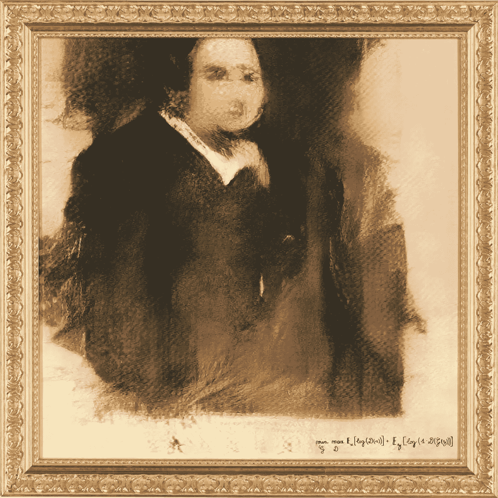
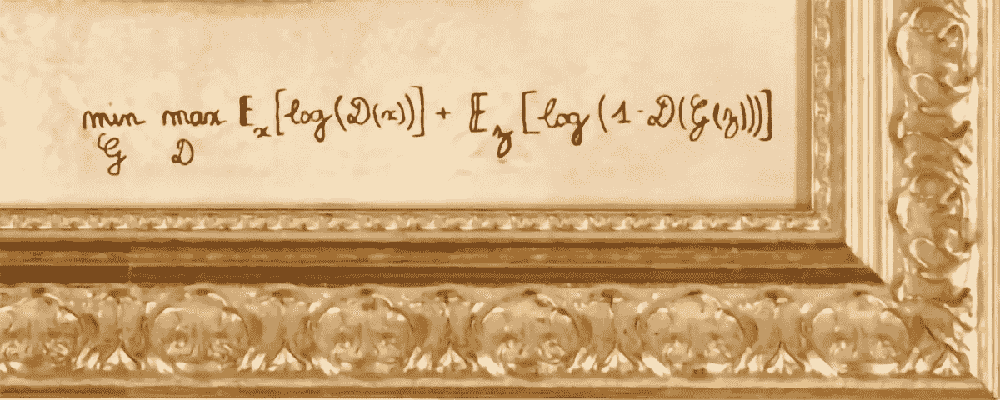
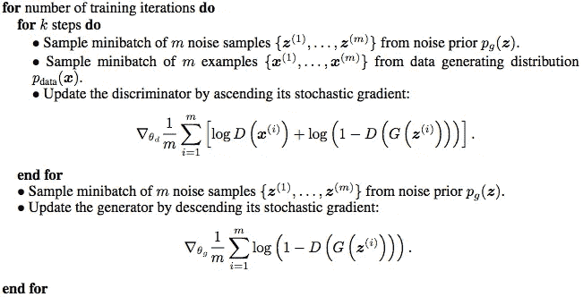
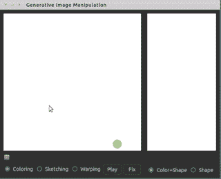
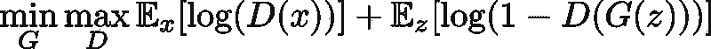
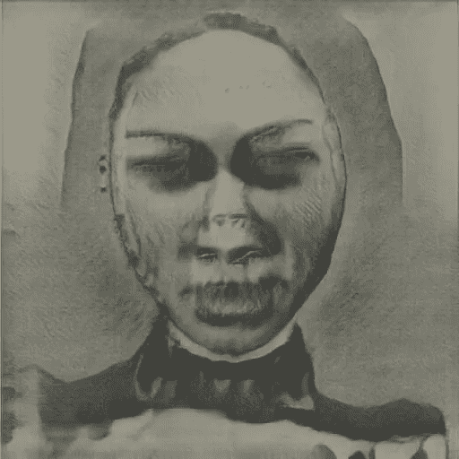
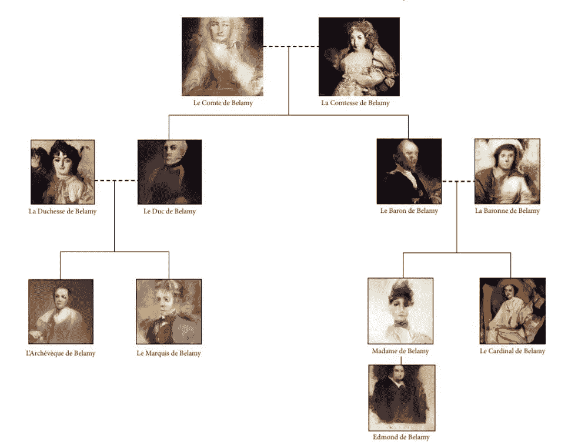
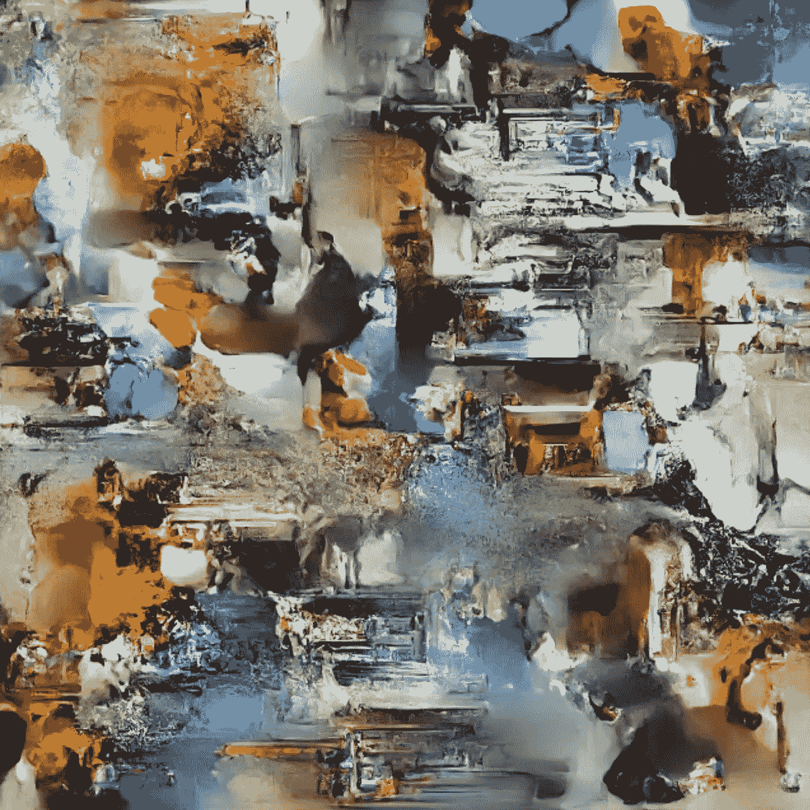

# 机器学习生成的艺术品拍卖价格为 432，500 美元

> 原文：<https://medium.datadriveninvestor.com/machine-learning-generated-artwork-auctions-off-for-432-500-c377be74146f?source=collection_archive---------2----------------------->

## “爱德蒙·德·贝拉米”的肖像远非人工智能的唯一创造，而是使用机器学习数月工作的结果

2018 年 10 月 25 日，作者:[罗伯托·伊里翁多](https://www.robertoiriondo.com)—2020 年 5 月 30 日更新

Picture | Courtesy of artist group Obvious | [[3]](http://obvious-art.com/about-us.html)

一幅机器学习生成的版画 [**于 2018 年 10 月 25 日周四在纽约佳士得拍卖行以 43.25 万美元**](https://www.christies.com/Lotfinder/lot_details.aspx?sid=&intObjectID=6166184&T=Lot&language=en) 成交——比预期成交价高出 40 多倍。

这个印刷品被称为“Edmond de Belamy”，及其模糊的特征——是生成对抗网络[1] (GANs)的产物——用于生成它的机器学习算法。该印刷是 11 个系列之一，都是 ML 生成的，描绘了虚构的“Belamy 家族”的成员。Belamy 的肖像上有数学公式，描述了用来生成它的算法。

Generative Adversarial Networks | The machine learning algorithm that was used to generate the Belamy portrait [1]

Pseudocode of GAN training | Arxiv | [[1]](https://arxiv.org/pdf/1406.2661.pdf)

生成对抗网络(GANs)是由谷歌大脑的机器学习研究员 Ian J. Goodfellow 在 2014 年创建的生成模型，他将两种算法置于竞争模式下进行训练。

How to train a GAN | A Short Introduction to Generative Adversarial Networks | Thalles Santos Silva [[5]](https://sthalles.github.io/intro-to-gans/)

这件作品远远不是人工智能的唯一创造，它确实是住在巴黎一套公寓里的三个人几个月来机器学习迭代工作的产物——其中一人是机器学习的博士生——这个小组统称自己为 Obvious[【3】](http://obvious-art.com/)。

Interactive Image Generation using GANs | Drawing basic strokes and let the model draw impressive pieces for you | Jun-Yan Zhu | [[10]](https://github.com/junyanz/iGAN)

这件作品与查克·克洛斯和杰弗·昆斯的版画一起被列入佳士得拍卖会，这在艺术界引起了一些恐慌，但也引起了人工智能专家的不满，他们认为(在作品的签名下)一种算法本身就可以成为艺术家——特别是用于创作这件作品的相对单调的种类。

算法并不是创造这些作品的唯一因素——甘人没有自由意志。它们根据复杂的数学输入参数输出复杂的画笔，您可以使用这些画笔来实现用其他方法很难实现的效果。

The cajoled GAN algorithm adjusted by machine learning Ph.D. student at Obvious [[3]](http://obvious-art.com/)

这种细微差别在围绕拍卖前的作品的一些报道中消失了——[**许多标题**](https://www.reuters.com/article/us-france-art-artificial-intelligence/first-ever-auction-of-ai-created-artwork-set-for-christies-gavel-idUSKCN1MX2WO) [**将这件作品**](https://www.usatoday.com/story/news/nation-now/2018/10/25/painting-created-ai-going-auction-block-christies/1759967002/) 描述为由人工智能**[**【创造】，**而不是使用机器学习或由机器学习生成，这显然表明公众对人工智能和机器学习之间的](https://www.pcmag.com/news/364580/christies-to-auction-art-created-by-artificial-intelligence)****的差异知之甚少。******

**甘斯开始受到艺术家群体的关注，因为他有潜力创作出引人入胜的艺术作品。下面请看马里奥·克林格曼[【6】](https://twitter.com/quasimondo)创作的甘作品，这位艺术家曾无数次使用甘创作出令人兴奋的作品。**

****

**“Freeda Beast — Bringing Things to an End” | A product of GANs training| Quasimodo | Mario Klingemann [[6]](http://quasimondo.com/)**

**[Hugo Caselles-Dupré](https://www.linkedin.com/in/hugo-caselles-dupr%C3%A9-733591107/?originalSubdomain=fr) ，一个机器学习的博士生和三分之一的显见者，声明[【7】](https://motherboard.vice.com/en_us/article/43ez3b/ai-generated-artwork-just-sold-at-christies)他把这种定性归结为媒体的“轰动效应”和“点击诱饵”。他坚持认为，这篇文章的目的是让公众了解人工智能的局限性。Caselles-Dupré提到，算法是一种工具，而不是创造性的存在本身。**

**“今天，不是算法取代人的问题，”卡塞尔斯-杜普雷说。“在未来，我们可能必须小心这一点，但今天，它们更像是一种工具。我们希望展示这些人工智能工具可以做什么的具体例子。”他提到，用算法的数学公式在作品上签名是一种“有趣的方式”，可以将这些想法传达给普通观众。**

****

**“The Belamy Family” | Machine learning generated art | Obvious [[3]](http://obvious-art.com/)**

**目前还不清楚这种信息传递策略的效果如何。在给 Artnet**[【8】](https://news.artnet.com/art-world/ai-art-comes-to-market-is-it-worth-the-hype-1352011)**的一份声明中，佳士得国际印刷和倍数负责人理查德·劳埃德说，这件作品被选中拍卖正是因为它的创作据说很少有人干预。******

******为了使这些模型工作，GANs 必须被输入大量数据，并在一段艰苦的训练期后使用这样的图像 [**数据集**](https://medium.com/datadriveninvestor/the-50-best-public-datasets-for-machine-learning-d80e9f030279) 产生新的结果。然而，仅仅因为它们能够产生原始输出，gan 就不是自主的。这样的最终产品是一个漫长过程的结果，这个过程需要仔细选择输入数据，调整数学参数，然后对结果进行筛选，以找到您正在寻找的最佳结果。******

****Caselles-Dupré说，该算法的最后一次迭代——这是它有史以来为显而易见的“目的”获得的最好的一次迭代——产生了数百张图像，但不得不被削减到只有 11 张。“我们仔细挑选了这批照片中最有趣的，”他说。****

****经过几次反复使用 GANs，明显[3]选择了 11 个艺术作品，他们精心挑选，因为他们想要新颖的结果[7]。然而，在这个过程中，谁是创造性的一方:需要迭代和哄骗几个月才能产生半有趣的东西的算法，还是艺术家寻找美学结果并做出所有决定以达到目的？虽然输出是计算机算法和相关艺术家之间的合作，但创造力的天平却落在了人类一边。****

****这样使用甘不会取代艺术家。然而，它确实为公众和艺术社区带来了一个新的视角，即使用机器学习算法来生成独特的作品[【11】](https://nips2017creativity.github.io/)。****

********

****[**Density estimation using Real NVP**](https://arxiv.org/abs/1605.08803) **|** [Laurent Dinh](https://arxiv.org/search/cs?searchtype=author&query=Dinh%2C+L), [Jascha Sohl-Dickstein](https://arxiv.org/search/cs?searchtype=author&query=Sohl-Dickstein%2C+J), [Samy Bengio](https://arxiv.org/search/cs?searchtype=author&query=Bengio%2C+S) | [[12]](https://arxiv.org/pdf/1605.08803.pdf)****

****最后，显而易见的[【3】](http://obvious-art.com/)在他们的博客上提到[【9】](https://medium.com/@hello.obvious/a-naive-yet-educated-perspective-on-art-and-artificial-intelligence-9e16783e73da):****

> ****“人工智能会是明天的艺术家吗？”****
> 
> ****我很想回答:****
> 
> ****“相机是当今的艺术家吗？”****

******免责声明:**本文表达的观点仅代表作者个人观点，不代表卡内基梅隆大学或其他(直接或间接)与作者相关的公司的观点。这些文章并不打算成为最终产品，而是当前思想的反映，同时也是讨论和改进的催化剂。****

****你可以在[我的网站](https://www.robertoiriondo.com)、[媒体](https://medium.com/@robiriondo)、 [Instagram](https://www.instagram.com/robiriondo) 、 [Twitter](https://twitter.com/robiriondo) 、[脸书](https://www.facebook.com/robiriondo)、 [LinkedIn](https://www.linkedin.com/in/robiriondo) 上找到我，或者通过我的[网页设计公司](https://www.daibuilds.com)。****

## ****参考资料:****

****[1]生成性对抗网络| [伊恩·j·古德菲勒](https://arxiv.org/search/stat?searchtype=author&query=Goodfellow%2C+I+J)，[让·普热-阿巴迪](https://arxiv.org/search/stat?searchtype=author&query=Pouget-Abadie%2C+J)，[迈赫迪·米尔扎](https://arxiv.org/search/stat?searchtype=author&query=Mirza%2C+M)，[徐炳](https://arxiv.org/search/stat?searchtype=author&query=Xu%2C+B)，[戴维·沃德-法利](https://arxiv.org/search/stat?searchtype=author&query=Warde-Farley%2C+D)，[谢尔吉尔·奥泽尔](https://arxiv.org/search/stat?searchtype=author&query=Ozair%2C+S)，[亚伦·库维尔](https://arxiv.org/search/stat?searchtype=author&query=Courville%2C+A)，[约舒阿·本吉奥](https://arxiv.org/search/stat?searchtype=author&query=Bengio%2C+Y) |阿尔 XIV |[https://arxiv.org/pdf/1406.2661.pdf](https://arxiv.org/pdf/1406.2661.pdf)****

****[2]卡西蒙多|马里奥·克林格曼，艺术家|[http://quasimondo.com/](http://quasimondo.com/)****

****[3]显而易见|总部位于巴黎的艺术家和机器学习研究人员集体|[http://obvious-art.com/](http://obvious-art.com/)****

****[4]佳士得拍卖行 Edmond de Belamy，来自 La famile de Belamy |[明显集团](http://obvious-art.com/)|【https://www.christies.com/Lotfinder/lot_details.aspx?sid=】into objectid = 6166184****

****[5]生成性敌对网络简介| Thalles Santos Silva |[https://sthalles.github.io/intro-to-gans/](https://sthalles.github.io/intro-to-gans/)****

****[6]马里奥·克林格曼|[https://twitter.com/quasimondo](https://twitter.com/quasimondo)****

****[7]一件人工智能生成的艺术品刚刚在佳士得| Motherboard | [以 432，500 美元的价格售出](https://motherboard.vice.com/en_us/article/43ez3b/ai-generated-artwork-just-sold-at-christies/?q=aspx.referral=medium)****

****【8】人工智能是否给了下一场伟大的艺术运动？专家说慢下来。“这个领域还处于起步阶段”| Artnet News |[https://News . Artnet . com/art-world/ai-art-comes-to-market-is-it-value-the-hype-1352011](https://news.artnet.com/art-world/ai-art-comes-to-market-is-it-worth-the-hype-1352011)****

****[9]对艺术和人工智能的天真而有教养的观点|显而易见|[https://medium . com/@ hello . Obvious/A-naive-yet-educated-perspective-on-art-and-artificial-intelligence-9e 16783 e 73 da](https://medium.com/@hello.obvious/a-naive-yet-educated-perspective-on-art-and-artificial-intelligence-9e16783e73da)****

****[10]经由生成性对抗网络的交互式图像生成| https://github.com/junyanz/iGAN |朱俊彦|****

****[11]面向创意和设计的机器学习| NIPS 2017 研讨会|[https://nips2017creativity.github.io/](https://nips2017creativity.github.io/)****

****[12]使用真实 NVP 的密度估计| [劳伦特·丁](https://arxiv.org/search/cs?searchtype=author&query=Dinh%2C+L)，[贾沙·索尔-迪克斯坦](https://arxiv.org/search/cs?searchtype=author&query=Sohl-Dickstein%2C+J)，[萨米·本吉奥](https://arxiv.org/search/cs?searchtype=author&query=Bengio%2C+S)|[https://arxiv.org/pdf/1605.08803.pdf](https://arxiv.org/pdf/1605.08803.pdf)****

****[13]结构化生成敌对网络| [邓志杰](https://arxiv.org/search/cs?searchtype=author&query=Deng%2C+Z)，[张浩](https://arxiv.org/search/cs?searchtype=author&query=Zhang%2C+H)，[肖丹](https://arxiv.org/search/cs?searchtype=author&query=Liang%2C+X)，[杨](https://arxiv.org/search/cs?searchtype=author&query=Yang%2C+L)，[徐世珍](https://arxiv.org/search/cs?searchtype=author&query=Xu%2C+S)，[朱军](https://arxiv.org/search/cs?searchtype=author&query=Zhu%2C+J)，[埃里克 p .兴](https://arxiv.org/search/cs?searchtype=author&query=Xing%2C+E+P) | [清华大学](http://www.tsinghua.edu.cn/publish/newthuen/)，[卡内基梅隆大学](https://www.cmu.edu)，[佩图姆公司](https://petuum.com)| NV****