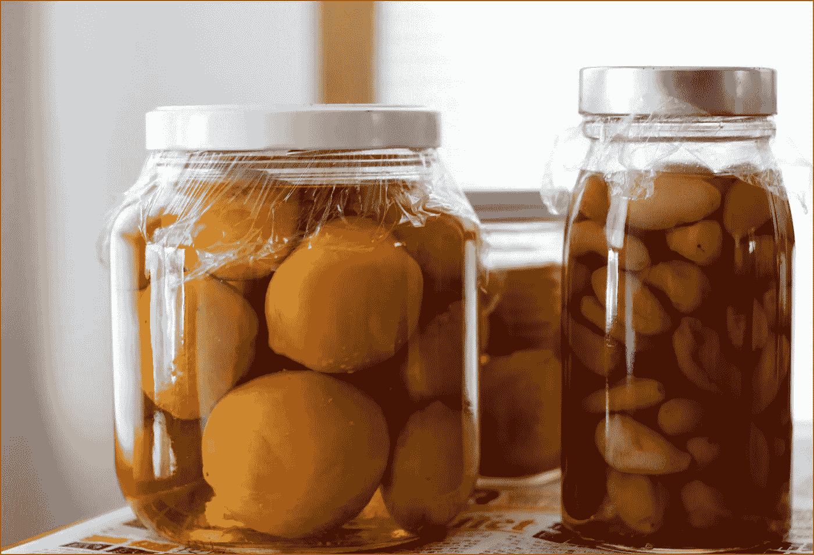
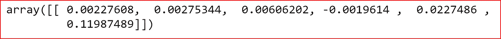
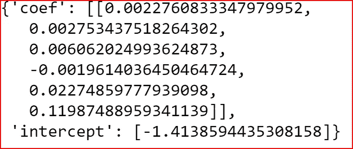

# 机器学习——如何保存和加载 scikit-learn 模型

> 原文：<https://medium.datadriveninvestor.com/machine-learning-how-to-save-and-load-scikit-learn-models-d7b99bc32c27?source=collection_archive---------0----------------------->

[](http://www.track.datadriveninvestor.com/1B9E)

在本帖中，我们将探讨如何在 Python 中持久化使用 scikit-learn 库构建的模型。加载已保存的预测模型。在这里，我们将探索三种不同的方法——使用 pickle、joblib 并将模型参数存储在 JSON 文件中



***什么是机器学习中模型的保存和加载？***

我们保存模型的参数和系数，即:模型的权重和偏差要归档在磁盘上。我们可以稍后加载保存的模型的权重和偏差，以便对看不见的数据进行预测。

数据的保存也被称为 ***序列化*** 其中我们将一个对象存储为字节流以保存在磁盘上

[](https://www.datadriveninvestor.com/2019/02/08/machine-learning-in-finance/) [## 金融中的机器学习——数据驱动的投资者

### 在我们讲述一些机器学习金融应用之前，我们先来了解一下什么是机器学习。机器…

www.datadriveninvestor.com](https://www.datadriveninvestor.com/2019/02/08/machine-learning-in-finance/) 

加载或恢复模型被称为 ***反序列化*** ，其中我们将字节流从磁盘恢复回 Python 对象

***为什么我们要保存一个模型，以后再恢复它？***

我们希望保存并加载模型

*   **避免训练时间过长**。我们已经在一个巨大的数据集上训练了模型，并且有一个表现良好的预测模型。在这种情况下，我们希望存储模型的权重和偏差，以便稍后用于预测
*   **重新创建已经训练好的模型。**加载已保存的训练好的模型进行预测
*   **与他人分享型号**。我们可以将模型保存到一个文件中，并与其他人共享该文件，可以加载该文件来进行预测
*   **比较多个模型的精度**。加载保存的模型以进行预测。可以比较预测准确性，以了解不同模型的预测能力

***如何保存和加载使用 scikit-learn 构建的模型？***

我们将讨论三种不同的保存和加载 scikit-learn 模型的方法

*   **泡菜**
*   **joblib**
*   **使用 JSON 格式**

***我们将创建一个线性回归模型，使用 pickle、joblib 保存并加载模型，并将模型系数保存并加载到 JSON 格式的文件中。***

本例中使用的数据集是为了从印度的角度预测研究生入学人数。

下面是创建线性回归的代码

```
**#Importing required libraries** 
import numpy as np
import pandas as pd
import matplotlib.pyplot as plt
import seaborn as sns
%matplotlib inline**#Reading the data in dataset**
dataset1 =pd.read_csv("D:\Machine Learning - Full\Blogs dataset\Admission_predict.csv")**# Creating input feature**
X= dataset1[['GRE Score','TOEFL Score','University Rating','SOP','LOR ', 'CGPA']]**# Creating target variable**
y= dataset1 [['Chance of Admit ']]**#Creating Train and Test dataset** from sklearn.model_selection import train_test_split
X_train, X_test, y_train, y_test = train_test_split(X, y, test_size=0.3)**#Normalizing the input features**
from sklearn.preprocessing import StandardScaler
sc_x= StandardScaler()
X_train = sc_x.fit_transform(X_train)
X_test = sc_x.transform(X_test)**#Normalizing the target variable**
sc_y= StandardScaler()
y_train = sc_y.fit_transform(y_train)
y_test = sc_y.transform(y_test)**# Creating the Linear regressor**
regressor = LinearRegression()**# fitting the training data to the Linear Regressor**
regressor.fit(X_train,y_train)**# Checking the model coefficients**
regressor,coef_
```



我们的模型现在已经训练好了。我们可以保存该模型，并在以后加载该模型，以便对看不见的数据进行预测。

## 使用泡菜

我们将首先导入库

```
import pickle
```

指定我们想要保存模型的文件名和路径

```
filename='Regressor_model.sav'
```

要保存模型，请以写入和二进制模式打开文件。和文件名一起传递我们建立的线性回归模型

```
**pickle.dump(regressor, open(filename, 'wb'))**
```

要加载模型，请以读取和二进制模式打开文件

```
**load_lr_model =pickle.load(open(filename, 'rb'))**
```

让我们检查一下系数的值是否相同

```
load_lr_model.coef_
```


Value of coefficients from the saved model

我们现在可以使用加载的模型来预测测试数据

```
y_load_predit=load_lr_model.predict(X_test)
```

## 使用 Joblib

首先我们将从 **sklearn.externals** 导入 **joblib** 库

```
**from sklearn.externals import joblib** 
```

为了保存模型，我们使用 joblib.dump 来指定文件名和需要保存的回归模型。

```
**joblib.dump(regressor, 'reg_1.sav')**
```

注意，我们只提供了文件名，并没有像对 pickle 方法那样打开文件。

现在我们已经保存了模型，我们可以使用 **joblib.load** 加载模型

```
**joblib_model= joblib.load('reg_1.sav')**
```

## 使用 JSON 格式

我们还可以将模型参数保存在一个 JSON 文件中，并将其加载回来。在下面的例子中，我们将保存模型系数并截取和加载它们。

我们将首先导入 json 库，创建一个包含系数和截距的字典。

系数和截距是一个数组对象。我们不能将数组转储为 JSON 字符串，所以我们将数组转换为一个列表，并将其存储在字典中

```
import json
model_param = {}
**model_param['coef'] = list(regressor.coef_)
model_param['intercept'] = regressor.intercept_.tolist()** 
```

我们使用 json 转储将 Python 字典转换成 JSON 字符串。我们需要缩进输出，所以我们提供缩进参数，并将其设置为 4

```
**json_txt = json.dumps(model_param, indent=4)** 
```

将 json 字符串保存到文件中

```
**with open('regressor_param.txt', 'w') as file:
    file.write(json_txt)** 
```

我们将文件内容加载到一个 json 字符串中。以读取模式打开文件，然后将 json 数据加载到 python 对象中，在我们的例子中，python 对象是一个字典

```
with open('regressor_param.txt', 'r') as file:
    json_text=json.load(file)
json_text
```



***保存或加载模型时还有其他考虑吗？***

*   Pickle 和 Joblib 可用于保存和加载使用相同 Python 版本的模型
*   在保存和恢复模型之间，模型的内部结构应该保持不变
*   从已知来源接收时恢复模型，以避免任何恶意代码

# 如果你喜欢这篇文章，请鼓掌！

## 参考资料:

[数据集](https://www.kaggle.com/mohansacharya/graduate-admissions#Admission_Predict.csv)来自—Mohan S . achar ya，Asfia Armaan，Aneeta S Antony:预测研究生入学的回归模型比较，IEEE 数据科学计算智能国际会议 2019