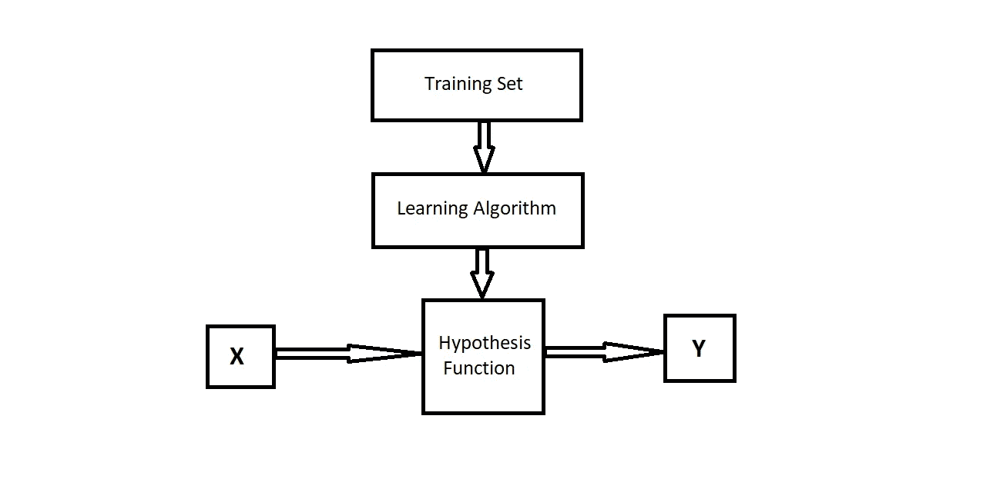
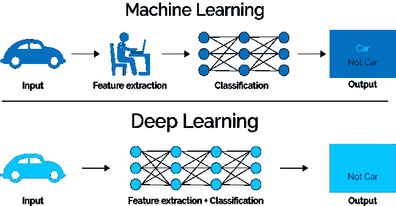
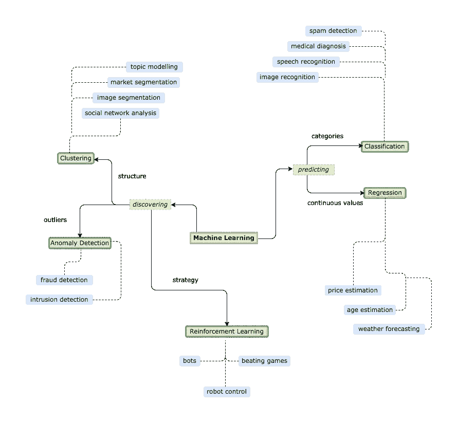
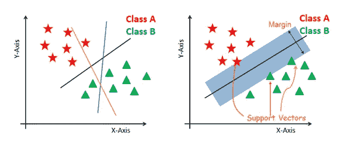
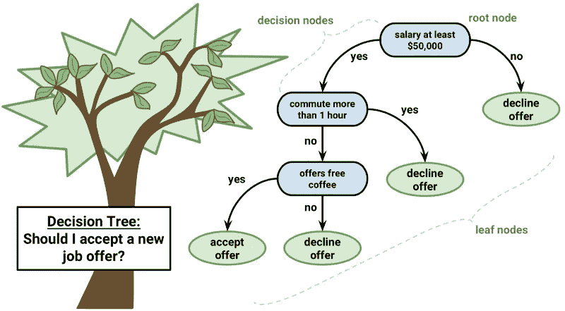
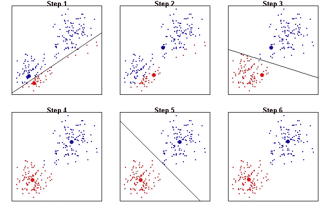
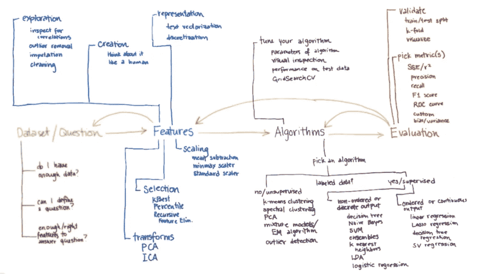

# 2019 年的机器学习

> 原文：<https://medium.datadriveninvestor.com/machine-learning-in-2019-b1a7b8750ca1?source=collection_archive---------10----------------------->

进入 2019 年已经一个月了，人工智能和人工智能的宣传越来越多，有大量的在线和离线课程。有如此多的机构和公司提供这些课程。而且，当每个人都声称自己拥有最好的课程时；从哪里开始令人困惑。

***如果你刚刚开始或者好奇想知道这个领域的本质，这个博客可能会帮助你。***

我将把它从“什么”(ML 术语和行话)带到“如何”(技术性:背后的算法和数学)。

为了使这个博客不是一个无聊的阅读，我们的两个角色 ***新手*** 和 ***专业*** 将帮助我们。新手是一个狂热的学习者，现在她想从机器学习开始。然而，她不知道从哪里开始。因此，她需要朋友 Pro 的帮助，Pro 是机器学习方面的专家。

***新手*** :嗨，亲。我一直在互联网上搜索机器学习，可获得的信息如此之多，以至于我被它淹没了。你能帮我做 ML 吗？

***亲*** :确定。为什么不呢？让我们从“机器学习”的基本而简单的定义开始。

> 机器学习是机器在没有明确编程的情况下进行学习的能力。在这里，“机器”意味着计算机软件或算法。

***新手*** :这是一个很容易理解的定义。然而，机器实际学习的是什么？

***Pro*** :在回答这个问题之前，你需要知道，机器学习之所以成为可能，只是因为有大量的数据可用。如果没有数据，就没有什么可以借鉴的。

因此，**这里的学习**是指在数据中找到模式，即拟合参数。

适定学习问题定义如下:

*如果由 P 测量的计算机程序在 T 上的性能随着经验 E 而提高，则称该计算机程序从关于一些任务 T 和一些性能测量 P 的经验 E 中学习*

***新手*** :参数是什么，拟合是什么意思？

***Pro*** :参数是我们的学习算法试图调整以建立精确模型的变量。它们在模型内部，因为它们可以从训练数据中估计出来。

参数拟合意味着找到这些变量的最佳值，从而提高预测精度。

***新手*** :专业人士，你能给我一个学习过程的图解概述吗？

***Pro*** :

Learning Process

这是机器学习算法如何从数据中学习的基本概述。要理解这一点，你需要知道几个术语。

**训练集:**它是为回答某些问题而提供的实际数据集。其实所有的机器学习都是在回答底层数据中的一些问题。

**学习算法:**它们是在训练数据上运行的算法的不同类别，以获得用于预测任务的模型。例如:SVM，决策树，神经网络。

**假设**:假设是我们认为(或希望)与真实函数相似的某个函数，也就是我们想要建模的目标函数。在垃圾邮件分类的上下文中，我们提出的规则允许我们将垃圾邮件与非垃圾邮件区分开来。

**模型**:在机器学习领域，假设和模型这两个术语经常互换使用。在其他科学中，它们可以有不同的含义，即假设将是科学家的“有根据的猜测”，而模型将是这种猜测的表现，可以用来检验假设。

**学习是如何发生的:**你通过一个带有训练数据的算法。学习算法在训练数据中寻找模式，使得输入参数对应于目标。训练过程的输出是一个机器学习模型，然后您可以使用它来进行预测。这个过程也叫“训练”。

# 示例:

**y = mx + c** ，这是我们的假设函数/模型，其中 **m** 和 **c** 的最佳值将由算法学习。现在，给定一个新的 X 值，模型将能够准确地预测相应的 y 值。

**其中**:

X=输入/特征/属性

Y=输出/目标/标签

M 和 C 是参数，M =重量，C=偏差

***新手*** :这是对整个学习过程相当不错的解释。

***Pro*** :这只是过程的概述，在训练和预测过程中还有更多内部进行的工作。

***新手*** :我在网上搜索机器学习的时候，发现了其他以学习为后缀的术语。比如监督学习，非监督学习，强化学习，深度学习。我很困惑它们和机器学习有什么关系。你能帮忙吗？

***Pro*** :机器学习是一个非常宽泛的话题，有不同的类型。主要分为 3 类:

*   **监督学习:**给定的数据集包含输入和相应的输出，即标记数据集。我们已经知道了一个问题(输入)的答案(输出)，知道了输入和输出之间的关系。
*   **无监督学习:**给定的数据集是未标记的，即不知道我们的输出应该是什么样子。我们必须根据数据集中变量之间的关系对数据进行聚类，从而从数据中导出结构。
*   **强化学习:**这是一种试错技术，算法通过执行一些动作来学习，并根据其动作获得奖励，这种奖励充当所采取的动作是好是坏的信号。
    这个过程一直持续到算法掌握了技巧，在数学上公式化为**马尔可夫决策过程**。

3 Broad Categories

**深度学习:**它是一种特殊的机器学习，或者说它是机器学习的一个子领域，其中使用了一种特定类型的算法，称为神经网络。由于数据爆炸和强大的计算能力，它已经成为我们今天使用的许多应用程序的最先进的技术。

神经网络是一组连接在一起的人工神经元，其中神经元是单个计算单元。

A Single Neuron

***新手*** :就我的理解，机器学习和深度学习的区别在于它们使用的算法。深度学习专门使用神经网络，而机器学习算法则不同。他们之间还有其他的主要区别吗？

***亲*** :是的，还有其他的区别。我想到的两个主要是，数据量和特征工程。

深度学习模型往往在处理大量数据时表现良好，而旧的机器学习模型在饱和点之后就会停止改善。

Feature Engineering

它们之间的另一个区别是在特征提取方面。在机器学习中，特征提取是由人来完成的，而深度学习模型是自己解决的。

> 想出特性是困难的，耗时的，需要专业知识。“应用机器学习”基本上是特征工程。
> 
> ——谷歌大脑 Coursera 的联合创始人吴恩达

***新手*** :现在，事情对我来说越来越清晰了。你告诉神经网络是深度学习的具体算法，那么机器学习模型用的算法是什么？

***Pro*** :如你所知机器学习有不同的类型，所以这些类型都有特定的算法。

在解决 ML 问题时，主要有两种类型的任务:

*   **预测**即数据被标注的监督学习问题。进一步分为分类和回归。
*   **发现**:它包括一个无监督和强化学习问题，任务是找到一个集群、离群值或一个策略。

ML Overview

***新手:*** 这种对机器学习任务和技术的概述非常有助于理解大局。但是用于不同任务的常见机器学习算法有哪些呢？

***Pro:*** 算法有很多种，没有一种算法对每个问题都是最好的。

***新手:*** 从这个意义上说，神经网络不总是解决问题的最佳选择吗？

***Pro:*** 是的，神经网络的确是最先进的，但在解决问题时有许多因素在起作用，例如数据集的大小和结构。

*比如*你不能说神经网络总是比支持向量机(SVM)好，反之亦然。

***新手:*** 那么，对于给定的问题，如何挑选合适的 ML 算法呢？

***Pro:*** 你应该尝试许多不同的算法来解决你的问题，同时使用一组“测试集”数据来评估性能并选出获胜者。

***新手:*** ok。那么，我可以从哪些算法入手，用在我的问题数据上呢？

***Pro:*** 在了解不同的 ML 算法之前，你应该了解一下:

*   **回归(标记数据):**回归是指在连续输出中预测结果，即将输入变量映射到某个连续函数。

*例如，*任何时间序列数据。这项技术包括拟合直线。

*   **分类(标记数据):**在这种情况下，在离散输出中预测结果，即将数据分类到预定义的类别中。

*例如，*电子邮件可以是“垃圾邮件”，也可以是“非垃圾邮件”。

*   **聚类(未标记数据):**是将相似的实体分组在一起的过程。它让我们深入了解不同群体的潜在模式。

*例如*，将不同来源的新闻文章归入特定类别，如体育、政治、科技等。

每一种机器学习算法都会解决上述任务中的一个或另一个。其中不包括“寻找策略”，即强化学习。我会在以后的博客中谈到它。

一些常见且广泛使用的 ML 算法有:

# 线性回归

Linear Regression

这可能是统计学和机器学习中最著名和最容易理解的算法之一。这是一种用于回归问题的监督机器学习算法。

*   它将使用数据点找到最佳拟合线来模拟数据。
*   一条线可以用方程来表示， **y = m*x + c** 其中 **y** 为因变量， **x** 为自变量。
*   使用给定的数据集，应用基本的微积分理论来找到 m 和 c**的值。**

有两种类型，线性回归:

*   一个变量:只使用一个自变量。(y = mx +c)
*   多个变量:使用多个独立变量。(y = m1x1 + m2x2 +………。+ mnxn + c)

# SVM(支持向量机)

SVM

这是一种监督机器学习算法，可用于分类和回归问题。

*   在 SVM，我们在 N 维空间中绘制数据点，其中 N 是特征的数量，并找到一个超平面来区分数据点。
*   超平面是分割输入变量空间的线。
*   超平面和最近的数据点之间的距离称为边界。可以将两个类别分开的最佳超平面是具有最大余量的线。
*   只有这些点与定义超平面和构造分类器相关。这些点被称为支持向量。它们支持或定义超平面。
*   当维数相对于数据点的数目较高时，这是一个很好的算法。
*   由于处理高维空间，该算法计算量很大。

# 决策树

Decision Tree

决策树是一种树形结构的分类器。通常，这种算法用于解决分类问题，但回归问题也可以用它来解决。

*   它通常表示一个二叉树，其中每个节点表示一个输入变量(x)和该变量上的一个分割点。
*   树的叶节点包含用于进行预测的输出变量(y)。
*   该算法通过从树的根开始并穿过它直到作为目标值的叶节点来分类实例或例子。
*   决策树很容易理解，因为它们只是一些必须要问的是/否问题。

# 朴素贝叶斯

Naive Bayes

该算法基于概率论中的“贝叶斯定理”。它主要用于分类任务，并且在问题中存在多个类别时工作得非常好。

*   朴素贝叶斯之所以称为朴素贝叶斯，是因为它假设每个输入变量都是相互独立的。

例如:如果我们必须通过花瓣的长度和宽度来预测一种花的类型，我们可以使用朴素贝叶斯算法，因为这两个特征是独立的。

*   现实世界中的数据很少是独立的。这就是为什么朴素贝叶斯并不总是分类的首选，然而，这种技术在大范围的复杂问题上非常有效。
*   在训练朴素贝叶斯分类器的过程中，会计算两种类型的概率:

1.  每一类的概率

2.给定每个 x 值时每个类的条件概率。

计算完成后，概率模型可用于使用贝叶斯定理对新数据进行预测。

# k 均值

K-means

这是一种无监督的聚类算法。它从包含同类数据点的数据中形成聚类。

*   k’是一个超参数，它代表形心的数量。

实现 K 均值聚类的算法非常简单。

*   随机选择 K 个质心。
*   将每个数据点分配给离它最近的质心。
*   基于每个质心点的平均位置重新计算质心。
*   迭代，直到点停止改变分配给质心。

要预测，你只需找到它们最接近的质心。

虽然有许多其他的机器学习算法，但这些是最受欢迎的，也是最容易开始的。

***新手:*** 这些算法相当直观，是学习的好起点。但是，如果我需要用它们来解决我的任何问题，我需要从头开始写吗？

***Pro:*** 不，已经有编写好的库和框架可以在你的数据集上使用和应用。

Python 是数据科学家和 ML 工程师中最受欢迎和使用的机器学习语言。python 中有大量的用于机器学习的库和框架。

***新手:*** 那么，像我这样的初学者应该从哪个库入手呢？

***Pro:***[*Scikit-learn*](https://scikit-learn.org/stable/)大概是最适合初学者的一款了。它支持许多监督和非监督学习算法，包括我们上面讨论的算法。

当你开始实现更复杂的算法时，你可以选择 [*Keras*](https://keras.io/) 和 [*TensorFlow*](https://www.tensorflow.org/) 。

***新手:*** Scikit-learn 就是我要开始的。

***Pro*** :是的，Scikit-learn 是一个很好的开始。还有一件事对解决任何 ML 问题都非常重要。

你需要始终遵循一个攻击计划:

1.  **了解问题和数据**
2.  **数据探索/数据清理**
3.  **特征工程/特征选择**
4.  **模型评估和选择**
5.  **模型优化**
6.  **结果和预测的解释**

这不是一个线性过程，而是一个非线性过程。这些步骤以任何顺序重复和完成。你需要熟悉数据，经常回到之前的步骤，采取新的方法。

Machine Learning Plan of attack

***新手*** :感谢这么棒的机器学习概述。

感谢您的阅读！

## 来自 DDI 的相关故事:

 [## 用 7 个步骤解释深度学习

### 和猫一起

medium.com](https://medium.com/datadriveninvestor/deep-learning-explained-in-7-steps-9ae09471721a)  [## 股票市场投资的机器学习

### 当你的一个朋友在脸书上传你的新海滩照，平台建议给你的脸加上标签，这是…

medium.com](https://medium.com/datadriveninvestor/machine-learning-for-stock-market-investing-f90ad3478b64)