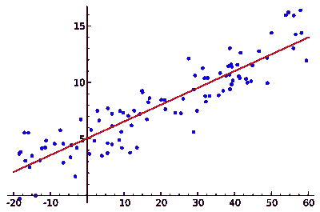
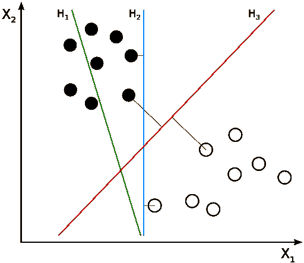
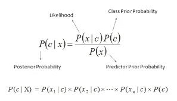

# 简而言之，机器学习

> 原文：<https://medium.datadriveninvestor.com/machine-learning-in-a-nutshell-e4ff2a50dbaf?source=collection_archive---------1----------------------->

*数据科学极客们你们好！*

*我们人类正处于这样一个阶段，我们开始对分析、大计算能力和云计算的发展进行革命性变革。在开发智能应用程序的早期，大多数系统使用“if”和“else”等决策条件来处理用户数据，并对用户输入进行调整。基本上使用手工编码的决策规则有两个主要缺点*

*   做出决策所需的逻辑特定于单个域和任务。
*   设计规则需要深刻理解人类专家应该如何做出决策。

 [## DDI 编辑推荐:5 本机器学习书籍，让你从新手变成数据驱动专家…

### 机器学习行业的蓬勃发展重新引起了人们对人工智能的兴趣

www.datadriveninvestor.com](https://www.datadriveninvestor.com/2019/03/03/editors-pick-5-machine-learning-books/) 

这种手动编码的方法在我们需要更精确的精度的情况下失败了，比如在人脸检测的情况下，人类可以利用描述图像中人脸的一组好的规则来做出决定。这使得这项任务不可能完成。*因此，机器学习在这里有大量的算法，告诉我们需要什么特征来识别图像。*

***什么是机器学习？***

> 机器学习是一项非常棒的技术，用于设计和构建智能系统。此外，这些系统能够从过去或历史数据中学习。因此根据其专长提供结果。

数据是机器学习的关键概念。我们应用各种算法来识别数据中的隐藏模式，以帮助系统学习和提高其性能。

***机器学习算法的类型***

*   *被监督，*输入数据被标记。
*   在无人监督的情况下，输入数据不会被标注，也没有已知的结果。
*   *半监督，*主要是标记和未标记数据点的组合。

在这篇文章中，正如标题所暗示的，我将概括地讲述大部分机器学习算法。这将是一个简明的点对点解释流行的监督，无监督的机器学习算法。

> 所以让我们开始吧！

> **监督学习**

***线性回归***

*   线性回归是一种监督学习算法，其中数据点用于寻找最佳拟合线
*   这条线用方程 y= mx + c 表示，这里 y 是因变量，x 是自变量，m 是斜率，c 是截距。

Linear Regression

*   线性回归有两种类型:由一个独立变量组成的简单线性回归和涉及多个独立变量的多元线性回归。
*   “ [scikit-learn](http://scikit-learn.org/) ”是 Python 中机器学习的基准工具。下面是使用 scikit-learn 实现线性回归。

*流行的线性回归数据集*

*   [卡尔科菲:60 多年的海洋学数据](https://www.kaggle.com/sohier/calcofi)
*   【2006 年至 2016 年塞格德的天气
*   [二战时期的天气状况](https://www.kaggle.com/smid80/weatherww2/data)
*   [黑色星期五数据集](https://www.kaggle.com/mehdidag/black-friday)

**逻辑回归**

*   不要被它的名字搞糊涂了！是分类，不是回归算法！
*   逻辑回归是一种非常棒的机器学习算法，用于预测离散值，如是/否、真/假或 0/1。
*   该算法使用 sigmoid 函数将值压缩到特定范围。
*   Sigmoid 函数基本上有一个“S”形曲线。它将值转换到 0，1 的范围内，这解释为发生某个事件的概率。
*   它也称为 Logit 函数，因为它将数据拟合到 Logit 函数中。

Logit Function

*   我们将使用 Sklearn 或 Scikit learn 来演示 python 中的 Logit 回归

*流行的逻辑回归数据集*

*   [人力资源分析](https://www.kaggle.com/vjchoudhary7/hr-analytics-case-study)
*   [成人收入数据集](https://www.kaggle.com/rdcmdev/adult-income-dataset)
*   [贷款违约](https://www.lendingclub.com/info/download-data.action)

## KNN(K-最近邻)

*   用 k 个最近邻预测未知数据点的流行算法。
*   确定 k 值在预测中起着至关重要的作用。预测的准确性主要取决于 k 的值。
*   为了使用像欧几里得距离函数计算相邻点之间的距离，需要不同的质心。

KNN

*   新数据点通过使用其邻居的 k 的多数投票来分类。它分配给其类的新数据点是其 KNN 中最常见的数据点之一。

*流行的 KNN 数据集*

*   [虹膜数据集](http://archive.ics.uci.edu/ml/datasets/Iris)
*   [前列腺癌](http://discuss.analyticsvidhya.com/uploads/analyticsvidhya/original/1X/e70a1105cd36e53cc13b6075aaa3175d36610d94.csv)
*   [玻璃识别](https://archive.ics.uci.edu/ml/datasets/glass+identification)

**决策树**

*   机器学习算法，属于监督学习算法的范畴，用于分类和回归任务。
*   它将重要的特性与确定的条件语句进行比较。它遍历左子分支或右子分支完全取决于结果。
*   最重要的特征被认为是最接近根的。决策树可以通过识别合适的属性来进一步扩展，以定义更多的类别。
*   算法对分类和连续因变量都有效。在这里，我们使用熵、基尼系数、信息增益和卡方等技术将一个群体分成两个或更多的同类群体。

Typical Decision Tree

*   决策树的 Python 代码看起来像

*决策树常用数据集*

*   [汽车评估数据集](https://archive.ics.uci.edu/ml/datasets/car+evaluation)
*   [泰坦尼克号数据集](https://www.kaggle.com/c/titanic)
*   [KDD 杯数据集](https://archive.ics.uci.edu/ml/datasets/KDD+Cup+1999+Data)

**支持向量机(SVM)**

*   这是一种监督学习算法，其中我们在 n 维空间中绘制数据点，其中每个特征的值代表特定坐标的值。
*   选择这条线，使其距离两个类别中最近的数据点最远。

SVM -Support Vectors

*   假设数据集中有两个特征，即收入和贷款额。我们将在二维空间中绘制这些特征，其中每个点有两个坐标，称为支持向量。
*   SVM 具有目标函数，该目标函数旨在从最近的支持向量(这可以属于任何类别)中找到边界的最小距离。

*SVM 的流行数据集*

*   [信用卡数据集](https://www.kaggle.com/pierra/credit-card-dataset-svm-classification/data)
*   [乳腺癌数据](https://archive.ics.uci.edu/ml/datasets/breast+cancer)
*   国际排雷行动中心 10 日

**朴素贝叶斯算法**

*   基于贝叶斯定理的分类算法。考虑在预测者中独立。
*   该算法假设一个类中特定特征的存在与任何其他特征的存在完全无关。
*   易于构建，对大型数据集有效。有趣的事实是，有时它胜过许多优秀的算法。
*   应该记住的公式，即后验概率

*   朴素贝叶斯算法的 Python 实现如下

*流行的朴素贝叶斯数据集*

*   [信用卡欺诈检测](https://www.kaggle.com/mlg-ulb/creditcardfraud)
*   [火腿垃圾数据集](https://www.kaggle.com/ishansoni/sms-spam-collection-dataset)
*   [托儿所数据集](https://archive.ics.uci.edu/ml/datasets/Nursery)

**随机森林**

*   分类算法是决策树的集成。
*   当每棵树为一个新的类投票时，分类就发生了。森林选择拥有最多票数的分类(超过森林中的所有树)。
*   拥有最多分类投票的树接管该类。
*   在随机森林中，每棵树都生长到最大深度，没有修剪的概念，不像决策树。
*   它是一个黑匣子，接受输入并给出预测，而不用太担心后端的计算。但是，您可以使用随机森林算法中的几个参数。
*   随机森林的 Python 实现是这样的。

*RF 算法常用数据集*

*   [房价数据集](https://www.kaggle.com/c/home-data-for-ml-course)
*   [乳腺癌](https://archive.ics.uci.edu/ml/datasets/breast+cancer+wisconsin+(original))
*   [家得宝数据集](https://www.kaggle.com/c/home-depot-product-search-relevance)

**梯度推进算法**

*   GB 算法来自 Boosting 算法家族。基本上，Boosting 只是一种技术，其中预测器是连续的，而不是独立的。
*   因此，GB 是一种用于回归和分类问题的机器学习算法，其中它以弱预测模型(通常是决策树)的集合的形式产生预测模型。(维基百科定义)。
*   梯度推进算法通过基于学习率更新我们的预测来最小化我们的损失函数，我们可以找到 MSE 或损失最小的值。
*   算法重复利用残差中的模式，加强弱预测模型并使其更好。
*   这些助推算法在 Kaggle、AV Hackathon、CrowdAnalytix 等数据科学竞赛中总是表现良好。
*   梯度提升算法在 Sklearn Python ML 库中实现

**XGB 算法(极限梯度提升)**

*   梯度提升决策树的实现提高了速度和性能。
*   一种软件库的安装和运行。支持多种接口，如 CLI、C++、Python、R Julia 等。
*   它具有自动处理缺失值的强大功能，还可以与 Spark、Flink 和其他云数据流系统集成，为每次迭代提供内置的交叉验证。
*   它不断地训练模型，以便您可以在增强的模型上拟合新数据。
*   XGB 算法使用跨所有 CPU 内核的多台机器来执行分布式计算，以训练非常大的模型。
*   XGB 能够在许多包含 GCE、AWS、Azure 和 Yarn 集群的机器上进行分布式和广泛的培训。
*   XGB 支持分类和回归任务以及许多目标函数。

**LightGBM**

*   它是一种基于决策树算法的快速、分布式、高性能梯度提升框架的梯度提升算法，用于排序、分类和许多其他机器学习任务。
*   LGB 和其他基于树算法之间的主要区别在于，光梯度增强以最佳拟合方式分裂树叶，而其他基于树的算法以深度或水平方式分裂树。
*   LGBM 遵循逐叶分裂，因此导致更好的准确性，这是任何现有的 boosting 算法都很难达到的。
*   由于复杂性的增加，LGBM 也可能导致我们过度拟合，因此应该通过使用最大深度参数来处理它，该参数指定分裂将发生的深度。

LGBM-Leaf wise Growth

> **无监督学习**

**K 表示**

*   旨在解决聚类相关问题的无监督机器学习算法。
*   *K-means 是一种迭代算法，将一组包含 n 个值的数据划分为 K 个子组。n 个值中的每一个都属于具有最近平均值的 k 个聚类。*
*   K-means 聚类的主要目标是最小化从质心到聚类的每个点之间的欧几里德距离。
*   我们可以用肘法来确定聚类数。聚类内质心和数据点之间的差的平方和构成该聚类的平方和。
*   聚类内部的数据点是同质的，并且对于形成的组的数量是异质的。
*   Kmean 算法可应用于商业领域，用于识别用户购买的商品、保险和欺诈检测、呼叫详细记录(CDR)分析。

Elbow Method

*   随着集群数量的增加，该值继续减小，并且平方距离的和减小到 k 的某个值

*流行的 K 均值数据集*

*   [*葡萄酒数据集*](https://archive.ics.uci.edu/ml/machine-learning-databases/wine/)
*   [*犯罪数据集*](https://www.kaggle.com/rajanand/crime-in-india)
*   [*图像分割数据*](https://archive.ics.uci.edu/ml/datasets/Image+Segmentation)
*   [虹膜数据集](https://archive.ics.uci.edu/ml/datasets/iris)

**数据库扫描**

*   众所周知，数据聚类算法广泛用于数据挖掘和机器学习。
*   基本上，DBScan 根据距离测量和最小数量的数据点将彼此接近的数据点组合在一起。
*   需要两个参数，即ε (eps)和形成密集区域所需的最小点数(minPts)。

Simley Face DBScan

*   该算法用于在数据中查找手动难以找到的模式。
*   聚类方法通常用于生物学、医学、社会科学、考古学、市场营销、字符识别、管理系统等领域。
*   优于其他聚类算法的优势在于它根本不需要预设的聚类数。此外，DbScan 能够将异常值识别为噪声，因为大多数聚类算法，如*均值漂移*都不喜欢。

*流行的 DBScan 数据集*

*   [*图像数据集上的用户感知聚类*](https://archive.ics.uci.edu/ml/datasets/Mturk+User-Perceived+Clusters+over+Images)
*   [*对 700 万个蛋白质进行层次聚类*](https://www.kaggle.com/rajasankar/hierarchical-clustering-of-7-million-proteins/version/2)
*   [*信用卡数据集进行聚类*](https://www.kaggle.com/arjunbhasin2013/ccdata)

> **结束注释**

朋友们，在这篇文章中，我们已经讨论了大多数有监督的和无监督的学习算法，我还填充了一些我认为有用的流行数据集。

> **参考文献**

*   [https://www . analyticsvidhya . com/blog/2017/09/common-machine-learning-algorithms/](https://www.analyticsvidhya.com/blog/2017/09/common-machine-learning-algorithms/)
*   [https://data-flair . training/blogs/data-science-tutorials-home/](https://data-flair.training/blogs/data-science-tutorials-home/)
*   [https://en.wikipedia.org/wiki/DBSCAN](https://en.wikipedia.org/wiki/DBSCAN)
*   [https://scikit-learn.org/](https://scikit-learn.org/)
*   [https://www.kaggle.com/datasets](https://www.kaggle.com/datasets)
*   [https://archive.ics.uci.edu/ml/index.php](https://archive.ics.uci.edu/ml/index.php)

*如果你喜欢这个帖子，请跟我来，只要你认为我值得，就按下那个按钮。如果你注意到思维方式、公式、动画或代码有任何错误，请告诉我。*

*干杯！*