# 生物信息学中的机器学习

> 原文：<https://medium.datadriveninvestor.com/machine-learning-in-bioinformatics-d81b1b3eaba2?source=collection_archive---------0----------------------->

## 基因分类&常用分类器的性能比较


Image by [Arek Socha](https://pixabay.com/users/qimono-1962238/?utm_source=link-attribution&utm_medium=referral&utm_campaign=image&utm_content=1811955) from [Pixabay](https://pixabay.com/?utm_source=link-attribution&utm_medium=referral&utm_campaign=image&utm_content=1811955)

生物信息学是一个利用计算从生物数据中提取知识的研究领域。它包括用于分析、可视化或预测的数据的收集、存储、检索、操作和建模。在这里，我们将使用机器学习对大肠杆菌的基因进行分类。

让我们了解遗传学的基础知识。DNA 或脱氧核糖核酸是人类和几乎所有其他生物的遗传物质。DNA 由四种化学碱基组成:腺嘌呤(A)、鸟嘌呤(G)、胞嘧啶(C)和胸腺嘧啶(T)。腺嘌呤与胸腺嘧啶配对，鸟嘌呤与胞嘧啶配对。每个碱基还连接着一个糖分子和一个磷酸分子。碱基、糖和磷酸盐一起构成了核苷酸。

基因由很长的核苷酸序列组成。根据核苷酸序列，基因可以分为两类(启动子和非启动子)。

[](https://www.datadriveninvestor.com/2019/03/03/editors-pick-5-machine-learning-books/) [## DDI 编辑推荐:5 本让你从新手变成专家的机器学习书籍|数据驱动…

### 机器学习行业的蓬勃发展重新引起了人们对人工智能的兴趣

www.datadriveninvestor.com](https://www.datadriveninvestor.com/2019/03/03/editors-pick-5-machine-learning-books/) 

查看长核苷酸序列是不切实际的。因此，我们将着眼于大肠杆菌基因的短核苷酸序列(57 个序列),并预测该基因是启动子还是非启动子。

数据集“基因”来自 [UIC 机器学习数据库](https://archive.ics.uci.edu/ml/machine-learning-databases/molecular-biology/promoter-gene-sequences/)。

导入必要的包。

```
# Importing the necessary packages**import numpy as np
import pandas as pd**
```

数据被读入“基因”中。

```
# Import UCI molecular biology (promoter gene sequences) dataset**url = ‘**[**https://archive.ics.uci.edu/ml/machine-learning-databases/molecular-biology/promoter-gene-sequences/promoters.data'**](https://archive.ics.uci.edu/ml/machine-learning-databases/molecular-biology/promoter-gene-sequences/promoters.data') **columns = [‘Class’,’id’,’Sequence’]** # Naming the columns **genes = pd.read_csv(url,names = columns)** # Reading the data
```

让我们来探索数据集。

```
**genes.shape** # Prints the shape of ‘df’
```

“基因”数据帧的形状为(106，3)，这意味着 106 个病例和 3 列。

```
**genes.nunique()** # Prints number of unique elements in each column
```

类别:- 2，id :- 106，序列:- 106

有 2 个唯一类，106 个唯一 id 和 106 个唯一序列。我们知道有 106 个病例。所以每个“id”和“序列”都是唯一的。

```
**genes[‘Class’].unique()** # Prints the unique elements in ‘Class’ column
```

这两个独特的类别被标记为'+'(启动子)和'-'(非启动子)。

```
**genes.head()** # Displays first 5 rows of ‘genes’ dataframe
```

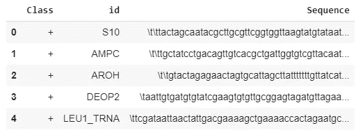

一些“序列”以特殊字符“\t”开头，表示制表符。预处理步骤是删除这些特殊字符，这样就只剩下碱基(a，g，c，t)。

```
# Removing ‘\t’ in ‘Sequence’ column**for i in range(genes.shape[0]):
 genes[‘Sequence’][i] = genes[‘Sequence’][i].replace(‘\t’, ‘’)**
```

让我们通过检查 5 个随机选择的序列的序列和长度来验证这一点。

```
**for i in np.random.randint(0,106,5):
 print(genes[‘Sequence’][i])
 print(len(genes[‘Sequence’][i]))
 print(‘\n’)**
```

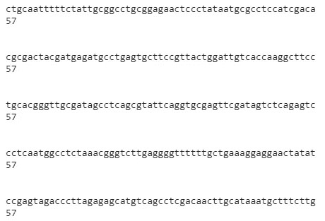

\t '字符已被删除，每个序列的长度为 57。

只有“序列”栏在基因分类中是重要的。让我们制作一个“序列”列的数据框架。

```
# Initializing a dataframe ‘nucleotide_sequence’ of size (106,57)**nucleotide_sequence = pd.DataFrame(np.random.randn(106,57))**# Storing each base of ‘Sequence’ in ‘nucleotide_sequence’**for i in range(genes.shape[0]):
 nucleotide_sequence.loc[i] = list(genes[‘Sequence’][i])**# Storing 'Class' column of 'Sequence' as a column in 'nucleotide_sequence'**nucleotide_sequence['Class'] = genes['Class']**
```

让我们看一下数据框“核苷酸序列”

```
**nucleotide_sequence.head()** # Displays first 5 rows of ‘nucleotide_sequence’ dataframe
```

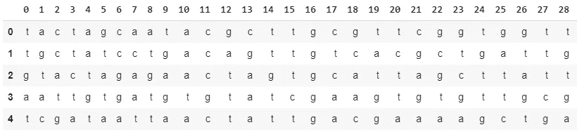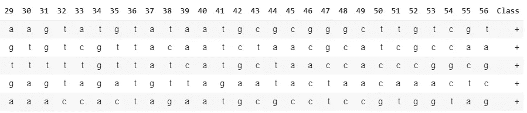

```
**plt.figure(figsize=(8,8)) 
plt.xticks(fontsize=20) 
plt.yticks(fontsize=20) 
plt.xlabel('Class',fontsize=20) 
plt.ylabel('count',fontsize=20) 
sns.countplot(nucleotide_sequence['Class'])** # Displays count of each element in 'Class' column
```

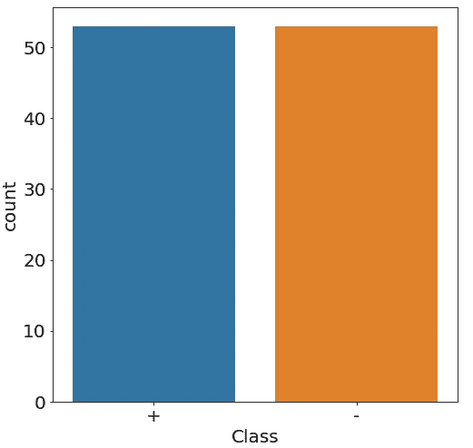

在给定的数据集中，启动子和非启动子的数量相等。

机器学习算法只能应用于数值。因此，我们使用“get_dummies”函数将“核苷酸序列”的字符串字符转换成数值。

```
# Switch to numerical data using pd.get_dummies() function**numerical_nucleotide = pd.get_dummies(nucleotide_sequence)**
```

让我们打印“数字核苷酸”数据图。

```
**print(numerical_nucleotide.head())** # Prints first 5 rows of 'numerical_nucleotide'
```

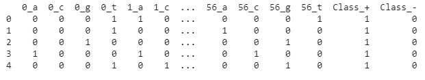

有两个类列:- 'Class_+'和' Class_-'。只需查看其中一列(“分类+”或“分类-”)就可以找到分类标签“促进者”或“非促进者”。因此其中一个被删除，另一个被重命名为“Class”。

```
# Remove one of the class columns and rename the other to simply ‘Class’**numerical_nucleotide.drop(‘Class_-’,axis = 1,inplace = True)
numerical_nucleotide.rename(columns = {‘Class_+’:’Class’},inplace = True)**
```

现在让我们打印“数字核苷酸”数据图。

```
**print(numerical_nucleotide.head())** # Prints first 5 rows of 'numerical_nucleotide'
```

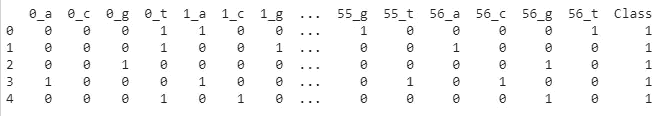

下面给出的代码片段与 get_dummies()函数(**可选**)的作用相同

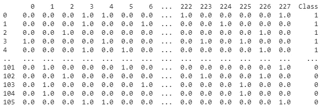

现在我们已经处理了数据，下一步是使用机器学习分类器训练数据。

数据集分为训练集和测试集。

```
# Import train_test_split**from sklearn.model_selection import train_test_split**# X is input and y is output**X = numerical_nucleotide.drop(‘Class’,axis = 1)
y = numerical_nucleotide[‘Class’]**# Split into train and test sets**X_train,X_test,y_train,y_test = train_test_split(X,y)**
```

导入必要的分类器和度量。

```
# Performance comparison of 9 classifiers**from sklearn.neighbors import KNeighborsClassifier
from sklearn.neural_network import MLPClassifier
from sklearn.tree import DecisionTreeClassifier
from sklearn.ensemble import RandomForestClassifier, AdaBoostClassifier
from sklearn.naive_bayes import GaussianNB
from sklearn.svm import SVC
from sklearn.metrics import classification_report,accuracy_score
from sklearn import model_selection**
```

计算分类器的交叉验证分数。

显示分类器的交叉验证分数。

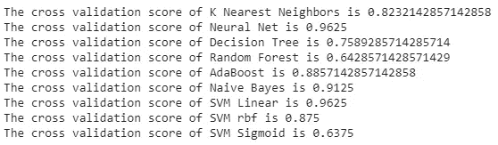

> 基于交叉验证分数的分类器排名:-
> (1 神经网络(MLP 分类器)& SVM 线性
> (2 朴素贝叶斯
> (3 AdaBoost
> (4 SVM RBF
> (5K 最近邻
> (6 决策树
> (7 随机森林
> (8 SVM Sigmoid

神经网络(MLP 分类器)和 SVM 线性具有最好的交叉验证分数 0.9625。但是基于交叉验证分数来概括分类器在新的未知数据上的性能是不正确的。因此，我们在测试集上检查分类器模型的性能。

```
**for i in range(len(models)):
 a = models[i].fit(X_train,y_train)** # Fitting the model **y_predict = a.predict(X_test)** # Predicting using trained model **print(accuracy_score(y_predict,y_test))
 print(classification_report(y_predict,y_test))**
```

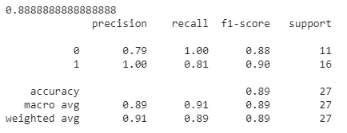

K-Nearest Neighbors

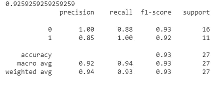

Neural Net (MLP Classifier)

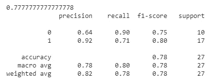

Decision Tree

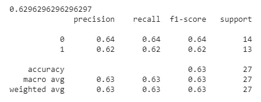

Random Forest

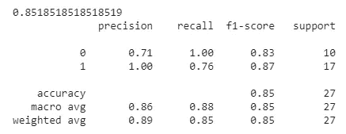

AdaBoost

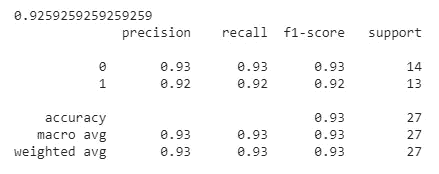

Naive Bayes

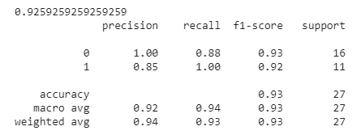

SVM Linear

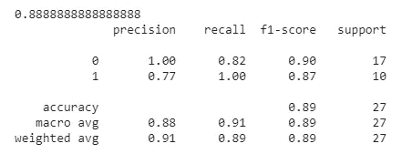

SVM rbf

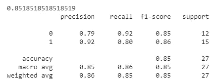

SVM Sigmoid

> 基于测试分数的分类器排名:-
> (1)神经网络(MLP 分类器)、朴素贝叶斯& SVM 线性
> (2)K 近邻&SVM RBF
> (3)AdaBoost&SVM sign oid
> (4)决策树
> (5)随机森林

神经网络(MLP 分类器)、朴素贝叶斯和 SVM 线性具有最高的准确度分数和 f1 分数。

分类器模型的性能可以通过超参数调整来进一步提高。如果你很好奇，请务必阅读[神经网络的超参数调整](https://medium.com/datadriveninvestor/hyperparameter-tuning-with-deep-learning-grid-search-8630aa45b2da)。

快乐阅读！