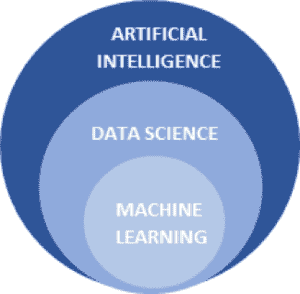
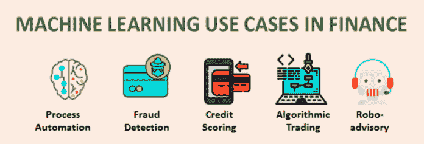
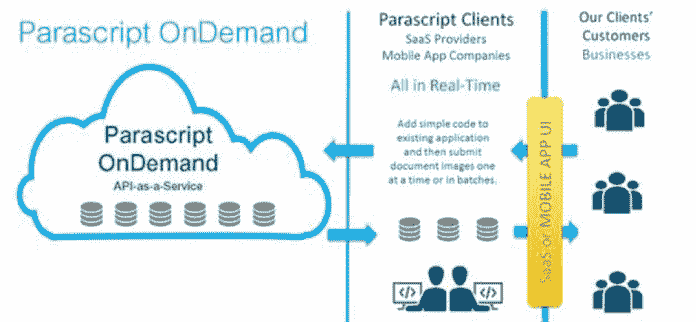

# 金融中的机器学习

> 原文：<https://medium.datadriveninvestor.com/machine-learning-in-finance-aafcf1de7738?source=collection_archive---------5----------------------->

在我们覆盖一些**机器学习金融**应用之前，我们先来了解一下什么是机器学习。机器学习(ML)是数据科学的一部分，它使用不同的模型来分析数据并进行预测。

机器学习很酷的一点是，就像婴儿如何通过经验学习走路和说话一样，机器学习软件也从经验中学习如何分析数据。你不需要明确地教它任何东西。您只需给它一组已知结果的数据，并让它处理这些数据以识别数据中的模式和相应的结果。不同的 ML 模型以不同的方式处理这些数据。因此，你必须决定使用正确的最大似然模型，以获得最快和最好的结果。一旦它完成了学习，你就可以将新的数据输入到模型中，让它每次都自动调整自己以改善结果。

不用说，您向 ML 模型提供的数据越多，它获得的经验就越多，给出的结果也就越好。随着时间的推移，这些模型已经处理了足够多的数据-结果关系，能够给出接近准确的结果。

# 机器学习金融应用

金融业一直是使用人工智能技术的先驱。自 70 年代以来，华尔街一直[分析股票数据来预测市场价格](http://www.datadriveninvestor.com/deep-learning-in-python)。**机器学习股票市场**应用程序正在获得动力，并继续添加越来越多的盈利功能。银行也开始使用**机器学习金融**应用程序来满足他们不断增长的需求。

我们可处理的数据量呈爆炸式增长。我们不仅有股票数据和销售数据，还有来自社交媒体帖子的数据、关于人们情绪和个人偏好的数据等等。如果通过正确的人工智能技术来利用这些数据，可以证明对金融业来说是非常有利可图的。

# 应用领域和使用案例

今天，金融行业[有许多领域正在应用 ML](http://www.datadriveninvestor.com/Introduction-to-R-for-Finance)。以下是几个例子:

**风险评估和欺诈检测**:像万事达卡这样的公司正在将 ML 用于他们的“决策智能”项目，以从持卡人的历史购物和消费习惯中发现模式，从而检测欺诈活动。因此，最大似然算法可以检测到人类分析师很容易忽略的异常。它们还可以帮助提高实时批准的准确性，减少虚假拒绝(这可能会导致比实际欺诈本身更大的损失)。

流程自动化: ML 现在已经使取代手工作业和自动化重复性任务成为可能。ML 被用于“流程自动化”的一些领域包括聊天机器人、呼叫中心自动化、文书自动化和员工培训模拟。例如，Parascript 使用 OCR 来处理收据和创建数据集。然后，他们使用 ML 自动分类、定位和提取所有关键数据，以便管理费用、报税和分析采购。

**信用评分**:银行和保险公司收集了大量关于消费者及其交易的数据。他们还可以从电信和公用事业公司获取数据集，然后使用所有这些数据来训练 ML 模型。然后，这些信息将用于帮助员工快速完成承保任务或识别新的信用良好的借款人。提供 ML 信用评分服务的创业公司包括 Zest Finance 和 Destacame。

**算法交易:**像 Sentient Technologies 这样的组织正在股票交易中应用 ML。他们使用 ML 实时分析新闻和交易结果，检测可能导致股价上涨或下跌的模式，然后做出适当的交易决策。

机器人顾问/投资组合管理(Robo-advisory/Portfolio Management):这是 ML 的一个有趣应用，它涉及使用算法来帮助个人规划投资并根据他们的金融投资组合分析风险。使用这些，用户输入他们的目标(例如:在 60 岁退休时有 100，000 美元的储蓄)、年龄、收入和当前金融资产。然后，机器人顾问会根据这些数据，建议人们一生中最好的投资领域。机器人顾问的一个例子是 Responsive.ai。

# 如何在金融领域利用机器学习的力量

如今，网上有很多股票市场数据集，比如 Quantopia、Google Finance 和 Kaggle。这些可以与从社交媒体和新闻网站收集的数据相结合，以训练像 Tensorflow、Keras、Scikit-learn *(* [*一门入门课程我强烈推荐*](http://www.datadriveninvestor.com/scikit-learn-training) *)* 等 ML 模型来进行预测。也有许多预训练的 ML 模型可用，如 textblob 和 NLTK。这些经过训练的模型使训练过程更快，并帮助我们获得更准确的结果。

金融市场预计将从 2017 年的 13 亿美元增长到 2022 年的 74 亿美元。换句话说，这个市场已经成熟并且正在增长，许多组织已经将 ML 集成纳入到他们的公司路线图中。因此，如果你对机器学习和金融都感兴趣，现在是加入潮流并利用你的专业知识来造福金融业和你自己的最佳时机。

如果您正在寻找一些资源来开始学习机器，请看看这些课程:

[***Scikit-learning***](http://www.datadriveninvestor.com/scikit-learn-training)

*[***深度学习中的 Python***](http://www.datadriveninvestor.com/deep-learning-in-python)*

**原载于 2019 年 2 月 8 日 www.datadriveninvestor.com**T21*[。](https://www.datadriveninvestor.com/2019/02/08/machine-learning-in-finance/)*